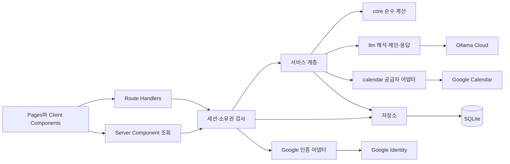
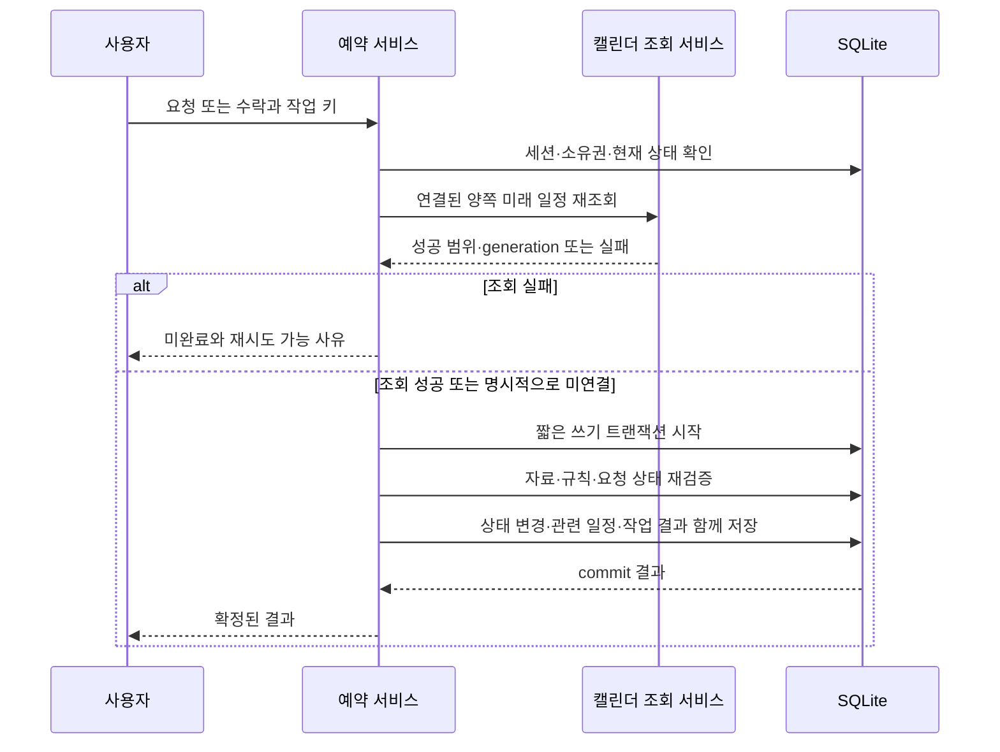

# Technical Architecture — AI 온보딩과 개인 미팅 프로필

> 저장소는 Postgres(Supabase)로 이식되었다. 이 문서의 SQLite 서술은 설계 당시 기준이며 대응은 [postgres_port.md](postgres_port.md)를 본다.

작성일: 2026-10-04 · 상태: 확정 (2026-10-04 검토 완료)

근거: `one_pager.md`, `product_requirement_document.md`, `user_stories.md`, `user_flow.md`, `app_screen_list.md`와 현재 `src/` 구현.

이 문서는 확정된 제품 요구사항을 구현하기 위한 구조를 정한다. 2026-10-04 검토에서 기술 결정 AD-01–AD-10을 채택했다. 구조의 확정은 구현·실제 계정 연결·성능 검증 완료를 뜻하지 않는다. 파일명과 데이터 그룹은 모듈 경계를 설명하며, 상세 테이블·API 계약은 이후 Backend Architecture에서 정한다.

---

## 1. 전제와 핵심 결정

- 기존 Next.js App Router·TypeScript·SQLite/Drizzle·Tailwind·Vitest·Ollama 구성을 유지한다. 별도 서버·메시지 큐·벡터 DB·외부 작업 스케줄러는 추가하지 않는다.
- 로컬에서 하나의 Node 서버와 지속 가능한 SQLite 파일로 실행하는 MVP를 기준으로 한다. 실제 계정 연동은 지원하지만 공개 서비스 배포·수평 확장은 이번 설계의 완료 조건이 아니다.
- `core`의 순수 계산과 `llm`의 해석·응답 경계를 유지한다. Google 응답·DB·인증은 서버 어댑터 안에서 처리한다.

| ID | 결정 | 이유 |
|---|---|---|
| AD-01 | 로그인 세션과 캘린더 연결을 별도 관리 | 로그인 후 캘린더 없이 설정·예약할 수 있어야 함 |
| AD-02 | 실제 모드와 시드 데모는 실행 설정·DB를 분리 | 사용자 전환이 실제 계정의 인증을 대신하지 않게 함 |
| AD-03 | 최초·일반 갱신은 기간을 지정한 전체 재조회 | 이동하는 조회 기간과 반복 회차·삭제를 첫 버전에서 명료하게 처리 |
| AD-04 | 조회 결과는 모든 선택 캘린더가 성공한 후 함께 교체 | 일부 실패를 빈 일정·삭제로 오인하지 않음 |
| AD-05 | 외부 일정, 사용자 보완, 분석 근거를 구분해 저장 | 재조회 시 사용자 수정을 보존하고 출처 제거를 추적 |
| AD-06 | 프로필 초안과 불변의 확정 버전을 분리 | 편집 도중에도 이전 설정으로 예약 가능 |
| AD-07 | 기존 conversation 한 개를 예약 탐색 한 개로 확장 | 같은 상대와 새 탐색, 기본값 상속·해제 상태 지원 |
| AD-08 | 차단 구간과 이동 기준점을 별도 입력으로 계산 | 종일·업무 위치·온라인을 모두 오프라인 일정처럼 처리하지 않음 |
| AD-09 | 클라이언트·호스트 점수를 정수 단위로 별도 비교 | 임의 오차나 점수 합산 없이 동점 해소 |
| AD-10 | 외부 재조회 후 짧은 DB 트랜잭션으로 예약 확정 | 외부 호출 중 DB 잠금을 유지하지 않으면서 로컬 경합 방지 |

## 2. 현재 구현에서 유지·변경할 경계

| 현재 코드 | 현재 전제 | 확장 |
|---|---|---|
| `src/server/context.ts` | `uid` 쿠키와 첫 시드 사용자 폴백 | 실제 모드의 검증된 세션과 데모 전용 사용자 전환 분리 |
| `src/server/db/schema.ts` | 사용자·요일당 시간 구간 하나, 상대별 대화 하나 | 복수 구간 프로필, 외부 출처·버전, 여러 예약 탐색 |
| `src/server/db/client.ts`, `ddl.ts` | 시작 시 테이블 생성, reset 중심 | 버전 있는 비파괴 마이그레이션. 실제 DB에서 reset 금지 |
| `src/core/availability.ts` | 미입력 시 매일 08–22시 | 신규 미확정은 예약 불가. 기존 규칙만 의미 보존 변환 |
| `src/core/slots.ts`, `travel.ts` | `kind !== online`이면 이동 기준점 | 차단·이동 의미를 분리. 기존 이동시간 표는 유지 |
| `src/core/filter.ts` | 완성된 필터 하나와 부동소수 여유 점수 | 상속·대체·해제로 유효 조건 구성, 양쪽 정수 점수 비교 |
| `src/core/options.ts`, `explain.ts` | 클라이언트 점수 중심 버튼 판정·설명 | 초기 후보 예외, 양쪽 우선순위, 출처와 동점 해소 근거 |
| `src/server/services/chat.ts` | 입력 후 해석·계산·응답 | 첫 응답 생성, 탐색 revision, 프로필 기준과 일회성 변경 저장 |
| `src/server/services/booking.ts` | 로컬 DB만 동기적으로 재검증 | 비동기 외부 조회 단계와 로컬 검증·상태 변경 트랜잭션 분리 |

원본 MVP 문서의 스택·버튼·데모 전제 중 위 항목은 이 확장에 맞게 변경한다. 요청 철회·거절, 수락 시 양쪽 앱 캘린더 반영, 겹치는 대기 요청 처리 등 기존 제품 규칙은 유지한다.

## 3. 구성과 의존 방향

| 모듈 | 책임 | 받는 입력·내보내는 결과 |
|---|---|---|
| `core/profile` | 복수 구간 정규화, 초안 검증, 선호 충돌 검사 | 시간 규칙·선호 → 정규화 결과·오류 |
| `core/analysis` | 검증된 일정 분류를 이용한 빈도·분포·예외 집계 | 정규화 일정·분류 → 근거 ID를 가진 집계 |
| `core/preferences` | 기본값·명시 변경·해제 합성 | 프로필 스냅샷·탐색 변경 → 유효 조건·출처 |
| `core/slots`, `filter`, `options`, `explain` | 후보 생성·제거·순위·다양화·설명 사실 | 일정·규칙·조건 → 슬롯·점수·검증 가능한 설명 근거 |
| `llm/onboarding` | 일정 분류, 설정 발화 해석, 다음 질문·제안 | 제한된 자기 자료·집계·초안 → 구조화된 제안 |
| 기존 `llm/interpret`, `respond` | 예약 조건 해석과 계산 결과 설명 | 자기 조건·공개 미팅 정보·요약 → 변경분·문장 |
| `server/auth` | 계정 식별, 세션, 연결 권한 결합 | 요청 → 검증된 사용자·권한 |
| `server/calendar` | Google 호출·응답 검증·정규화 | 선택 캘린더·기간 → 출처별 일정·바쁨 결과 |
| `server/services/calendar-sync` | 조회 작업·완결성·자료 교체 | 사용자·선택 revision·조회 범위 → 성공 자료 버전 |
| `server/services/onboarding`, `profile` | 초안·대화 저장, 확정, 재분석 | 사용자·초안 revision·변경 → 초안 또는 확정 버전 |
| `server/services/chat`, `schedule`, `booking` | 탐색·추천과 예약 상태 변경 | 검증된 사용자·탐색 또는 요청 → UI용 결과 |

의존은 `app/components → server → core/llm/calendar/repos` 방향이다. `core`에는 I/O·환경 변수·Next.js·DB·공급자 스키마를 넣지 않는다. `llm`은 `core` 계약과 모델 호출 어댑터만 사용하고 직접 캘린더를 가져오거나 프로필·예약을 저장하지 않는다.

서버 컴포넌트의 최초 조회는 읽기만 수행한다. 연결·재조회·새 탐색·대화·확정은 Route Handler를 통해 명시적 작업으로 시작한다. 렌더링 재실행이나 프리패치가 외부 조회·LLM 호출·첫 응답 생성을 중복 실행하지 않도록 한다. 설치된 Next.js의 [인증 가이드](../../node_modules/next/dist/docs/01-app/02-guides/authentication.md)와 [Route Handler 가이드](../../node_modules/next/dist/docs/01-app/01-getting-started/15-route-handlers.md)를 구현 시 기준으로 삼는다.

## 4. 계정·세션·연결

### 4.1 로그인과 Calendar 권한

- 서버용 Google OAuth/OIDC 어댑터에 공식 `google-auth-library`를 사용한다. 로그인은 `openid email profile`로 계정을 확인하고 안정적인 공급자 `sub`를 내부 사용자에 연결한다. 이메일·표시명만으로 기존 사용자와 합치지 않는다.
- ID 토큰의 서명·issuer·audience·만료를 라이브러리로 검증하고, 일회성 OAuth state·nonce·시작 세션과 callback을 결합한다. callback의 복귀 경로는 앱 내부 허용 경로로 제한한다.
- 앱 세션은 무작위 불투명 토큰으로 발급하고 DB에는 그 해시·사용자·만료·폐기 상태를 저장한다. 쿠키는 HttpOnly, SameSite=Lax, HTTPS 환경에서 Secure를 사용한다. 로컬 loopback HTTP 개발 예외를 운영 기본값으로 사용하지 않는다.
- Calendar 연결은 로그인 후 별도 동의 단계다. 같은 Google `sub`인지 확인하고 `calendar.calendarlist.readonly`, `calendar.events.readonly`, `calendar.events.freebusy`만 추가 요청한다. 마지막 권한은 상세를 읽을 수 없는 캘린더의 바쁨 조회용이다.
- 갱신 토큰은 서버에서 암호화해 보관한다. 새 동의 응답에 갱신 토큰이 없으면 기존 유효 토큰을 지우지 않는다. 갱신 권한이 실제로 없거나 만료되면 재연결 필요 상태로 둔다.
- 모든 변경 API는 세션·소유권·동일 출처/CSRF 보호를 확인한다. 쿠키에 있는 임의 `uid`를 실제 사용자 신원으로 받아들이지 않는다.

공급자 인증 처리의 근거는 [Google OpenID Connect](https://developers.google.com/identity/openid-connect/openid-connect), [서버 OAuth 흐름](https://developers.google.com/identity/protocols/oauth2/web-server), [Node.js 인증 라이브러리](https://github.com/googleapis/google-auth-library-nodejs)다. 읽기 범위는 [Calendar scopes](https://developers.google.com/workspace/calendar/api/auth)와 대조했다. 앱 세션 저장·권한 경계는 이 프로젝트의 설계 결정이다.

### 4.2 상대 일정 사용의 경계

- 본인의 일정·근거·프로필 원문 조회는 소유자 전용이다. 클라이언트가 상대의 일정 목록 API를 직접 호출할 수 없다.
- 예약 서비스만 유효한 상대 선택·요청 관계를 검사한 후 양쪽 일정을 계산용으로 읽고 필요한 갱신을 수행한다. 클라이언트에는 후보·집계·최소한의 실패 이유만 반환한다.
- 상대 갱신 실패 시 상대의 계정·캘린더 이름·오류 원문·개인 일정은 반환하지 않는다. 본인에게 필요한 재연결 안내는 본인 화면에서 제공한다.
- 실제/시드 모드는 서버 설정으로 고정하고 별도 DB를 사용한다. 실제 모드에서는 사용자 전환 API와 기본 시드 사용자 폴백을 비활성화한다.

## 5. 데이터 관계와 저장 경계

| 데이터 그룹 | 핵심 관계·제약 | 수명·변경 |
|---|---|---|
| 사용자·Identity·Session | Google sub 유일, 세션은 사용자 소유 | 로그인·로그아웃과 만료 관리 |
| CalendarConnection | 사용자당 활성 Google 연결 하나, 선택 캘린더·권한 상태·selectionRevision | 선택 변경·해제 시 revision 증가 |
| SyncOperation / Snapshot | 연결·조회 범위·선택 revision·완결 상태·generation | 전부 성공한 snapshot만 활성화 |
| ImportedEvent / BusyInterval | 사용자·출처·공급자 회차 식별·정규화된 시각 | 성공한 범위 재조회로 교체·삭제 반영 |
| EventAnnotation | 원본 회차·관련 필드 지문에 결합한 사용자 보완과 확인 상태 | 원본 관련 필드 변경 시 재확인 필요 |
| Analysis / Evidence | 일정 revision·분류 출처·근거 ID·기간 | 자료 변경·선택 해제 시 무효화·제거 |
| ProfileDraft / DraftMessages | 사용자당 편집 초안, baseProfileVersion·revision | 자동 저장·재개, 확정 전 계산에 사용하지 않음 |
| ProfileVersion | 사용자·버전, 근무 구간·허용 구간·기본 선호 | 불변 버전 생성과 currentVersion 포인터 교체 |
| BookingSearch / SearchMessages | client·host·상속한 프로필 버전/선호·override·revision | 같은 상대에 여러 탐색 허용 |
| Request / AppEvent | 기존 요청과 `seed/manual/booking` 일정 | 수락 시 양쪽 앱 일정 생성, 외부 쓰기 없음 |
| MutationOperation | 사용자·작업 종류·키·입력 지문·결과 | 중복 생성 방지와 결과 불명확 상황 재확인 |

- 외부 원본은 필요한 필드만 투영해 저장한다. API 응답 전체·참석자 연락처·첨부파일은 저장하지 않는다. 자기 참석 상태는 필요한 값만 추출한다.
- 기존 `events`는 앱 내 일정용으로 유지하고 외부 일정 저장소를 따로 둔다. `schedule`이 두 출처를 합쳐 `core` 입력을 만든다. 캘린더 해제가 예약 일정을 지우는 구조를 피한다.
- 반복 회차의 저장 식별은 연결·캘린더·공급자 이벤트 ID를 기본으로 하고 `recurringEventId`, `originalStartTime`, `iCalUID`를 보존한다. 이동한 회차를 새 약속으로 중복 생성하지 않는다.
- 같은 사용자의 복수 캘린더에서 동일 `iCalUID`와 회차 원래 시각 등 공급자 근거가 맞는 경우에만 같은 약속으로 묶는다. 출처별 값은 보존하며 시간·상태가 충돌하면 살아 있는 바쁜 사본의 합집합으로 차단하고 장소는 미확인으로 처리한다. 충돌한 약속은 시간대·미팅 빈도 분석에서 제외해 중복 횟수나 임의 최신값을 근거로 단정하지 않는다.
- 시간 구간은 `[start, end)` 반열림 구간을 공통으로 사용한다. 실제 시각은 UTC epoch millisecond, 주간 규칙은 KST 요일·분 단위, 종일 일정은 원본 날짜·시간대를 함께 보존한다.
- S2 조회는 현재 확정 버전, S11은 초안, S12 확정은 검증된 초안 전체를 대상으로 한다. 기존 직접 availability 저장 API가 확정 절차를 우회하지 않게 한다.

## 6. 캘린더 조회와 실패·경합 처리

### 6.1 조회 방식

- 일반 조회는 KST 오늘 00:00을 기준으로 과거 56일~미래 60일 범위를 매번 전체 재조회한다. 반복 회차는 `singleEvents=true`로 펼치고 모든 페이지를 읽는다. 필요한 원본 변경·취소 값은 정규화에 반영한다.
- `timeMin/timeMax`를 바꾸며 쓰는 범위 조회와 `syncToken`을 혼용하지 않는다. 첫 버전은 증분 동기화·웹훅을 사용하지 않는다. 범위·페이징 계약은 [Events.list](https://developers.google.com/workspace/calendar/api/v3/reference/events/list)를 따른다.
- 요청·수락 직전에는 미래 예약 계산 구간만 새로 조회한다. 이 조회가 성공해도 과거 분석 자료까지 갱신됐다고 표시하지 않는다. 자료의 성공 시각·범위를 구분한다.
- 조회 범위 양끝에는 최대 이동시간 60분과 여유 점수 상한 120분을 합친 180분을 경계 검사 여유로 포함한다. 이 자료는 경계 밖 인접 일정의 충돌·여유 확인용이며 분석 기간·예약 후보 범위를 늘리지 않는다. 슬롯 전체는 미래 60일 범위 안에 있어야 한다.
- 상세를 읽을 수 없고 바쁨만 제공되는 캘린더는 [Freebusy.query](https://developers.google.com/workspace/calendar/api/v3/reference/freebusy/query)로 차단 구간을 얻는다. 이 구간으로 업무·개인 분류나 약속 횟수를 만들지 않는다. 권한 없는 캘린더를 빈 일정으로 처리하지 않는다.

### 6.2 완료된 결과만 적용

1. 선택 캘린더 집합·selectionRevision·조회 범위를 고정하고 서버 작업 키를 발급한다.
2. DB 트랜잭션 밖에서 각 캘린더의 전체 페이지를 읽고 구조를 검증한다. 작업 중 일부만 읽은 결과는 활성 자료와 섞지 않는다.
3. 전부 성공하면 짧은 트랜잭션에서 선택 revision과 해당 작업의 유효성을 다시 확인한다.
4. 성공한 범위의 자료를 교체하고 active generation·성공 시각·자료 revision을 함께 갱신한다. 빠진 기존 회차는 해당 성공 범위 안에서만 제거한다.
5. 하나라도 실패하면 활성 자료를 유지하고 실패 상태만 기록한다. 새 결과가 없다고 모든 이전 일정을 삭제하지 않는다.

- 한 사용자 연결의 조회·토큰 갱신은 중복 실행을 조정한다. DB 작업 소유권과 만료를 사용하고 브라우저의 로딩 상태나 프로세스 전역 변수만을 잠금으로 신뢰하지 않는다.
- 다른 작업이 선택·연결을 바꾸거나 더 최신 자료를 확정했다면 오래된 결과는 폐기한다. 해제 이후 늦게 도착한 응답이 제거한 일정을 되살리지 못하게 한다.
- 무제한 대기는 금지한다. 호출 제한 시간·페이지 제한에 닿으면 불완전 결과를 성공 처리하지 않고 재시도 가능 실패로 끝낸다. 실제 임계값과 응답 코드는 Backend Architecture에서 정한다.
- 연결 해제는 조회 작업을 무효화하고 토큰·수집 일정·근거·관련 캐시를 제거한다. 원본 공급자의 일정을 삭제하지 않는다. 남은 자료 사용 선택이 완료되기 전까지 전송·수락 게이트를 닫는다.
- 제거된 자료를 인용한 저장된 분석·제안은 출처를 따라 무효화 또는 비식별 요약으로 정리한다. 소유자가 직접 확정한 프로필과 사용자 발화까지 자동 삭제하지 않는다.

## 7. 정규화와 슬롯 계산

| 입력 | 차단 구간 | 이동 기준점 | 패턴 분석 |
|---|---|---|---|
| 확인된 오프라인 시각 일정 | 포함 | 해당 장소 | 유효한 업무·개인·미팅 분류로 집계 |
| 확인된 온라인 시각 일정 | 포함 | 제외 | 집계 가능 |
| 장소 미확인 시각 일정 | 포함 | 기존 `none` 규칙 적용 | 확인 가능한 정보만 사용 |
| 바쁜 종일 일정 | 원본 날짜 범위에 따라 포함 | 제외 | 시각 분포·미팅 빈도에서 제외 |
| 취소·참석 거절·비차단 일정 | 제외 | 제외 | 대상에서 제외 |
| 미응답·참석 미정 시각 초대 | 포함 | 확인 상태에 맞춰 처리 | 추정·확인 상태를 구분 |
| 업무 위치 정보 | 그 자체로 차단하지 않음 | 제외 | 장소·근무를 자동 확정하지 않음 |
| 집중 시간·부재 | 바쁨 상태를 따름 | 장소가 없는 시각 구간은 기존 none 규칙 | 업무 미팅 횟수에서 제외 |
| 상세 없는 free/busy 구간 | 포함 | 미확인 시각 구간으로 보수적 none 규칙 | 분류·약속 횟수 추정 제외 |

- `CalEvent.kind`만으로 모든 의미를 표현하지 않는다. 정규화 계약에서 `busyIntervals`, `travelAnchors`, 원본 표시·분석 정보를 분리한다. 여러 구간으로 합쳐진 free/busy는 실제 개별 일정이나 특정 장소라고 설명하지 않는다.
- 종일 날짜는 원본 캘린더의 시간대에서 시작·종료 날짜를 시각으로 변환하고 KST로 표시한다. UTC 자정으로 임의 변환하거나 원본 날짜 의미를 잃지 않는다.
- 미팅 허용 구간은 요일별 복수 구간의 합집합이다. 전체 미팅 길이가 허용 범위 안에 들어가야 하며 근무시간은 계산용 차단 구간으로 넣지 않는다.
- `schedule`은 최신 확정 허용 규칙, 로컬 일정, 유효 외부 snapshot을 조립한다. 신규 미확정은 계산 전에 예약 불가로 반환하고 기존 규칙 보유자는 변환한 규칙을 사용한다.
- API에서 장소 보완을 받아 원본 필드 지문과 함께 저장한다. 원본 위치·방식이 달라지면 보완을 유효한 확정값에서 제외하고 재확인 대상으로 반환한다.

## 8. 분석·온보딩·프로필 확정

### 8.1 기록 분석

1. 서버가 소유자·선택 자료 revision·분석 기간을 확인하고 필요한 필드만 준비한다.
2. 명시적 공급자 타입과 사용자 확인값을 먼저 적용한다. 남은 자료에 한해 LLM이 업무/개인/미확인 및 업무 미팅 여부를 구조화해서 제안한다.
3. 모델에는 묶음 안의 정수 번호만 보내고 서버가 기존 일정 ID로 되돌린다. 분류 출력은 번호 범위와 허용 enum으로 항목별 검증하며, 판단이 모호한 일정은 `unknown`으로 둔다. 사용자가 확정한 분류를 모델 결과로 덮어쓰지 않는다.
4. `core/analysis`가 빈도·분포·예외와 참조 근거를 계산한다. LLM이 숫자를 직접 세어 최종 집계로 저장하지 않는다.
5. 제안은 근거 ID와 연결하며 짧은 기록·미확인 자료의 한계를 표시한다. 모든 일정을 분류해야 설정이 진행되는 구조는 피한다.

일정별 모델 분류는 내용 지문과 분류 버전으로 재사용하고 변경된 자료만 다시 해석한다. 긴 기록은 제한된 묶음으로 처리하며, 응답이 잘리면 묶음을 나누어 다시 요청한다. 분류가 실패하거나 시간이 걸려도 직접 설정은 사용 가능하며 분석의 일부 완료를 전체 분석 완료처럼 표시하지 않는다.

### 8.2 대화와 초안 변경

- 온보딩 메시지는 소유자·draft revision·작업 키를 확인한 뒤 해석한다. 결과는 근무 구간·허용 구간·선호 변경분과 아직 확인하지 않은 주제로 제한한다.
- 코드가 지원 범위·시간 구간·충돌을 검증해 유효 초안을 만들고, 그 결과로 응답·주간표·요약을 생성한다. 해석 실패는 1회 재시도 후 기존 초안을 유지한다.
- 숫자·근거·주간표는 구조화 데이터에서 표시한다. 설명 생성이 실패하거나 근거가 검증되지 않으면 같은 사실의 템플릿을 사용한다.
- 저장은 예상 draft revision이 맞을 때만 허용한다. AI 응답을 기다리는 동안 직접 편집됐다면 늦게 도착한 응답으로 새 편집을 덮어쓰지 않는다.
- AI 호출 중 DB 트랜잭션을 열어두지 않는다. 원본 자료가 변경·제거된 경우 사용하지 못하는 근거가 달린 제안을 최신 사실로 저장하지 않는다.

### 8.3 확정

사용자가 S12에서 적용하면 서버가 초안 전체와 baseProfileVersion을 다시 검증한다. 한 트랜잭션에서 새 불변 ProfileVersion을 만들고 현재 포인터·온보딩 완료 상태를 바꾼다. 같은 작업의 재시도는 같은 확정 결과를 돌려준다. 다른 화면에서 먼저 확정했으면 변경 충돌로 돌려주고 최신 상태를 보여준다.

확정 버전에는 사용자 규칙·선호만 저장하고 원본 일정 목록을 복사하지 않는다. 미팅 허용 규칙은 다음 계산부터 최신값을 쓰며 기본 선호는 새 탐색의 초기값으로 사용한다.

## 9. 예약 탐색·선호 상속·순위

### 9.1 탐색의 독립성

- 기존 `conversations`의 `(client, host)` 유일 제약을 제거하고 각 행을 독립 탐색으로 취급한다. 기존 메시지·요청은 보존한다. API는 '이어가기'와 '새 탐색'을 구분한다.
- 탐색은 시작 시 프로필 버전과 기본 선호 스냅샷을 저장한다. 날짜·호스트 장소·양식·정렬 등은 이번 탐색의 조건이다.
- 항목별 상태는 `inherit / override(value) / disabled`다. 삭제를 단순한 값 부재로 표현하지 않아 다음 턴에 기본 선호가 되살아나는 것을 막는다.
- 기본값 복원은 현재 탐색의 상속 기준을 사용한다. 최신 기본값 적용은 그 기준만 갱신하고 override·disabled를 유지한다.
- 기본 온라인/오프라인 선호는 전역 장소 ID가 아닌 `meetingMode`다. 이번 탐색의 특정 장소 선택과 같은 장소 조건 차원에서 대체 관계를 정해 이중 가산하지 않는다. 대응 장소가 없다는 이유로 선호 후보를 필수 제거하지 않는다.
- 새 탐색 생성과 첫 응답 준비는 작업 키로 중복을 방지한다. 양식 미정이면 길이 질문, 정해졌으면 초기 후보를 계산하고 설명한다. LLM 해석 단계가 필요 없는 최초 추천은 계산부터 시작한다.

### 9.2 정확한 점수와 비교

- 기존 강/약 가중치 10/3, 양쪽에 공통으로 확보되는 여유의 상한 120분을 유지한다.
- 부동소수 오차 대신 **점수 단위를 7,200,000배(120분의 millisecond 수)**로 둔다. 일반 선호 일치는 `가중치 × 7,200,000`, 여유 선호는 `가중치 × clamp(여유ms, 0, 7,200,000)`를 더한다. 원래 점수와 같은 순서이며 전체를 정수로 비교할 수 있다.
- 외부 시각 정밀도는 epoch millisecond로 정규화한다. 여유를 분 단위로 반올림하지 않아 30초 차이를 임의 동점으로 만들지 않는다. `clientScoreUnits`, `hostScoreUnits`는 별도로 보관한다.
- 명시적 정렬이 없으면 `clientScore 내림차순 → hostScore 내림차순 → 날짜·시각 오름차순 → 장소·양식 ID`다.
- 명시적 정렬이 있으면 `clientScore 내림차순 → 날짜 오름차순 → 같은 날 요청한 시각 순서 → hostScore 내림차순 → 장소·양식 ID`다.
- 호스트 점수로 클라이언트의 상위 비교 결과를 뒤집지 않는다. 같은 자료에 대해 완전히 같은 순서를 반환한다.

### 9.3 버튼과 설명

- 순위 비교와 버튼 표시 판정을 분리한다. ID까지 정렬돼 있다는 이유로 모든 후보의 순위가 의미 있게 확정됐다고 판단하지 않는다.
- 이후 턴의 '3위 확정'은 ID·기본 시간 정렬을 제외한 의미 있는 비교 키의 3·4위 경계를 본다. 명시적 시간 순서가 있으면 그 시간 키까지 비교하며, 같은 시간·같은 점수에 양식만 다른 후보는 여전히 동점이다.
- 첫 후보, 사용자의 보여달라는 요청, 후보 3개 이하는 별도 표시 사유다. 다양화는 정렬 후 기존 60분 간격 선택·부족 시 보충 규칙을 적용한다.
- 설명 근거에는 조건 출처·맞춘/못 맞춘 선호·호스트 동점 해소 여부·다양화로 건너뛴 이유를 코드가 담는다. 상대의 개인 일정은 설명 LLM 입력에 넣지 않는다.

## 10. 요청·수락과 동시성

- 전송·수락은 마지막 일반 조회가 최근이라는 이유로 재조회를 건너뛰지 않는다. 동일 작업 내 동시 갱신 합류는 해당 작업 시작 이후의 성공 조회이며 필요한 범위와 선택 revision을 만족할 때만 허용한다.
- 양쪽 조회는 독립적으로 병렬 실행할 수 있다. 한쪽 성공 후 다른 쪽 실패면 성공 자료는 보존하되 예약 동작은 완료하지 않는다.
- 외부 조회가 끝난 뒤 로컬 쓰기 트랜잭션에서 최신 프로필·앱 일정·요청 상태·호스트 양식과 장소를 다시 읽는다. 읽은 이후 로컬 변경이 끼지 않도록 SQLite의 쓰기 직렬화 경계를 사용한다.
- connection selection/generation이 조회 이후 바뀌었으면 오래된 성공을 근거로 commit하지 않는다. 실패 또는 재조회로 돌려주며 무제한 재시도하지 않는다.
- 생성은 동일 슬롯의 최신 가능 여부·메시지·내 대기 요청 겹침을 검사한다. 수락은 시작 시각·현재 pending·일정 충돌을 검사하고 기존처럼 accepted·겹치는 pending 거절·양쪽 앱 일정 생성을 함께 처리한다.
- 수락 확인 때 본 자동 거절 대상과 최종 대상이 달라지면 최신 영향을 반환해 재확인한다. 확인 후 다시 외부 조회·검증하며 이전 결과를 고정하지 않는다.
- 작업 키와 입력 지문을 저장해 네트워크 중단 후 같은 요청의 결과를 복원한다. 다른 입력으로 같은 키를 재사용하면 충돌로 처리한다. 거절·철회에는 외부 조회를 요구하지 않는다.
- 원본 Google 일정은 로컬 트랜잭션에 참여하지 않는다. 조회 직후 원본이 바뀌는 경합은 남으며, 이 한계를 숨기지 않는다. 이후 충돌은 당사자 화면에 표시하고 자동 취소하지 않는다.

## 11. UI·API 전달과 실행

- API 입력은 zod로 검사하고 사용자 ID는 세션에서 얻는다. 클라이언트가 보낸 소유자·profileVersion·revision을 무검증으로 신뢰하지 않는다.
- UI용 응답은 초안/확정 상태, 조건 출처, 연결/조회 상태, 성공 시각·범위, 오류의 재시도 가능 여부를 구분한다. 내부 토큰·원본 공급자 오류를 그대로 반환하지 않는다.
- S5의 후보 수는 미조회/실패와 실제 0개를 구분한다. 이전 메시지의 버튼은 스냅샷이며 요청 시 재검증한다.
- 계산과 설명의 입력 자료 revision을 함께 추적한다. 응답 생성 사이 규칙이 바뀌면 현재 자료로 재계산하거나 결과가 갱신 필요함을 반환하며 오래된 설명을 최신값에 붙이지 않는다.
- 긴 외부 작업은 request 수명 안에서 await하고 제한 시간 내 끝내거나 실패로 마친다. 응답 후 실행이 보장되지 않는 fire-and-forget 작업에 데이터 일관성을 맡기지 않는다. UI 재시도는 저장된 작업 결과를 확인한다.
- 운영 설정에는 모드, 별도 DB 경로, Google client ID/secret·callback, 토큰 암호화 키, 기존 Ollama 설정이 필요하다. 값은 저장소·브라우저로 내보내지 않는다. 외부 공개 환경에서는 HTTPS·배포 적합성을 별도로 검증한다.

## 12. 마이그레이션과 검증 경계

### 12.1 기존 자료 보존

- `CREATE TABLE IF NOT EXISTS`만으로 스키마 변경을 처리하지 않는다. 순서 있는 마이그레이션과 적용 버전을 기록하고, 새 스키마와 테스트용 생성 스키마의 일치를 검사한다.
- 기존 사용자의 요일별 구간을 의미가 같은 새 허용 구간으로 변환한다. 근무 패턴 미확인·기본 선호 없음·온보딩 전환 미완료 상태를 보존하며 기존 규칙의 사용은 허용한다.
- 기존 conversation은 원래 ID와 메시지를 유지한 하나의 탐색으로 옮긴다. 필터는 모두 해당 탐색의 명시 조건으로 변환하고 기본 선호를 뒤늦게 끼워 넣지 않는다.
- 실제 계정 DB에는 시드 사용자를 자동 삽입하지 않는다. reset·seed 명령은 데모/테스트 모드에서만 허용한다. 실제 자료는 마이그레이션 전 백업과 복원 경로를 갖춘다.

### 12.2 검증 책임

| 검증 영역 | 필수 확인 | 관련 AC |
|---|---|---|
| 인증·권한 | OAuth 사용자 결합, 세션·소유권, 실제/시드 분리 | AC-01 |
| 공급자 정규화·갱신 | 반복 변경·삭제, 페이징 실패, 빈 성공, 시간대·종일, 늦은 응답과 해제 경합 | AC-01, AC-02, AC-10, AC-12 |
| 프로필·초안 | 복수 구간, 충돌, 실패 보존, revision 충돌, 원자적 확정·재개 | AC-03, AC-04, AC-05 |
| 분석·LLM | 실제 근거 ID, 숫자 일치, 추정/확인 구분, 잘못된 출력·장애·직접 설정 | AC-03, AC-05 |
| 상속·첫 후보 | 새 탐색·이어가기, 해제 지속, 최신값 적용, 길이 질문, 첫 응답 중복 방지 | AC-06, AC-07 |
| 순위·설명 | 정수 점수, 동점/비동점, 명시 시간 순서, 다양화와 설명 일치 | AC-08, AC-09 |
| 예약 | 재조회 실패·조회 후 로컬 변경, 중복 요청·수락, 자동 거절 영향 재확인 | AC-11, AC-12 |

고정 시간과 메모리 DB·공급자 fixture로 자동 검증한다. 실제 Google 연결·선택 캘린더 변경·토큰 갱신은 별도 실제 연동 검증이 필요하다. 화면 클릭·직접 편집·중단 복구는 브라우저 검증 대상으로 남기며 단위 테스트로 대체하지 않는다. 기존 core·예약 회귀 테스트와 60일 슬롯 계산 성능을 함께 확인한다.

## 13. 다음 문서의 책임

- **Frontend Architecture**: S0–S13의 페이지·패널·상태 소유권, 초안 자동 저장, 탐색 식별 URL, 비동기 작업과 오류·복귀 처리.
- **Backend Architecture**: 이 문서의 데이터 그룹을 테이블·인덱스·마이그레이션으로 구체화하고 API 스키마·작업 키·revision·조회 범위·오류·제한 시간을 정의.
- **Implementation Plan**: 확정된 구조의 구현 순서·의존성·검증 완료 기준과 실제 OAuth 환경 준비를 작업 단위로 정리.

문서 작성은 기존 순서대로 Frontend Architecture부터 진행한다. 현재 단계에서는 라이브러리 설치·DB 변경·실제 계정 연결을 수행하지 않는다.
