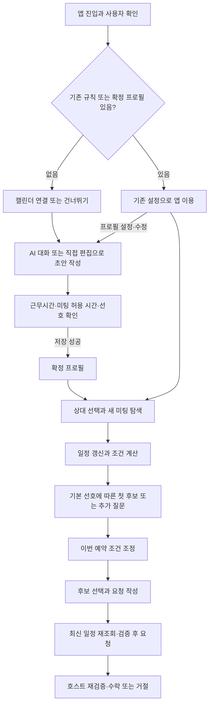
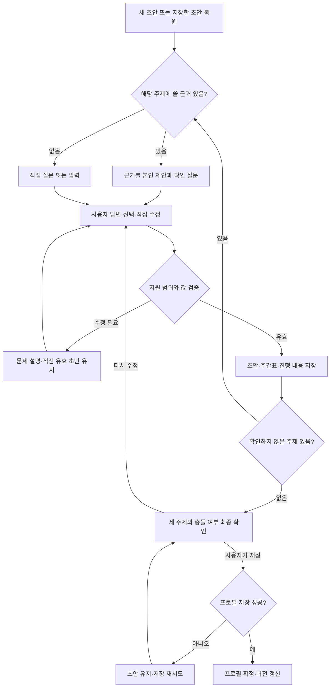
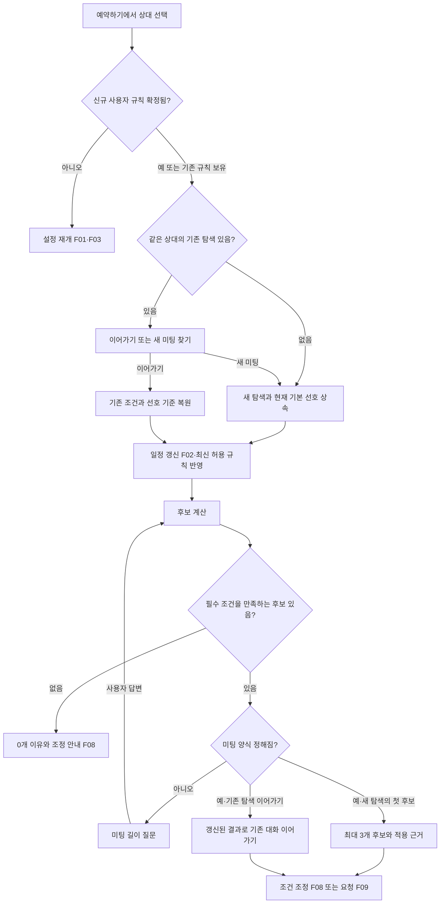
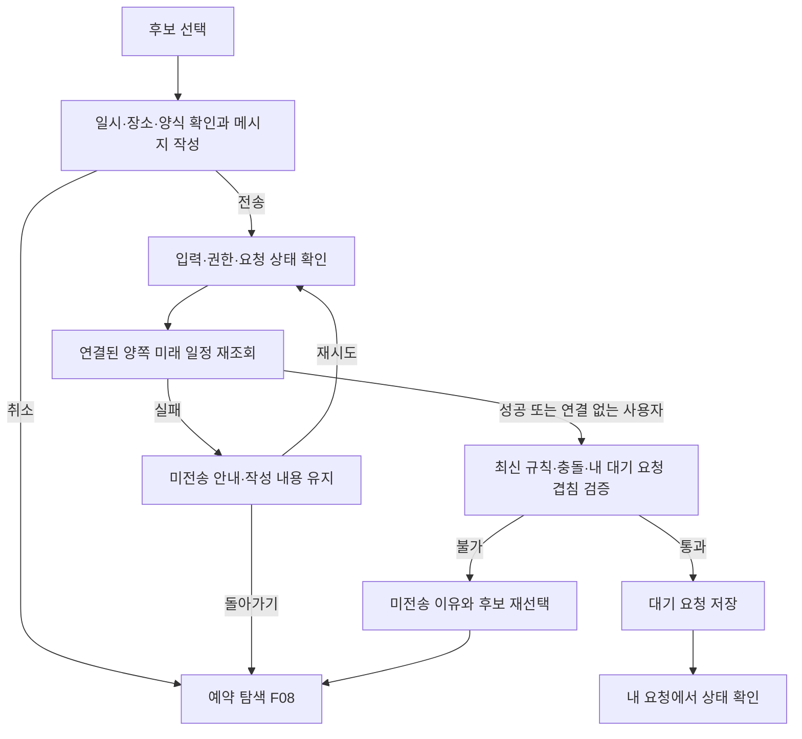

# User Flow — AI 온보딩과 개인 미팅 프로필

작성일: 2026-10-04 · 상태: 확정 (2026-10-04 검토 완료)

근거: `product_requirement_document.md`, `user_stories.md`.

이 문서는 사용자의 진입·선택·상태 변경·실패 후 복귀를 정한다. F 번호는 이 기능 폴더 안에서 사용한다. 화면 ID와 경로는 다음 `app_screen_list.md`에서 정하며, 아래의 화면 이름은 기능상 목적지를 뜻한다. 구현 방식·DB 상태명·AI 호출 횟수는 아키텍처 단계에서 결정한다.

---

## 1. 전체 흐름

- 신규 사용자는 미팅 허용 규칙 확정 전 요청·수신이 열리지 않는다. 기존 사용자는 새 프로필 작성 중에도 이전 규칙으로 이용한다.
- 허용 시간을 모두 닫은 사용자는 프로필이 확정돼 있어도 예약 가능한 시간이 없다. 호스트는 장소·미팅 양식도 등록해야 한다.
- **초안 저장**, **프로필 확정**, **예약 요청**, **예약 수락**은 별도 동작이다. 앞 단계를 마쳤다고 다음 단계가 자동 실행되지 않는다.

## 2. 상태를 구분하는 기준

| 구분 | 사용자에게 의미 있는 상태 | 다음 단계에 미치는 영향 |
|---|---|---|
| 사용자 | 신규 / 기존 규칙 보유 / 확정 프로필 보유 | 신규만 규칙 확정 전 예약 이용 제한 |
| 연결 | 연결 안 함 / 사용 캘린더 선택 중 / 연결됨 / 재연결 필요 | 계정으로 사용자 식별하는 것과 캘린더 읽기 권한을 구분 |
| 자료 조회 | 최초 조회 중 / 성공 자료 있음 / 갱신 중 / 실패 | 실패 시 마지막 성공 자료와 시각 유지. 최초 실패를 빈 캘린더로 취급하지 않음 |
| 설정 | 미시작 / 초안 작성 / 최종 확인 / 확정 프로필과 편집 초안 공존 | 확정 전 초안은 예약 계산에 쓰지 않음 |
| 예약 탐색 | 새 탐색 / 기존 탐색 이어가기 / 후보 계산·조정 / 요청 작성 | 새 탐색만 최신 기본 선호를 자동 상속 |
| 요청 | 대기 / 수락 / 거절 / 철회 / 만료 표시 | 기존 MVP 규칙 유지. 프로필 편집으로 요청 상태를 자동 변경하지 않음 |

계정이 확인됐어도 캘린더 연결은 건너뛸 수 있다. AI 장애는 연결 실패와 별개이며, AI 없이 프로필을 직접 편집할 수 있다. 연결된 캘린더의 조회 실패는 연결 건너뛰기로 자동 전환하지 않는다.

## F01. 첫 진입과 캘린더 연결

관련 스토리: US-01, US-02, US-40. 관련 기준: AC-01, AC-05.

1. 실제 이용 모드에서는 Google 계정으로 사용자를 확인한다. 시드 데모 모드에서는 기존 사용자 전환을 유지하며 실제 계정의 일정을 섞지 않는다.
2. 신규 사용자에게 연결 목적과 조회 기간, 외부 AI 분석에 쓰이는 정보 범위를 보여준다. 기존 사용자에게는 프로필 만들기·수정 진입점을 제공한다.
3. 사용자가 연결하면 캘린더 읽기 권한을 요청하고 사용할 캘린더를 선택한다. 권한 결과가 연결을 시작한 사용자와 맞는지 확인한다.
4. 선택을 마치면 F02로 이동한다. 캘린더를 선택하지 않은 상태에서 수집 성공으로 표시하지 않는다.
5. 연결을 건너뛰거나 권한 요청을 취소하면 외부 분석 없이 F03의 직접 설정으로 이동할 수 있다.
6. 전체 설정을 나중으로 미루면 앱 이용 화면에 재개 진입점을 남긴다. 신규 사용자가 예약 기능을 선택하면 설정 필요 상태와 재개 동작을 안내한다.

**실패·복귀**

- 계정 확인 실패: 사용자 선택·로그인으로 돌아간다. 다른 사용자의 초안을 대신 열지 않는다.
- 캘린더 권한 거절·취소: 재연결 또는 연결 없이 설정을 선택한다. 사용자 계정 확인까지 취소한 것으로 처리하지 않는다.
- 기존 사용자의 전환: 기존 구간을 초안에 불러오되, 확정 전까지 기존 규칙과 대화를 유지한다. 기존 대화 조건은 이번 탐색의 명시적 조건으로 취급한다.

## F02. 일정 가져오기·갱신과 결과 확인

관련 스토리: US-03, US-04. 관련 기준: AC-01, AC-02, AC-10.

1. 최초 연결, 수동 새로 가져오기, 온보딩 재개, 새 탐색, 예약 화면 재진입에서 필요한 자료 조회를 시작한다.
2. 과거 56일은 분석, 오늘부터 60일은 예약 계산용으로 가져온다. 반복 회차·변경·취소·기간에 겹치는 일정을 PRD 규칙에 맞춰 반영한다.
3. 모든 선택 캘린더의 조회가 끝나면 완결된 결과를 적용하고 마지막 성공 시각을 갱신한다.
4. 내 캘린더에서 시간·장소·바쁨 상태를 확인한다. 필요한 장소 보완은 F04로 연결한다.
5. 최초 온보딩이면 F03, 기존 온보딩 재개면 마지막 초안, 예약에서 시작했다면 해당 탐색으로 돌아가 후보를 재계산한다.

| 결과 | 표시와 다음 행동 | 보존할 것 |
|---|---|---|
| 조회 성공, 일정 있음 | 현재 자료와 갱신 시각 표시 후 원래 목적지로 복귀 | 사용자 보완 정보와 확정 프로필 |
| 조회 성공, 일정 없음 | 실제 빈 결과임을 표시. 분석은 직접 질문으로 진행 | 기존 설정. 빈 기록으로 허용 시간을 자동 확대하지 않음 |
| 최초 조회 실패 | 재시도·권한 복구·직접 설정 안내 | 작성한 초안. 분석 결과를 만들지 않음 |
| 일부 또는 갱신 조회 실패 | 실패 상태와 마지막 성공 시각 표시, 재시도 제공 | 마지막 성공 자료 전체. 실패를 삭제로 반영하지 않음 |
| 접근 권한 만료·해제 | 계정 소유자에게 재연결 안내 | 마지막 성공 자료와 프로필. 현재 자료라고 표현하지 않음 |

- 조회 실패 중에도 초안 편집은 가능하다. 이전 자료를 제안 근거로 쓰면 그 기준 시각을 밝힌다. 새 예약의 요청 전송·수락에는 F09·F10의 별도 재조회 성공이 필요하다.
- 재개·갱신은 이미 답한 질문이나 저장한 선호를 덮어쓰지 않는다. 반복 클릭으로 조회 자료나 첫 응답을 중복 생성하지 않는다.
- 종일 일정·비차단 일정·미응답 초대·업무 위치의 처리는 PRD FR-13–15를 따른다. 사용자에게 같은 일정이 상황마다 다른 의미로 표시되지 않게 한다.

## F03. AI 온보딩·직접 편집과 최종 확정

관련 스토리: US-10, US-11, US-12, US-13, US-14, US-15, US-16, US-17, US-18. 관련 기준: AC-03, AC-04, AC-05.

**질문 순서와 건너뛰기**

| 주제 | 질문·제안의 근거 | 완료할 수 있는 답 |
|---|---|---|
| 근무시간 | 업무 일정 패턴, 개인 약속 시작 등. 개인 약속만으로 근무 시작을 추정하지 않음 | 요일별 구간 또는 고정 패턴 없음 |
| 미팅 허용 시간 | 업무 미팅 분포와 늦은 사례. 반복 가능 시간인지 예외였는지 확인 | 요일별 복수 구간 또는 미팅을 받지 않음 |
| 기본 선호 | 미팅이 자주 있었던 시간과 사용자 설명. 앞으로도 원하는지 확인 | 지원하는 항목별 강/약 선호 또는 선호 없음 |

- 한 발화에 여러 주제의 답이 있으면 모두 초안에 반영하고, 아직 확인하지 않은 부분만 묻는다. 사용자가 원하면 앞선 주제로 돌아간다.
- AI가 분류한 업무·개인 여부를 사용자가 고치면 해당 집계와 제안 근거를 갱신한다. 불명확한 일정 전체를 반드시 분류해야 완료되는 흐름으로 만들지 않는다.
- 주간표에서 수정하는 동작과 대화는 같은 초안을 편집한다. 예: 근무 09–18시, 허용 10–12시·14–18시, 오후 선호를 별도로 표시한다.
- 자정을 넘는 구간은 두 요일로 나누어 확인하고 겹치는 구간은 합친다. 잘못된 구간, 허용 시간과 모순되는 선호는 수정 지점으로 돌아간다.
- 날짜별 예외, 온라인 여부별 허용 시간, 필수 최소 여유처럼 지원하지 않는 요구는 제한을 설명한다. 다른 의미의 규칙을 저장한 뒤 완료됐다고 하지 않는다.
- AI 실패는 마지막 유효 초안을 유지한 채 직접 편집 또는 재시도로 연결한다. 단순 새로고침·재접속은 마지막 저장 초안으로 돌아온다.
- 최종 저장 전까지 신규 사용자는 예약 미개방, 기존 사용자는 이전 규칙 적용 상태다. 빈 허용 구간도 확정할 수 있으나 완료 결과에 예약 불가를 표시한다.
- 저장 성공 후 예약을 찾던 사용자는 원래 탐색 진입점으로, 호스트 설정이 필요한 사용자는 장소·미팅 양식 설정으로 이동할 수 있다. 프로필 완료만으로 요청이나 예약을 만들지 않는다.

## F04. 장소·온라인 정보 확인과 보완

관련 스토리: US-05. 관련 기준: AC-10.

1. 내 캘린더 또는 온보딩의 근거 확인에서 해당 일정 상세를 연다.
2. 원본 장소·온라인 단서와 현재 해석을 확인한다. 장소가 없으면 미확인, 장소와 화상회의 링크가 함께 있으면 참석 방식을 확인할 수 있게 한다.
3. 사용자가 회사·특정 장소·온라인 정보를 보완해 저장한다.
4. 저장 성공 시 해당 자료로 이동 계산을 갱신하고 원래 캘린더·초안·탐색으로 돌아간다. 실패하면 입력을 유지해 다시 저장할 수 있게 한다.
5. 원본 장소·온라인 정보가 나중에 바뀌면 기존 보완 내용을 보여주고 재확인한다. 이전 보완이 여전히 확정된 현재 정보라고 표시하지 않는다.

미확인 장소의 시각 일정은 기존 '장소 없음' 규칙으로 계산할 수 있다. 장소 보완을 온보딩 전체의 필수 단계로 만들지 않는다. 근무시간과 종일 일정은 이 흐름으로 실제 출발 위치를 자동 생성하지 않는다.

## F05. 프로필 수정·재분석과 탐색에 적용

관련 스토리: US-19, US-23. 관련 기준: AC-07, AC-12.

| 진입 행동 | 초안 생성과 검토 | 저장 후 결과 |
|---|---|---|
| 프로필 직접 수정 | 현재 확정값을 초안으로 열어 F03의 편집·최종 확인 사용 | 새 프로필 확정. 새 탐색은 새 기본 선호 사용 |
| 새 기록으로 재분석 | F02 조회 후 새 제안을 기존 설정과 함께 확인 | 사용자가 선택하고 저장한 값만 확정 |
| 예약 중 '앞으로도 이렇게' | 이번 조건 중 프로필에서 지원하는 변경을 초안으로 표시 | 저장 후 원래 탐색으로 복귀. 아래 적용 규칙 사용 |

- 저장 취소·실패·이탈 중에는 기존 확정 프로필이 적용된다. 진행 중 초안은 재개할 수 있다.
- 새 **미팅 허용 규칙**은 저장 후 후보 재계산과 전송·수락 검증에 적용한다.
- 새 **기본 선호**는 진행 중 탐색에 자동 덮어쓰지 않는다. 최신 기본 선호 적용을 선택하면 상속 항목만 갱신하고 명시적 변경·해제는 유지한다.
- '앞으로도 이렇게'를 저장해도 이번 탐색에서 이미 정한 조건은 유지한다. 다른 상속 항목까지 갱신하려면 최신 기본 선호 적용을 선택한다.
- 호스트의 기본 선호는 이후 후보 재계산에서 최신값을 사용한다. 기존 요청·확정 예약 상태는 바꾸지 않는다.

## F06. 캘린더 선택 해제·연결 해제

관련 스토리: US-06. 관련 기준: AC-12.

1. 연결 관리에서 사용자가 캘린더를 선택 해제하거나 연결 해제를 선택한다.
2. 해당 출처의 수집 일정·분석 근거 제거, 확정 프로필·앱 내 일정 유지, 가능 시간 증가 가능성을 안내한다.
3. 해제를 실행하면 해당 출처의 추가 조회를 중단하고 관련 수집 자료를 제거한다. 제거한 자료를 새 제안의 근거로 다시 사용하지 않는다.
4. 사용자는 남은 자료 기준으로 계속 사용하거나 다시 연결할 수 있다. 다시 연결은 F01, 계속 사용은 현재 자료에 따른 재계산으로 연결한다.

- 남은 자료 기준의 사용 여부를 고르기 전에, 해제 직후 늘어난 후보로 요청·수락을 진행시키지 않는다. 재접속해도 이 선택을 다시 제공한다.
- 연결 해제로 기존 요청·프로필·앱 내 확정 일정을 삭제하지 않는다. 제안 초안에서 제거된 출처의 근거는 현재 확인 가능한 근거로 표시하지 않는다.
- 공급자에서 권한이 사라진 경우는 이 해제 선택을 대신한 것이 아니다. F02의 재연결 필요 상태로 처리한다.

## F07. 상대 선택·새 탐색과 첫 후보

관련 스토리: US-20, US-21. 관련 기준: AC-06, AC-07.

- 상대가 장소·양식 미등록 또는 미팅 허용 시간 없음으로 예약 불가이면 그 이유를 먼저 표시한다. 대화가 가능하다고 허위 안내하지 않는다.
- 이어가기는 이전 조건을 유지하고 새 시작은 현재 기본 선호만 가져온다. 첫 응답은 같은 탐색의 재조회마다 중복 생성하지 않는다.
- 미팅 양식이 여러 개이고 길이가 미정이면 질문한다. 기본 선호만으로 임의의 길이를 확정하지 않는다.
- 새 탐색의 첫 후보는 길이가 정해지고 후보가 있으면 동점이 많아도 최대 3개를 보여준다. 이후 턴은 PRD의 갱신된 버튼 표시 기준을 따른다.
- F02가 실패하면 갱신 실패와 자료 기준 시각을 표시한다. 마지막 성공 자료로 탐색을 이어갈 수 있어도 요청 단계의 재조회는 생략하지 않는다. 자료가 전혀 없으면 현재 가능 시간을 확인했다고 표현하지 않는다.
- 기본 선호가 있으면 실제 적용한 선호를 설명하고, 없으면 공통 가능 시간 기준임을 설명한다.

## F08. 예약 조건 조정·양쪽 선호와 후보 없음

관련 스토리: US-22, US-23, US-24, US-25, US-30. 관련 기준: AC-07, AC-08, AC-09.

1. 클라이언트의 발화 또는 칩 동작을 받는다.
2. 자연어는 지원하는 조건으로 해석·검증하고, 직접 조작은 해당 조건 변경으로 반영한다. 해석 실패 시 조건을 바꾸지 않고 재입력·직접 조정을 제공한다.
3. 최신 허용 규칙과 현재 수집 일정으로 후보를 계산한 후 클라이언트 선호, 필요한 경우 호스트 선호, 결정적 정렬과 다양화를 적용한다.
4. 새 결과를 근거로 응답과 조건 출처를 표시한다. 응답 AI 실패 시 같은 근거의 템플릿을 사용한다.

| 사용자 행동 | 해당 탐색에서의 변경 | 기본 프로필 영향 |
|---|---|---|
| '이번에는 오전 우선' | 시간대 항목 대체. 다른 상속 항목 유지 | 없음 |
| 기본 선호 칩 삭제 | 해당 항목 해제 상태 저장. 다음 턴에도 해제 유지 | 없음 |
| 기본값으로 복원 | 해당 항목을 이 탐색이 상속 중인 기본 선호로 복원 | 없음 |
| 최신 기본 선호 적용 | 상속 기준을 최신으로 갱신. 명시적 대체·해제 유지 | 없음 |
| '앞으로도 이렇게' | 현재 조건을 유지하고 프로필 변경 초안으로 연결 | F05에서 저장해야 변경 |
| 허용 범위 밖을 요청 | 해당 사용자의 프로필 편집 필요 안내 | 이번 탐색만의 예외로 자동 변경하지 않음 |

**결과 분기**

- **선호에 맞는 후보 있음**: 버튼 조건에 따라 후보를 표시하거나 근거 있는 추가 질문을 한다.
- **필수 조건을 만족하지만 일부 선호 불일치**: 미충족 선호를 밝혀 대안을 제시한다. 선호를 필수 조건처럼 적용해 후보 0개로 만들지 않는다.
- **필수 조건 때문에 0개**: 조정할 조건을 안내한다. 본인 허용 규칙 변경은 F05, 상대 규칙 변경이 필요한 경우에는 상대의 설정이 필요하다고 설명한다.
- **양쪽 선호 사용**: 클라이언트 점수가 우선이며 동점에만 호스트 점수를 사용한다. 명시적 빠른·늦은 순서가 있으면 해당 시간 순서도 호스트 선호보다 우선한다. 실제 동점 해소에 쓰이지 않은 호스트 선호를 추천 이유로 만들지 않는다.
- **같은 후보 반복**: 기존 MVP의 반복 표시 규칙을 유지하되 최신 계산 결과와 일치하게 한다. 요청 시 F09에서 다시 검증한다.

## F09. 후보 선택·요청 전송·철회

관련 스토리: US-26. 관련 기준: AC-11.

- 메시지와 슬롯 입력이 유효하지 않으면 작성 위치에서 수정한다. 서버가 요청 저장에 성공한 뒤에만 전송 완료를 표시한다.
- 재조회 실패는 일정 충돌과 구분한다. 상대의 재연결이 필요하면 상세 일정·계정 정보를 노출하지 않고 현재 전송할 수 없는 이유를 알린다.
- 연결 없는 사용자는 앱에 등록된 일정 기준으로 검사한다. 연결됐지만 실패한 사용자를 이 경우로 바꾸지 않는다.
- 결과가 불명확한 네트워크 중단은 요청 생성 여부를 확인한 후 재시도하며 중복 요청을 만들지 않는다.
- 대기 요청은 슬롯을 막지 않는다. 내 요청에서 기존 규칙대로 철회할 수 있으며, 철회 후 상태를 갱신한다.
- 요청 이후 프로필 변경은 요청 내용을 소급해서 다시 쓰거나 자동 철회하지 않는다.

## F10. 호스트 요청 확인·수락·거절

관련 스토리: US-31, US-32. 관련 기준: AC-11, AC-12.

1. 받은 요청함에서 상태별 요청을 확인한다. 겹치는 대기 요청은 기존처럼 묶어서 표시한다.
2. **거절**을 선택하면 권한·현재 대기 상태를 검사하고 거절로 저장한다. 일정 조회 성공을 거절의 전제조건으로 두지 않는다.
3. **수락**을 선택하면 겹치는 대기 요청의 자동 거절 영향을 확인하고, 연결된 양쪽 미래 일정을 다시 조회한다.
4. 최신 허용 규칙·일정과 현재 요청 상태를 재검증한다. 불가능하거나 조회 실패이면 수락하지 않고 요청함에 이유와 재시도 경로를 표시한다.
5. 통과하면 수락, 겹치는 대기 요청 자동 거절, 양쪽 앱 캘린더 일정 생성을 함께 반영한다. 성공 후 요청함과 캘린더 상태를 갱신한다.

- 요청이 철회·처리됐거나 만료된 경우 최신 상태를 표시하고 수락을 차단한다. 중복 클릭으로 다시 수락하지 않는다.
- 재검증 중 영향받는 요청이 달라져 최초 확인 내용과 달라지면 변경된 영향을 다시 보여준다. 사용자가 본 영향과 다른 결과를 조용히 확정하지 않는다.
- 기본 선호만 바뀐 것은 수락 불가 사유가 아니다. 허용 규칙 변경은 수락 직전 검증 대상이다.
- 수락 실패만으로 원래 대기 요청을 자동 거절하지 않는다. 호스트는 이유를 보고 거절하거나 나중에 다시 처리할 수 있다.
- 확정은 앱 내 양쪽 캘린더에 반영한다. Google 캘린더에 일정이 작성됐다고 안내하지 않는다.

## F11. 확정 이후 일정·규칙 변경과 충돌 확인

관련 스토리: US-19, US-27, US-32. 관련 기준: AC-12.

| 변경 | 다음 흐름 | 유지되는 것 |
|---|---|---|
| 본인 기본 선호 변경 | 새 탐색에 적용, 진행 중 탐색은 F05의 선택 적용 | 대기 요청·확정 예약 상태 |
| 호스트 기본 선호 변경 | 이후 재계산에서 동점 해소에 사용 | 클라이언트 조건·기존 요청 상태 |
| 미팅 허용 규칙 변경 | 후보 재계산·향후 전송·수락 검증 | 이미 확정된 미팅, 처리 전 대기 요청 |
| 외부 일정 추가·변경으로 확정 미팅과 충돌 | 조회 후 당사자의 캘린더·예약 확인 화면에 충돌 표시 | 확정 미팅 자체. 자동 취소하지 않음 |
| 외부 일정 조회 실패 | 마지막 자료와 조회 실패 표시, 재시도 | 확정 예약. 실패를 충돌 해소로 표시하지 않음 |

이 흐름은 충돌 확인까지 제공한다. 확정 미팅 변경·취소, 상대방 자동 연락, 외부 알림을 실행하지 않는다.

## 3. 실패·중단 후 복귀 기준

| 멈춘 지점 | 보존할 상태 | 복귀 위치·가능한 선택 |
|---|---|---|
| 사용자 확인 | 확인되지 않은 사용자의 자료를 열지 않음 | F01 로그인·사용자 확인 |
| 캘린더 권한 요청 | 이미 저장한 자기 초안·프로필 | F01 재연결 또는 연결 없이 설정 |
| 최초·갱신 조회 | 마지막 성공 자료와 조회 시각, 사용자 보완 | F02 재시도 또는 F03 직접 편집 |
| AI 해석·응답 | 마지막 유효 초안·조건 | F03 직접 편집, F08 조건 조정·재시도 |
| 프로필 최종 저장 | 편집 초안과 이전 확정 프로필 | F03 최종 확인에서 저장 재시도 |
| 초안 작성 중 이탈 | 마지막 저장 초안과 진행 주제 | F03 이어가기. 외부 일정은 F02 갱신 |
| 예약 탐색 중 이탈 | 이번 조건·상속 기준·해제 상태 | F07 이어가기 또는 새 미팅 찾기 |
| 요청 전송 실패 | 작성 메시지·선택 슬롯, 확인된 요청 상태 | F09 재시도 또는 F08 재선택 |
| 수락 실패 | 확인된 요청 상태 | F10 재시도 또는 거절 |
| 연결 해제 후 이용 방식 미선택 | 프로필·앱 일정, 남은 자료 기준 사용 선택 대기 | F06 계속 사용 또는 재연결 |

## 4. 스토리·수용 기준 연결과 다음 문서

| 흐름 | 관련 스토리 | 주요 PRD 수용 기준 |
|---|---|---|
| F01 진입·연결 | US-01, US-02, US-40 | AC-01, AC-05 |
| F02 수집·갱신 | US-03, US-04 | AC-01, AC-02, AC-10 |
| F03 온보딩·확정 | US-10, US-11, US-12, US-13, US-14, US-15, US-16, US-17, US-18 | AC-03, AC-04, AC-05 |
| F04 장소 보완 | US-05 | AC-10 |
| F05 프로필 편집·재분석 | US-19, US-23 | AC-07, AC-12 |
| F06 연결 해제 | US-06 | AC-12 |
| F07 탐색 시작 | US-20, US-21 | AC-06, AC-07 |
| F08 조건·추천 조정 | US-22, US-23, US-24, US-25, US-30 | AC-07, AC-08, AC-09 |
| F09 요청 전송 | US-26 | AC-11 |
| F10 요청 처리 | US-31, US-32 | AC-11, AC-12 |
| F11 확정 이후 변경 | US-19, US-27, US-32 | AC-12 |

다음 `app_screen_list.md`에서 각 흐름의 진입점·입력·행동·로딩·빈 상태·오류·복귀 동작을 화면별로 배치한다. 이번 문서의 목적지는 반드시 각각 별도 페이지를 뜻하지 않으며 화면·패널·모달 구분은 다음 단계에서 정한다.
