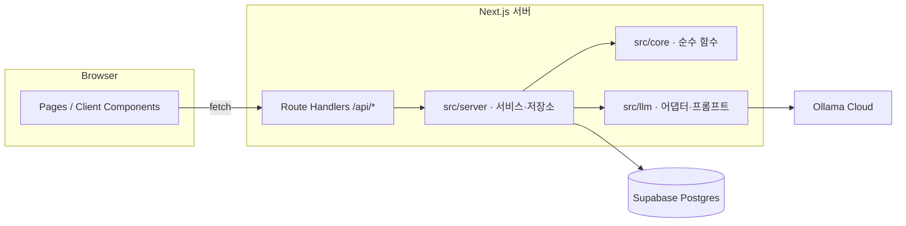

# Technical Architecture — AI 미팅 예약 (가칭)

작성일: 2026-09-29 · 상태: 확정 (2026-09-29) · 수정: 2026-09-30 (팀 리포 이관, Supabase 전환)
상세: `frontend_architecture.md`, `backend_architecture.md`
코드 경로(`src/…`)는 팀 리포의 `apps/web/` 기준이다.

---

## 1. 전제
- 완전한 데모다. 실제 앱(React Native + Supabase)을 만들 때 갈아엎을 수 있다.
- 실제 앱으로 **가져갈 자산은 두 가지**뿐이다. 둘 다 프레임워크에 의존하지 않는 순수 TypeScript로 격리한다.
  1. `src/core`: 슬롯 계산, 필터, 순위, 예약 규칙
  2. `src/llm`: Ollama 어댑터, 프롬프트, 호출 1/2
- 나머지(Next.js, `src/server`의 DB 코드, UI)는 데모 전용이다. DB는 팀 리포의 Supabase(Postgres)를 쓴다.

## 2. 스택

| 영역 | 선택 | 비고 |
|---|---|---|
| 앱 | Next.js (App Router) + TypeScript | 하나의 프로젝트에서 UI와 API를 함께 다룬다 |
| DB | Supabase(Postgres) + Drizzle ORM | 드라이버 `postgres`(postgres-js). 스키마는 리포 루트 `supabase/schemas/scheduler.sql`, 마이그레이션은 `supabase/migrations/` |
| 검증 | zod | LLM 출력, API 입력 |
| UI | Tailwind CSS | |
| 날짜 | date-fns | Asia/Seoul 고정. KST는 서머타임이 없어 +09:00 고정 오프셋으로 처리 |
| 테스트 | Vitest | `src/core`, `src/llm` 단위 테스트, `src/server` 서비스 테스트(PGlite에 같은 마이그레이션 적용) |
| LLM | Ollama Cloud `/api/chat` · `gemma4:31b` (대체 `nemotron-3-nano:30b`) | `.env`의 키 3개를 로테이션 |

## 3. 구성도

- **의존 방향**: `app → server → core / llm`
  - `core`는 아무것도 import하지 않는다(date-fns 제외).
  - `llm`은 `core`의 타입(Filter, Summary)만 import한다.
- 서버 컴포넌트는 조회할 때 `src/server`를 직접 호출한다. 변경은 모두 Route Handler를 거친다.
  - 이유: 외부 에이전트용 블록은 이후 확장으로 미뤘다. 하지만 그때 쓸 API 경계를 지금 한 곳에 모아두기 위해서다.

## 4. 요청 흐름 요약
- **대화 한 턴**: `POST /api/conversations/[id]/turns` → 호출 ① → core로 적용·계산 → 호출 ② → 저장 → 응답. 상세는 `backend_architecture.md` §4.
- **요청 전송·수락**: 서버에서 core 규칙으로 다시 검증한 뒤, 트랜잭션 안에서 상태를 바꾼다. 요청 생성·수락·거절·철회는 advisory lock으로 한 번에 하나씩 처리한다(`backend_architecture.md` §3.4).

## 5. 실행 · 환경
- `.env`: `OLLAMA_API_URL`, `OLLAMA_API_KEY_1..3`(작성됨), `OLLAMA_MODEL`, `DATABASE_URL`
- 테이블은 Supabase 마이그레이션이 만든다: 로컬은 리포 루트에서 `supabase start` → `supabase db reset`. 스키마 변경 절차는 리포 루트 `AGENTS.md`를 따른다.
- `npm run db:reset`: 모든 행을 지우고 시드를 넣는다(사용자 4명, 60일 일정). 날짜는 실행 시점 기준 상대 날짜로 생성한다.
- `.gitignore`에 `.env`를 넣는다.

## 6. 미확인 · 구현 전 확인할 것
- **DB** (해소, 2026-09-30): SQLite(`better-sqlite3`)로 구현했다가 팀 리포로 옮기면서 Supabase(Postgres)로 바꿨다. 팀 리포가 Supabase 기준으로 셋업되어 있고, Vercel 함수는 파일시스템이 읽기 전용(쓰기는 `/tmp` 임시 공간만)이라 SQLite 파일을 쓸 수 없기 때문이다.
- **Next.js 버전**: 설치 시점의 최신 안정 버전을 쓰고, 여기에는 버전을 적지 않는다.
- **두 번 호출 지연시간(NFR-2)**: 아직 측정하지 않았다.
