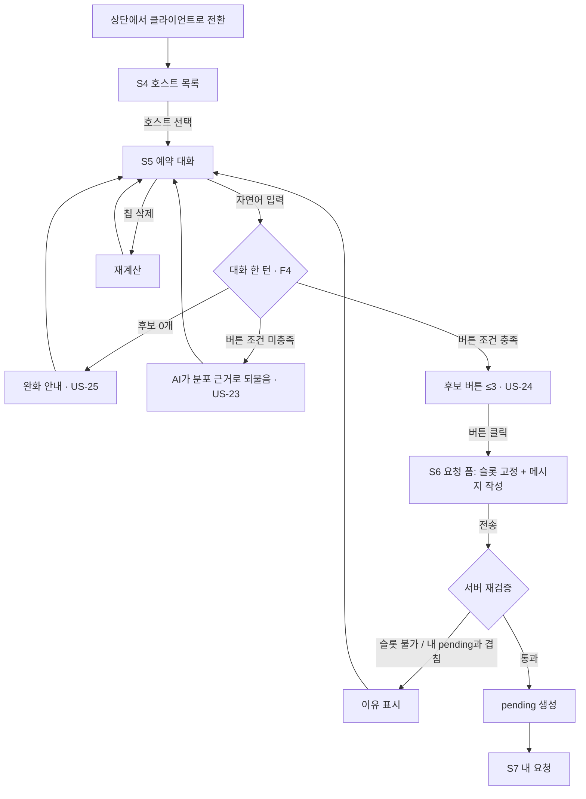
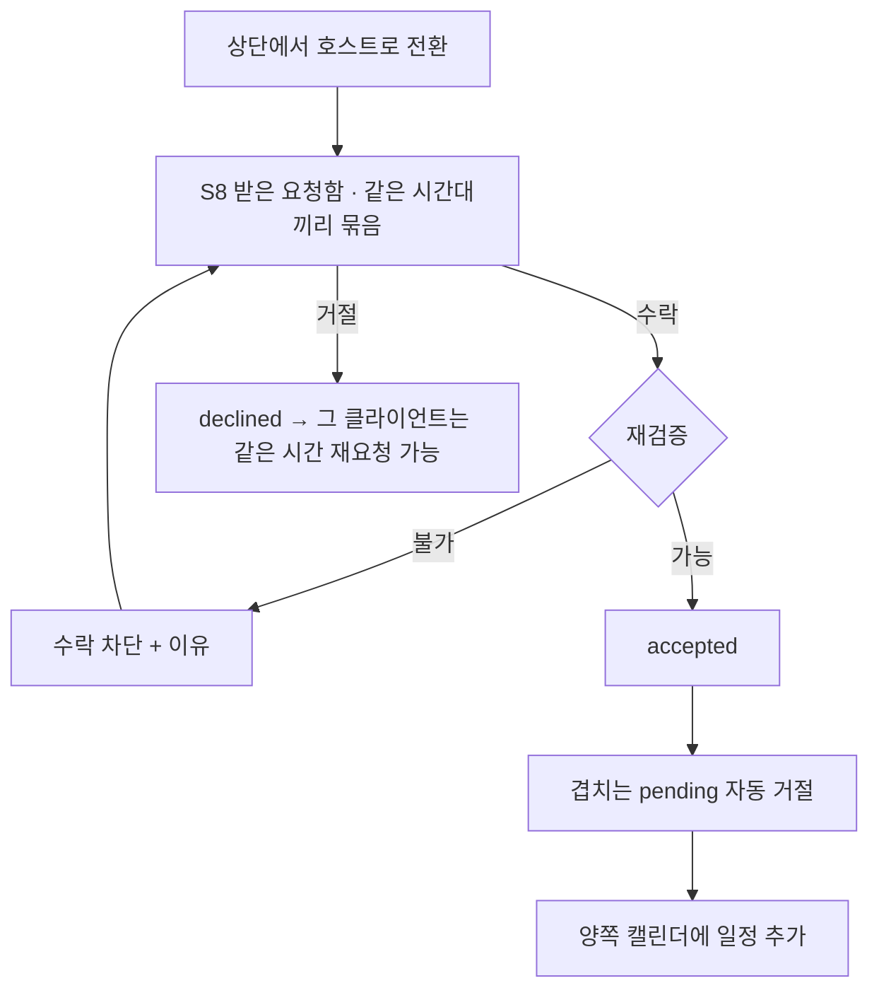
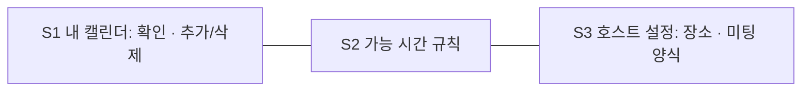
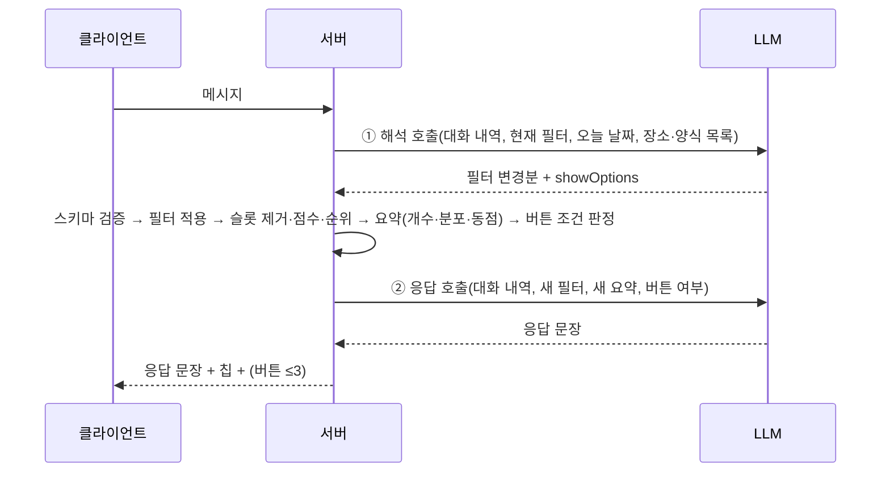

# User Flow — AI 미팅 예약 (가칭)

작성일: 2026-09-29 · 상태: 확정 (2026-09-29) · 근거: `user_stories.md`
화면 ID(S*)는 `app_screen_list.md` 참조.

---

## F1. 클라이언트 예약 (US-20–27)

## F2. 호스트 요청 처리 (US-12–14)

## F3. 초기 설정 (US-2–4, US-10–11)

- 순서는 자유롭다. 시드 데이터로 이미 채워져 있어 데모는 설정 없이도 바로 F1부터 시작할 수 있다.

## F4. 대화 한 턴 (시스템 흐름)

**LLM을 한 턴에 두 번 부른다 (2026-09-29 결정, PRD FR-21/22).**
- 호출을 한 번만 하면 응답 문장이 **필터를 적용하기 전의 요약**을 근거로 쓰인다. 그러면 "42개 있어요" 같은 숫자가 이번 턴의 결과와 맞지 않는다.
- 그래서 ① 해석 호출과 ② 응답 호출로 나눈다. ②는 새로 계산한 요약을 근거로 문장을 쓴다.
- 턴당 호출이 2회가 된다. NFR-2(p50 3초) 안에 들어갈지는 아직 측정하지 않았다.

**실패 경로** (서비스에 닿지 못한 경우와 모델 출력이 쓸 수 없는 경우를 구분한다. 전자는 ①을 재시도한 뒤 ②를 건너뛰고 "AI 응답 불가" 배너, 후자는 "해석 실패" 배너)
- ① 해석 호출이 스키마 검증에 실패하면 1회 재시도한다. 그래도 실패하면 필터를 바꾸지 않고 "이해하지 못했어요, 칩으로 직접 조정할 수 있어요"라고 안내한다.
- ② 응답 호출이 실패하면 코드 템플릿으로 요약 문장을 만든다. 예: "조건에 맞는 시간 42개".
- LLM이 전혀 동작하지 않아도 칩 편집, 버튼, 요청은 동작한다(NFR-3).
