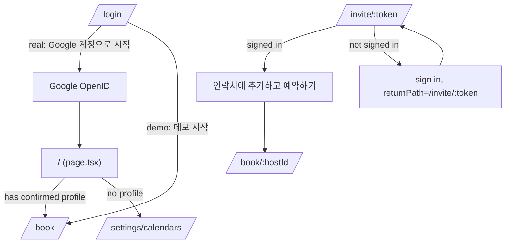
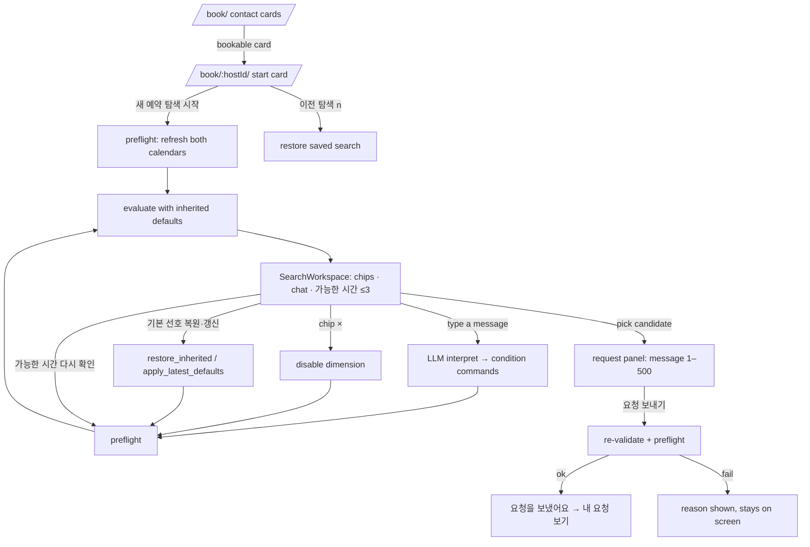

# 01 — End-to-end journey map (AI-facing)

All routes are under `apps/web/src/app`. Screens inside `(app)/` require an actor; unauthenticated → `/login` (`(app)/layout.tsx`).
Feature IDs (F01…F11) refer to `features/`.

## J0. Entry and routing

- `/` redirects by **profile existence only** (`app/page.tsx`): no profile → calendar step first; otherwise booking. Intent `[code comment]`: "people who have not set up their hours start at the calendar step".
- Login page shows a 3-step promise (`login/page.tsx STEPS`): ① Calendar 연결 (선택) ② 시간 프로필 (AI proposes, user confirms) ③ AI와 예약. It sets expectations that connection is optional and confirmation is the user's.
- Header nav (`components/Header.tsx`) groups: 예약 [예약하기 · 내 요청 · 받은 요청함(pending badge)] / 일정 [내 캘린더] / 설정 [내 시간 프로필 · Calendar 연결 · 호스트 설정]. Demo shows user switcher; real shows name + 로그아웃.

## J1. First-time setup: calendar → AI → profile (the "AI path")

| Step | Screen / component | What the user sees and does | What the system does | Feature |
|---|---|---|---|---|
| 1 | `/settings/calendars` `CalendarSettings` | Stepper `연결 → 캘린더 선택 → 일정 가져오기 → 시간 프로필`. Real: "Google Calendar 연결" (+ link "Calendar 없이 직접 설정하기"). Demo: "예시 Calendar 연결". | OAuth (purpose=calendar, read-only scopes) or mock connect. After linking, calendar list loads automatically (no extra click). | F01, F02 |
| 2 | same | Checkbox list of calendars, preselected = all with full detail access. | — | F02 |
| 3a | same | **저장하기** | Save selection if changed → full import (past 56 d + next 60 d). Message "일정을 가져와 저장했어요." | F02 |
| 3b | same | **AI로 설정 시작하기** (primary) | Import (skipped if unchanged and already imported) → create profile draft → AI classifies past 8 weeks → status line "AI가 일정을 분류하는 중이에요 (최대 1분)". | F02, F04, F05 |
| 4 | `ImportReviewDialog` | "가져온 일정 확인": tabs 분류별 / 장소별; groups 업무/개인/확인 필요 or 회사/장소/온라인/알 수 없음; each event expandable to correct category/place. Confirm "확인했어요 · AI 설정 계속". | If anything was corrected, analysis re-runs ("보정한 내용으로 다시 분석하는 중…"), then navigate `/onboarding`. | F03, F04 |
| 5 | `/onboarding` `OnboardingWorkspace` | Left: manual editor (work hours, meeting windows, preferences, 3 topic checkboxes). Right: optional re-analysis bar, chat (first AI message = analysis briefing), week chart. Sticky bottom bar: save status + "주제 확인 n/3" + **최종 확인**. | Draft autosaves 500 ms after valid edits. Chat messages are parsed into profile patches by the LLM; replies are fixed wording asking for the next unconfirmed topic; questions about the analysis are answered from stored numbers. | F05, F04 |
| 6 | same, review state | Summary table + week chart; "돌아가서 수정" / **이 설정으로 확정** (disabled until all three topics confirmed and draft saved). | Confirm writes a new immutable profile version; booking starts using it. | F05 |
| 7 | completion card | "프로필 설정을 완료했어요." → 내 프로필 보기 / 예약하기 | — | F05 |

Manual path: step 1 "Calendar 없이 직접 설정하기" → `/onboarding` (banner offers connecting later) → "설정 시작" creates draft → same editor without analysis.
Re-entry: `/settings/availability` shows the active profile (version badge "적용 중" + week chart) and the same editor (`purpose="edit"`); the analysis bar appears whenever a calendar import exists (`commit ea8eb13`).

## J2. Becoming bookable (host side)

`/settings/host`: header badge 예약 받는 중 / 예약 받을 수 없음; warning until ≥1 place and ≥1 meeting type; **내 예약 링크** card (copy / 새 링크로 바꾸기); **제안으로 채우기** card (calendar-derived and spoken proposals, each added with **추가**); place and meeting-type editors (F06, F07).
Readiness gates used elsewhere: host must have places+types (`isBookableHost`, `/book` card state) and **both** participants must have meeting windows (`profileReadiness`, enforced in `preflightCalendars` → `setup_required`).

## J3. Connecting with someone

- Host shares `/invite/<token>`. Visitor states (`app/invite/[token]/page.tsx`): invalid/renewed link → "링크를 열 수 없어요"; own link → hint to share it; signed in → **연락처에 추가하고 예약하기** (adds both directions, opens `/book/<hostId>`); signed out → sign in and come back to the same link.
- Alternative: paste the link (or token) on `/book` "받은 예약 링크 붙여넣기" → 연락처에 추가 → opens `/book/<hostId>`.

## J4. Booking a meeting (client side)

Key behaviours (all `[code]`, `services/search.ts`):
- The **first response is automatic**: creating a search immediately computes candidates using the client's profile defaults and posts an assistant message ("기본으로 선호하시는 조건을 적용해 찾아봤어요. …"). The user does not have to type first.
- **Every evaluation shows up to 3 candidates** (`decideOptions(ranked, effective, requested=true, initial)`), with a template explanation of how they were chosen.
- Chips show the **source** of each condition: neutral style "기본 선호" (inherited) vs. tinted "이번 예약" (override).
- If calendars/settings changed since the last evaluation, candidates are flagged stale: warning "일정 또는 설정이 바뀌었어요. 후보를 새로 확인해 주세요." and candidate buttons are disabled.
- URL keeps the search: `/book/<hostId>?search=<id>`; "다른 예약 탐색 시작" returns to the start card. Up to 10 previous searches are listed.

## J5. Handling requests (host side)

`/requests/inbox`: pending requests grouped by transitive time overlap. A group with >1 item has a warn border and "같은 시간대에 N건이 겹쳐 있어요. 하나를 수락하면 나머지는 자동 거절돼요." **수락** fetches an accept preview → inline confirm "겹치는 요청 N건은 자동 거절됩니다." / "이 요청을 수락할까요?" → **확인**. **거절** is immediate. Sections below: 수락한 요청 / 거절·철회된 요청 / 만료된 요청. Accepted cards show a conflict note if the host's own calendar now overlaps. (F10)

## J6. After confirmation

- Both people get an in-app event titled `미팅 · <other person> · <meeting type>` (`acceptMeeting`). Google is never written to.
- `/requests/sent` (client): status badge 대기 중/수락됨/거절됨/철회됨/만료; **철회** on pending.
- `/calendar`: week grid (this week … +8 weeks) merging app events, confirmed meetings (green), imported Google items (tinted; busy-only items grey), all-day items, per-day meeting-window line ("허용 시간 없음" when closed). Overlaps between a confirmed meeting and an external item are badged on both and explained in the detail panel; nothing is cancelled. (F11)

## J7. Failure and recovery paths (what the user is told)

| Situation | UI response | Code |
|---|---|---|
| Mutation result unknown (network/timeout) | Button "작업 결과 확인 / 저장 결과 확인 / AI 결과 확인 / 예약 요청 결과 확인 …" replays the same idempotency key | `useMutationOperation.recover` |
| Draft edited elsewhere | Alert with "최신 서버 설정 보기", choose "내 입력으로 다시 저장" or "최신 저장값 사용" | `draftReducer`, `useDraftAutosave` |
| Search changed in another tab | error + view reloads to current revision | `SearchWorkspace.accept` |
| LLM unparseable in search | condition unchanged, reply prefixed "말씀을 조건으로 해석하지 못해 기존 조건을 유지했어요." | `search.ts:89` |
| LLM unparseable in onboarding | message note "해석하지 못했어요. 직접 입력하거나 다시 설명해 주세요." | `OnboardingChat` |
| Calendar refresh fails | "<reason> 기존 일정은 그대로 유지했어요." | `RefreshCalendarButton` |
| Calendar permission revoked | status 권한 재연결 필요, button "Google Calendar 다시 연결" | `CalendarSettings` |
| Search error referencing calendar | alert with link "Calendar 연결" | `SearchWorkspace` |
