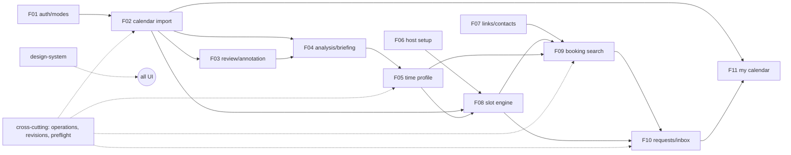

# Transplant guide (AI-facing)

Goal: cherry-pick features, intent and design from this MVP into another team member's MVP. The target is not fixed; check §6 against it before starting.

## 1. Dependency graph

## 2. Recommended order
1. **Design system** (tokens + `components/ui`) — no dependencies, makes later UI copy-paste.
2. **Pure core** `core/{time,types,travel,availability,slots,booking}.ts` (F08 + overlap rules). Bring tests `tests/core/*`.
3. **Profile model** `core/profile.ts` + F05 editor UI (manual path only). Wire `getRules`-style "confirmed windows win".
4. **Host setup** F06 → booking becomes possible with app events only.
5. **Search engine** `core/{preferences,filter,options,summary,chips,explain}.ts` + `services/search.ts` without LLM (chips/commands only).
6. **Requests** F10 (with impact-token accept).
7. **Calendar import** F02 (`core/calendar.ts` first; provider second) + preflight.
8. **LLM** `llm/ollama.ts` → `interpret` (search), `onboarding` (profile patch).
9. **Analysis/briefing** F04 + **review** F03.
10. **Contacts/links** F07 and **calendar view/conflicts** F11 (independent; any time after their inputs exist).

## 3. Minimal subsets
| Want | Copy | Can skip |
|---|---|---|
| "AI proposes, you confirm" onboarding only | F02 normaliser, F04, F05, `llm/{ollama,classify,onboarding}.ts` | F09/F10 if target already books |
| Better availability in an existing booking flow | F08 + F02 normaliser + F05 windows | AI entirely |
| Conversational booking on top of target's own slots | F09 core + `llm/interpret.ts` | travel rules (feed your own `Slot[]`) |
| Visual identity | design-system.md | everything else |

## 4. Present in code but not in the live journey (decide before copying)
- `server/services/chat.ts`, `llm/respond.ts`: two-LLM-call turn, LLM-written replies, ask-back on distribution, "ask meeting length first" (`askMeetingType`), "same as before" suppression, relax hints in replies. Routes `/api/conversations*` are retired. Tests still cover them.
- `services/booking.ts createRequest/acceptRequest/declineRequest/withdrawRequest`: superseded by `booking-commands.ts` (no route calls them).
- `components/calendar/ImportedEvents.tsx` list component: not mounted (only `EventEditor` used).
- `app/api/availability` (legacy 7-row rules editor): no UI calls it; (its missing `await` was fixed together with `places`, `meeting-types` and `events`).
- `core/summary.ts relax` counts are computed in `search.ts` evaluations but not rendered by the live reply template (only `chat.ts`/`respond.ts` would use them).

## 5. Where the design docs and code differ (code is the truth)
| Topic | Design docs say | Code does |
|---|---|---|
| Booking turn | 2 LLM calls; AI writes 1–3 sentences; asks back when many candidates; buttons only when requested/settled/≤3 (`documentaions/mvp` FR-21, FR-27) | 1 LLM call (interpret); reply = code template; up to 3 candidates every turn (`search.ts:30,47`) |
| Meeting length first (FR-29a, availability FR-45) | ask length when type undecided and host has several | not asked in live flow; `createSearch` accepts `meetingTypeId` but UI never sends it |
| Same-as-before suppression (FR-27b) | don't repeat identical buttons | not in live flow |
| Onboarding replies | AI conversation with evidence-backed proposals | LLM only extracts patches; replies are fixed questions per topic + code briefing |
| Final review | separate page S12 `/onboarding/review` | state inside `OnboardingWorkspace` (route still in auth return-path allow-list) |
| Header "설정 이어가기" (S0) | resume entry in header | not present; `/` redirect + empty states guide instead |
| "최신 기본 선호 적용" (S5) | action offered when the profile has changed | always-visible link "최신 기본 선호 가져오기" inside the collapsed "기본 선호 복원·갱신"; no detection that the profile changed |
| Booking links | listed as out of scope in MVP | implemented, mandatory (`canBook`) |
| Import review dialog, analysis Q&A, work-hour estimate, demo example calendar, conflict badges | not in docs or only partially | implemented (commits 0caecf2…47a7b9c) |

## 6. Pre-flight checklist against the target MVP
- Stack match: Next.js App Router? Postgres? Tailwind v4? Zod v4? If Supabase Auth is used, replace F01 sessions but keep calendar-consent separation.
- Time zone: this code is KST-only (`core/time.ts` fixed offset). A multi-zone target needs `kstParts`/`kstDayStart` generalised first.
- IDs: places/meeting types are referenced by id in slots; profile preferences must stay id-free (portable across hosts).
- Data volume: classification budget 120 events/run; calendar limits 100 pages / 50k items.
- Schema: tables needed per feature are listed in each `features/F*.md` "Data / API" section; DDL in `supabase/schemas/scheduler.sql`.
- Secrets: `OLLAMA_API_KEY_*`, Google OAuth, `TOKEN_ENCRYPTION_KEY`, `IMPACT_SIGNING_KEY` (demo falls back to a fixed key).

## 7. Invariants to re-test after transplant
1. Every travel-table cell (`tests/core/travel.test.ts`).
2. Must conditions never relaxed automatically; preference mismatch never yields zero.
3. Host score changes order only among equal client scores.
4. A draft never affects slots; only a confirmed version does; empty windows ⇒ not bookable.
5. Accept with a changed affected set ⇒ `accept_impact_changed`.
6. Calendar refresh failure keeps the previous snapshot.
7. Correction with changed source fingerprint ⇒ "다시 확인 필요".
8. No LLM output reaches the user as an unverified number.
