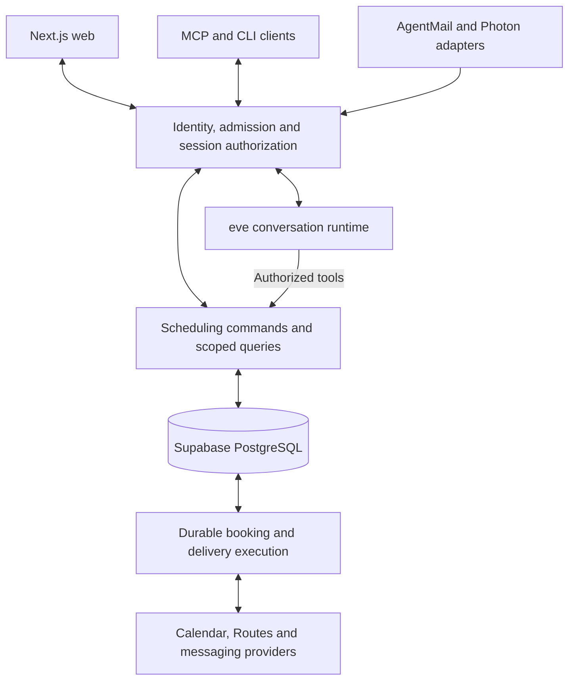

# Find Me a Time — Technical Specification

Status: architecture overview; replacement implementation and verification pending
Date: 2026-10-06
Basis: [implementation plan](technical_specification/04_implementation_plan.md), [PRD](02_product_requirements.md), and [interfaces](user_experience/03_interfaces.md)

The pre-launch rebuild replaces the web, agent integration, scheduling backend, contracts and channel integration source. Supabase remains selected infrastructure; the former API and worker implementation is not a retained dependency. Build directly in the final workspace paths on `feat/reconstruct-application` in the main checkout. Follow the eve chat template with root `agent/`, Next.js under `apps/web/`, shared contracts and server-only capabilities in root `lib/`, and separate eve/web builds composed through root `vercel.ts`. Keep database assets under `supabase/`; defer additional packages and worker/bridge apps until independent packaging or runtime requirements justify them. The [source organization](technical_specification/02_frontend_architecture.md#source-organization) owns the layout.

This document describes the target system. [Capability specifications](../openspec/specs/) retain agreed behavior; bounded [OpenSpec changes](../openspec/changes/) must resolve proposed deltas before implementation. The [implementation plan](technical_specification/04_implementation_plan.md#compatibility-gates) tracks unresolved provider/client gates..

## 1. Scope and foundation

The system coordinates one host and one external requester, checks Google Calendar and host rules, negotiates a proposal, and books only after requester agreement and explicit host approval of the current proposal. All channels use the same request state.

| Area | Rebuild direction | Decision status |
|---|---|---|
| Web | Next.js App Router, React and TypeScript; conversation-centered pages with typed in-chat actions. | Proposed; see [frontend architecture](technical_specification/02_frontend_architecture.md) and [page list](user_experience/04_page_list.md). |
| Agent runtime | eve for durable conversation execution, connected through application-authorized tools and sessions. | Selected on managed Vercel Workflow; [isolation and recovery evidence](technical_specification/05_rebuild_evidence.md#managed-workflow-recovery-acceptance--2026-10-10). Live provider/client gates remain open. |
| Model provider | Direct OpenAI through eve's `openai(...)` helper and a server-side `OPENAI_API_KEY`; use the intended OpenAI API billing account and applicable API credits. | Direct `gpt-6-luna` access and bounded failure behavior verified; [acceptance and remaining recovery limits](technical_specification/05_rebuild_evidence.md#direct-model-access-and-failure-acceptance--2026-10-10). |
| Identity and database | Supabase Auth and PostgreSQL; application-owned admission, grants and domain state. | Selected infrastructure; schemas and access paths are rebuilt and verified afresh. |
| Scheduling backend | Shared commands, audience-specific queries, deterministic feasibility, explicit decisions and reliable booking. | Web/eve APIs and workers share Vercel; Supabase owns durable jobs and scheduled wake-ups. Full scheduling/provider acceptance remains open. |
| Agent access | Remote MCP and a thin CLI over shared scheduling operations. | Required release scope; authorization and each named client need independent verification. |
| Calendar and travel | Separate Google Calendar grants for host events and requester availability; Google Routes plus confirmed buffers. | Provider direction retained; replacement adapters and controlled journeys need verification. |
| Transactional and Auth email | **Cloudflare Email Service**, sending host invitations, contact verification, recovery and booking confirmations from `no-reply@findmeatime.com`; Supabase Auth uses Cloudflare custom SMTP. | Selected provider; verify delivery against the rebuild project. See [email setup](technical_specification/03_provider_setup.md#cloudflare-email-service). |
| Conversation channels | AgentMail for requester email inboxes, threads and replies; Photon Spectrum for host iMessage. | Photon uses the [verified application-owned receiver and Spectrum SDK boundary](technical_specification/03_provider_setup.md#photon); native eve acknowledgment/send identity is insufficient. Live sender/device and AgentMail acceptance remain open. |
| Hosting | Vercel at `https://release.findmeatime.com` for separately built Next.js and eve services; selected Supabase project `mriseqztcwmezvtawnbo` for identity/data. See [deployment setup](technical_specification/03_provider_setup.md#reconstruction-deployment-origin). | [Runtime placement is selected](technical_specification/01_backend_architecture.md#selected-runtime-persistence-and-recovery); no additional worker deployment. Complete Spectrum and operational acceptance remain open. |

Native mobile apps, group meetings, non-Google calendars and automated post-booking changes remain outside the initial release. Private host email is a proposed extension, not an accepted requirement.

### Backend decision

Use eve with managed Vercel Workflow persistence for durable conversation execution. Supabase owns identity and durable scheduling state; application code owns resource authorization, proposal revisions, human decisions, idempotency and external-effect recovery. Framework sessions and tool approval never establish application authority.

The [runtime acceptance](technical_specification/05_rebuild_evidence.md#managed-workflow-recovery-acceptance--2026-10-10) records persistence, API/worker placement, durable job transport, recovery scheduling and complementary managed/local recovery checks. It does not establish live Spectrum compatibility or production-load recovery targets. Supabase Auth login does not establish MCP OAuth compatibility; resource-specific tokens and each named client's workflow require separate verification. See the [implementation gates](technical_specification/04_implementation_plan.md#phase-1--prove-the-runtime-and-settle-deployment-decisions).

## 2. Architecture

Use a modular application with Supabase-backed scheduling state and an application-authorized conversation runtime. The diagram shows logical responsibilities, not a selected API hosting layout.

## 3. User surfaces and trust boundaries

Hosts use the single `/app` agent chat for admission, setup, request review and settings through contextual cards/dialogs. Requesters start at `/{handle}` and continue with request-scoped access at `/booking/[bookingId]`. Authentication and provider consent use dedicated browser callbacks. Public `/SKILL.md` and `/{handle}/SKILL.md` explain agent entry; reading them grants no access. The [page list](user_experience/04_page_list.md) and [interfaces](user_experience/03_interfaces.md) own route and channel design.

Verified host web/iMessage and requester web/email may continue their respective authorized contexts. Keep host-private and requester histories, memory, projections and tool permissions separate. Resolve actor, resource and audience server-side for every read, stream, continuation and action. Provider credentials remain server-side.

## 4. Scheduling guarantees

Deterministic availability, rule and travel checks constrain candidate selection; the model gathers information and ranks feasible options. Booking requires current requester agreement and explicit, attributable host approval of the same proposal. Revalidate before creation, persist a stable event identity, and reconcile uncertain provider outcomes before another write. Delivery failure remains distinct from booking failure.

Confirmation email, Calendar invitation and protected receipt describe the same confirmed event. Shared invitations expose no conversation credentials or private host context. Initial-release scheduling excludes automated post-booking reschedule/cancel. Detailed rules live in backend architecture and the owning capability specs.

## 5. Detailed design owners

| Concern | Owning document |
|---|---|
| Identity/admission, public skill entry, MCP/CLI, data model, command contracts, availability, booking and channel recovery | [Backend architecture](technical_specification/01_backend_architecture.md) |
| Server/browser boundaries, session selection, artifact rendering, setup review, connection flows and accessible recovery | [Frontend architecture](technical_specification/02_frontend_architecture.md) |
| Supabase project, direct OpenAI configuration, messaging services, operator invitations and Google consent configuration | [Provider setup](technical_specification/03_provider_setup.md) |
| Phases, open decisions, compatibility gates, acceptance mapping and release evidence | [Implementation plan](technical_specification/04_implementation_plan.md) |
| Product intent and acceptance; user experience | [PRD](02_product_requirements.md), [journeys](user_experience/01_user_journeys.md), [user stories](user_experience/02_user_stories.md), [interfaces](user_experience/03_interfaces.md), [page list](user_experience/04_page_list.md) |
| Agreed behavior and proposed deltas | [Capability specifications](../openspec/specs/) and [OpenSpec changes](../openspec/changes/) |

## 6. Delivery and verification

The [implementation plan](technical_specification/04_implementation_plan.md) is the execution entry point. It owns decision deadlines and fresh acceptance evidence across domain, database, runtime, browser, providers and every named agent client. Verify each capability against the rebuilt deployment. Resolve scope in the PRD and technical decisions in the owning change; promote behavior into main capability specs only after implementation and verification.
