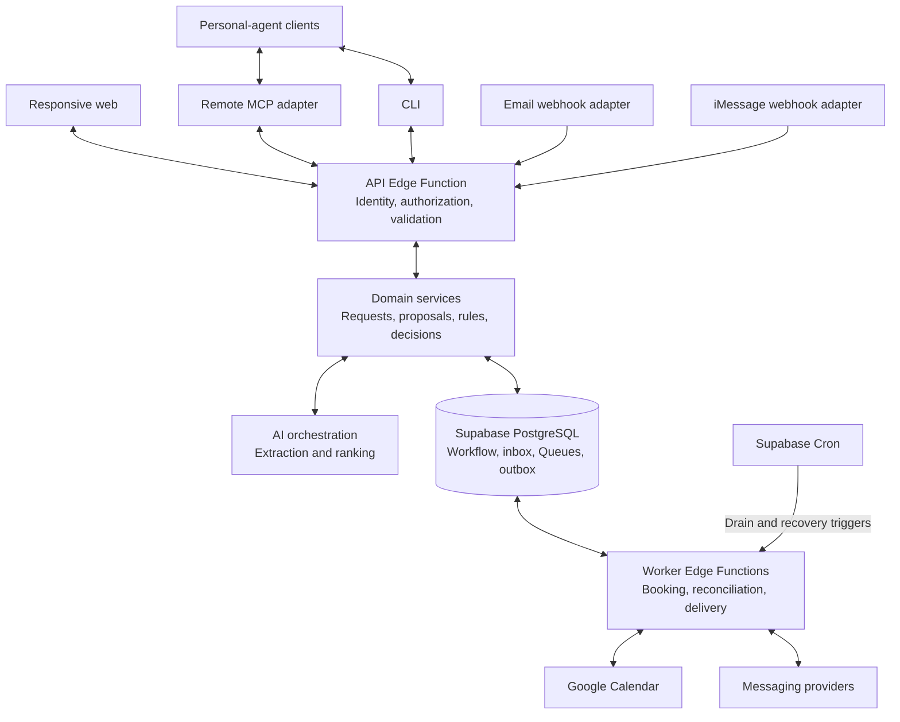

# Find Me a Time — Technical Specification

Status: P1–P4 implementation and deployment recorded; live provider and client gates remain open\
Date: 2026-10-05\
Basis: [PRD](02_product_requirements.md), [user journeys](user_experience/01_user_journeys.md), and [interfaces](user_experience/03_interfaces.md)

This architecture overview describes component boundaries, data ownership, authorization, and reliable scheduling. Current implementation, deployment evidence, and remaining live gates are recorded in the [runtime guide](technical_specification/07_request_and_booking_runtime.md) and [implementation plan](technical_specification/04_implementation_plan.md). Draft channel and agent designs remain release direction. Detailed behavior and implementation tasks move through [OpenSpec](../openspec/config.yaml); completed and verified behavior belongs in main capability specs.

## 1. Scope and foundation

The system coordinates one host and one external requester, checks Google Calendar and host rules, negotiates a proposal, and books only after requester agreement and explicit host approval of the current proposal. All channels use the same request state.

The repository contains a React/Vite web app, shared TypeScript contracts, Hono/Deno API and worker functions, declarative PostgreSQL schemas with reviewed pg-delta migrations, and CI. Vercel serves findmeatime.com and the Supabase API/worker are deployed. The [local Supabase configuration](../supabase/config.toml) uses PostgreSQL 17 and pg-delta; the production OAuth server remains disabled. See the [repository structure](technical_specification/02_repo_structure.md) and [phase evidence](technical_specification/04_implementation_plan.md) for paths and verification boundaries.

| Area | Design direction | Decision status |
|---|---|---|
| Application | React/Vite npm workspace with shadcn preset `b6rtA2Hmi`; TypeScript/Deno backend with Hono routing. | Implemented; dependencies and lockfiles are committed. |
| Database and host identity | Supabase PostgreSQL and Auth, with server-enforced ownership and application-owned client grants. | Selected. MCP OAuth compatibility must be verified before release. |
| Agent access | Remote MCP plus a thin CLI over the same scheduling API. | Product adapters remain pending; isolated P0 diagnostics do not establish production compatibility. |
| Async work | Supabase Queues, bounded worker Edge Functions, and Supabase Cron for recurring drains and recovery sweeps. | Implemented with bounded claims/fencing and recurring recovery; fixture tests and a production persisted ping are recorded. Pilot tuning remains open. |
| Calendar | Server-side Google Calendar adapter with separate host event and requester availability grants. | Consent, refresh, scoped reads, booking and reconciliation code implemented and fixture-tested; actual user grants and live M1/M2 remain unverified. |
| Travel | Server-side Google Routes API estimates plus host-defined buffers. | Actual evaluator probes cover both Seoul travel legs and margins; DRIVE/WALK no-route results remain unresolved. Coverage beyond tested cases is unverified. |
| Messaging | Cloudflare Email Service sends transactional verification, recovery, and booking mail; Supabase Auth remains the identity provider and uses Cloudflare custom SMTP. AgentMail owns managed conversation inboxes/threading. Direct Photon Spectrum through a narrow Node/Bun bridge is selected for iMessage. | Cloudflare sending DNS, scoped token, SMTP authentication and Supabase Auth SMTP readback are configured; no actual Cloudflare email has been sent. Controlled AgentMail and Photon probes passed. |
| Hosting | Vercel serves the React/Vite web app; Supabase hosts API and worker functions. | Deployed at findmeatime.com. Product MCP and messaging webhook endpoints remain pending. |

Native mobile apps, group meetings, non-Google calendars, and automated post-booking changes remain outside the initial release. Private host email remains the proposed extension described in the interface overview; reconcile its PRD requirements before implementing it.

### Backend decision

Decision on 2026-10-05: use Supabase for the initial backend—PostgreSQL, Auth, Edge Functions with TypeScript/Deno and Hono, Queues, and Cron. This keeps identity, persistence, and job infrastructure together and avoids operating an always-on API/worker service for the initial workload. The API/worker foundation is implemented and deployed; remaining live provider and client verification is tracked separately.

| Option | Decision | Reconsider when |
|---|---|---|
| Supabase Edge Functions + Postgres/Auth + Queues/Cron | Selected for the initial release. | Measure function limits, queue latency, and authorization compatibility during implementation. |
| Dedicated Node API and worker with Supabase | Deferred alternative. | Required dependencies or measured workloads cannot fit Edge execution, or persistent connections become necessary. |
| Edge API with managed tasks such as Trigger.dev | Deferred alternative. | Long-running workflows justify another execution service. |
| Neon + Clerk, or Supabase database + Clerk | Not selected. | A demonstrated identity/platform limitation requires a specific replacement; do not reopen the database choice solely for OAuth. |

Supabase's OAuth server is marked public beta, and its documented scopes cover identity claims rather than custom application permissions. Enforce scheduling grants by host and OAuth client at the application boundary, with database restrictions that prevent bypass. Selection does not establish compatibility: test discovery, token audience, registration, refresh/revocation, and each supported agent before release. See [feature status](https://supabase.com/features/oauth2-1-server), [OAuth flows and scopes](https://supabase.com/docs/guides/auth/oauth-server/oauth-flows), and [token security](https://supabase.com/docs/guides/auth/oauth-server/token-security).

Use a stateless Streamable HTTP MCP endpoint with durable request state in PostgreSQL. Supabase's [Hono-based MCP example](https://supabase.com/docs/guides/functions/examples/mcp-server-mcp-lite) establishes hosting feasibility; the MCP library and version still need compatibility testing. Do not require an in-memory session or a connection to remain alive while a host decides.

[Supabase Queues](https://supabase.com/docs/guides/queues) stores durable messages; worker Edge Functions consume them, and [Cron](https://supabase.com/docs/guides/cron) invokes drains and recovery sweeps. The application owns retry policy, idempotency, and booking reconciliation. Save workflow changes and queue publication in one database transaction, or commit an outbox entry that can be republished safely. HTTP invocation is a wake-up mechanism, not the durable work record.

As checked on 2026-10-05, hosted Edge Functions allow 256 MB memory, 2 seconds of CPU per request, worker wall-clock lifetimes of 150 seconds on Free or 400 seconds on paid plans, and a 150-second request idle timeout. Async I/O does not count toward CPU time. Set provider timeouts and batch budgets below applicable limits; split longer work into persisted steps. [Runtime limits](https://supabase.com/docs/guides/functions/limits)

`EdgeRuntime.waitUntil()` can finish work after a response but remains subject to those limits. It is not a durable queue or a guarantee of completion. Host approval waits live in database state; a later reply starts another invocation. [Background tasks](https://supabase.com/docs/guides/functions/background-tasks)

## 2. Architecture

Use one modular application with shared domain code and Supabase PostgreSQL. API and worker are separate execution roles implemented as Edge Functions. Durable records survive invocation termination; a subsequent invocation resumes or reconciles unfinished work.

| Module | Responsibility |
|---|---|
| Identity and access | Resolve host, authorized requester, or worker; validate grants, permissions, channel links, and revocation. |
| Requests and proposals | Intake, immutable proposal revisions, agreement, explicit host decisions, and lifecycle transitions. |
| Availability | Calendar reads, timezone normalization, duration/location/travel checks, and deterministic filtering. |
| AI orchestration | Extract intent, clarify missing information, and rank feasible candidates. Cannot grant authority or directly create events. |
| Booking | Coordinate internal competing writes, revalidate, create an event, and reconcile uncertainty. |
| Channel adapters | Normalize messages, bind verified identity and proposal context, and format audience-specific content. |
| Jobs and delivery | Persist work, retry safely, track outcomes, and expose recovery actions. |

Adapters invoke shared domain operations rather than editing state directly. Calendar credentials and privileged database credentials never pass to personal-agent clients or model context.

See [backend architecture](technical_specification/01_backend_architecture.md) for module ownership, command processing, transaction boundaries, worker responsibilities, and recovery flows.

## Public skill entry documents

Serve two public, read-only HTTPS Markdown routes as the agent entry layer:

| Route | Purpose | Public contents |
|---|---|---|
| `https://findmeatime.com/SKILL.md` | Host onboarding from the pasted setup prompt. | Service purpose, instruction/schema version, supported connection paths, authorization guidance, resumable setup steps, and direct web fallback. |
| `https://findmeatime.com/{host}/SKILL.md` | Account-free meeting request for that host; `dodo` is the example handle. | Public host identifier/name, canonical booking entry, instructions for intake/negotiation/status, role boundaries, and web continuation. |

These are planned routes, not files deployed by this documentation change. The root document must guide `Let me use findmeatime.com/SKILL.md for my scheduling`; the host document must guide `Let me schedule a meeting with findmeatime.com/dodo/SKILL.md`. A remote Markdown URL is not assumed to be a universally recognized installable skill format. Test fetching, instruction use, connection, consent, and resumption separately for every named client.

MCP and CLI remain execution interfaces behind these instructions. Use supported client connection mechanisms; do not claim that reading the file installs tools or supplies credentials. When a client cannot complete a step, expose the smallest supported setup action or browser continuation and retain existing progress. No API secrets or authorization codes should be pasted into chat.

Generate host documents from an allowlist of public profile fields and service-controlled instructions. Include no private policy, request history, live calendar details, tokens, or approval evidence. Treat host-provided display text as data, not executable instructions. Resolve handles to stable host IDs server-side; define handle rename/reuse policy before release so a stale link cannot silently target a different host. Unknown or disabled hosts return an explicit unavailable result. Publish version information, keep caches consistent with host availability, and validate permissions and availability again at execution time.

Persist host onboarding progress under the authenticated account, with idempotent setup operations for calendar selections, confirmed rule settings, and handle assignment. Separate host session, agent OAuth, and Google Calendar grants; resume after the required consent callbacks and reject invalid callback context. Final onboarding readiness requires host admission, verified calendar access, and confirmed minimum settings. Denied consent or incomplete setup cannot return a false ready state. Existing hosts resume their account rather than creating duplicates.

The root skill's setup tools require explicitly granted onboarding/configuration permissions. Those permissions do not grant meeting approval. Optional messaging setup follows core readiness. Skill content is guidance; the scheduling backend remains authoritative for workflow and access.

## 3. Identity and access

### Host and requester boundaries

Host web sessions identify the account; every operation checks resource ownership and permission on the server. Client-supplied host IDs and request IDs are not authority. Protect cookie-authenticated mutations against cross-site requests. Opening a URL never records approval.

Public booking links expose only intended public host information and intake. Implemented requester continuation uses 256-bit request-scoped credentials stored as hashes, with a maximum thirty-day lifetime. Closure revokes mutation, OAuth, and recovery authority while retaining only minimal terminal status and confirmed-booking receipt reads until credential expiry. Contact verification protects recovery and attendee identity; no requester account is required. See the [meeting-request specification](../openspec/specs/meeting-requests/spec.md) and [runtime guide](technical_specification/07_request_and_booking_runtime.md).

Host-private and requester-visible data use separate response schemas and access paths. Do not return private fields and rely on a client to hide them. Enforce the same separation in notifications, model context, traces, and errors.

### Waitlist and host admission

The initial release uses a public waitlist and invite-only calendar hosting: publishing a booking link and receiving requests as a host. Connecting Google Calendar as a requester does not require an invitation. Authentication identifies an account; admission authorizes it to become a scheduling host. Maintain admission in server-owned records and check it on host setup, hosting configuration, booking-link publication, and host operations across web, API, MCP, and CLI. A Supabase user, successful OAuth consent, public skill document, or client-supplied metadata cannot establish admission. Request-scoped guest access to active hosts does not require admission.

Waitlist submission collects only the contact information needed for admission, deduplicates repeat entries, and does not connect a calendar or publish a booking link. Return a neutral confirmation without exposing whether another person's address is registered or invited. Root skill instructions provide waitlist/redemption guidance; setup status distinguishes access pending from admitted-but-incomplete setup and ready hosting.

Invite issuance is restricted to authorized operators. New invitations use a 16-character, 80-bit random code; redemption stores only its hash, expiry and revocation metadata, and a verified recipient/account binding. Previously issued long tokens remain redeemable. Redeem atomically so concurrent attempts cannot admit multiple accounts; retries by the same admitted account resume safely. Invitation secrets stay out of model context and logs. Invitations expire after seven days and bind a verified recipient; operator issuance/revocation tooling is implemented in `scripts/manage-invitations.mjs`. Cloudflare sends the code separately from the setup URL; invitation emails are separate from meeting invitations and host approval. See the [host setup guide](technical_specification/06_host_setup.md).

### MCP OAuth and CLI

Protected host MCP access uses OAuth authorization code flow with PKCE, protected-resource metadata, authorization-server discovery, and resource-specific tokens. Validate issuer, signature, audience, expiry, active client grant, and permissions. Select protocol version and registration mechanisms through client compatibility testing. See the [MCP authorization specification](https://modelcontextprotocol.io/specification/2025-11-25/basic/authorization).

Separate permissions for reading requests, revising requests, and submitting decisions; names remain provisional. Check active server-side grants so revocation does not depend only on old tokens expiring. Never accept Google Calendar tokens as MCP credentials. Host login and acting as an OAuth authorization server for third-party MCP clients are distinct capabilities to evaluate in the authentication provider.

The CLI calls the scheduling API directly and provides structured JSON results and meaningful exit codes. Its interactive login, headless access, and credential storage remain open. Guest CLI/MCP operations use request-scoped credentials, never shared host or service credentials.

### Optional requester Google Calendar access

Requesters may connect Google Calendar for availability without a Find Me a Time account or host admission. Keep this provider authorization separate from host login, host admission, and MCP OAuth. Start consent only from an authorized request continuation; bind the callback to that request and browser session with validated OAuth state. Never attach credentials using a caller-supplied request ID alone. Web, email, and agents can offer the browser continuation; provider tokens never pass through chat or client tool arguments.

Use least-privilege availability access for requester-selected calendars. Store encrypted credential references under a requester/request-scoped connection, separate from host calendar connections. Prevent cross-request reuse without fresh verified authorization. Expose connection status and a disconnect action through the protected continuation. The implemented host/requester scope, closure, disconnect, and refresh boundaries are documented in the [host setup guide](technical_specification/06_host_setup.md); actual user consent and refresh remain live gates.

Combine authorized requester busy intervals with host calendar/rule checks. Read required connected calendars again before booking; a requester conflict returns to negotiation and changed proposals require renewed agreement and approval. Denied, revoked, or failed requester access never means free time: pause dependent scheduling and offer reconnection or explicit replacement with manual/agent-supplied availability. Do not expose private requester event details to the host or model; derived availability is sufficient for this path.

Requester consent neither expresses agreement nor authorizes calendar writes. Create the meeting through the host booking calendar and its invitation flow; this feature does not add a separate event write to the requester's calendar.

### Human confirmation

Approval evidence binds the host, request, current proposal version, canonical approved-details digest, decision, timestamp, and trusted confirmation path. The approval digest includes applicable private exceptions; requester agreement binds only shared meeting details.

P0–P4 currently accepts only a deliberate authenticated web action. The later channel/client design permits a verified private iMessage reply with explicit current-proposal intent or a personal-agent integration only after its human-confirmation mechanism is tested. Until that mechanism exists for a client, return an authenticated web confirmation action. An agent-supplied `approved: true`, quoted conversation, OAuth token, or model assertion is not evidence of human approval. Possession of a confirmation link does not complete the confirmation.

Ambiguous replies require clarification. Stale replies cannot approve a new version. For proposed host email, final approval takes place in authenticated web review. An OAuth connection authorizes operations, not blanket approval of meetings.

## 4. Logical data model

These records describe ownership and invariants, not final SQL tables. Use UUIDs, foreign keys, explicit uniqueness constraints, UTC instants, and retained IANA timezone identifiers.

| Record | Contents and constraints |
|---|---|
| Waitlist, invitation, and admission | Minimal contact, deduplication identity, pending/admitted status, invite token hash and validity, verified account binding, issuing operator, and redemption audit. Client-controlled fields cannot grant admission. |
| Host profile and rules | Owner, public booking identifier, timezone, versioned hard constraints, preferences, and travel buffers. Public fields separate from private policy. |
| Calendar connection | Owner role, host or authorized requester/request binding, selected calendars, encrypted credential reference, scopes, and connection status. Only host connections have a booking destination/write role. Requester connections are for availability and have bounded retention/revocation. |
| Channel identity | Host/requester binding, provider identity, verification, opt-in, and revocation. Requester bindings never imply host authority. |
| Request and continuation grants | Host, requester contact, purpose, lifecycle state, state revision, current proposal, and hashed request-scoped grants. |
| Proposal | Unique `(request_id, version)`, immutable shared details, private exception references, rule version, and digest. |
| Agreement and host decision | Actor, proposal version, relevant digest, evidence reference, timestamp, and decision. Append-only history with validity derived from current state. |
| Conversation and message | Request, thread/channel, participant role, visibility audience, provider ID, and delivery metadata. |
| Agent grant | Host, client, permissions, authorization-server reference, and active/revoked status. |
| Booking operation | Unique request association, exact payload, destination calendar, persisted event ID, worker ownership, outcome, and confirmed event reference. |
| Booking reservation | Host, associated operation, and blocked/released state to serialize our competing writes. |
| Inbox, jobs, and outbox | Deduplication keys, processing state, retry schedule, recipient/audience, and provider outcome. |
| Audit event | Actor, channel, request/proposal, transition, correlation ID, and outcome without raw secrets. |

Enforce one logical booking operation per request, unique proposal versions, and unique provider message IDs within provider/account scope. Prevent cross-host/request associations through constraints. Index host inboxes by host/state/update time, histories by request/time, and runnable jobs by state/next attempt. Final indexes need measured query patterns.

Keep workflow tables in a non-exposed schema by default. Clients cannot directly write approvals, booking operations, or jobs. Exposed tables need explicit grants and ownership-based RLS; privileged backend paths still need application authorization because service credentials bypass RLS. See [Supabase RLS](https://supabase.com/docs/guides/database/postgres/row-level-security).

Encrypt provider tokens with keys stored separately from database rows. Keep revocation and credential checks server-side. Decide retention, deletion, encryption key management, and audit retention before a real-user pilot.

## 5. Shared operation contract

These are domain operations, not finalized routes, tool names, or CLI commands.

| Operation | Caller | Guard/result |
|---|---|---|
| Read public skill entry | Personal agent or public client | Root onboarding or host-specific request instructions; no private data or authority granted. |
| Join waitlist / redeem invitation | Prospective host; redemption requires verified identity | Deduplicate intake; atomically validate and consume admission invitation. Neither action approves a meeting. |
| Read setup status / save confirmed setup | Authenticated account or permitted client; setup mutations require host admission | Return pending access or resume admitted onboarding; validate admission, calendar access, confirmed rules, and handle ownership before readiness. |
| Discover booking entry / submit request | Public requester or agent | Public information and intake; no historical request access. Return protected continuation after submission. |
| Connect / disconnect requester calendar | Authorized request-scoped requester | Bind browser consent and credentials to the request; expose status and revocation without host admission or calendar-write authority. |
| Read / clarify / negotiate | Authorized requester or host | Audience-specific state and feasible options. |
| Agree / withdraw | Requester or delegated requester agent | Agreement on current shared details or permitted withdrawal. Never host approval. |
| List host requests / manage rules | Host or appropriately scoped client | Host-owned data; relevant rule changes trigger reevaluation. |
| Revise / decline / submit approval | Verified host context | Permission and current-version checks; approval additionally requires trusted human confirmation. |
| Connect / revoke agent or channel | Authenticated host with management authority | Verified binding or effective revocation. |
| Book / reconcile | Internal worker | Revalidate prerequisites; clients cannot directly create calendar events. |

Mutations carry an idempotency key and expected state revision; decisions also identify proposal version. Atomically persist the operation, actor, key, payload digest, and result with its local state change. A repeated key with the same payload returns the prior result after checking current access; a different payload under the same key is rejected. Preserve deduplication for the supported retry window and booking identity beyond that window.

Results include request ID, state revision, applicable proposal version, lifecycle status, and next action. Use stable error categories for invalid credentials, forbidden access, stale proposal, missing confirmation/details, unavailable calendar, and pending reconciliation. Errors cannot reveal another user's private state. MCP and CLI expose the same domain outcomes.

## 6. State, availability, and AI

Use the [PRD lifecycle](02_product_requirements.md#7-request-lifecycle) for user-visible status. Internal job states do not create independent request lifecycles. Proposal changes create immutable revisions and invalidate host approval. Changed shared details also invalidate requester agreement; changed private exceptions require fresh host approval.

Use short transactions with concurrency control and expected-revision checks. Commit domain changes, audit records, and outbox/jobs together. Do not hold a database transaction open across calendar, messaging, or model calls.

Normalize ambiguous dates, timezone, duration, location, and mode before a proposal is actionable. Deterministic checks apply calendar conflicts, availability rules, focus blocks, and travel buffers before AI ranks candidates. Free/busy intervals alone do not supply adjacent event locations for travel; obtain only necessary authorized context or clarify location/buffer information with the host. Failed calendar reads block availability-dependent decisions. Use Google Routes API for adjacent physical commitments: previous event to candidate, then candidate to next event, with the relevant travel mode and departure context. Each gap must cover the route estimate plus configured buffers. Missing locations, unavailable routes, or API failures require clarification or an explicitly confirmed manual travel allowance; do not substitute zero. Keep private location context server-side and validate regional coverage before advertising supported travel modes.

The model produces validated structured suggestions, never raw database or calendar commands. Treat emails, agent input, event descriptions, and retrieved text as untrusted. Keep host and requester model contexts separate, and construct requester responses from shared data. Cache candidate availability only as an optimization; re-read required calendars before booking. Offered candidates do not reserve time.

## 7. Booking and reconciliation

PostgreSQL and Google Calendar do not share a transaction. Booking needs a durable operation and recovery protocol:

1. Atomically check current agreement, attributable approval, proposal version, and request state. Create or resume the request's unique booking operation, persisting its destination, exact payload, and provider event ID before an external write.
2. Acquire a durable per-host booking reservation. Initially serialize our booking operations for a host. An unresolved write remains a blocker; a worker lease expiring does not prove that its external call failed.
3. Re-read calendars and rules outside the transaction, then recheck reservation ownership and relevant revisions in a short transaction. A conflict returns to revision without an event. Freeze the authorized payload for dispatch. Later rule edits cannot be represented as cancelling a write already sent.
4. Dispatch creation. Use fenced worker ownership for local transitions; recovery reconciles any previously dispatched attempt before another write because local fencing cannot stop Google processing an earlier call.
5. On confirmed creation, atomically persist Booked and notification work. Release the reservation when the outcome is settled. Notification failure does not undo the booking.
6. On timeout or uncertain outcome, retain Booking and reconcile by the persisted event ID and destination. Verify the returned event matches the operation before reporting success. A missing result or permission error alone is not proof that creation never happened.
7. Retry creation only under an adapter policy that establishes retry is appropriate, retaining the same ID and payload. Unresolved ambiguity stays pending with an operator recovery action; never generate a new ID to escape uncertainty.

Google documents supplied event IDs as protection against duplicates after a successful write with a lost response, while cautioning that distributed ID collisions may not always be detected at creation. Persist a provider-valid UUID-derived ID once per operation and test duplicate/error recovery. Do not promise mathematically exactly-once external effects. See [create events](https://developers.google.com/workspace/calendar/api/guides/create-events), [event identifiers](https://developers.google.com/workspace/calendar/api/v3/reference/events), and [error handling](https://developers.google.com/workspace/calendar/api/guides/errors).

Define booking entry as an atomic transition: withdrawal before it prevents creation; withdrawal or edits after it return an accurate pending outcome until the write is resolved. Internal serialization coordinates our competing requests but cannot prevent another application changing Google Calendar between final read and write. Surface detected conflicts; do not automatically delete a created event as compensation because post-booking cancellation is outside scope.

## 8. Channel adapters

Authenticate webhooks with the chosen provider's documented mechanism, persist deduplicated inbound work before acknowledging receipt, and process asynchronously. Replays and delayed messages resolve against current state. A valid webhook signature proves provider origin, not the sender's authority to act as a host.

Channel binding requires verified identity and request context. Matching names, subject lines, thread IDs, or forwarded content do not grant private history access. Keep host-private and requester-shared conversations separate; choose recipients from verified bindings rather than reply-all headers.

iMessage requires opt-in, linked host identity, private conversation checks, unlinking, and current-proposal confirmation. The [P0 compatibility decisions](technical_specification/05_compatibility_report.md) select direct Photon Spectrum through a narrow Node/Bun bridge from the PRD options; a controlled transport conversation passed, while application identity binding and web booking continuation remain open. Framework approval mechanics do not replace host approval. If host email is adopted, use a separate private conversation and final authenticated web approval.

Photon supports outbound conversation initiation, but its deliverability guidance favors the host sending the first message during optional channel setup. The [provider setup notes](technical_specification/03_provider_setup.md#first-message-and-host-onboarding) record the recommended onboarding flow, recipient policy, and default initiation quota. Bind the conversation to the authenticated host before enabling private notifications; inbound contact alone is not host authorization. The proposed optional [Add to contacts step](technical_specification/03_provider_setup.md#display-name-contact-cards-and-profile-sync) uses the verified sender route; custom vCard delivery passed, while native profile sync and device-side name display remain unverified.

Outbox records include version, audience, verified recipient, and stable delivery key. Recheck authorization before sending private content and suppress obsolete pending summaries. Retry transient failures with bounded backoff and jitter; exhausted work stays visible for recovery. Delivery retries cannot trigger booking again.

Test Dots, Muse, Instinct, ChatGPT, Codex, Claude, and Claude Code separately for requester and host workflows, including discovery, connection, OAuth, continuation, and human confirmation. Do not assume every client has terminal access or supports the same MCP features. A separate agent-to-agent protocol endpoint is not a current release requirement.

### Email provider direction

Use **Cloudflare Email Service** for operator invitations and application-owned transactional verification, recovery, and booking messages, from `no-reply@findmeatime.com`. Supabase remains the Auth system; configure its Auth mailer to use Cloudflare authenticated SMTP rather than the Supabase default sender. Cloudflare SMTP uses `smtp.mx.cloudflare.net:465`, implicit TLS, the literal username `api_token`, and an Email Sending token as the password. The runtime sends application transactional mail through Cloudflare's API. [Cloudflare sending](https://developers.cloudflare.com/email-service/get-started/send-emails/), [Cloudflare SMTP](https://developers.cloudflare.com/email-service/api/send-emails/smtp/), [Supabase custom SMTP](https://supabase.com/docs/guides/auth/auth-smtp)

Keep **AgentMail** for the conversational-email integration behind the conversation adapter. Its managed inbox, thread, message, reply, and extracted-reply primitives support multi-turn scheduling negotiation. The controlled transport probe passed, while production conversational integration remains open. [AgentMail capabilities](https://docs.agentmail.to/knowledge-base/inbox-capabilities)

The AgentMail conversation adapter should:

- Map provider inbox/thread/message IDs to our host, request, and conversation IDs. Provider storage is not the authoritative scheduling state, and provider thread grouping is not an authorization boundary.
- Maintain separate host-private and requester-facing threads with explicit recipient validation. Extracted reply text remains untrusted input. For the proposed host-email extension, final approval still uses authenticated web review.
- Verify webhook signatures, durably record inbound events, and deduplicate provider event IDs before processing. Use stable outbound idempotency keys and our own outbox history; AgentMail's documented send/reply idempotency window is 24 hours, so it cannot replace durable application deduplication. Reconcile uncertain delivery instead of blindly resending after that window. [Webhook verification](https://docs.agentmail.to/webhook-verification), [idempotency](https://docs.agentmail.to/idempotency)
- Keep its provider-managed conversation inboxes and threading separate from Cloudflare transactional sending. If a custom AgentMail receiving domain is introduced later, preserve the Cloudflare Email Service and unrelated domain mail records. [Custom domains](https://docs.agentmail.to/custom-domains)

For new Cloudflare transactional deliveries, freeze the account and From address with the encrypted recipient/body snapshot before dispatch. Cloudflare's sending documentation does not specify an application idempotency key, so a persisted dispatch is never replayed automatically; a lost or ambiguous response remains uncertain for operator review. Historical pending AgentMail deliveries retain the existing stable-key retry policy and stop before the documented 24-hour idempotency horizon. Provider results do not replace application recovery or identity verification.

Before production conversational use, test a multi-turn requester conversation, safe continuation on web, delayed/replayed webhooks, uncertain sends, and private-thread isolation. Finalize AgentMail inbox allocation per host, retention/export needs, scoped credentials, and cost against the pilot workload.

## 9. Operations and delivery

Separate development, preview/test, and production credentials, calendars, and messaging identities. Preview deployments must not send real invitations by default. Keep secrets out of browser bundles, repositories, CLI output, and model context. Choose connection pooling and worker concurrency to fit database limits.

Record correlation IDs, stale decisions, authorization failures, job age, provider errors, unresolved writes, and delivery failures with private content redacted. Pilot targets for latency, queue age, recovery time, cost, retention, and escalation ownership remain open.

The [implementation plan](technical_specification/04_implementation_plan.md) owns the delivery sequence, dependencies, and phase exit checks. Its intermediate milestones do not remove required integrations from release scope. Follow the repository's [pg-delta workflow](../AGENTS.md#supabase-schema-changes) for schema changes: desired SQL, reviewed generated migrations, a disposable local rebuild, and relevant database tests.

## 10. Verification plan

| Layer | Evidence required | PRD coverage |
|---|---|---|
| Domain | Timezones/DST, feasibility, travel, preferences, immutable revisions, current decisions, and closed-state guards. | AC-02–AC-04, AC-07, AC-12–AC-13. |
| Authorization and database | Host/guest isolation, direct API bypass attempts, restricted workflow writes, revoked grants, requester calendar consent/callback binding and disconnect, and audience-safe responses. | AC-10–AC-11, AC-19–AC-21, AC-27. |
| Booking fault injection | Concurrent approvals, competing requests, Edge termination after dispatch, lost success responses, duplicate queue delivery, missed wake-ups, Cron recovery, and delivery failure after creation. | AC-06–AC-09, AC-13, AC-18. |
| Channel and agent contracts | Channel transitions, spoofed identity, ambiguous/stale replies, webhook replay, MCP/CLI parity, and every named client. | AC-05, AC-11, AC-14–AC-22. |
| Skill entry and onboarding | Both pasted prompts in every named client; invited/existing hosts, pending waitlist access, duplicate submissions, invalid/concurrent invite redemption, direct admission bypass attempts, interrupted consent, unknown handles, and unsupported capabilities. | FR-33–FR-35; AC-23–AC-26. |
| End-to-end/accessibility | Account-free intake, clarification, agreement, host revision/approval/decline, invitation, phone layout, keyboard use, and readable errors. | AC-01, AC-04, AC-12; PRD section 8. |

Use dedicated provider test accounts as well as mocks. Model evaluations cannot substitute for authority or booking tests. Record dependency and tested client versions. The [runtime guide](technical_specification/07_request_and_booking_runtime.md), [compatibility report](technical_specification/05_compatibility_report.md), and [implementation plan](technical_specification/04_implementation_plan.md) distinguish existing automated/deployment evidence from pending live consent, Calendar booking, and client/channel journeys.

## 11. Open technical decisions

| Area | Remaining decision or verification |
|---|---|
| Web and deployment details | React/Vite/npm, shadcn `b6rtA2Hmi`, Hono/Deno and Vercel are implemented with committed lockfiles and routing. Broader preview/production rollout policy remains open. |
| Job execution tuning | Validate batch/concurrency limits, visibility timeouts, provider deadlines, retry/quarantine policy, Cron cadence, and queue-age targets. |
| AI integration | OpenAI strict extraction/ranking is implemented with deterministic validation and bounded input. Continue evaluating model quality and pilot data handling. |
| OAuth and confirmation | Verify resource audience, permissions, registration, refresh/revocation, direct-data isolation, and attributable human confirmation per client. |
| Skill entry and setup | Markdown format/version, per-client fetch/connection/resumption, minimum settings, setup permissions, handle lifecycle, and unavailable-host behavior. |
| Host admission | Seven-day verified-recipient invitations and operator tooling are implemented. Live M1, invitation delivery automation, pilot abuse controls and retention remain open. |
| Guest access | Request-bound tokens and verified-contact recovery are implemented. Broader channel linking/forwarding and pilot abuse policies remain open. |
| Calendar | Implemented separate grant boundaries, host-supplied links, stable event IDs and reconciliation need controlled live consent/refresh and Calendar M1/M2 evidence. |
| Rules and concurrency | Hard/preference classification, travel defaults, rule edits during booking, and recovery of blocked reservations. |
| Messaging | Cloudflare sending DNS and Supabase Auth SMTP are configured, but live transactional/Auth delivery remains unverified. Controlled distinct-identity AgentMail evidence and controlled Photon send/reply passed. Complete production conversational integration, inbox/address allocation, sender binding, retention and unlinking. |
| Host email | Align PRD, journeys, stories, and acceptance scenarios before implementation. |
| Pilot | Retention/deletion, AI-provider data handling, backup/recovery, performance targets, cost limits, and operator ownership. |

Resolve product scope in the PRD and technical decisions in the corresponding OpenSpec change. Keep this document as the architecture overview, linking to capability specs as they become implemented and verified.
