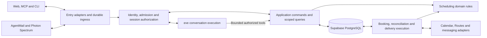

# Find Me a Time — Backend Architecture

Status: replacement backend design; implementation and runtime placement pending
Date: 2026-10-06
Basis: [implementation plan](04_implementation_plan.md), [technical specification](../03_technical_specification.md), [PRD](../02_product_requirements.md), and [interfaces](../user_experience/03_interfaces.md)

The scheduling backend is part of the full source rebuild. This document defines domain guarantees and proposed runtime boundaries. Reconcile behavioral deltas through bounded changes before implementation under the [repository workflow](../../AGENTS.md#documentation-and-specifications).

## 1. Deployment shape

Use Supabase Auth and PostgreSQL for identity and durable application state. Next.js and eve are the proposed web/conversation direction, subject to the checks in the [backend decision](../03_technical_specification.md#backend-decision). Follow the eve chat template: root `agent/`, Next.js in `apps/web/`, and separately built eve/web services composed through root `vercel.ts`. Shared server-only domain modules live in root `lib/server/`. The runtime spike verifies cross-runtime module compatibility, persistence, job transport, background execution and recovery scheduling; add a worker or bridge deployment only for an evidenced requirement.

Separate interactive commands, conversation execution and durable external effects as logical responsibilities. They may share modules or deployment infrastructure once the runtime spike establishes compatibility. Human waits live in durable state; request connections and process memory are not their source of truth.

Model calls use eve's direct OpenAI provider with server-side `OPENAI_API_KEY` and a verified native model ID. Keep provider billing configuration in backend infrastructure; API credit exhaustion is a failed model operation, not a successful scheduling transition. See [model access and billing](03_provider_setup.md#openai-model-access-through-eve).



Public skill documents are read-only guidance. Protected operations require their own verified credentials. eve owns conversation execution; the application owns actor/audience-to-session bindings and scheduling authority. A verified provider event must be durably recorded and resolved to a permitted conversation before runtime dispatch. Select the Spectrum bridge or compatible native eve adapter based on evidence, not adapter naming.

## 2. Module boundaries

| Module | Owns | Boundary |
|---|---|---|
| Identity and grants | Host/account mapping, admission checks, agent grants, guest access, verified channel bindings, and revocation. | Resolves principals from trusted credentials; login and OAuth consent alone cannot confer host admission. |
| Onboarding and profiles | Waitlist, invitations, admission records, setup progress, public handles, calendar selection, settings, and readiness. | Invite issuance requires operator authority; publication requires admission and validated setup. |
| Requests and conversation bindings | Intake, request state/revision, verified channel mappings and actor/audience-to-session associations. | Links channels only after verifying access; keeps host-private and requester runtime histories separate. |
| Conversation runtime | eve sessions, model turns, tool execution and stream resumption within the selected runtime contract. | Every read, stream, continuation and tool call passes application authorization; runtime persistence never substitutes for domain authority. |
| Rules and availability | Versioned policy, normalized times, feasible candidates, and travel checks. | Deterministic filtering precedes AI ranking. Failed data reads never mean free time. |
| Proposals and decisions | Proposal versions, shared-detail and approval digests, agreements, exceptions, and human-confirmation evidence. | Only trusted confirmation paths can produce approval evidence. |
| Booking | Booking identity, attempt history, host reservations, provider event association, and reconciliation. | Sole owner of calendar event creation. |
| Delivery | Outbound messages, recipients, formatting, provider keys, and delivery outcomes. | A delivery job cannot book or change an approved proposal. |
| Infrastructure | Database transactions, job transport, secrets, provider clients, and telemetry. | Implements domain-facing interfaces; does not decide scheduling policy. |

Application services coordinate modules for a use case. A request adapter does not write another module's records directly, and a background handler does not bypass authorization by calling a repository helper. Use the same transition functions for web, MCP, CLI, and messaging inputs.

Keep application operations and their rules together within each capability under `lib/server/`: identity, onboarding, scheduling (including request lifecycle/proposals), booking and delivery. Infrastructure lives in its `providers/`, `db/` and `jobs/` modules. Eve tools and every channel entry invoke these same operations. Provider credentials and privileged persistence stay server-only. Client-safe schemas live in `lib/contracts/`; share these source modules between the agent and web builds without a new package, and extract a package only when independent packaging is required. See the [source organization](02_frontend_architecture.md#source-organization) for the canonical layout.

The [page list](../user_experience/04_page_list.md#supporting-routes-and-surfaces) records proposed public routes and skill-document surfaces. Preserve the promised `findmeatime.com/SKILL.md` and `/{host}/SKILL.md` entry URLs independently of deployment paths.

### Implemented host setup drafts

`lib/contracts/setup.ts` and `lib/server/setup/commands.ts` expose private read, partial draft, explicit refresh and current-review confirmation. The service-only `fmat_host_setup` derives an admitted host from current Auth; eve uses the same private SQL operations through `fmat_conversation_tool` with assistant provenance. Host/conversation locks, immutable idempotency inputs and revision checks serialize changes. Drafts and reviews use the retained setup tables, with field provenance; they never mutate confirmed policy before explicit confirmation. Assistant suggestions cannot overwrite explicit host choices, supply applicable human mode/location/travel answers or confirm policy.

A rules/calendar change hides stale reviews. A protected refresh retains answers/provenance and creates a review against the current rules version; ordinary stale edits fail without resetting answers. Confirmation re-fetches Google calendar metadata and write permission, then atomically rechecks draft/review/conversation/rules/grant versions. A committed confirmation replay requires current Auth but avoids another provider read or save. No setup operation grants booking authority. Full Calendar analysis and linked-channel setup remain pending.

## 3. Entry surfaces

| Surface | Replacement responsibility (all require implementation and verification) |
|---|---|
| `GET /SKILL.md` | Serve versioned onboarding instructions for “Let me use findmeatime.com/SKILL.md for my scheduling”. |
| `GET /{host}/SKILL.md` | Resolve a public host handle and serve requester instructions for “Let me schedule a meeting with findmeatime.com/dodo/SKILL.md”. |
| Application HTTP API | Validate web/CLI inputs, resolve identity, invoke commands/queries, and return structured results. Define client-safe input/output schemas in `lib/contracts/`. |
| Remote MCP endpoint | Expose permitted tools and map tool calls to the same application commands. OAuth discovery and consent follow the selected authorization implementation. |
| Calendar and identity callbacks | Validate provider callback context and associate host grants with the initiating account/setup flow, or requester availability grants with the authorized request continuation. Requester calendar consent does not require host admission. |
| Email events and iMessage ingress | Authenticate provider origin/transport, persist deduplicated input, acknowledge durable receipt and dispatch authorized processing. |
| Session reads, streams and action cards | Resolve actor, audience and resource scope before accessing eve; typed actions invoke authorized commands or allowlisted connection flows. |

### Public skill entry documents

Public skill content is service-controlled guidance. Host display text is treated as data. No private rules, request history, credentials, or live calendar context appear in these documents. Execution revalidates the stable host ID and status; cached instructions do not authorize an operation. Finalize handle rename/reuse behavior so an old link cannot silently identify a different host.

The root document describes resumable host onboarding and the host-specific document describes account-free intake, negotiation, status and web continuation. Reading either document does not install tools, connect MCP, or provide credentials. Publish an instruction/schema version, return an explicit unavailable result for unknown or disabled hosts, and test fetch, interpretation, connection and resumption separately in every named client. Generate host documents from an allowlist of public profile fields and service-authored instructions.

For onboarding, return a saved setup status and a next action such as join waitlist, redeem invitation, consent required, missing settings, or ready. Check host admission before host calendar setup and hosting operations; requester calendar connection requires no host admission; keep waitlist entry and request-scoped guest operations accessible without host admission. Readiness and public-link publication require admission, confirmed timezone/rules, an active host Calendar grant, selected conflict calendars and a currently writable booking destination. Reconnection invalidates dependent calendar selections until the host reconfirms them; a read-only calendar cannot be the booking destination. Browser callbacks update this state so the personal agent can resume without repeating questions. Optional messaging setup follows core readiness. Direct web onboarding uses the same services while skipping personal-agent connection and consent.

### Identity and access

#### Host and requester boundaries

Host web sessions identify an account, but every operation still checks ownership and permission server-side. Client-supplied host IDs, request IDs and eve session IDs are resource locators, not authority. Protect cookie-authenticated mutations against cross-site requests; opening a URL never records approval.

The rebuild foundation stores separate `conversation_scopes` for host setup, host-private request review and shared request discussion, with independent participant execution grants. The server verifies the original host JWT through Supabase Auth; the access RPC then checks the current Auth session row, verified email, account status and admission. Guest authority uses a request-bound opaque-token hash. Only service-role callers can use the access/check RPCs; ordinary authenticated clients cannot submit actor claims directly. Internal grant IDs are omitted from browser projections and never serve as login credentials. Runtime adapters must recheck grants before output and tools; the adapter/restart tests remain part of the foundation change.

Authored model tools use `fmat_conversation_tool`: it derives the actor and resource from the captured grant, locks revocable authority, enforces an audience-specific operation allowlist and executes the command in one transaction. Shared discussion uses shared projections even when the caller is the host, including cached retry results. Tools read the active caller rather than the session initiator and derive retry keys from durable call identity. Current tools can read setup/request context, update shared details and save private notes; approval, agreement, confirmed policy, travel exceptions and provider outcomes require separate application operations. Lock-wait expiry is checked against current wall time. The runtime ingress and stream adapters remain pending.

Public booking links expose only the intended public host profile and intake. Requester continuation uses unguessable request-scoped credentials stored as hashes, with the agreed maximum thirty-day lifetime. Closing a request revokes mutation, OAuth and recovery authority while retaining only minimal terminal status and confirmed receipt reads until credential expiry. Contact verification protects recovery and attendee identity without requiring a requester account. Host-private and requester-visible projections remain separate in database queries, notifications, model context, traces and errors.

#### Waitlist and host admission

Authentication identifies an account; server-owned admission authorizes calendar hosting. Check admission for setup, configuration, link publication and host operations across web, API, MCP and CLI. Successful login, Google consent, a public skill document or client metadata cannot grant admission. Waitlist intake collects only necessary contact information, deduplicates repeats and returns a neutral response that does not expose another person's status.

Invitation issuance and revocation are operator-only operations. Generate a 16-character code from 80 random bits, format it as `XXXX-XXXX-XXXX-XXXX`, store only its SHA-256 hash, bind it to the normalized verified recipient, and expire it within seven days. Cloudflare sends the code separately from the `/app` URL; the URL never contains the secret. Redemption atomically consumes the invitation and admits the matching account; same-account retries resume saved admission, while wrong-recipient, expired, revoked or reused codes fail. Revoking an unused invitation does not revoke a previously admitted host; host access revocation is a separate audited operation.

Before sending an invitation, persist a protected dispatch intent and immutable payload. A lost provider response stays uncertain until the audit, dispatch record and provider activity are reconciled; do not blindly issue or send a replacement. Provider acceptance is not inbox delivery or redemption. Privileged operator tools must identify the intended project, reject publishable/anon/user credentials and mismatched origins, and keep service credentials and one-time codes out of browser configuration, logs and terminal history.

#### MCP OAuth and CLI

Protected host MCP access uses OAuth authorization code flow with PKCE, protected-resource metadata, authorization-server discovery and resource-specific tokens. Validate issuer, signature, audience, expiry, the active client grant and requested permission on every operation. Keep permissions for reading, revising and submitting decisions distinct, and enforce revocation through current server-side grant state. Google Calendar credentials are never MCP credentials.

The CLI calls the same application operations and returns structured results with meaningful exit codes. Its final interactive/headless login and credential storage need compatibility decisions. Guest MCP and CLI operations use request-scoped grants, never host or service credentials.

#### Optional requester Google identity

Support an optional identity-only Google flow bound to the initiating browser and intake draft/request. Verify the provider subject and verified-email claim server-side before using identity to prefill trusted contact data. Keep draft/request authorization distinct from provider identity; never merge or recover requests merely because emails match. Manual or changed recipient emails use the existing contact-verification boundary. Identity sign-in does not request Calendar permissions or imply host admission. Resolve the provider adapter/callback contract in the pending Google connection change and verify cross-browser/account-switch behavior before release.

Timezone is an explicit request setting with a source: user choice, detected browser suggestion or unresolved. Preserve user corrections across provider callbacks. Use IANA identifiers and date-specific offsets; display conversion must not shift proposed instants. Reject ambiguous local-time scheduling inputs until resolved.

#### Optional requester Google Calendar access

Requester Calendar consent starts only from an authorized request continuation. Bind a short-lived, single-use OAuth state to the initiating browser and protected request, restrict the return destination, and reject caller-supplied request identity without that binding. Browser flows should use a same-origin, HttpOnly, SameSite=Lax state cookie and Secure in production. Store encrypted credentials under a requester/request-scoped connection, prevent cross-request reuse, and expose protected status and disconnect actions.

Requester grants supply availability only; they confer no host admission, agreement, event creation or host history access. Denied, revoked or failed access never means free time. Pause dependent evaluation and offer reconnection or explicit manual/agent availability. Keep requester event details and tokens out of host responses and model context. Host sign-in, host Calendar consent, requester Calendar consent and MCP OAuth remain distinct grants.

#### Human confirmation

Approval evidence binds the verified host, request, current proposal version, canonical approved-details digest, decision, timestamp and trusted confirmation path. The host digest includes applicable private exceptions; requester agreement binds only shared meeting details. Authenticated web action cards are the direct path. A verified private channel or personal-agent client may submit a decision only after its exact current-proposal confirmation mechanism is tested; otherwise return authenticated web review.

An agent-supplied boolean, quoted conversation, OAuth token, model assertion, ambiguous reply or possession of a confirmation link is not attributable human approval. Stale replies cannot approve a newer proposal. OAuth authorizes operations, not blanket meeting approval.

## 4. Command and query pipeline

Each entry adapter constructs a server-verified principal and a validated command. The principal identifies an authenticated host, a permitted host client, a request-scoped guest, or a narrowly authorized internal job. A worker principal authorizes job execution; it does not convert unverified inbound text into a host decision.

### Shared operation contract

These are domain operations rather than finalized routes, tools or CLI names:

| Operation family | Permitted caller and guard |
|---|---|
| Public entry and intake | Public clients can read skill guidance, discover an active host, join the waitlist and submit new intake; no historical private state is exposed. |
| Admission and setup | A verified prospective host can redeem a recipient-bound invitation; setup mutations additionally require admission and current calendar/rule/handle validation. |
| Requester continuation | A request-scoped principal can read shared state, clarify, negotiate, agree, withdraw, and connect or disconnect requester availability. None grants host approval. |
| Host management | The owning host or appropriately scoped client can read requests, manage rules, revise or decline; approval additionally requires current attributable human evidence. |
| Connections | An authorized host can bind or revoke an agent/channel; revocation is checked against current server state. |
| Booking and reconciliation | Only an internal scoped worker can revalidate prerequisites, create through the booking boundary, or reconcile the persisted attempt. |

Results include resource identity, state revision, applicable proposal version, lifecycle status and next action. Use stable error categories for invalid credentials, forbidden access, stale proposals, missing confirmation/details, unavailable calendars and pending reconciliation. Error shape and not-found behavior must not reveal another user's private state; HTTP, MCP and CLI expose the same domain outcomes.

An illustrative command envelope contains:

| Field | Use |
|---|---|
| Operation and input | Validated domain intent, such as revise proposal or express requester agreement. |
| Resource identity | Request/setup identifier; its ownership is checked against the principal. |
| Expected revision | Reject concurrent or stale changes instead of silently overwriting them. |
| Proposal version | Required when acting on particular meeting details. |
| Idempotency key | Stable within actor, operation, and resource scope for retries. |
| Correlation and source reference | Trace the input without storing unnecessary private content in logs. |

Actor identity, effective permissions, and confirmation evidence are derived or verified server-side, not accepted as authoritative fields in this envelope.

The processing sequence is:

1. Apply input limits and schema validation; authenticate and authorize the operation against current ownership, grants, and channel bindings.
2. Check the idempotency record within the same logical mutation. Repeated identical input returns its recorded outcome after current access checks; key reuse with different input is rejected.
3. Load current state and check expected revision, proposal version, and transition prerequisites under transaction-level concurrency control.
4. Commit state changes, decision/audit history, and necessary jobs/outbox records atomically. Return the new revision and the actual completed or pending outcome.
5. Perform slow or external work outside that transaction. Apply recomputable model/availability results only if their relevant state/rule versions still match. Always durably record or reconcile booking and delivery outcomes against their persisted attempts; later rule or state changes cannot erase an external side effect.

Idempotency prevents duplicate processing of the same operation. Revision checks prevent different operations based on stale state. Both are needed. For initial creation, which has no existing revision, use a creation-specific idempotency key; do not invent a revision or merge unrelated submissions by matching names.

Query services return separate host and requester projections. Requester projections contain submitted information, shared proposals, and permitted status. Host-only fields should never be serialized into guest or public responses. Keep error responses equally scoped, including resource-not-found behavior.

## 5. Persistence and concurrency

PostgreSQL owns request state and the mapping from provider identifiers to application records.

### Logical data model

These are logical records and invariants, not final SQL table names. Use UUIDs, foreign keys, explicit uniqueness constraints, UTC instants and retained IANA timezone identifiers.

| Record | Core ownership and constraints |
|---|---|
| Waitlist, invitation and admission | Minimal contact and deduplication identity; hashed invitation, validity, verified account binding, issuing operator and redemption audit. Client-controlled data cannot grant admission. |
| Host profile and rules | Owning account, public handle, timezone, versioned hard constraints, preferences and travel buffers. Public profile fields are separate from private policy. |
| Calendar connection | Host or protected requester/request owner, selected calendars, encrypted credential reference, scopes and status. Only host connections may identify a booking destination. |
| Channel identity and agent grant | Verified provider/client binding, scope, permissions, opt-in and revocation. Requester identities never imply host authority. |
| Request and continuation grant | Host, requester contact, purpose, lifecycle state, revision, current proposal and hashed request-scoped grants. |
| Proposal, agreement and decision | Immutable unique proposal versions and digests; append-only version-bound requester agreement and host decision evidence. |
| Conversation binding | Actor, request/setup scope, audience, verified channel and eve session identity; session access always passes application authorization. |
| Booking operation and reservation | One logical booking per request, exact payload, destination, persisted provider event identity, attempt/worker state, outcome, confirmed association and per-host reservation. |
| Inbox, jobs and outbox | Provider/account-scoped deduplication, processing/retry state, audience, recipient, stable delivery identity and provider outcome. |
| Audit event | Actor, channel, resource/proposal, transition, correlation identity and outcome without raw secrets or private transcript content. |

Enforce unique proposal versions, one logical booking per request and provider message uniqueness within provider/account scope. Prevent cross-host and cross-request associations through constraints. Index host work by host/state/update time, histories by request/time and runnable work by state/next attempt; finalize indexes from measured query patterns.

| Transaction | Records committed together |
|---|---|
| Redeem host invitation | Validate token, expiry/revocation, verified account binding, and unused status; consume invitation and grant admission with an audit record atomically. Same-account retries return existing admission. |
| Accept intake or verified message | Request/conversation update, revision, audit record, and follow-up work. |
| Revise proposal | New immutable proposal, current-version pointer, invalidation of applicable decisions, and notifications/work items. |
| Record agreement or approval | Version-bound decision, evidence reference where required, revision, and booking work if prerequisites hold. |
| Enter booking | Current prerequisite checks, booking identity/attempt, request state, and reservation or reservation-wait state. |
| Confirm booking | Provider event association, Booked state, audit record, reservation release, and confirmation outbox entries. |
| Revoke access | Grant/channel revocation and invalidation of pending access-dependent work where appropriate. |

Keep one booking identity per request with attempt history. A pre-dispatch feasibility failure can return the request to negotiation. After renewed agreement and approval, a new attempt may bind the revised proposal only when the previous attempt is conclusively non-creating. Once an attempt may have reached Google, do not replace its payload/event identity or accept a new booking attempt until reconciliation resolves it. A confirmed booking is terminal for initial-release scheduling.

Use short row locks or compare-and-update operations to guard revisions, plus uniqueness constraints for proposal versions, deduplication keys, and booking identity. Adopt a consistent lock acquisition order for host reservation and request records. Do not hold a database transaction open across model or provider calls.

Initially serialize booking work per host with a durable reservation. This is an internal coordination record, not a calendar hold visible to requesters. Preserve the reservation while a write is uncertain. Worker leases may expire and transfer recovery ownership, but that cannot free a potentially occupied interval or justify a fresh creation.

Database access should use narrowly privileged server paths. Keep workflow data unexposed by default; exposed data needs explicit grants and ownership-based RLS. Application authorization remains necessary on privileged paths. Guest credentials and provider secrets never become general database credentials. Follow the existing [schema workflow](../../AGENTS.md#supabase-schema-changes) rather than adding a second migration mechanism.

Encrypt provider credentials with keys stored separately from database rows. Persist encryption keys in ignored secret storage, define explicit rotation, and never generate a new key on each restart. Decide retention, deletion, backup and audit ownership before launch.

## 6. Conversation and availability processing

### Calendar-informed onboarding

After verified host Google consent, list permitted calendar metadata and offer explainable selection recommendations based on access, ownership/primary metadata and the host's stated intent. A read-only calendar may be useful for conflicts but never as the booking destination. The host chooses calendars to analyze before event reads; do not scan every accessible calendar by default. Analysis is a read-only onboarding operation, distinct from confirming settings, meeting approval and event creation.

Read a bounded, disclosed period from selected authorized calendars using the existing host grant. Choose concrete look-back/look-ahead limits and refresh policy before implementation. Normalize instants in the confirmed IANA timezone, expand recurring commitments correctly, and account for all-day events, cancellations and free/busy transparency. Record source calendar IDs, scan interval, completion/partial status and freshness. Failed, revoked or incomplete reads must not produce a confident availability recommendation; expose limitations and retry/manual setup.

Derive minimized schedule summaries deterministically: recurring occupied/free intervals, distribution by weekday/time and coarse meeting-mode/location patterns where available. The model may explain and rank suggestions from these summaries plus stated preferences. Do not forward raw event titles, descriptions, attendee lists, conferencing secrets or full calendar dumps to the model or transcript; keep necessary location candidates in a private server-owned projection. Calendar labels and event text are untrusted data, never tool instructions. A repeated address is not evidence of home/work identity or consent to publish a venue. Missing or ambiguous locations produce clarification, and actual future booking feasibility remains separately rechecked.

Generate missing preference suggestions using explicit current choices/confirmed settings first, authorized evidence second, and configured starter defaults last. Mark each source as stated, inferred or default; record uncertainty and dismissals so rejected guesses do not recur without new evidence. Defaults do not substitute for failed availability reads or establish verified identity, consent, addresses or approval. A new explicit correction updates the draft, never silently overwrites saved policy.

Track whether meeting mode and the applicable location/transportation preferences and extra travel buffer were explicitly answered. Transport choices must map to supported routing modes or an explicit per-trip policy; resolve each necessary leg before offering physical candidates, using explicit manual allowances for unavailable estimates. Never infer mode from addresses, silently substitute a mode or combine an extra buffer with the route estimate without retaining their separate values. A generated/default value does not satisfy onboarding completion. Permit a host-confirmed per-meeting location policy without a fixed venue; actual proposals still require resolved locations and travel feasibility. Reuse explicit prior answers and require a physical-location preference only for in-person/either mode.

Store suggestions as host-owned draft artifacts with rationale, evidence limitations, source scope/freshness and draft revision. Confirming a scan does not activate calendars or rules. **Use** updates the draft only; final explicit review validates calendar IDs/permissions, timezone, rule schema and location choices before saving. Source selection, permissions, refreshed analysis or draft revisions invalidate dependent reviews. Recheck authorization when accepting late results and discard work after revocation; keep derived insights out of guest/shared contexts and use the same host-data retention/deletion policy. Calendar-analysis failure never blocks manual setup with valid required connections.

### State, availability, and AI

Inbound channel processing has two stages. First, the adapter stores the authenticated provider event with a provider/account-scoped deduplication key. Second, application dispatch resolves verified participant identity, request mapping and audience before starting or resuming the corresponding eve session. Unknown or ambiguous associations trigger clarification or authenticated continuation without disclosing existing private history.

The authorized eve session gives the model only audience-appropriate context and exposes bounded tools for structured intent, missing fields and scheduling commands. Host-private web/iMessage and requester web/email continue separate verified contexts. Deliberate host access to a shared request discussion uses that discussion's shared-safe context; never merge host-private history or Calendar context into it. Stream reconnection resumes authorized runtime output without replaying committed domain commands. Deterministic code validates the result, obtains authorized availability, applies rules, and offers feasible candidates. The model can rank candidates but cannot relax hard constraints, waive preferences, generate host consent, or select private recipients.

Proposal changes create immutable revisions and invalidate host approval. Changed shared details also invalidate requester agreement; changed private exceptions require fresh host approval. Attach request revision and rule version to long-running model/availability work. Before saving a result, compare those versions with current state; discard or recompute stale work. Arrival order, email timestamps, and provider thread grouping are not reliable substitutes for proposal versions.

Keep calendar reads behind the availability adapter and creation behind the booking adapter. Optional requester connections supply only authorized availability, remain bound to their protected request, and never grant event creation or host access. Intersect their busy intervals with host feasibility, recheck before booking, and require reconnection or explicit manual/agent availability when a required requester read fails. Keep requester event details and tokens out of host responses and model context. See [optional requester Calendar access](01_backend_architecture.md#optional-requester-google-calendar-access).

Normalize ambiguous dates, timezone, duration, location and meeting mode before a proposal becomes actionable. Deterministic checks apply calendar conflicts, hard rules, focus blocks and travel buffers before model ranking. Free/busy results alone cannot establish adjacent event locations. For physical meetings, evaluate both the prior-event-to-candidate and candidate-to-next-event legs with the applicable travel mode and departure context. Each gap must cover the route estimate and configured buffers. Missing locations, unavailable routes or provider failures require clarification or an explicitly confirmed manual allowance; never substitute zero. Offered candidates do not reserve time.

### Deterministic interval core

The replacement interval core is `lib/server/scheduling/intervals.ts`. It accepts validated snapshots and returns continuous time windows; those windows are an intermediate result, not complete scheduling candidates. Authorized Calendar acquisition, current request/rule checks, travel, private preferences and persisted proposal controls remain separate mandatory gates. Neither model ranking nor an empty array substituted for a failed provider call may bypass them.

- Treat intervals as half-open `[start, end)`. A meeting ending at 10:00 may touch a busy interval starting at 10:00 when the configured general buffer is zero. The entire elapsed meeting duration must fit; a valid start alone is insufficient.
- Expand each weekly host window in the host's IANA timezone on its actual local date (Sunday is `0`). The requester's timezone is a display/input context, not a replacement for host working hours. Merge overlapping/touching allowed windows before intersecting requested windows with explicitly supplied requester availability.
- Host busy intervals and focus blocks are hard exclusions. The confirmed general `bufferMinutes` expands both ends of those exclusions. For example, a 10:00–11:00 commitment with a ten-minute general buffer excludes 09:50–11:10. A thirty-minute meeting ending at 09:50 fits; ending at 09:51 does not. Provider reads must cover the requested windows plus the configured buffer on both sides so an adjacent commitment outside the requested window is not lost. Travel still needs its wider neighboring-event context.
- Requester busy intervals are independently excluded. A host's general buffer does not invent a requester-side buffer. The requested duration governs elapsed meeting length; the host's default duration is intake guidance, not an additional duration restriction.
- General scheduling buffer, estimated route duration and extra `travelBufferMinutes` remain distinct. Time-only filtering does not waive meeting-mode/location preferences, interpret free-form preference prose or manufacture an exception. Private preference interpretation and explicit host exceptions belong to their own current-context stage.
- Convert instants without millisecond rounding. Repeated/nonexistent local boundary times require clarification; do not silently select the earlier or later offset. Unambiguous windows spanning a clock change preserve real elapsed duration. For example, New York 09:00 is 14:00Z on 2030-03-08 and 13:00Z on 2030-03-11. A 00:00–04:00 Sunday window spans three elapsed hours at the spring change and five at the fall change. Both 01:00 occurrences in the fall remain distinct instants.
- `intervalFits` reuses the complete interval/duration check for proposed exact times and later revalidation. `sampleIntervals` is only bounded presentation sampling: the caller supplies its spacing and a maximum of 300 results, and receives an explicit truncation flag. It never defines all feasible start times or silently chooses a product-wide sampling default.

Inputs require explicit busy/availability arrays and reject offset-free timestamps, malformed intervals, unsupported timezones and unbounded windows. Pure deterministic tests include exact boundaries, both calendars, focus and buffers, clock changes, sub-millisecond overlap, and an independent minute-grid oracle. The shared browser-safe local-time converter also powers the requester manual-availability form, keeping its ambiguity rejection aligned with the server. Temporal's [documented disambiguation behavior](https://tc39.es/proposal-temporal/docs/zoneddatetime.html) is verified against the pinned `@js-temporal/polyfill` package. These tests establish time filtering, not live Calendar/Routes compatibility or complete AC acceptance.

## 7. Approval to booking

### Booking and reconciliation

The approval handler verifies trusted human evidence for the exact current proposal. A client having permission to submit decisions does not let it invent confirmation. Authenticated web action cards provide the direct review path. A verified channel/client may submit a decision only after its confirmation mechanism is specified and tested for attributable human intent and current proposal binding; otherwise it returns authenticated web review.

```mermaid
sequenceDiagram
    participant H as Verified host confirmation
    participant API as Application service
    participant DB as PostgreSQL
    participant W as Booking worker
    participant G as Google Calendar
    H->>API: Approve proposal version
    API->>DB: Transaction: verify evidence, version, agreement; record decision and job
    DB-->>API: Current state and revision
    API-->>H: Approved; booking pending
    W->>DB: Claim work and acquire host reservation
    W->>G: Read current availability
    W->>DB: Recheck versions; persist exact attempt and dispatch state
    Note over W,G: Create only if current checks still pass
    W->>G: Create using persisted event ID and payload
    alt Confirmed creation
        G-->>W: Confirmed event
        W->>DB: Transaction: Booked, release reservation, enqueue notifications
    else Uncertain outcome
        W->>DB: Keep Booking and reservation; schedule reconciliation
        W->>G: Look up persisted event ID
        Note over W,DB: Do not create a replacement while uncertainty remains
    end
```

The sequence shows the main path, not every error response. Revalidation failure returns to revision before dispatch. A definitive non-creating provider rejection records a recoverable failure. A timeout, lost response, or worker crash after dispatch requires reconciliation before another creation. Inspect the persisted event in the persisted destination and verify its association with the attempt before accepting success.

Provider event IDs and local fencing reduce duplicate risk but do not create a distributed transaction. Neither a lease timeout nor an immediate not-found result proves that an earlier provider write cannot complete. Persist a provider-valid UUID-derived event ID once for the attempt, retain the same payload and identity across safe retries, and test duplicate/error recovery. Do not promise mathematically exactly-once external effects. External calendar changes can still race with the final availability read.

The transition into Booking is the cutoff for reporting that withdrawal prevented creation. Requests to edit or withdraw after a write may have begun report the pending outcome until resolved. Do not auto-delete confirmed events as compensation; post-booking cancellation remains outside scope.

### Confirmation and invitation projection

The requester-facing `/booking/[bookingId]` parameter identifies the scheduling request created during intake, not an internal booking attempt or Google event. The route name neither grants access nor implies confirmation. Host review remains in `/app`, where contextual controls identify the selected request and current proposal.

After confirmed creation or reconciliation, derive the receipt and confirmation outbox from the persisted event association and final shared details. Email, Calendar fields/description and the authorized receipt must agree on title/purpose, start/end instants, timezone, participants and location/join URL. The transactional email sender is distinct from the actual selected-calendar organizer. RSVP or `ACCEPTED` metadata is not requester agreement or host approval.

Use **View booking** for recipient-appropriate access to the canonical requester destination. Shared Calendar descriptions must not embed conversation credentials, host-private details or approval capabilities; an ID or action query cannot authorize access. A private email may carry its scoped continuation mechanism, while closed-state access remains limited to minimal status and confirmed receipt until expiry.

Calendar invitations and service confirmation email represent one event. If an iCalendar representation is emitted, preserve a stable event association and verify clients do not create a duplicate beside the provider invitation. Delivery retries retain the same event identity and never recreate the booking. Initial release adds no application reschedule/cancel command.

## 8. Jobs, inbox, and outbox

### Channel adapters

Authenticate each inbound provider event using the provider's documented mechanism, persist deduplicated input before acknowledgment, and process it asynchronously. A valid webhook proves provider origin, not sender authority. Replays and delayed messages resolve against current application state.

Bind channels through verified identity and protected request context. Names, subjects, forwarded content, sender matches and provider thread IDs do not grant private history or join contexts. Host web/iMessage may continue the verified host context; requester web/email may continue the requester context; keep their histories separate. Choose recipients from verified bindings rather than reply-all headers. Direct channel decisions require attributable intent for the exact current proposal; otherwise return authenticated web review.

iMessage linking starts from authenticated `/app`, sends a short-lived six-digit code in the private Photon conversation, and verifies it in the initiating browser without returning the code to the web client. Challenges are browser-bound, single-use, expiring and rate-limited. Unlinking revokes the binding; relinking requires fresh proof. Adapter outage or delivery failure leaves web setup available. Reconcile this proposed flow through the pending capability change before implementation.

Durable execution must tolerate duplicate work, runtime termination and lost wake-ups. Scheduling state and effect outcomes belong in application records. Choose the concrete queue, scheduler and worker placement during the backend/runtime design; the old Supabase Queues/Edge/Cron implementation is not a retained dependency.

Commit state changes and required work in one database transaction using a restricted operation or transaction-capable connection. If publication uses another service, commit an outbox entry with the state change and publish it idempotently. Separate REST calls do not provide an atomic commit.

A consumer claims bounded work with leases/fencing, persists the outcome and required follow-up before acknowledgment, and recognizes completed work on redelivery. Recovery sweeps must discover committed work after a lost wake-up or expired claim. Lease expiry does not prove an external call failed; uncertain attempts stay blocked for reconciliation.

Keep the two durability concerns explicit: eve resumes conversation turns according to its verified runtime contract, while application inbox dispatch records prevent duplicate ingress and domain idempotency prevents repeated tool effects. Do not implement a second competing transcript/agent execution engine in the job layer. Define the dispatch receipt/session association and recovery behavior in the implementation change, including a crash between runtime acceptance and local acknowledgment.

Select provider deadlines and batch sizes for the chosen execution limits. Shutdown callbacks and best-effort background tasks are not durable records. Internal booking and delivery work requires scoped service authorization; public clients cannot consume jobs or manufacture approval evidence.

| Job family | Input references | Completion and recovery |
|---|---|---|
| Process inbound message | Inbox event and verified channel context | Deduplicated conversation/action result; clarification when identity or intent is uncertain. |
| Evaluate request | Request and expected state/rule versions | Persist valid candidates or clarification; discard stale results. |
| Attempt booking | Booking identity and authorized proposal version | Confirm event, record definite failure, or schedule reconciliation. |
| Reconcile booking | Existing attempt, destination, and event ID | Resolve the same write; unresolved work remains visible and blocks conflicting progress. |
| Deliver message | Outbox entry, audience, recipient, and provider key | Record delivered/failed/uncertain outcome independently of booking state. |

Claims carry lease/ownership metadata and attempt counts. Retry transient failures with bounded backoff and jitter; invalid credentials or unverified identity require a recovery action rather than endless retries. Quarantine malformed input with a visible operational reason. A job exhausting retries does not silently close its request or release an uncertain booking reservation.

For notification dispatch, recheck recipient authorization and suppress obsolete pending summaries. Persist provider references and retry identity. An uncertain send must be reconciled under the provider's capabilities and idempotency window; do not assume that retrying always avoids duplicate email. Maintain separate requester and host-private outbox entries even when they refer to the same request.

### Private iMessage reply outbox

The eve channel captures only final (`finishReason=stop`) assistant text in checkpointed per-input state. Settlement atomically records input completion and one immutable `photon_replies` intent for an accepted linked receipt. Web inputs produce no iMessage intent. Failed or empty final output produces a fixed browser-recovery message; overlong replies use a Unicode-safe 4,000-character limit and a link to `/app`. A failed settlement leaves the input pending; the input recovery sweep resends the same input to eve, whose checkpoint retries settlement without invoking the model again. A later failure notification cannot replace checkpointed completion.

Reply claims serialize with current host authority, freeze the inbound recipient/line/private space and persist uncertainty before sending. Each intent UUID is the transport message ID; active two-minute leases fence workers. Current link, receiver, admission, account and one-hour receipt-grant authority are checked at claim and again after provider preflight. Uncertain or prepared earlier replies hold later replies on that route; other hosts can proceed. Known acceptance permits the next reply. A lost response or expired lease permits only read-only reconciliation of the original reference, never another send. Reconciliation without a reference stays uncertain. Acceptance is not device delivery, and a failed poll cannot erase known acceptance. Revocation suppresses further work without claiming an unknown provider result; delivered, failed and revoked records discard the private reply body.

The minute `fmat-photon-replies` sweep uses a separate authenticated `/api/internal/photon/replies` route within the existing Next.js service. It claims at most five intents, each in a separate transaction, then handles their transport work concurrently. Missing Vault configuration means no wake-up network call. Runtime checkpoint and SQL outbox are distinct durable stores; the pending input is their recovery link. Live provider acceptance remains a separate gate.

### Unlinked iMessage entry

`PhotonHandoffs` and the private `fmat_photon_handoffs` ledger prepare one bounded onboarding continuation from a signed, canonical private receipt. Preparation atomically completes its ingress job/publication and cannot create a conversation grant, model turn, host link or booking. A later link suppresses older unlinked traffic. Tokens are random 256-bit secrets stored as hashes plus project/intent-bound encrypted material; they expire fifteen minutes after receipt. Per-sender limits permit one continuation per five minutes and five per hour. The fixed reply never echoes incoming text or reveals account state. Dispatch uses the same frozen-route, stable-ID, uncertainty-first transport rules as other Photon intents.

The server-only resolver returns route/expiry metadata after current receiver, private-route, token and lifetime checks. It grants no host authority. This foundation remains disconnected from HTTP dispatch and cron until browser proof binding and fresh authenticated OTP completion are implemented; the eventual `/app` fragment exchange must not treat a forwarded continuation as account proof. Task 4.2 and complete iMessage-first acceptance remain open.

## 9. Provider boundaries

| Integration | Narrow application-facing responsibility |
|---|---|
| Identity/OAuth | Validate sessions and tokens, bind client grants, and expose revocation checks. No provider login claim supplies meeting approval. |
| Google Calendar | Read authorized host context and optional requester availability under distinct grants; create the frozen attempt only through the host booking calendar, and retrieve its event for reconciliation. |
| Google Routes | Estimate travel between adjacent physical commitments; combine estimates with host buffers and surface missing or unsupported routes without assuming zero travel. |
| Cloudflare Email Service | Send frozen transactional verification, recovery, booking, and Supabase Auth messages from an onboarded domain. Do not automatically replay an application delivery after persisted dispatch. |
| AgentMail | Receive authenticated event notifications, retrieve messages, and send/reply to explicitly validated recipients. Map inbox/thread/message IDs to our records. |
| iMessage transport | Receive and send messages for verified private host conversations; channel identity and proposal confirmation remain application checks. |
| Model | Return validated extraction/ranking results from audience-scoped context. No direct credentials or booking authority. |

### Email provider direction

Cloudflare handles transactional sending and Supabase Auth custom SMTP; AgentMail handles managed requester conversational inboxes and threads. Map provider inbox/thread/message IDs to verified application conversations. Provider thread grouping is neither scheduling state nor an authorization boundary, and inbound text remains untrusted. The adapters should not expose provider-specific delivery or thread behavior as a scheduling invariant.

Freeze recipient, audience, provider account, sender and payload before dispatch. Retain a stable application delivery identity across retries and verify each provider's idempotency behavior during implementation. A lost response requires reconciliation or visible recovery where safe retry cannot be established. Booking and delivery have separate outcomes.

Host email remains a proposed scope extension. The architecture permits a private host conversation, but implementing it still requires aligned requirements and web-based final approval. Dots, Muse, Instinct, ChatGPT, Codex, Claude, and Claude Code connect through the same backend operations; each needs separate discovery, authorization, and confirmation testing.

## 10. Operations and verification

### Operations and delivery

Use separate development, test/preview and production credentials and destinations. Preview deployments must not send real invitations by default. Choose connection pooling and worker concurrency to fit database limits. Before controlled provider tests, identify running development consumers and prevent duplicate processing against the same inbox, sender or calendar. Source replacement does not authorize remote resets or deletion of provider resources/secrets. Provider secrets remain in server-side secret storage. Limit public intake, webhook payload size, per-request model usage, and outbound messaging so one conversation cannot consume unlimited capacity. Select concrete limits before launch.

Correlate logs by request, proposal, job, and booking attempt. Track aged pending jobs, unresolved writes, blocked reservations, repeated delivery failures, rejected stale decisions, and authorization failures. Logs should contain identifiers and error categories rather than tokens, full private transcripts, or calendar descriptions.

Operational recovery must use audited actions with defined guards: reconnect credentials, retry delivery, resume a definitively failed action, or reconcile an uncertain attempt. Operators cannot mark a meeting approved or booked merely to clear a queue. Backups, retention, and recovery ownership must be decided before launch.

### Verification plan

Verify this architecture with:

- Domain and contract tests for revision checks, authority, audience separation, and valid transitions.
- Database tests for tenant isolation, uniqueness, concurrent decisions, and competing host reservations.
- Crash tests at each boundary between local commit and provider call, including a successful Calendar write with a lost response.
- Runtime termination, duplicate work delivery, overlapping consumers, lost wake-ups, scheduled recovery and unauthorized worker invocation; verify against the selected execution limits.
- eve session binding, unauthorized read/stream denial, reconnect and restart recovery, duplicate ingress dispatch and repeated tool calls without repeated domain effects.
- Adapter tests for duplicate/out-of-order webhooks, uncertain sends, recipient changes, revoked access, and provider rate limits.
- End-to-end tests of both pasted skill prompts, browser consent/resumption, every named agent, and cross-channel continuation.
- Admission tests for waitlist deduplication, invalid/expired/revoked/reused and concurrent invitation redemption, operator-only issuance, direct host-setup bypass attempts, and continued account-free requester access.
- Requester calendar tests for browser callback/request binding, denied/revoked consent, disconnection, read failure, changed busy intervals before booking, private-data isolation, and manual/agent availability fallback.

Map these tests to the [PRD acceptance scenarios](../02_product_requirements.md#9-end-to-end-release-acceptance-scenarios). Record tests, migration rebuilds, deployment checks and remaining live gates in the owning [OpenSpec changes](../../openspec/changes/); archived results do not verify the replacement. Resolve the relevant [open technical decisions](01_backend_architecture.md#open-technical-decisions) before extending the affected area.

### Open technical decisions

- Verify Next.js/eve streaming, persistence, restart recovery, session authorization and tool retry behavior; pin tested dependency versions.
- Select API/tool/worker placement, durable job transport, recovery scheduler and execution limits without inheriting the old Edge topology by default.
- Define eve persistence versus application conversation bindings, inbox dispatch acknowledgment, retry and revocation.
- Resolve MCP resource/audience enforcement, client registration, refresh/revocation and attributable human confirmation for every named client.
- Verify public skill fetch/interpretation, handle lifecycle, Photon Spectrum adapter compatibility, provider consent/refresh, both travel legs, uncertain-write reconciliation and real transactional/Auth delivery.
- Decide retention/deletion, model data handling, encryption rotation, backup/recovery, abuse/cost limits and operational ownership before launch.
- Treat private host email as a proposed extension until the PRD, journeys and acceptance scenarios adopt it.

## Implemented Calendar analysis

The host-only scan adapter requires explicit selection of 1–10 authorized calendars, an IANA timezone and a disclosed 14–56-day exclusive-end range within 90 days of today. It reads expanded instances with complete pagination, no event title/description/attendee identity fields, a 20-second event-read deadline, ten 250-item pages per calendar, 10,000 events, 2 MiB per page and 8 MiB total. Inaccessible, malformed, capped or incomplete results produce no suggestions. All-day dates use each calendar timezone; cancelled/free/declined/informational entries are excluded.

Deterministic suggestions search weekday 09:00–18:00 for two-hour gaps clear on at least 75% of matching scanned dates. Sparse data produces labeled starter defaults; no consistent gap produces manual recovery. Repeated locations and video-link counts are private observations, never inferred consent, home/work labels or booking feasibility. Model projections exclude observed locations and calendar IDs.

Service-only scan operations bind Auth/admission, grant generation, rules version and setup revision. Starting a scan invalidates pending reviews. Results expire after 15 minutes; an interrupted read becomes failed after 90 seconds. Input identity deduplicates start; three starts per host per minute limit reads. Apply rechecks current permissions and only fills missing nonexplicit draft schedule fields. Explicit/confirmed values are preserved; conflicting timezones reject application. Dismissal fingerprints suppress unchanged results. Host operations remove that host's scan rows older than 24 hours; a global retention sweep remains an operational release gate. See the bounded contract in the [setup change design](../../openspec/changes/conversational-host-setup/design.md#bounded-calendar-analysis-contract).

### Remembered setup guidance

`fmat_host_setup` additionally accepts host-only `progress` actions for optional-analysis skip and schedule/mode suggestion dismissal or explicit re-offering. Input is strict and carries the current setup revision and idempotency key. Existing actor/session locks and replay guards apply. Conversation columns retain these decisions across reload and scan retention cleanup; a separate migration backfills hosts with existing scan evidence. They do not change the draft, confirmed rules or booking state. Authorized `setup_read` tools receive the same derived next-step guide as the browser; model tools cannot manufacture progress decisions.

### Reviewable Calendar suggestions

`analysis/apply` accepts optional schedule inclusion/edited weekly windows, explicit meeting mode and a location policy with selected candidate indices/edited labels or manually entered places. Current authority, scan freshness, Calendar metadata and revisions are rechecked. Candidate references must exist in the host's current scan; observed places cannot imply a mode. Existing explicit/confirmed preferences cannot be replaced by applying a conflicting suggestion. The entire accepted review produces one idempotent private draft and no booking work.

`setup_drafts.origins` records derivation separately from explicit-choice provenance. The server assigns Calendar/edited-Calendar/starter origins and minimal scan scope; raw origins are not caller input. Browser draft `starterFields` may identify only bounded known defaults, with SQL checks for current host authority and actual values; model drafts cannot supply these hints. Ordinary changed edits replace the affected origin with their actual source, unchanged/unrelated values retain origin, and online normalization clears physical origins. Model attempts to write changed schedule/mode guesses after a host dismissal are rejected until explicit re-offering. Old drafts with no source evidence remain unannotated rather than receiving invented history.

## Implemented linked setup execution

Private Photon receipts freeze an existing link and receiver at ingestion; later linking cannot authorize old input. The service-only processor atomically transfers ordered input to the canonical host setup runtime, completes its transport job and acknowledges queue publications. Per-receipt grants last one hour without renewal and recheck current account/admission, route, receiver and link at execution/tool boundaries. Web and phone share a setup session, with separate credentials and explicit iMessage draft attribution. Browser logout leaves an established phone link intact; unlinking and account/admission revocation deny queued actions. Model tools still cannot confirm settings or book. See the [execution design](../../openspec/changes/conversational-host-setup/design.md#linked-private-input-execution) and [verification record](05_rebuild_evidence.md#linked-private-setup-execution-2026-10-07). The live receiver remains inactive while conversational outbound and inbound-first handoff are unfinished.

### Authorized availability checks

`AvailabilityEvaluation` joins the interval core to selected host and optional request-bound requester free/busy. Its service-only RPC locks and validates the current request, admitted host/account, browser session or guest proof, and both connections. A five-minute attempt ID and fingerprint bind the read to request details/revision, rules/version, selected Calendar IDs, connection generations, availability mode and confirmed local booking intervals. A newer check supersedes the older attempt; edits, account revocation, expiry, reconnect and local bookings appearing during provider work reject the old result. Token refresh compares the prior ciphertext and keeps the same principal context. Network reads occur outside database transactions, with authority checks before provider calls and before returning results.

Host ranges include the general buffer on both sides; merged ranges are split into at most 31-day provider queries. The adapter preserves sub-millisecond boundaries and requires complete coverage for every selected Calendar. Empty successful responses remain empty; denied/missing selected calendars require reconnection, while partial/unknown errors and transport failures remain unavailable. This follows the [Google free/busy response contract](https://developers.google.com/workspace/calendar/api/v3/reference/freebusy/query). No failed response supplies an empty busy array.

A current read failure invalidates candidates and prior decisions and persists the affected party's failure flag. A fresh successful full read clears the flags. Explicit requester manual replacement revokes that request's Calendar grant and replaces its availability; it cannot clear a failed host read. Candidate saving, proposal creation/revision and booking preparation reject a recorded unresolved Calendar failure.

`POST /api/browser/scheduling/check` accepts `{audience, requestId, revision}` and derives authority from the matching HttpOnly guest cookie or verified host session. Same-origin checks and private/no-store responses apply. Its receipt contains only `{checked, revision, checkedAt, complete: false}`. Private busy intervals, rules and connection metadata never enter the receipt or model context. Without an exact candidate the private server result is time-only. Exact-candidate checks add authorized adjacent travel and private durable evidence as described below; the private preference stage below, ranking and actionable proposal UI govern whether a slot may be offered. This check does not reserve time or authorize booking.

### Routes adapter and adjacent-trip core

`GoogleRoutes` implements the private Routes boundary for DRIVE, TRANSIT, WALK and BICYCLE. Each request fixes both endpoints, mode and absolute departure time; credentials stay in a server header. The adapter bounds time/body size, requests only needed fields, disables alternate routes and rejects provider fallbacks. It distinguishes successful estimates, no route, unsupported context and failures. Address inputs need a precise non-partial geocoding result. An omitted estimate never becomes zero. Transit evaluation follows timed steps, including initial/transfer waiting and the final walk, and uses at least the provider's total duration. Fractional seconds remain nanoseconds. See the [Google request/response contract](https://developers.google.com/maps/documentation/routes/reference/rest/v2/TopLevel/computeRoutes).

`evaluateTravel` checks each adjacent trip independently. General transition buffer precedes departure; route time plus the separate extra travel buffer must then fit before the next commitment. For example, a 09:00 prior end and 10:00 candidate with ten general-buffer minutes and five travel-buffer minutes allows at most 45 minutes of travel, departing at 09:10. A one-nanosecond overrun fails. Online meetings need no physical trip. An absent neighbor requires complete authorized Calendar evidence; unknown neighbors, missing venues/locations, an unresolved per-trip mode or a past departure require clarification. A past location is not silently treated as the host's current location.

Successful route evidence lasts at most five minutes, matching the current evaluation horizon. Reuse also requires an identical request/rule/Calendar context fingerprint, both neighbors, candidate, endpoint locations, departure, mode and buffers. Changed context recomputes; future-dated, stale, mismatched or malformed estimates cannot prove fit. Both trips are intermediate private evidence. Authorized adjacent-event acquisition and private evidence persistence are implemented below; the authenticated manual-allowance and preference-decision paths are described below; proposal integration remains unfinished. The pure function grants no authority and does not waive hard interval constraints. Tested public-route coverage is recorded in [provider setup](03_provider_setup.md#google-routes).

### Authorized adjacent commitments

`AvailabilityEvaluation.read` accepts an optional exact `candidate` interval and returns private interval/travel evidence under the same current request/rule/connection attempt. It checks the complete meeting duration against the time core before spending event/Routes calls. Online candidates skip event-location reads. Physical candidates read only selected host calendars, with recurring instances, all pages and a minimal field mask; titles, descriptions and attendee identity are omitted. Each page and route request rechecks current authority, and final success checks it again. Failed or incomplete event reads pause host availability; revocation or stale work cannot mark a newer snapshot failed.

The event read covers 31 days before candidate start through 31 days after candidate end, with provider filter boundaries rounded outward to whole seconds. This is a bounded acquisition budget, not a rule permitting zero travel outside the range. Missing neighbors and ambiguous same-boundary locations remain unknown and require clarification or later explicit host context. All-day events use calendar-local day boundaries; ambiguous offset-free event times fail. Cancelled, declined, transparent and working-location entries do not establish physical commitments. A busy event without a usable location—including an online event—still constrains where travel can begin/end. Free/busy intervals not explained by the event read remain commitments with unknown locations, so a discrepancy between reads cannot silently free a trip.

Confirmed local bookings within the same expanded request-window coverage enter the private snapshot and context fingerprint before Google necessarily returns them. Provider edits, local writes, focus rules, candidate details and changed authority invalidate the relevant context. Duplicate identical local/provider events collapse only for neighbor selection; differing versions remain conservative constraints. Provider Calendar edits after a read remain an external race, requiring a fresh evaluation before eventual booking dispatch.

`POST /api/browser/scheduling/check` accepts the optional `candidate` with the existing audience/request/revision fields. Its response remains only the private/no-store `complete: false` receipt; event identifiers, locations, mode decisions and diagnostics are not disclosed to the requester. This intermediate check persists private assessment evidence but neither offers a candidate nor approves it. Private allowance/exception UI, ranking, proposal actions and booking revalidation remain required.

The browser command function allows 120 seconds for the combined bounded token refresh, two free/busy reads, adjacent-event read and Routes calls. Individual provider deadlines and the five-minute authorization-attempt expiry still apply; raising the composition ceiling does not extend any provider request or authorize stale results.

### Private candidate evidence

Exact-candidate evaluation stores an immutable row in `fmat.candidate_evaluations` after successful provider acquisition. The row preserves the precise interval, request/rule versions, attempt/context fingerprints, time/travel results and a server-derived private snapshot of details, rules, connection generations, selected calendars and local-booking fingerprints. Credentials and raw Calendar payloads are excluded. Browser roles have no table access; the existing browser check still returns only its four-field receipt. The server-only evidence reader returns an allowlisted receipt after rechecking current authority and context.

Saving rechecks the same authority and snapshot after provider success, closing the asynchronous gap between acquisition and persistence. A request/rule/private-context edit, changed connection, newer check, revocation or expired attempt rejects the result. Identical concurrent retries return the same evidence ID; a changed payload for the same request/check/interval fails. Rows cannot be updated, and expiry is bounded by the five-minute attempt and candidate start. Deleting the owning request also deletes its evidence; broader retention policy remains a release decision.

For new assessments, `checks_passed` requires the recorded interval, travel and preference stages to pass. Historical rows may retain `preferences: pending`; new rows include the private preference result. Every row still has `complete: false`. These records do not write offered candidates, proposal versions or approval. The retained legacy candidate/proposal commands must be integrated with complete current evidence in the ranking/proposal tasks; this ledger alone does not certify those paths. Calendar edits after an external read still require fresh booking-time revalidation.

### Host-confirmed manual travel allowances

Authenticated browser hosts can confirm or revoke one private leg allowance through `POST /api/browser/scheduling/allowances/confirm` and `/revoke`. Confirmation references a current exact-candidate evaluation, an explicit `confirmed: true`, and an immutable retry key. It records a positive travel duration, selected mode, endpoint/time boundary and private reason. A guest, model tool or supplied actor object cannot produce the host credential. The service checks the evidence's interval, unresolved leg, current candidate/context and known endpoint before SQL rechecks authority and freshness and records host/session attribution. No hard-conflict waiver or meeting approval is created.

Known future commitments retain their endpoint and boundary. Missing neighboring context requires an explicit host-supplied place and prior available/next required time. If the prior departure is already past, the host supplies a current origin and a new available time at or after now and the old boundary; the old event location is not assumed current. The evaluator adds general buffer before departure and extra travel buffer after the host's duration, then checks the remaining gap. An oversized allowance is a conflict, and a boundary that has become past needs clarification again. Missing meeting location still needs a request-details correction.

`fmat.travel_allowances` stores private immutable decision values, attribution and revocation. Confirmation/revocation increments request revision and invalidates evaluation/candidates/proposals and decisions; replay returns the same receipt only while its local context and resulting revision remain current. The asynchronous evaluation basis retains revision checks. A separate travel-content fingerprint excludes that revision so a decision does not invalidate itself, but includes details/rules, connection generations, calendar selection, local commitments, private context and the fresh adjacent-event fingerprint. Every new check rereads calendars and consumes only matching active leg allowances. Provider event edits, reconnects, changed details/rules and revocation therefore prevent stale reuse. Requests are limited to twenty active allowances per local context and two hundred total decisions.

Both endpoints use current Auth sessions, same-origin protection and private/no-store responses. The browser evaluation receipt stays minimal; private allowance values/reasons and adjacent context never enter guest projections or model tools. These backend operations precede the host review controls in task 3.2. Private review UI, complete candidate publication, proposal approval and booking-time revalidation remain unfinished.

### Private preference checks and exceptions

The evaluator checks three named preferences after evaluating an exact interval: `meeting_mode`, `location`, and `additional`. A configured **Either** mode or **Decide per meeting** location policy imposes no extra preference match. Preferred locations use exact trimmed NFC-normalized text; the evaluator does not guess that a similarly named venue is equivalent. Online meetings do not need a physical-location preference match. Nonempty free-form preferences always require explicit host review; no model response turns prose into permission. Missing actual meeting mode/location remains unresolved.

`POST /api/browser/scheduling/preferences/confirm` requires the current evaluation, revision, an explicit confirmation and a named preference decision. The host explicitly classifies the reviewed item as a preference and supplies a private reason. For free-form preferences, they may confirm that the candidate satisfies the preference or grant an exception. A known mode/location mismatch requires an exception; it cannot be mislabeled as a match. Ambiguous additional instructions must be clarified in this review; an intended hard requirement must be configured as a hard rule rather than waived. Busy calendars, focus blocks, required duration, availability and buffers are not accepted preference keys. The SQL boundary rejects decisions whose evidence still has an interval or travel conflict/clarification.

`fmat.preference_decisions` stores immutable host/session attribution, the exact candidate/rule context and private decision/reason. Confirmation and revocation advance request revision, invalidate prior evaluation/proposal decisions and support identical retries under current authority. A fresh evaluator consumes only active decisions matching current details/rules and the exact candidate; altered context or revocation returns the preference to unresolved. `/revoke` cannot resurrect a decision, and logged-out/revoked sessions cannot replay one. The table has RLS and no browser-role access; only the service RPC is executable by the service role. Per request, records are bounded to thirty active decisions per local context and two hundred total decisions.

Persisted preference evidence contains only named check statuses and decision references; private reasons stay in the decision ledger. Requester projections and the browser scheduling receipt contain neither private checks nor reasons. Model tools cannot confirm exceptions. These backend operations do not create offers, proposal approval or booking authority; host review controls and publication remain task 3.2, with fresh booking revalidation in task 3.3.

### Structured private candidate ranking

`AvailabilityEvaluation.batch` shares one authorized free/busy snapshot and superseding check across up to thirty sampled exact intervals. Sampling step and limit are explicit presentation parameters; the returned `truncated` flag prevents interpreting a bounded sample as exhaustive availability. Every interval still runs the same travel and private-preference evaluator and persists immutable evidence. The batch rechecks current authority after all saves. Physical candidates retain separately checked adjacent context and route deadlines; incomplete acquisition fails the batch.

`CandidateRanking` reads only current `checks_passed` evidence through the service-only `fmat_candidate_ranking` RPC. Historical pending preferences and unresolved/conflicting records cannot reach the ranking model. The model projection contains only candidate IDs, exact intervals and requester timezone, omitting private rules, notes, exception reasons, Calendar data and credentials. Direct OpenAI through `eve/models/openai` returns one structured `rank_candidates` call; strict application validation requires an exact permutation of the supplied IDs. The prompt favors earlier dates and a useful spread of local times but grants no authority to alter feasibility. Refusals, incomplete output, missing/duplicate/invented IDs or extra fields fail without a ranking write. Calls have a thirty-second deadline, no automatic retries and a 2,048-token output cap; empty sets make no model call.

The private immutable `candidate_rankings` ledger stores one ordering per request/check. Saving reuses the evaluator's request/host/session/connection lock order and verifies the full evidence manifest, current request/rules, authority, failure flags and five-minute freshness. A changed manifest, including a newly added excluded result, rejects earlier model output. Identical concurrent saves return one row; a changed ordering conflicts. Saved-read retries reauthorize before returning and avoid another model call. The expiry cannot exceed any source evidence or the request. Neither rank creation nor retry advances the request revision, publishes candidates, grants agreement/approval, reserves time or starts booking. Receipts remain `complete: false`; browser controls/publication and booking revalidation belong to the remaining feasibility tasks.

### Evidence-backed publication and explicit proposal decisions

`SchedulingPublication` joins bounded batch evaluation and private ranking to the shared request lifecycle. `POST /api/browser/scheduling/evaluate` derives a host session or request-bound guest cookie and requires current revision and complete details. Its initial presentation sample is at most twelve intervals spaced fifteen minutes apart; `truncated` means more intervals exist and an empty sample is not a claim that all possible times were exhausted. Only the already-ranked `checks_passed` evidence can be published. SQL rechecks the saved ranking and its full manifest before atomically storing a publication, advancing revision and clearing prior proposal/agreement/approval. Empty sets expose only a generic clarification or no-candidates outcome, without private reasons.

The private `candidate_publications` record binds the check, stable content context, immutable ordering and source expiry. Its shared projection contains IDs/times, expiry and truncation only. Current content includes request details, rules, selected Calendar grants/generations and local scheduling context; it deliberately excludes the revision increments produced by publication and explicit decisions themselves. A new evaluation attempt, expiry or changed content prevents selection from an old publication. Old rankings without the newly retained evaluation basis cannot be published.

`GET /api/browser/scheduling/state?audience=guest|host&requestId=…` returns the same shared-safe state to both authorized roles. `POST /api/browser/scheduling/select` accepts a publication ID, candidate ID, current revision, explicit `confirmed: true` and retry key. It preserves exact interval strings in a new immutable proposal, links its private source evidence and clears both prior decisions. Selection is not requester agreement. `POST /api/browser/scheduling/agree` is guest-only and separately records explicit agreement to the exact current proposal version. Host selection of a different verified candidate creates a new version; previous agreement cannot transfer. No command creates host approval, reserves time, emits a message or starts booking.

Decision retries reauthorize, compare immutable inputs and current result revision/context, and return current shared state without another mutation. Concurrent identical decisions commit once; changed payloads or stale revisions conflict. Agreement remains bound to unchanged proposal/details/rules after the short candidate-selection window expires; booking still requires fresh Calendar/travel revalidation and attributable host approval. All routes enforce same origin for mutation and private/no-store responses. Model tools cannot call publication decisions or supply consent.

The legacy `candidates_save`, `proposal_create`, `proposal_revise`, `requester_agree`, `manual_allowance_save` and `preference_exception_save` generic command operations are now denied, including their old cached replay paths. Caller-supplied `validatedEvidence` is not an alternative to stored checks. Existing history is retained. The new backend APIs and requester cards are implemented. Private host controls are described below; complete negotiation UX and booking dispatch revalidation remain required before task 3.2/3.3 and their acceptance gates close.

### Completed private evaluation reviews

`PrivateReview` exposes host-only `GET /api/browser/scheduling/private` and `POST /api/browser/scheduling/private/evaluate`, with current Auth/admission/ownership checks, same-origin mutation and private/no-store responses. Batch checks sample at most twelve intervals every fifteen minutes; exact-candidate rechecks reuse the same availability/travel/preference evaluator. These checks neither rank nor publish proposals.

The service-only `fmat_private_review` RPC persists an immutable completed-check marker containing revision, stable content fingerprint, sorted evidence IDs, sample truncation and expiry. It verifies current evaluation authority before completion; identical retries deduplicate. Read requires the same current check, content/revision, complete evidence manifest and five-minute freshness, with no failed Calendar dependence. Incomplete, superseded, expired or changed-context batches expose no actionable evidence. A host with missing Calendar access can still read reconnection status and saved decisions. Closed/booking requests deny private review.

The server maps private evidence to a strict browser allowlist: exact intervals, check status, fixed or missing leg boundaries, travel mode, preference checks and confirmed host rules. Provider identifiers, credentials, raw responses and internal fingerprints never cross that boundary. Active allowance/preference ledgers provide bounded saved-decision history for revocation, without asserting that obsolete inputs still apply. Existing confirmation/revocation services retain attribution, idempotency and invalidation; a subsequent exact check recomputes both legs and rejects insufficient travel gaps.

### Explicit request closure

`RequestLifecycle` exposes minimal status, requester withdrawal and host decline through service-only `fmat_request_lifecycle`. Decisions require explicit confirmation, the current request revision and an immutable UUID. Current host Auth/admission/ownership or the exact unexpired guest credential is verified while the request is locked. Calendar connection is not required. An immutable closure record permits exact same-actor retries to recover minimal status after guest mutation authority is revoked; changed inputs, new commands, expired/rotated credentials and revoked host sessions are denied. Closing clears active proposal/evaluation pointers and triggers requester Calendar/unfinished consent revocation. Generic legacy withdrawal/decline and cached replays are denied.

Booking status or any prepared, dispatched, uncertain, conflicting or confirmed attempt prevents closure, preserves the event identity and reservation, and returns a reconciliation-pending result. A terminal receipt never includes prior conversation, contact details or private scheduling evidence. This adapter does not cancel an event or implement post-booking rescheduling. The browser reads status after ambiguous responses before offering a same-input retry. Full current-proposal host approval and booking-time revalidation remain under the booking change.

### Frozen Calendar booking transport

`GoogleBookingProvider` accepts a strict saved dispatch snapshot and a host Calendar credential for the same provider subject. It sends the exact saved payload to the explicit selected calendar with `sendUpdates=all`; the `primary` alias, guest credentials, mismatched identities and inserts from uncertain/conflicting phases are rejected before network access. It never creates an ID, changes the destination, refreshes credentials, grants approval or retries a write. The worker must authorize the action, refresh the matching host grant, revalidate availability and commit fenced dispatch before calling it. That worker integration and the explicit approval UI remain unfinished.

Both insert responses and reconciliation lookups must match the saved event ID, request/attempt/proposal association, meeting text/location, precise start/end instants and attendee set. Cancelled, recurring, transparent or materially changed events produce conflict; incomplete evidence remains uncertain. Provider time-offset normalization and attendee ordering/case/RSVP metadata do not change the meeting. Only minimized calendar/event/fingerprint/etag evidence and an allowlisted optional Calendar link return to persistence; raw provider bodies and credentials do not.

Structured definitive insert rejection can return noncreation. Duplicate IDs, failed lookups (including immediate 404/410), transport failure, throttling, malformed or oversized responses remain uncertain. The adapter performs no automatic second insert, event deletion, reservation release or database mutation. Responses are bounded to 256 KiB and requests to fifteen seconds. These classifications follow the [Google insert contract](https://developers.google.com/workspace/calendar/api/v3/reference/events/insert), [event lookup](https://developers.google.com/workspace/calendar/api/v3/reference/events/get) and [error reference](https://developers.google.com/workspace/calendar/api/guides/errors), with deliberately conservative uncertainty for unrecognized errors. Tests use synthetic provider responses; live booking acceptance remains required.

### Explicit browser approval

The host-only `GET /api/browser/booking-approval/state` and `POST /api/browser/booking-approval/approve` adapter derives authority from the verified HttpOnly Auth session. The decision accepts only request ID, expected `revision`, `proposalVersion`, literal confirmation and a stable UUID. The service-only RPC rechecks admission, ownership, session, request expiry, active requester authority, current proposal/evidence context, requester agreement and verified contact. Missing agreement/contact, changed details/rules/grants and past proposals prevent approval. No model tool or generic browser action can supply approval attribution.

`web_approval_decisions` records the current host/session and exact immutable input separately from requester agreement and the retained `host_approvals` record. Under request/context locks, approval advances the revision to `booking`, creates one saved booking identity/attempt and enqueues its job atomically. Exact same-session/input retries at that resulting revision return current pending status; changed retry input, superseded state or revoked authority fails. The original approval never establishes provider success. Fresh Calendar/travel revalidation, reservations, fenced dispatch and the durable worker are still required before this queued path can produce a confirmed event.

The approval card sits outside the conversation in `/app`, displays the exact proposal, requires a separate confirmation and allows returning to review without a write. It freezes the decision during uncertain responses and reads current state before an explicit same-input retry. Revision changes invalidate the displayed confirmation. Pending approval removes negotiation controls and moves focus to approval status; refresh/reload preserves the saved decision. Status updates cannot regress to an older request revision. The closure card refreshes when the host request revision changes. Verified-contact UI/recovery and live full-booking acceptance remain separate pending obligations.
