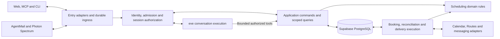

# Find Me a Time — Backend Architecture

Status: replacement backend design; implementation and runtime placement pending
Date: 2026-10-06
Basis: [implementation plan](04_implementation_plan.md), [technical specification](../03_technical_specification.md), [PRD](../02_product_requirements.md), and [interfaces](../user_experience/03_interfaces.md)

The scheduling backend is part of the full source rebuild. This document defines domain guarantees and proposed runtime boundaries. Reconcile behavioral deltas through bounded changes before implementation under the [repository workflow](../../AGENTS.md#documentation-and-specifications).

## 1. Deployment shape

Use Supabase Auth and PostgreSQL for identity and durable application state. Next.js and eve are the proposed web/conversation direction, subject to the checks in the [backend decision](../03_technical_specification.md#backend-decision). Follow the eve chat template: root `agent/`, Next.js in `apps/web/`, and separately built eve/web services composed through root `vercel.ts`. Shared server-only domain modules live in root `lib/server/`. The runtime spike verifies cross-runtime module compatibility, persistence, job transport, background execution and recovery scheduling; add a worker or bridge deployment only for an evidenced requirement.

Separate interactive commands, conversation execution and durable external effects as logical responsibilities. They may share modules or deployment infrastructure once the runtime spike establishes compatibility. Human waits live in durable state; request connections and process memory are not their source of truth.

Model calls use eve's direct OpenAI provider with server-side `OPENAI_API_KEY` and a verified native model ID. Keep provider billing configuration in backend infrastructure; API credit exhaustion is a failed model operation, not a successful scheduling transition. See [model access and billing](03_provider_setup.md#openai-model-access-through-eve).



Public skill documents are read-only guidance. Protected operations require their own verified credentials. eve owns conversation execution; the application owns actor/audience-to-session bindings and scheduling authority. A verified provider event must be durably recorded and resolved to a permitted conversation before runtime dispatch. Select the Spectrum bridge or compatible native eve adapter based on evidence, not adapter naming.

## 2. Module boundaries

| Module | Owns | Boundary |
|---|---|---|
| Identity and grants | Host/account mapping, admission checks, agent grants, guest access, verified channel bindings, and revocation. | Resolves principals from trusted credentials; login and OAuth consent alone cannot confer host admission. |
| Onboarding and profiles | Waitlist, invitations, admission records, setup progress, public handles, calendar selection, settings, and readiness. | Invite issuance requires operator authority; publication requires admission and validated setup. |
| Requests and conversation bindings | Intake, request state/revision, verified channel mappings and actor/audience-to-session associations. | Links channels only after verifying access; keeps host-private and requester runtime histories separate. |
| Conversation runtime | eve sessions, model turns, tool execution and stream resumption within the selected runtime contract. | Every read, stream, continuation and tool call passes application authorization; runtime persistence never substitutes for domain authority. |
| Rules and availability | Versioned policy, normalized times, feasible candidates, and travel checks. | Deterministic filtering precedes AI ranking. Failed data reads never mean free time. |
| Proposals and decisions | Proposal versions, shared-detail and approval digests, agreements, exceptions, and human-confirmation evidence. | Only trusted confirmation paths can produce approval evidence. |
| Booking | Booking identity, attempt history, host reservations, provider event association, and reconciliation. | Sole owner of calendar event creation. |
| Delivery | Outbound messages, recipients, formatting, provider keys, and delivery outcomes. | A delivery job cannot book or change an approved proposal. |
| Infrastructure | Database transactions, job transport, secrets, provider clients, and telemetry. | Implements domain-facing interfaces; does not decide scheduling policy. |

Application services coordinate modules for a use case. A request adapter does not write another module's records directly, and a background handler does not bypass authorization by calling a repository helper. Use the same transition functions for web, MCP, CLI, and messaging inputs.

Keep application operations and their rules together within each capability under `lib/server/`: identity, onboarding, scheduling (including request lifecycle/proposals), booking and delivery. Infrastructure lives in its `providers/`, `db/` and `jobs/` modules. Eve tools and every channel entry invoke these same operations. Provider credentials and privileged persistence stay server-only. Client-safe schemas live in `lib/contracts/`; share these source modules between the agent and web builds without a new package, and extract a package only when independent packaging is required. See the [source organization](02_frontend_architecture.md#source-organization) for the canonical layout.

The [page list](../user_experience/04_page_list.md#supporting-routes-and-surfaces) records proposed public routes and skill-document surfaces. Preserve the promised `findmeatime.com/SKILL.md` and `/{host}/SKILL.md` entry URLs independently of deployment paths.

### Implemented host setup drafts

`lib/contracts/setup.ts` and `lib/server/setup/commands.ts` expose private read, partial draft, explicit refresh and current-review confirmation. The service-only `fmat_host_setup` derives an admitted host from current Auth; eve uses the same private SQL operations through `fmat_conversation_tool` with assistant provenance. Host/conversation locks, immutable idempotency inputs and revision checks serialize changes. Drafts and reviews use the retained setup tables, with field provenance; they never mutate confirmed policy before explicit confirmation. Assistant suggestions cannot overwrite explicit host choices, supply applicable human mode/location/travel answers or confirm policy.

A rules/calendar change hides stale reviews. A protected refresh retains answers/provenance and creates a review against the current rules version; ordinary stale edits fail without resetting answers. Confirmation re-fetches Google calendar metadata and write permission, then atomically rechecks draft/review/conversation/rules/grant versions. A committed confirmation replay requires current Auth but avoids another provider read or save. No setup operation grants booking authority. Full Calendar analysis and linked-channel setup remain pending.

## 3. Entry surfaces

| Surface | Replacement responsibility (all require implementation and verification) |
|---|---|
| `GET /SKILL.md` | Serve versioned onboarding instructions for “Let me use findmeatime.com/SKILL.md for my scheduling”. |
| `GET /{host}/SKILL.md` | Resolve a public host handle and serve requester instructions for “Let me schedule a meeting with findmeatime.com/dodo/SKILL.md”. |
| Application HTTP API | Validate web/CLI inputs, resolve identity, invoke commands/queries, and return structured results. Define client-safe input/output schemas in `lib/contracts/`. |
| Remote MCP endpoint | Expose permitted tools and map tool calls to the same application commands. OAuth discovery and consent follow the selected authorization implementation. |
| Calendar and identity callbacks | Validate provider callback context and associate host grants with the initiating account/setup flow, or requester availability grants with the authorized request continuation. Requester calendar consent does not require host admission. |
| Email events and iMessage ingress | Authenticate provider origin/transport, persist deduplicated input, acknowledge durable receipt and dispatch authorized processing. |
| Session reads, streams and action cards | Resolve actor, audience and resource scope before accessing eve; typed actions invoke authorized commands or allowlisted connection flows. |

### Public skill entry documents

Public skill content is service-controlled guidance. Host display text is treated as data. No private rules, request history, credentials, or live calendar context appear in these documents. Execution revalidates the stable host ID and status; cached instructions do not authorize an operation. Finalize handle rename/reuse behavior so an old link cannot silently identify a different host.

The [public agent entry contract](../../openspec/specs/public-agent-entry/spec.md) owns document behavior. The rebuilt Next.js routes serve versioned UTF-8 Markdown with `no-store`, no session creation and links derived only from the configured application origin. Per-host documents reuse current public-intake readiness and Calendar permission checks, project only handle/display name/timezone/duration, and encode host text in a marked JSON data block. Unknown or unavailable hosts return neutral 404; transient failures return sanitized 503 with a retry hint. The documents describe the authenticated MCP and source CLI paths while disclosing remaining full-workflow and named-client acceptance limits. They do not certify client compatibility or root-domain promotion.

The root document describes resumable host onboarding and the host-specific document describes account-free intake, negotiation, status and web continuation. Both provide the actual MCP URL and a pinned public source CLI alternative with browser login, discovery/calls and logout. The requester CLI path now begins with explicit future-request consent for the fixed public host; an existing private request can also use the original requester login path. Missing local runtime/launcher/client support retains the browser path; a source checkout is not advertised as an npm distribution. Reading either document does not install tools, connect MCP, or provide credentials. Publish an instruction/schema version, return an explicit unavailable result for unknown or disabled hosts, and test fetch, interpretation, connection and resumption separately in every named client. Generate host documents from an allowlist of public profile fields and service-authored instructions.

For onboarding, return a saved setup status and a next action such as join waitlist, redeem invitation, consent required, missing settings, or ready. Check host admission before host calendar setup and hosting operations; requester calendar connection requires no host admission; keep waitlist entry and request-scoped guest operations accessible without host admission. Readiness and public-link publication require admission, confirmed timezone/rules, an active host Calendar grant, selected conflict calendars and a currently writable booking destination. Reconnection invalidates dependent calendar selections until the host reconfirms them; a read-only calendar cannot be the booking destination. Browser callbacks update this state so the personal agent can resume without repeating questions. The browser readiness operation reads the current confirmed setup, retrieves Calendar metadata, then reauthorizes and compares setup revision, rules version and connection generation. It returns only readiness and the public handle; missing selected calendars or a non-writable destination cannot produce links. Provider failures and concurrent changes fail the check instead of using an earlier result. The private conversation readiness tool resolves the handle from its authorized setup read, checks the same public-intake metadata boundary, and repeats grant/revision checks after I/O. Only a current result includes canonical booking and agent-instruction URLs; a model cannot supply another host. Optional messaging setup follows core readiness. Direct web onboarding uses the same services while skipping personal-agent connection and consent.

### Identity and access

#### Host and requester boundaries

Host web sessions identify an account, but every operation still checks ownership and permission server-side. Client-supplied host IDs, request IDs and eve session IDs are resource locators, not authority. Protect cookie-authenticated mutations against cross-site requests; opening a URL never records approval.

The rebuild foundation stores separate `conversation_scopes` for host setup, host-private request review and shared request discussion, with independent participant execution grants. The server verifies the original host JWT through Supabase Auth; the access RPC then checks the current Auth session row, verified email, account status and admission. Guest authority uses a request-bound opaque-token hash. Only service-role callers can use the access/check RPCs; ordinary authenticated clients cannot submit actor claims directly. Internal grant IDs are omitted from browser projections and never serve as login credentials. Runtime adapters must recheck grants before output and tools; the adapter/restart tests remain part of the foundation change.

Authored model tools use `fmat_conversation_tool`: it derives the actor and resource from the captured grant, locks revocable authority, enforces an audience-specific operation allowlist and executes the command in one transaction. Shared discussion uses shared projections even when the caller is the host, including cached retry results. Tools read the active caller rather than the session initiator and derive retry keys from durable call identity. Current tools can read setup/request context, update shared details and save private notes; approval, agreement, confirmed policy, travel exceptions and provider outcomes require separate application operations. Lock-wait expiry is checked against current wall time. The runtime ingress and stream adapters remain pending.

Public booking links expose only the intended public host profile and intake. Requester continuation uses unguessable request-scoped credentials stored as hashes, with the agreed maximum thirty-day lifetime. Closing a request revokes mutation, OAuth and recovery authority while retaining only minimal terminal status and confirmed receipt reads until credential expiry. Contact verification protects recovery and attendee identity without requiring a requester account. Host-private and requester-visible projections remain separate in database queries, notifications, model context, traces and errors.

#### Waitlist and host admission

Authentication identifies an account; server-owned admission authorizes calendar hosting. Check admission for setup, configuration, link publication and host operations across web, API, MCP and CLI. Successful login, Google consent, a public skill document or client metadata cannot grant admission. Waitlist intake collects only necessary contact information, deduplicates repeats and returns a neutral response that does not expose another person's status.

Invitation issuance and revocation are operator-only operations. Derive a 16-character code from a versioned HMAC with a dedicated 32-byte key and random UUID retry identity, using its first 80 bits; format it as `XXXX-XXXX-XXXX-XXXX`, store only its SHA-256 hash, bind it to the normalized verified recipient, and expire it within seven days. Cloudflare sends the code separately from the `/app` URL; the URL never contains the secret. Redemption atomically consumes the invitation and admits the matching account; same-account retries resume saved admission, while wrong-recipient, expired, revoked or reused codes fail. Revoking an unused invitation does not revoke a previously admitted host; host access revocation is a separate audited operation.

Before sending an invitation, persist a protected dispatch intent, immutable derivation context and message fingerprint. Render the versioned payload only in memory and check the derived code against the stored hash. The service-only worker rechecks current invitation validity and lease ownership after locking, then commits its dispatch fence before network I/O. A lost provider response stays uncertain until the audit, dispatch record and provider activity are reconciled; do not blindly issue or send a replacement. Provider acceptance is not inbox delivery or redemption. Privileged operator tools must identify the intended project, reject publishable/anon/user credentials and mismatched origins, and keep service credentials and one-time codes out of browser configuration, logs and terminal history.

#### MCP OAuth and CLI

`fmat_list_requests` requires host:read and uses the same private summary query as browser navigation, returning at most 30 requests plus a stable created-at/ID cursor. Search is literal, and status filters are active/closed/all. Agent cursors must identify an existing request of the current host at the exact timestamp; removed, foreign or altered cursors return INVALID_INPUT and require restarting from the first page. Summaries omit email, private notes, calendar data and conversation text. The service-only agent transaction rechecks grant/session/admission and wall-clock token validity around the read. The shared helper is not executable by public, authenticated or service roles directly. Agent conversation reads are still a separate pending part of task 2.1.

`POST /mcp` uses pinned official TypeScript SDK 2.3.1 Streamable HTTP with JSON responses and no persistent transport session. Every request verifies the application bearer token before SDK dispatch; browser cookies and query credentials cannot authenticate. Missing/invalid tokens return a 401 protected-resource metadata challenge, and missing tool permissions return 403 with the exact required scope. Bodies are bounded to 16 KiB and a five-second upload deadline; batches are rejected. Native clients may omit Origin; browser origins must equal the application origin or an exact configured `MCP_ALLOWED_ORIGINS` entry. Allowed CORS responses never permit browser credentials. GET/DELETE return 405 after authentication because standalone streams/sessions are unsupported. Results use a structured `result` envelope; domain errors are sanitized tool errors.

The pending [agent tools and CLI change](../../openspec/changes/deliver-agent-tools-and-cli/proposal.md) owns protected transport and workflow coverage. Its internal `lib/contracts/agent-tools.ts` catalog maps fifteen named tools to the existing strict agent-operation schemas, with role-specific discovery, required scopes, retry descriptions and explicit human-review handoffs. Discovery metadata grants no authority; transport must still invoke the authorized domain/runtime adapters. The catalog is mounted by the stateless `/mcp` Route Handler; request discovery, conversation, availability, negotiation and booking-status coverage remain tracked tasks.

Compatibility finding (2026-10-08): stock local GoTrue v2.197.0 does not enforce the required resource isolation in form code exchange or refresh and issues a generic audience. Do not use it unmodified as the MCP authorization boundary. Preserve Supabase Google identity while implementing explicit application client/resource/grant enforcement; [probe and setup constraints](03_provider_setup.md#protected-mcp-oauth-compatibility) record the evidence. The replacement MCP resource uses the application OAuth boundary described below.

Protected host MCP access uses OAuth authorization code flow with PKCE, protected-resource metadata, authorization-server discovery and resource-specific tokens. Validate issuer, signature, audience, expiry, the active client grant and requested permission on every operation. Keep permissions for reading, revising and submitting decisions distinct, and enforce revocation through current server-side grant state. Google Calendar credentials are never MCP credentials.

The [archived agent authorization change](../../openspec/changes/archive/2026-10-08-authorize-agent-clients/proposal.md) owns the application OAuth boundary. Protocol parsers, ES256 token handling and public OAuth route adapters are implemented; release signing is active and controlled requester browser/terminal acceptance is recorded. The configured origin and `/mcp` resource are fixed, tokens carry only actor/client/grant/scope identifiers, and verified claims still require current durable authorization before any domain operation. Google sign-in credentials remain distinct.

The internal HTTP adapter bounds streamed form/JSON uploads to 16 KiB and one five-second deadline, rejects invalid UTF-8/media types and alternate client authentication, and emits sanitized no-store protocol responses. The token service passes only hashes of code/refresh credentials to the existing service-only RPCs, checks signing configuration before consuming them, and rechecks the exact effective grant before and after signing. Returned lifetime reflects elapsed checks. A committed replay error remains committed; the adapter never retries a consumed credential. Refresh-token revocation remains available without signing configuration. The protocol routes and protected browser consent now use these modules. Release signing is active; the protected MCP adapter uses the current-grant operation boundary.

OAuth discovery lives at `/.well-known/oauth-authorization-server` and `/.well-known/oauth-protected-resource[/mcp]`; `/oauth/jwks` publishes public keys. `/oauth/register` accepts bounded JSON public-client metadata, `/oauth/authorize` accepts strict query parameters, and `/oauth/token` and `/oauth/revoke` accept form bodies. Discovery, registration and authorization fail closed without signing keys; refresh-token revocation remains available during key incidents. Protocol responses allow credential-free CORS except browser authorization. Unknown callbacks are never used for error redirects. Registration strips unsupported display/extension metadata without fetching URLs; authorization always requires explicit scopes and the exact resource. Bounded parse rejections still charge the appropriate durable registry budgets.

Authorization creates a ten-minute HttpOnly browser-binding cookie and redirects only to `/connect/authorize`. Protected same-origin browser actions display escaped client identity, exact permissions, return address and current actor. Host consent reuses Google-only login and a UUID-only, cookie-bound return marker; ordinary login clears that marker. Requester consent uses current request-specific cookies, optionally selected through the non-authoritative `request_id` hint. A UUID alone never binds a request. A deterministic code derived from the high-entropy browser binding recovers the same recorded consent outcome after a lost response, without issuing a second code; its one-minute expiry still applies. Owner-authorized grant listing is paginated at 50 records with an owner-bound cursor and a private partial index; revocation remains available after the original attempt expires. Browser responses contain no signing, session, continuation or provider secrets.

Protocol and application route names, including `mcp` and `oauth`, are reserved by the shared browser-safe handle contract and the private SQL validator. The host storage constraint, current and legacy setup, public intake and requester identity all enforce that rule. Reserved names do not resolve to host pages or host skill documents; the bare `/oauth` returns 404, while `/mcp` is the authenticated protocol resource and dedicated child OAuth endpoints are mounted. Prefix neighbors such as `mcp-team` remain valid. Migration constraint validation stops on an existing conflict without renaming a published host.

The internal `AgentCredentials` boundary verifies the signed application token and exact current grant projection before issuing a frozen, process-branded agent credential. It retains only public access claims, never the raw bearer token or underlying browser/request secrets. Browser command and consent APIs reject this separate credential type. This is an identity boundary only: subsequent MCP/CLI operation adapters must enforce per-operation scopes and recheck current authority under locks in the same transaction as the domain operation. The internal `AgentOperations` adapter now calls service-only `fmat_agent_operation`, which repeats the exact grant/client/resource/actor binding and scope checks under request, host, Auth, client and grant locks. Setup acquires the host update lock before grant checks to avoid lock upgrades. A domain subtransaction rolls back effects if token or underlying authority expires during a later helper lock; observed authority loss revokes the grant outside that subtransaction. A successful credential check alone cannot authorize a meeting decision.

The future MCP resource and CLI must use `AgentCredentials` followed by `AgentOperations`, with a strict operation object. `setup_read` and `setup_analysis_read` require `host:read`; `setup_draft` requires `host:write` and remains an assistant draft. `request_read` requires the actor role's read scope, with owned-host or exact-request targeting and shared-only requester output. `private_note_save` requires `host:write`; `details_propose` requires `request:write` and creates a pending browser review. Each mutation requires a UUID retry key, namespaced by OAuth grant in SQL so retries after refresh remain stable without colliding with another client or browser command.

`decision_review` requires the actor role's decide scope and returns only the current request revision and authenticated browser path with `requiresHumanConfirmation: true`. It creates no agreement, approval or other meeting decision. No operation accepts caller-supplied actors, continuation secrets, arbitrary RPC names or confirmation flags. Provider credentials never cross this boundary. Scheduling evaluation, booking, transport/tool discovery and full named-client journeys still require their own implementations and acceptance; this internal operation set is not complete MCP/CLI coverage.

The private OAuth registry stores public clients (a display name of at most 120 characters and one to five exact callbacks) and ten-minute, browser-hash-bound authorization attempts. Registration creates no user grant. Attempts freeze the client, resource, callback, canonical role scopes, S256 challenge and state. Readback requires the initiating browser hash and rechecks client disablement and wall-clock expiry after locks; client names remain untrusted text for escaped UI rendering.

Two fixed global counter rows enforce 30 registration attempts per hour and 600 authorization attempts per minute. Each client row enforces 20 authorization attempts per minute. Windows begin with the first attempt and reset after the configured interval; they are not sliding-window limits. Rejected metadata and unknown clients consume the applicable global budget, and known-client protocol failures consume its client budget. RPCs return sanitized error results so budget consumption commits on rejection. The eventual route must not turn these into a database rollback. Lock order is global budget, client, authorization; later grant operations must not acquire these budgets while holding client locks. No raw IPs are stored. Service-only consent, grant checks, single-use codes, refresh rotation and revocation now extend this registry. Public protocol routes, browser consent controls and the operation adapter remain pending; registry/grant IDs never serve as client credentials.

Explicit grant or denial is frozen on the browser-bound authorization. A grant snapshots one admitted host/session or one current requester token hash, the resource and role-specific scopes. Host consent requires a verified, still-fresh browser access token; the resulting delegation can outlast that JWT, but expires within thirty days and no later than the Auth session maximum. Every grant use checks the current Auth session/user and admission. Requester expiry is bounded by both request and continuation-token expiry, with current token, host admission and closed-state checks. Observed authority loss permanently revokes that grant. No provider tokens, browser tokens or email addresses are stored in OAuth grants or their public projections.

A one-minute authorization code stores only its hash and exact redirect/S256 snapshot. Concurrent redemption produces at most one refresh family. Refresh atomically consumes the old hash and creates one successor; narrowing permissions also narrows the grant so older broad JWTs lose authority. Consumed-token reuse revokes the entire family, including a concurrent winner. Lost exchange/refresh responses therefore require reauthorization. The grant check preserves narrower verified-token permissions in its result. Client/resource mismatch never revokes a different client's family. Browser owners and correctly bound refresh credentials can revoke, without creating meeting agreement or approval.

Lifecycle operations lock request, host, Auth user/session, client, then authorization/grant and token rows. They recheck wall-clock expiry after the final blocking lock. RPCs return sanitized failure results for persisted revocation; adapters must commit those outcomes, check current authority before signing/returning tokens, and repeat authorization inside each eventual domain-operation transaction. Cryptographic tokens and a successful earlier check alone do not authorize a later effect.

The CLI calls the same application operations and returns structured results with meaningful exit codes. Its final interactive/headless login and credential storage need compatibility decisions. Guest MCP and CLI operations use request-scoped grants, never host or service credentials.

#### Optional requester Google identity

Support an optional identity-only Google flow bound to the initiating browser and intake draft/request. Verify the provider subject and verified-email claim server-side before using identity to prefill trusted contact data. Keep draft/request authorization distinct from provider identity; never merge or recover requests merely because emails match. Manual or changed recipient emails use the existing contact-verification boundary. Identity sign-in does not request Calendar permissions or imply host admission. The identity-only provider adapter now verifies signed Google claims and returns no tokens. Gmail and verified hosted-domain addresses are eligible for contact proof; other addresses still need an email code even when Google reports historical verification. Durable single-use state now binds identity to the exact intake token/handle or current request credential/revision, with post-exchange authority rechecks. Atomic intake creation or explicit current-recipient proof can establish contact verification. The browser offers optional identity prefill and manual continuation, with a separately marked callback and explicit proof application for existing requests. Signed-provider browser fixtures verify callback isolation and account switching; controlled live Google and actual-device acceptance remain release gates.

Timezone is an explicit request setting with a source: user choice, detected browser suggestion or unresolved. Preserve user corrections across provider callbacks. Use IANA identifiers and date-specific offsets; display conversion must not shift proposed instants. Reject ambiguous local-time scheduling inputs until resolved.

#### Optional requester Google Calendar access

Requester Calendar consent starts only from an authorized request continuation. Bind a short-lived, single-use OAuth state to the initiating browser and protected request, restrict the return destination, and reject caller-supplied request identity without that binding. Browser flows should use a same-origin, HttpOnly, SameSite=Lax state cookie and Secure in production. Store encrypted credentials under a requester/request-scoped connection, prevent cross-request reuse, and expose protected status and disconnect actions.

Requester grants supply availability only; they confer no host admission, agreement, event creation or host history access. Denied, revoked or failed access never means free time. Pause dependent evaluation and offer reconnection or explicit manual/agent availability. Keep requester event details and tokens out of host responses and model context. Host sign-in, host Calendar consent, requester Calendar consent and MCP OAuth remain distinct grants.

#### Human confirmation

Approval evidence binds the verified host, request, current proposal version, canonical approved-details digest, decision, timestamp and trusted confirmation path. The host digest includes applicable private exceptions; requester agreement binds only shared meeting details. Authenticated web action cards are the direct path. A verified private channel or personal-agent client may submit a decision only after its exact current-proposal confirmation mechanism is tested; otherwise return authenticated web review.

An agent-supplied boolean, quoted conversation, OAuth token, model assertion, ambiguous reply or possession of a confirmation link is not attributable human approval. Stale replies cannot approve a newer proposal. OAuth authorizes operations, not blanket meeting approval.

## 4. Command and query pipeline

Each entry adapter constructs a server-verified principal and a validated command. The principal identifies an authenticated host, a permitted host client, a request-scoped guest, or a narrowly authorized internal job. A worker principal authorizes job execution; it does not convert unverified inbound text into a host decision.

### Shared operation contract

These are domain operations rather than finalized routes, tools or CLI names:

| Operation family | Permitted caller and guard |
|---|---|
| Public entry and intake | Public clients can read skill guidance, discover an active host, join the waitlist and submit new intake; no historical private state is exposed. |
| Admission and setup | A verified prospective host can redeem a recipient-bound invitation; setup mutations additionally require admission and current calendar/rule/handle validation. |
| Requester continuation | A request-scoped principal can read shared state, clarify, negotiate, agree, withdraw, and connect or disconnect requester availability. None grants host approval. |
| Host management | The owning host or appropriately scoped client can read requests, manage rules, revise or decline; approval additionally requires current attributable human evidence. |
| Connections | An authorized host can bind or revoke an agent/channel; revocation is checked against current server state. |
| Booking and reconciliation | Only an internal scoped worker can revalidate prerequisites, create through the booking boundary, or reconcile the persisted attempt. |

Results include resource identity, state revision, applicable proposal version, lifecycle status and next action. Use stable error categories for invalid credentials, forbidden access, stale proposals, missing confirmation/details, unavailable calendars and pending reconciliation. Error shape and not-found behavior must not reveal another user's private state; HTTP, MCP and CLI expose the same domain outcomes.

An illustrative command envelope contains:

| Field | Use |
|---|---|
| Operation and input | Validated domain intent, such as revise proposal or express requester agreement. |
| Resource identity | Request/setup identifier; its ownership is checked against the principal. |
| Expected revision | Reject concurrent or stale changes instead of silently overwriting them. |
| Proposal version | Required when acting on particular meeting details. |
| Idempotency key | Stable within actor, operation, and resource scope for retries. |
| Correlation and source reference | Trace the input without storing unnecessary private content in logs. |

Actor identity, effective permissions, and confirmation evidence are derived or verified server-side, not accepted as authoritative fields in this envelope.

The processing sequence is:

1. Apply input limits and schema validation; authenticate and authorize the operation against current ownership, grants, and channel bindings.
2. Check the idempotency record within the same logical mutation. Repeated identical input returns its recorded outcome after current access checks; key reuse with different input is rejected.
3. Load current state and check expected revision, proposal version, and transition prerequisites under transaction-level concurrency control.
4. Commit state changes, decision/audit history, and necessary jobs/outbox records atomically. Return the new revision and the actual completed or pending outcome.
5. Perform slow or external work outside that transaction. Apply recomputable model/availability results only if their relevant state/rule versions still match. Always durably record or reconcile booking and delivery outcomes against their persisted attempts; later rule or state changes cannot erase an external side effect.

Idempotency prevents duplicate processing of the same operation. Revision checks prevent different operations based on stale state. Both are needed. For initial creation, which has no existing revision, use a creation-specific idempotency key; do not invent a revision or merge unrelated submissions by matching names.

Query services return separate host and requester projections. Requester projections contain submitted information, shared proposals, and permitted status. Host-only fields should never be serialized into guest or public responses. Keep error responses equally scoped, including resource-not-found behavior.

## 5. Persistence and concurrency

PostgreSQL owns request state and the mapping from provider identifiers to application records.

### Logical data model

These are logical records and invariants, not final SQL table names. Use UUIDs, foreign keys, explicit uniqueness constraints, UTC instants and retained IANA timezone identifiers.

| Record | Core ownership and constraints |
|---|---|
| Waitlist, invitation and admission | Minimal contact and deduplication identity; hashed invitation, validity, verified account binding, issuing operator and redemption audit. Client-controlled data cannot grant admission. |
| Host profile and rules | Owning account, public handle, timezone, versioned hard constraints, preferences and travel buffers. Public profile fields are separate from private policy. |
| Calendar connection | Host or protected requester/request owner, selected calendars, encrypted credential reference, scopes and status. Only host connections may identify a booking destination. |
| Channel identity and agent grant | Verified provider/client binding, scope, permissions, opt-in and revocation. Requester identities never imply host authority. |
| Request and continuation grant | Host, requester contact, purpose, lifecycle state, revision, current proposal and hashed request-scoped grants. |
| Proposal, agreement and decision | Immutable unique proposal versions and digests; append-only version-bound requester agreement and host decision evidence. |
| Conversation binding | Actor, request/setup scope, audience, verified channel and eve session identity; session access always passes application authorization. |
| Booking operation and reservation | One logical booking per request, exact payload, destination, persisted provider event identity, attempt/worker state, outcome, confirmed association and per-host reservation. |
| Inbox, jobs and outbox | Provider/account-scoped deduplication, processing/retry state, audience, recipient, stable delivery identity and provider outcome. |
| Audit event | Actor, channel, resource/proposal, transition, correlation identity and outcome without raw secrets or private transcript content. |

Enforce unique proposal versions, one logical booking per request and provider message uniqueness within provider/account scope. Prevent cross-host and cross-request associations through constraints. Index host work by host/state/update time, histories by request/time and runnable work by state/next attempt; finalize indexes from measured query patterns.

| Transaction | Records committed together |
|---|---|
| Redeem host invitation | Validate token, expiry/revocation, verified account binding, and unused status; consume invitation and grant admission with an audit record atomically. Same-account retries return existing admission. |
| Accept intake or verified message | Request/conversation update, revision, audit record, and follow-up work. |
| Revise proposal | New immutable proposal, current-version pointer, invalidation of applicable decisions, and notifications/work items. |
| Record agreement or approval | Version-bound decision, evidence reference where required, revision, and booking work if prerequisites hold. |
| Enter booking | Current prerequisite checks, booking identity/attempt, request state, and reservation or reservation-wait state. |
| Confirm booking | Provider event association, Booked state, audit record, reservation release, and confirmation outbox entries. |
| Revoke access | Grant/channel revocation and invalidation of pending access-dependent work where appropriate. |

Keep one booking identity per request with attempt history. A pre-dispatch feasibility failure can return the request to negotiation. After renewed agreement and approval, a new attempt may bind the revised proposal only when the previous attempt is conclusively non-creating. Once an attempt may have reached Google, do not replace its payload/event identity or accept a new booking attempt until reconciliation resolves it. A confirmed booking is terminal for initial-release scheduling.

Use short row locks or compare-and-update operations to guard revisions, plus uniqueness constraints for proposal versions, deduplication keys, and booking identity. Booking workers, including retained command entrypoints, acquire the job lease, request and host before an attempt or reservation. The host lock serializes requests for the same host; recheck the lease after lock waits before allowing effects. Do not hold a database transaction open across model or provider calls.

Initially serialize booking work per host with a durable reservation. This is an internal coordination record, not a calendar hold visible to requesters. Preserve the reservation while a write is uncertain. Worker leases may expire and transfer recovery ownership, but that cannot free a potentially occupied interval or justify a fresh creation.

Database access should use narrowly privileged server paths. Keep workflow data unexposed by default; exposed data needs explicit grants and ownership-based RLS. Application authorization remains necessary on privileged paths. Guest credentials and provider secrets never become general database credentials. Follow the existing [schema workflow](../../AGENTS.md#supabase-schema-changes) rather than adding a second migration mechanism.

Encrypt provider credentials with keys stored separately from database rows. Persist encryption keys in ignored secret storage, define explicit rotation, and never generate a new key on each restart. Decide retention, deletion, backup and audit ownership before launch.

## 6. Conversation and availability processing

### Calendar-informed onboarding

After verified host Google consent, list permitted calendar metadata and offer explainable selection recommendations based on access, ownership/primary metadata and the host's stated intent. A read-only calendar may be useful for conflicts but never as the booking destination. The host chooses calendars to analyze before event reads; do not scan every accessible calendar by default. Analysis is a read-only onboarding operation, distinct from confirming settings, meeting approval and event creation.

Read a bounded, disclosed period from selected authorized calendars using the existing host grant. Choose concrete look-back/look-ahead limits and refresh policy before implementation. Normalize instants in the confirmed IANA timezone, expand recurring commitments correctly, and account for all-day events, cancellations and free/busy transparency. Record source calendar IDs, scan interval, completion/partial status and freshness. Failed, revoked or incomplete reads must not produce a confident availability recommendation; expose limitations and retry/manual setup.

Derive minimized schedule summaries deterministically: recurring occupied/free intervals, distribution by weekday/time and coarse meeting-mode/location patterns where available. The model may explain and rank suggestions from these summaries plus stated preferences. Do not forward raw event titles, descriptions, attendee lists, conferencing secrets or full calendar dumps to the model or transcript; keep necessary location candidates in a private server-owned projection. Calendar labels and event text are untrusted data, never tool instructions. A repeated address is not evidence of home/work identity or consent to publish a venue. Missing or ambiguous locations produce clarification, and actual future booking feasibility remains separately rechecked.

Generate missing preference suggestions using explicit current choices/confirmed settings first, authorized evidence second, and configured starter defaults last. Mark each source as stated, inferred or default; record uncertainty and dismissals so rejected guesses do not recur without new evidence. Defaults do not substitute for failed availability reads or establish verified identity, consent, addresses or approval. A new explicit correction updates the draft, never silently overwrites saved policy.

Track whether meeting mode and the applicable location/transportation preferences and extra travel buffer were explicitly answered. Transport choices must map to supported routing modes or an explicit per-trip policy; resolve each necessary leg before offering physical candidates, using explicit manual allowances for unavailable estimates. Never infer mode from addresses, silently substitute a mode or combine an extra buffer with the route estimate without retaining their separate values. A generated/default value does not satisfy onboarding completion. Permit a host-confirmed per-meeting location policy without a fixed venue; actual proposals still require resolved locations and travel feasibility. Reuse explicit prior answers and require a physical-location preference only for in-person/either mode.

Store suggestions as host-owned draft artifacts with rationale, evidence limitations, source scope/freshness and draft revision. Confirming a scan does not activate calendars or rules. **Use** updates the draft only; final explicit review validates calendar IDs/permissions, timezone, rule schema and location choices before saving. Source selection, permissions, refreshed analysis or draft revisions invalidate dependent reviews. Recheck authorization when accepting late results and discard work after revocation; keep derived insights out of guest/shared contexts and use the same host-data retention/deletion policy. Calendar-analysis failure never blocks manual setup with valid required connections.

### State, availability, and AI

Inbound channel processing has two stages. First, the adapter stores the authenticated provider event with a provider/account-scoped deduplication key. Second, application dispatch resolves verified participant identity, request mapping and audience before starting or resuming the corresponding eve session. Unknown or ambiguous associations trigger clarification or authenticated continuation without disclosing existing private history.

The authorized eve session gives the model only audience-appropriate context and exposes bounded tools for structured intent, missing fields and scheduling commands. Host-private web/iMessage and requester web/email continue separate verified contexts. Deliberate host access to a shared request discussion uses that discussion's shared-safe context; never merge host-private history or Calendar context into it. Stream reconnection resumes authorized runtime output without replaying committed domain commands. Deterministic code validates the result, obtains authorized availability, applies rules, and offers feasible candidates. The model can rank candidates but cannot relax hard constraints, waive preferences, generate host consent, or select private recipients.

Proposal changes create immutable revisions and invalidate host approval. Changed shared details also invalidate requester agreement; changed private exceptions require fresh host approval. Attach request revision and rule version to long-running model/availability work. Before saving a result, compare those versions with current state; discard or recompute stale work. Arrival order, email timestamps, and provider thread grouping are not reliable substitutes for proposal versions.

Keep calendar reads behind the availability adapter and creation behind the booking adapter. Optional requester connections supply only authorized availability, remain bound to their protected request, and never grant event creation or host access. Intersect their busy intervals with host feasibility, recheck before booking, and require reconnection or explicit manual/agent availability when a required requester read fails. Keep requester event details and tokens out of host responses and model context. See [optional requester Calendar access](01_backend_architecture.md#optional-requester-google-calendar-access).

Normalize ambiguous dates, timezone, duration, location and meeting mode before a proposal becomes actionable. Deterministic checks apply calendar conflicts, hard rules, focus blocks and travel buffers before model ranking. Free/busy results alone cannot establish adjacent event locations. For physical meetings, evaluate both the prior-event-to-candidate and candidate-to-next-event legs with the applicable travel mode and departure context. Each gap must cover the route estimate and configured buffers. Missing locations, unavailable routes or provider failures require clarification or an explicitly confirmed manual allowance; never substitute zero. Offered candidates do not reserve time.

### Deterministic interval core

The replacement interval core is `lib/server/scheduling/intervals.ts`. It accepts validated snapshots and returns continuous time windows; those windows are an intermediate result, not complete scheduling candidates. Authorized Calendar acquisition, current request/rule checks, travel, private preferences and persisted proposal controls remain separate mandatory gates. Neither model ranking nor an empty array substituted for a failed provider call may bypass them.

- Treat intervals as half-open `[start, end)`. A meeting ending at 10:00 may touch a busy interval starting at 10:00 when the configured general buffer is zero. The entire elapsed meeting duration must fit; a valid start alone is insufficient.
- Expand each weekly host window in the host's IANA timezone on its actual local date (Sunday is `0`). The requester's timezone is a display/input context, not a replacement for host working hours. Merge overlapping/touching allowed windows before intersecting requested windows with explicitly supplied requester availability.
- Host busy intervals and focus blocks are hard exclusions. The confirmed general `bufferMinutes` expands both ends of those exclusions. For example, a 10:00–11:00 commitment with a ten-minute general buffer excludes 09:50–11:10. A thirty-minute meeting ending at 09:50 fits; ending at 09:51 does not. Provider reads must cover the requested windows plus the configured buffer on both sides so an adjacent commitment outside the requested window is not lost. Travel still needs its wider neighboring-event context.
- Requester busy intervals are independently excluded. A host's general buffer does not invent a requester-side buffer. The requested duration governs elapsed meeting length; the host's default duration is intake guidance, not an additional duration restriction.
- General scheduling buffer, estimated route duration and extra `travelBufferMinutes` remain distinct. Time-only filtering does not waive meeting-mode/location preferences, interpret free-form preference prose or manufacture an exception. Private preference interpretation and explicit host exceptions belong to their own current-context stage.
- Convert instants without millisecond rounding. Repeated/nonexistent local boundary times require clarification; do not silently select the earlier or later offset. Unambiguous windows spanning a clock change preserve real elapsed duration. For example, New York 09:00 is 14:00Z on 2030-03-08 and 13:00Z on 2030-03-11. A 00:00–04:00 Sunday window spans three elapsed hours at the spring change and five at the fall change. Both 01:00 occurrences in the fall remain distinct instants.
- `intervalFits` reuses the complete interval/duration check for proposed exact times and later revalidation. `sampleIntervals` is only bounded presentation sampling: the caller supplies its spacing and a maximum of 300 results, and receives an explicit truncation flag. It never defines all feasible start times or silently chooses a product-wide sampling default.

Inputs require explicit busy/availability arrays and reject offset-free timestamps, malformed intervals, unsupported timezones and unbounded windows. Pure deterministic tests include exact boundaries, both calendars, focus and buffers, clock changes, sub-millisecond overlap, and an independent minute-grid oracle. The shared browser-safe local-time converter also powers the requester manual-availability form, keeping its ambiguity rejection aligned with the server. Temporal's [documented disambiguation behavior](https://tc39.es/proposal-temporal/docs/zoneddatetime.html) is verified against the pinned `@js-temporal/polyfill` package. These tests establish time filtering, not live Calendar/Routes compatibility or complete AC acceptance.

## 7. Approval to booking

### Booking and reconciliation

The approval handler verifies trusted human evidence for the exact current proposal. A client having permission to submit decisions does not let it invent confirmation. Authenticated web action cards provide the direct review path. A verified channel/client may submit a decision only after its confirmation mechanism is specified and tested for attributable human intent and current proposal binding; otherwise it returns authenticated web review.

```mermaid
sequenceDiagram
    participant H as Verified host confirmation
    participant API as Application service
    participant DB as PostgreSQL
    participant W as Booking worker
    participant G as Google Calendar
    H->>API: Approve proposal version
    API->>DB: Transaction: verify evidence, version, agreement; record decision and job
    DB-->>API: Current state and revision
    API-->>H: Approved; booking pending
    W->>DB: Claim work and acquire host reservation
    W->>G: Read current availability
    W->>DB: Recheck versions; persist exact attempt and dispatch state
    Note over W,G: Create only if current checks still pass
    W->>G: Create using persisted event ID and payload
    alt Confirmed creation
        G-->>W: Confirmed event
        W->>DB: Transaction: Booked, release reservation, enqueue notifications
    else Uncertain outcome
        W->>DB: Keep Booking and reservation; schedule reconciliation
        W->>G: Look up persisted event ID
        Note over W,DB: Do not create a replacement while uncertainty remains
    end
```

The sequence shows the main path, not every error response. Revalidation failure returns to revision before dispatch. A definitive non-creating provider rejection records a recoverable failure. A timeout, lost response, or worker crash after dispatch requires reconciliation before another creation. Inspect the persisted event in the persisted destination and verify its association with the attempt before accepting success.

Provider event IDs and local fencing reduce duplicate risk but do not create a distributed transaction. Neither a lease timeout nor an immediate not-found result proves that an earlier provider write cannot complete. Persist a provider-valid UUID-derived event ID once for the attempt, retain the same payload and identity across safe retries, and test duplicate/error recovery. Do not promise mathematically exactly-once external effects. External calendar changes can still race with the final availability read.

The transition into Booking is the cutoff for reporting that withdrawal prevented creation. Requests to edit or withdraw after a write may have begun report the pending outcome until resolved. Do not auto-delete confirmed events as compensation; post-booking cancellation remains outside scope.

### Confirmation and invitation projection

The requester-facing `/booking/[bookingId]` parameter identifies the scheduling request created during intake, not an internal booking attempt or Google event. The route name neither grants access nor implies confirmation. Host review remains in `/app`, where contextual controls identify the selected request and current proposal.

After confirmed creation or reconciliation, derive the receipt and confirmation outbox from the persisted event association and final shared details. Email, Calendar fields/description and the authorized receipt must agree on title/purpose, start/end instants, timezone, participants and location/join URL. The transactional email sender is distinct from the actual selected-calendar organizer. RSVP or `ACCEPTED` metadata is not requester agreement or host approval.

Use **View booking** for recipient-appropriate access: requesters open the canonical booking route and hosts select the request in their authenticated `/app` workspace. Shared Calendar descriptions must not embed conversation credentials, host-private details or approval capabilities; an ID or action query cannot authorize access. A private email may carry its scoped continuation mechanism, while closed-state access remains limited to minimal status and confirmed receipt until expiry.

Calendar invitations and service confirmation email represent one event. If an iCalendar representation is emitted, preserve a stable event association and verify clients do not create a duplicate beside the provider invitation. Delivery retries retain the same event identity and never recreate the booking. Initial release adds no application reschedule/cancel command.

## 8. Jobs, inbox, and outbox

### Channel adapters

Authenticate each inbound provider event using the provider's documented mechanism, persist deduplicated input before acknowledgment, and process it asynchronously. A valid webhook proves provider origin, not sender authority. Replays and delayed messages resolve against current application state.

Bind channels through verified identity and protected request context. Names, subjects, forwarded content, sender matches and provider thread IDs do not grant private history or join contexts. Host web/iMessage may continue the verified host context; requester web/email may continue the requester context; keep their histories separate. Choose recipients from verified bindings rather than reply-all headers. Direct channel decisions require attributable intent for the exact current proposal; otherwise return authenticated web review.

iMessage linking starts from authenticated `/app`, sends a short-lived six-digit code in the private Photon conversation, and verifies it in the initiating browser without returning the code to the web client. Challenges are browser-bound, single-use, expiring and rate-limited. The service rechecks Auth deadlines after database lock waits, and rechecks code/handoff expiry under the recipient lock immediately before creating a link. Delivery authorization rechecks the current session after locking the challenge. Exact retries can recover an existing active link after code expiry without creating another link. Unlinking revokes the binding; relinking requires fresh proof. Adapter outage or delivery failure leaves web setup available. The [host-setup change](../../openspec/changes/conversational-host-setup/tasks.md) records implemented browser/proof behavior and deterministic verification. Live Google/iPhone acceptance remains open before main-spec promotion.

Durable execution must tolerate duplicate work, runtime termination and lost wake-ups. Scheduling state and effect outcomes belong in application records. Choose the concrete queue, scheduler and worker placement during the backend/runtime design; the old Supabase Queues/Edge/Cron implementation is not a retained dependency.

Commit state changes and required work in one database transaction using a restricted operation or transaction-capable connection. If publication uses another service, commit an outbox entry with the state change and publish it idempotently. Separate REST calls do not provide an atomic commit.

A consumer claims bounded work with leases/fencing, persists the outcome and required follow-up before acknowledgment, and recognizes completed work on redelivery. Lease deadlines use wall-clock time, including after waiting for job, request, attempt or reservation locks and immediately before recording booking dispatch. An expired owner cannot load booking work, record an outcome, acknowledge completion or fail/requeue its job; rejection preserves saved attempts and reservations. Recovery sweeps must discover committed work after a lost wake-up or expired claim. Lease expiry does not prove an external call failed; uncertain attempts stay blocked for reconciliation.

Keep the two durability concerns explicit: eve resumes conversation turns according to its verified runtime contract, while application inbox dispatch records prevent duplicate ingress and domain idempotency prevents repeated tool effects. Do not implement a second competing transcript/agent execution engine in the job layer. Define the dispatch receipt/session association and recovery behavior in the implementation change, including a crash between runtime acceptance and local acknowledgment.

Select provider deadlines and batch sizes for the chosen execution limits. Shutdown callbacks and best-effort background tasks are not durable records. Internal booking and delivery work requires scoped service authorization; public clients cannot consume jobs or manufacture approval evidence.

| Job family | Input references | Completion and recovery |
|---|---|---|
| Process inbound message | Inbox event and verified channel context | Deduplicated conversation/action result; clarification when identity or intent is uncertain. |
| Evaluate request | Request and expected state/rule versions | Persist valid candidates or clarification; discard stale results. |
| Attempt booking | Booking identity and authorized proposal version | Confirm event, record definite failure, or schedule reconciliation. |
| Reconcile booking | Existing attempt, destination, and event ID | Resolve the same write; unresolved work remains visible and blocks conflicting progress. |
| Deliver message | Outbox entry, audience, recipient, and provider key | Record delivered/failed/uncertain outcome independently of booking state. |

Claims carry lease/ownership metadata and attempt counts. Retry transient failures with bounded backoff and jitter; invalid credentials or unverified identity require a recovery action rather than endless retries. Quarantine malformed input with a visible operational reason. A job exhausting retries does not silently close its request or release an uncertain booking reservation.

For notification dispatch, recheck recipient authorization and suppress obsolete pending summaries. Persist provider references and retry identity. An uncertain send must be reconciled under the provider's capabilities and idempotency window; do not assume that retrying always avoids duplicate email. Maintain separate requester and host-private outbox entries even when they refer to the same request.

### Private iMessage reply outbox

The eve channel captures only final (`finishReason=stop`) assistant text in checkpointed per-input state. Settlement atomically records input completion and one immutable `photon_replies` intent for an accepted linked receipt. Web inputs produce no iMessage intent. Failed or empty final output produces a fixed browser-recovery message; overlong replies use a Unicode-safe 4,000-character limit and a link to `/app`. A failed settlement leaves the input pending; the input recovery sweep resends the same input to eve, whose checkpoint retries settlement without invoking the model again. A later failure notification cannot replace checkpointed completion.

Reply claims serialize with current host authority, freeze the inbound recipient/line/private space and persist uncertainty before sending. Each intent UUID is the transport message ID; active two-minute leases fence workers. Current link, receiver, admission, account and one-hour receipt-grant authority are checked at claim and again after provider preflight. Uncertain or prepared earlier replies hold later replies on that route; other hosts can proceed. Known acceptance permits the next reply. A lost response or expired lease permits only read-only reconciliation of the original reference, never another send. Reconciliation without a reference stays uncertain. Acceptance is not device delivery, and a failed poll cannot erase known acceptance. Revocation suppresses further work without claiming an unknown provider result; delivered, failed and revoked records discard the private reply body.

The minute `fmat-photon-replies` sweep uses a separate authenticated `/api/internal/photon/replies` route within the existing Next.js service. It claims at most five intents, each in a separate transaction, then handles their transport work concurrently. Missing Vault configuration means no wake-up network call. Runtime checkpoint and SQL outbox are distinct durable stores; the pending input is their recovery link. Live provider acceptance remains a separate gate.

### Unlinked iMessage entry

`PhotonHandoffs` and the private `fmat_photon_handoffs` ledger prepare one bounded onboarding continuation from a signed, canonical private receipt. Preparation atomically completes its ingress job/publication and cannot create a conversation grant, model turn, host link or booking. A later link suppresses older unlinked traffic. Tokens are random 256-bit secrets stored as hashes plus project/intent-bound encrypted material; they expire fifteen minutes after receipt. Per-sender limits permit one continuation per five minutes and five per hour. The fixed reply never echoes incoming text or reveals account state. Dispatch uses the same frozen-route, stable-ID, uncertainty-first transport rules as other Photon intents.

The server-only resolver returns route/expiry metadata after current receiver, private-route, token and lifetime checks. It grants no host authority. This foundation remains disconnected from HTTP dispatch and cron until browser proof binding and fresh authenticated OTP completion are implemented; the eventual `/app` fragment exchange must not treat a forwarded continuation as account proof. Task 4.2 and complete iMessage-first acceptance remain open.

### Durable AgentMail ingress

The bounded `/api/providers/agentmail` receiver verifies transport before calling the service-only receipt RPC. A locked operator registry fences disabled or replaced consumer generations. An inbox transaction serializes event/message/delivery deduplication, stores immutable minimized locators and signed-payload hash, and atomically publishes a receipt-reference job. Conflicting evidence fails without mutation; commit failure is not acknowledged. Private receipt tables grant no client access or conversation authority. The receiver stays disabled until consumer ownership and downstream requester routing are verified; see [setup](03_provider_setup.md#agentmail-verified-transport-boundary).

## 9. Provider boundaries

| Integration | Narrow application-facing responsibility |
|---|---|
| Identity/OAuth | Validate sessions and tokens, bind client grants, and expose revocation checks. No provider login claim supplies meeting approval. |
| Google Calendar | Read authorized host context and optional requester availability under distinct grants; create the frozen attempt only through the host booking calendar, and retrieve its event for reconciliation. |
| Google Routes | Estimate travel between adjacent physical commitments; combine estimates with host buffers and surface missing or unsupported routes without assuming zero travel. |
| Cloudflare Email Service | Send frozen transactional verification, recovery, booking, and Supabase Auth messages from an onboarded domain. Do not automatically replay an application delivery after persisted dispatch. |
| AgentMail | Receive authenticated event notifications, retrieve messages, and send/reply to explicitly validated recipients. Map inbox/thread/message IDs to our records. |
| iMessage transport | Receive and send messages for verified private host conversations; channel identity and proposal confirmation remain application checks. |
| Model | Return validated extraction/ranking results from audience-scoped context. No direct credentials or booking authority. |

### Email provider direction

Cloudflare handles transactional sending and Supabase Auth custom SMTP; AgentMail handles managed requester conversational inboxes and threads. Map provider inbox/thread/message IDs to verified application conversations. Provider thread grouping is neither scheduling state nor an authorization boundary, and inbound text remains untrusted. The adapters should not expose provider-specific delivery or thread behavior as a scheduling invariant.

Freeze recipient, audience, provider account, sender and payload before dispatch. Retain a stable application delivery identity across retries and verify each provider's idempotency behavior during implementation. A lost response requires reconciliation or visible recovery where safe retry cannot be established. Booking and delivery have separate outcomes.

Host email remains a proposed scope extension. The architecture permits a private host conversation, but implementing it still requires aligned requirements and web-based final approval. Dots, Muse, Instinct, ChatGPT, Codex, Claude, and Claude Code connect through the same backend operations; each needs separate discovery, authorization, and confirmation testing.

## 10. Operations and verification

### Operations and delivery

Use separate development, test/preview and production credentials and destinations. Preview deployments must not send real invitations by default. Choose connection pooling and worker concurrency to fit database limits. Before controlled provider tests, identify running development consumers and prevent duplicate processing against the same inbox, sender or calendar. Source replacement does not authorize remote resets or deletion of provider resources/secrets. Provider secrets remain in server-side secret storage. Limit public intake, webhook payload size, per-request model usage, and outbound messaging so one conversation cannot consume unlimited capacity. Select concrete limits before launch.

Correlate logs by request, proposal, job, and booking attempt. Track aged pending jobs, unresolved writes, blocked reservations, repeated delivery failures, rejected stale decisions, and authorization failures. Logs should contain identifiers and error categories rather than tokens, full private transcripts, or calendar descriptions.

Operational recovery must use audited actions with defined guards: reconnect credentials, retry delivery, resume a definitively failed action, or reconcile an uncertain attempt. Operators cannot mark a meeting approved or booked merely to clear a queue. Backups, retention, and recovery ownership must be decided before launch.

### Operational inspection boundary

The [operational diagnostics change](../../openspec/changes/archive/2026-10-09-inspect-operational-health/tasks.md) defines a private read-only operator projection. Strict contracts require an explicit local/selected project, 0–20 samples (default 10), thirteen fixed signal categories, counts, oldest timestamps and UUID/timestamp samples only. Unknown/private fields and inconsistent samples fail closed. Authorization-denial and rejected-stale-action event coverage is explicitly `not_recorded`; release readiness is `not_assessed`. The shared server credential/origin check preserves invitation tooling behavior. The locally verified stable service-only SQL projection reads thirteen ledger categories without changing jobs, leases, decisions, reservations or outcomes. Samples are ordered by timestamp and UUID; counts cover retained matching rows. The five-minute threshold selects overdue pending jobs/runtime inputs; expired running leases are separate. Rejected action event rates are distinct from surviving mismatched decision state. The repository operator command uses the same strict projection and fails closed on malformed output; see the [inspection runbook](08_operational_diagnostics.md). Local and selected-production command acceptance, redaction, privilege and unchanged-state checks are verified in the [deployment evidence](05_rebuild_evidence.md#deployed-operational-diagnostics--2026-10-09). No public or agent capability is exposed.

### Verification plan

Verify this architecture with:

- Domain and contract tests for revision checks, authority, audience separation, and valid transitions.
- Database tests for tenant isolation, uniqueness, concurrent decisions, and competing host reservations.
- Crash tests at each boundary between local commit and provider call, including a successful Calendar write with a lost response.
- Runtime termination, duplicate work delivery, overlapping consumers, lost wake-ups, scheduled recovery and unauthorized worker invocation; verify against the selected execution limits.
- eve session binding, unauthorized read/stream denial, reconnect and restart recovery, duplicate ingress dispatch and repeated tool calls without repeated domain effects.
- Adapter tests for duplicate/out-of-order webhooks, uncertain sends, recipient changes, revoked access, and provider rate limits.
- End-to-end tests of both pasted skill prompts, browser consent/resumption, every named agent, and cross-channel continuation.
- Admission tests for waitlist deduplication, invalid/expired/revoked/reused and concurrent invitation redemption, operator-only issuance, direct host-setup bypass attempts, and continued account-free requester access.
- Requester calendar tests for browser callback/request binding, denied/revoked consent, disconnection, read failure, changed busy intervals before booking, private-data isolation, and manual/agent availability fallback.

Map these tests to the [PRD acceptance scenarios](../02_product_requirements.md#9-end-to-end-release-acceptance-scenarios). Record tests, migration rebuilds, deployment checks and remaining live gates in the owning [OpenSpec changes](../../openspec/changes/); archived results do not verify the replacement. Resolve the relevant [open technical decisions](01_backend_architecture.md#open-technical-decisions) before extending the affected area.

### Open technical decisions

- Verify Next.js/eve streaming, persistence, restart recovery, session authorization and tool retry behavior; pin tested dependency versions.
- Select API/tool/worker placement, durable job transport, recovery scheduler and execution limits without inheriting the old Edge topology by default.
- Define eve persistence versus application conversation bindings, inbox dispatch acknowledgment, retry and revocation.
- Resolve MCP resource/audience enforcement, client registration, refresh/revocation and attributable human confirmation for every named client.
- Verify public skill fetch/interpretation, handle lifecycle, Photon Spectrum adapter compatibility, provider consent/refresh, both travel legs, uncertain-write reconciliation and real transactional/Auth delivery.
- Decide retention/deletion, model data handling, encryption rotation, backup/recovery, abuse/cost limits and operational ownership before launch.
- Treat private host email as a proposed extension until the PRD, journeys and acceptance scenarios adopt it.

## Implemented Calendar analysis

The host-only scan adapter requires explicit selection of 1–10 authorized calendars, an IANA timezone and a disclosed 14–56-day exclusive-end range within 90 days of today. It reads expanded instances with complete pagination, no event title/description/attendee identity fields, a 20-second event-read deadline, ten 250-item pages per calendar, 10,000 events, 2 MiB per page and 8 MiB total. Inaccessible, malformed, capped or incomplete results produce no suggestions. All-day dates use each calendar timezone; cancelled/free/declined/informational entries are excluded.

Deterministic suggestions search weekday 09:00–18:00 for two-hour gaps clear on at least 75% of matching scanned dates. Sparse data produces labeled starter defaults; no consistent gap produces manual recovery. Repeated locations and video-link counts are private observations, never inferred consent, home/work labels or booking feasibility. Model projections exclude observed locations and calendar IDs.

Service-only scan operations bind Auth/admission, grant generation, rules version and setup revision. Starting a scan invalidates pending reviews. Results expire after 15 minutes; an interrupted read becomes failed after 90 seconds. Input identity deduplicates start; three starts per host per minute limit reads. Apply rechecks current permissions and only fills missing nonexplicit draft schedule fields. Explicit/confirmed values are preserved; conflicting timezones reject application. Dismissal fingerprints suppress unchanged results. Host operations remove that host's scan rows older than 24 hours; a global retention sweep remains an operational release gate. See the bounded contract in the [setup change design](../../openspec/changes/conversational-host-setup/design.md#bounded-calendar-analysis-contract).

### Remembered setup guidance

`fmat_host_setup` additionally accepts host-only `progress` actions for optional-analysis skip and schedule/mode suggestion dismissal or explicit re-offering. Input is strict and carries the current setup revision and idempotency key. Existing actor/session locks and replay guards apply. Conversation columns retain these decisions across reload and scan retention cleanup; a separate migration backfills hosts with existing scan evidence. They do not change the draft, confirmed rules or booking state. Authorized `setup_read` tools receive the same derived next-step guide as the browser; model tools cannot manufacture progress decisions.

### Reviewable Calendar suggestions

`analysis/apply` accepts optional schedule inclusion/edited weekly windows, explicit meeting mode and a location policy with selected candidate indices/edited labels or manually entered places. Current authority, scan freshness, Calendar metadata and revisions are rechecked. Candidate references must exist in the host's current scan; observed places cannot imply a mode. Existing explicit/confirmed preferences cannot be replaced by applying a conflicting suggestion. The entire accepted review produces one idempotent private draft and no booking work.

`setup_drafts.origins` records derivation separately from explicit-choice provenance. The server assigns Calendar/edited-Calendar/starter origins and minimal scan scope; raw origins are not caller input. Browser draft `starterFields` may identify only bounded known defaults, with SQL checks for current host authority and actual values; model drafts cannot supply these hints. Ordinary changed edits replace the affected origin with their actual source, unchanged/unrelated values retain origin, and online normalization clears physical origins. Model attempts to write changed schedule/mode guesses after a host dismissal are rejected until explicit re-offering. Old drafts with no source evidence remain unannotated rather than receiving invented history.

## Implemented linked setup execution

Private Photon receipts freeze an existing link and receiver at ingestion; later linking cannot authorize old input. The service-only processor atomically transfers ordered input to the canonical host setup runtime, completes its transport job and acknowledges queue publications. Per-receipt grants last one hour without renewal and recheck current account/admission, route, receiver and link at execution/tool boundaries. Web and phone share a setup session, with separate credentials and explicit iMessage draft attribution. Browser logout leaves an established phone link intact; unlinking and account/admission revocation deny queued actions. Model tools still cannot confirm settings or book. See the [execution design](../../openspec/changes/conversational-host-setup/design.md#linked-private-input-execution) and [verification record](05_rebuild_evidence.md#linked-private-setup-execution-2026-10-07). The live receiver remains inactive while conversational outbound and inbound-first handoff are unfinished.

### Authorized availability checks

`AvailabilityEvaluation` joins the interval core to selected host and optional request-bound requester free/busy. Its service-only RPC locks and validates the current request, admitted host/account, browser session or guest proof, and both connections. A five-minute attempt ID and fingerprint bind the read to request details/revision, rules/version, selected Calendar IDs, connection generations, availability mode and confirmed local booking intervals. A newer check supersedes the older attempt; edits, account revocation, expiry, reconnect and local bookings appearing during provider work reject the old result. Token refresh compares the prior ciphertext and keeps the same principal context. Network reads occur outside database transactions, with authority checks before provider calls and before returning results.

Host ranges include the general buffer on both sides; merged ranges are split into at most 31-day provider queries. The adapter preserves sub-millisecond boundaries and requires complete coverage for every selected Calendar. Empty successful responses remain empty; denied/missing selected calendars require reconnection, while partial/unknown errors and transport failures remain unavailable. This follows the [Google free/busy response contract](https://developers.google.com/workspace/calendar/api/v3/reference/freebusy/query). No failed response supplies an empty busy array.

A current read failure invalidates candidates and prior decisions and persists the affected party's failure flag. A fresh successful full read clears the flags. Explicit requester manual replacement revokes that request's Calendar grant and replaces its availability; it cannot clear a failed host read. Candidate saving, proposal creation/revision and booking preparation reject a recorded unresolved Calendar failure.

`POST /api/browser/scheduling/check` accepts `{audience, requestId, revision}` and derives authority from the matching HttpOnly guest cookie or verified host session. Same-origin checks and private/no-store responses apply. Its receipt contains only `{checked, revision, checkedAt, complete: false}`. Private busy intervals, rules and connection metadata never enter the receipt or model context. Without an exact candidate the private server result is time-only. Exact-candidate checks add authorized adjacent travel and private durable evidence as described below; the private preference stage below, ranking and actionable proposal UI govern whether a slot may be offered. This check does not reserve time or authorize booking.

### Routes adapter and adjacent-trip core

`GoogleRoutes` implements the private Routes boundary for DRIVE, TRANSIT, WALK and BICYCLE. Each request fixes both endpoints, mode and absolute departure time; credentials stay in a server header. The adapter bounds time/body size, requests only needed fields, disables alternate routes and rejects provider fallbacks. It distinguishes successful estimates, no route, unsupported context and failures. Address inputs need a precise non-partial geocoding result. An omitted estimate never becomes zero. Transit evaluation follows timed steps, including initial/transfer waiting and the final walk, and uses at least the provider's total duration. Fractional seconds remain nanoseconds. See the [Google request/response contract](https://developers.google.com/maps/documentation/routes/reference/rest/v2/TopLevel/computeRoutes).

`evaluateTravel` checks each adjacent trip independently. General transition buffer precedes departure; route time plus the separate extra travel buffer must then fit before the next commitment. For example, a 09:00 prior end and 10:00 candidate with ten general-buffer minutes and five travel-buffer minutes allows at most 45 minutes of travel, departing at 09:10. A one-nanosecond overrun fails. Online meetings need no physical trip. An absent neighbor requires complete authorized Calendar evidence; unknown neighbors, missing venues/locations, an unresolved per-trip mode or a past departure require clarification. A past location is not silently treated as the host's current location.

Successful route evidence lasts at most five minutes, matching the current evaluation horizon. Reuse also requires an identical request/rule/Calendar context fingerprint, both neighbors, candidate, endpoint locations, departure, mode and buffers. Changed context recomputes; future-dated, stale, mismatched or malformed estimates cannot prove fit. Both trips are intermediate private evidence. Authorized adjacent-event acquisition and private evidence persistence are implemented below; the authenticated manual-allowance and preference-decision paths are described below; proposal integration remains unfinished. The pure function grants no authority and does not waive hard interval constraints. Tested public-route coverage is recorded in [provider setup](03_provider_setup.md#google-routes).

### Authorized adjacent commitments

`AvailabilityEvaluation.read` accepts an optional exact `candidate` interval and returns private interval/travel evidence under the same current request/rule/connection attempt. It checks the complete meeting duration against the time core before spending event/Routes calls. Online candidates skip event-location reads. Physical candidates read only selected host calendars, with recurring instances, all pages and a minimal field mask; titles, descriptions and attendee identity are omitted. Each page and route request rechecks current authority, and final success checks it again. Failed or incomplete event reads pause host availability; revocation or stale work cannot mark a newer snapshot failed.

The event read covers 31 days before candidate start through 31 days after candidate end, with provider filter boundaries rounded outward to whole seconds. This is a bounded acquisition budget, not a rule permitting zero travel outside the range. Missing neighbors and ambiguous same-boundary locations remain unknown and require clarification or later explicit host context. All-day events use calendar-local day boundaries; ambiguous offset-free event times fail. Cancelled, declined, transparent and working-location entries do not establish physical commitments. A busy event without a usable location—including an online event—still constrains where travel can begin/end. Free/busy intervals not explained by the event read remain commitments with unknown locations, so a discrepancy between reads cannot silently free a trip.

Confirmed local bookings within the same expanded request-window coverage enter the private snapshot and context fingerprint before Google necessarily returns them. Provider edits, local writes, focus rules, candidate details and changed authority invalidate the relevant context. Duplicate identical local/provider events collapse only for neighbor selection; differing versions remain conservative constraints. Provider Calendar edits after a read remain an external race, requiring a fresh evaluation before eventual booking dispatch.

`POST /api/browser/scheduling/check` accepts the optional `candidate` with the existing audience/request/revision fields. Its response remains only the private/no-store `complete: false` receipt; event identifiers, locations, mode decisions and diagnostics are not disclosed to the requester. This intermediate check persists private assessment evidence but neither offers a candidate nor approves it. Private allowance/exception UI, ranking, proposal actions and booking revalidation remain required.

The browser command function allows 120 seconds for the combined bounded token refresh, two free/busy reads, adjacent-event read and Routes calls. Individual provider deadlines and the five-minute authorization-attempt expiry still apply; raising the composition ceiling does not extend any provider request or authorize stale results.

### Private candidate evidence

Exact-candidate evaluation stores an immutable row in `fmat.candidate_evaluations` after successful provider acquisition. The row preserves the precise interval, request/rule versions, attempt/context fingerprints, time/travel results and a server-derived private snapshot of details, rules, connection generations, selected calendars and local-booking fingerprints. Credentials and raw Calendar payloads are excluded. Browser roles have no table access; the existing browser check still returns only its four-field receipt. The server-only evidence reader returns an allowlisted receipt after rechecking current authority and context.

Saving rechecks the same authority and snapshot after provider success, closing the asynchronous gap between acquisition and persistence. A request/rule/private-context edit, changed connection, newer check, revocation or expired attempt rejects the result. Identical concurrent retries return the same evidence ID; a changed payload for the same request/check/interval fails. Rows cannot be updated, and expiry is bounded by the five-minute attempt and candidate start. Deleting the owning request also deletes its evidence; broader retention policy remains a release decision.

For new assessments, `checks_passed` requires the recorded interval, travel and preference stages to pass. Historical rows may retain `preferences: pending`; new rows include the private preference result. Every row still has `complete: false`. These records do not write offered candidates, proposal versions or approval. The retained legacy candidate/proposal commands must be integrated with complete current evidence in the ranking/proposal tasks; this ledger alone does not certify those paths. Calendar edits after an external read still require fresh booking-time revalidation.

### Host-confirmed manual travel allowances

Authenticated browser hosts can confirm or revoke one private leg allowance through `POST /api/browser/scheduling/allowances/confirm` and `/revoke`. Confirmation references a current exact-candidate evaluation, an explicit `confirmed: true`, and an immutable retry key. It records a positive travel duration, selected mode, endpoint/time boundary and private reason. A guest, model tool or supplied actor object cannot produce the host credential. The service checks the evidence's interval, unresolved leg, current candidate/context and known endpoint before SQL rechecks authority and freshness and records host/session attribution. No hard-conflict waiver or meeting approval is created.

Known future commitments retain their endpoint and boundary. Missing neighboring context requires an explicit host-supplied place and prior available/next required time. If the prior departure is already past, the host supplies a current origin and a new available time at or after now and the old boundary; the old event location is not assumed current. The evaluator adds general buffer before departure and extra travel buffer after the host's duration, then checks the remaining gap. An oversized allowance is a conflict, and a boundary that has become past needs clarification again. Missing meeting location still needs a request-details correction.

`fmat.travel_allowances` stores private immutable decision values, attribution and revocation. Confirmation/revocation increments request revision and invalidates evaluation/candidates/proposals and decisions; replay returns the same receipt only while its local context and resulting revision remain current. The asynchronous evaluation basis retains revision checks. A separate travel-content fingerprint excludes that revision so a decision does not invalidate itself, but includes details/rules, connection generations, calendar selection, local commitments, private context and the fresh adjacent-event fingerprint. Every new check rereads calendars and consumes only matching active leg allowances. Provider event edits, reconnects, changed details/rules and revocation therefore prevent stale reuse. Requests are limited to twenty active allowances per local context and two hundred total decisions.

Both endpoints use current Auth sessions, same-origin protection and private/no-store responses. The browser evaluation receipt stays minimal; private allowance values/reasons and adjacent context never enter guest projections or model tools. These backend operations precede the host review controls in task 3.2. Private review UI, complete candidate publication, proposal approval and booking-time revalidation remain unfinished.

### Private preference checks and exceptions

The evaluator checks three named preferences after evaluating an exact interval: `meeting_mode`, `location`, and `additional`. A configured **Either** mode or **Decide per meeting** location policy imposes no extra preference match. Preferred locations use exact trimmed NFC-normalized text; the evaluator does not guess that a similarly named venue is equivalent. Online meetings do not need a physical-location preference match. Nonempty free-form preferences always require explicit host review; no model response turns prose into permission. Missing actual meeting mode/location remains unresolved.

`POST /api/browser/scheduling/preferences/confirm` requires the current evaluation, revision, an explicit confirmation and a named preference decision. The host explicitly classifies the reviewed item as a preference and supplies a private reason. For free-form preferences, they may confirm that the candidate satisfies the preference or grant an exception. A known mode/location mismatch requires an exception; it cannot be mislabeled as a match. Ambiguous additional instructions must be clarified in this review; an intended hard requirement must be configured as a hard rule rather than waived. Busy calendars, focus blocks, required duration, availability and buffers are not accepted preference keys. The SQL boundary rejects decisions whose evidence still has an interval or travel conflict/clarification.

`fmat.preference_decisions` stores immutable host/session attribution, the exact candidate/rule context and private decision/reason. Confirmation and revocation advance request revision, invalidate prior evaluation/proposal decisions and support identical retries under current authority. A fresh evaluator consumes only active decisions matching current details/rules and the exact candidate; altered context or revocation returns the preference to unresolved. `/revoke` cannot resurrect a decision, and logged-out/revoked sessions cannot replay one. The table has RLS and no browser-role access; only the service RPC is executable by the service role. Per request, records are bounded to thirty active decisions per local context and two hundred total decisions.

Persisted preference evidence contains only named check statuses and decision references; private reasons stay in the decision ledger. Requester projections and the browser scheduling receipt contain neither private checks nor reasons. Model tools cannot confirm exceptions. These backend operations do not create offers, proposal approval or booking authority; host review controls and publication remain task 3.2, with fresh booking revalidation in task 3.3.

### Structured private candidate ranking

`AvailabilityEvaluation.batch` shares one authorized free/busy snapshot and superseding check across up to thirty sampled exact intervals. Sampling step and limit are explicit presentation parameters; the returned `truncated` flag prevents interpreting a bounded sample as exhaustive availability. Every interval still runs the same travel and private-preference evaluator and persists immutable evidence. The batch rechecks current authority after all saves. Physical candidates retain separately checked adjacent context and route deadlines; incomplete acquisition fails the batch.

`CandidateRanking` reads only current `checks_passed` evidence through the service-only `fmat_candidate_ranking` RPC. Historical pending preferences and unresolved/conflicting records cannot reach the ranking model. The model projection contains only candidate IDs, exact intervals and requester timezone, omitting private rules, notes, exception reasons, Calendar data and credentials. Direct OpenAI through `eve/models/openai` returns one structured `rank_candidates` call; strict application validation requires an exact permutation of the supplied IDs. The prompt favors earlier dates and a useful spread of local times but grants no authority to alter feasibility. Refusals, incomplete output, missing/duplicate/invented IDs or extra fields fail without a ranking write. Calls have a thirty-second deadline, no automatic retries and a 2,048-token output cap; empty sets make no model call.

The private immutable `candidate_rankings` ledger stores one ordering per request/check. Saving reuses the evaluator's request/host/session/connection lock order and verifies the full evidence manifest, current request/rules, authority, failure flags and five-minute freshness. A changed manifest, including a newly added excluded result, rejects earlier model output. Identical concurrent saves return one row; a changed ordering conflicts. Saved-read retries reauthorize before returning and avoid another model call. The expiry cannot exceed any source evidence or the request. Neither rank creation nor retry advances the request revision, publishes candidates, grants agreement/approval, reserves time or starts booking. Receipts remain `complete: false`; browser controls/publication and booking revalidation belong to the remaining feasibility tasks.

### Evidence-backed publication and explicit proposal decisions

`SchedulingPublication` joins bounded batch evaluation and private ranking to the shared request lifecycle. `POST /api/browser/scheduling/evaluate` derives a host session or request-bound guest cookie and requires current revision and complete details. Its initial presentation sample is at most twelve intervals spaced fifteen minutes apart; `truncated` means more intervals exist and an empty sample is not a claim that all possible times were exhausted. Only the already-ranked `checks_passed` evidence can be published. SQL rechecks the saved ranking and its full manifest before atomically storing a publication, advancing revision and clearing prior proposal/agreement/approval. Empty sets expose only a generic clarification or no-candidates outcome, without private reasons.

The private `candidate_publications` record binds the check, stable content context, immutable ordering and source expiry. Its shared projection contains IDs/times, expiry and truncation only. Current content includes request details, rules, selected Calendar grants/generations and local scheduling context; it deliberately excludes the revision increments produced by publication and explicit decisions themselves. A new evaluation attempt, expiry or changed content prevents selection from an old publication. Old rankings without the newly retained evaluation basis cannot be published.

`GET /api/browser/scheduling/state?audience=guest|host&requestId=…` returns the same shared-safe state to both authorized roles. `POST /api/browser/scheduling/select` accepts a publication ID, candidate ID, current revision, explicit `confirmed: true` and retry key. It preserves exact interval strings in a new immutable proposal, links its private source evidence and clears both prior decisions. Selection is not requester agreement. `POST /api/browser/scheduling/agree` is guest-only and separately records explicit agreement to the exact current proposal version. Host selection of a different verified candidate creates a new version; previous agreement cannot transfer. No command creates host approval, reserves time, emits a message or starts booking.

Decision retries reauthorize, compare immutable inputs and current result revision/context, and return current shared state without another mutation. Concurrent identical decisions commit once; changed payloads or stale revisions conflict. Agreement remains bound to unchanged proposal/details/rules after the short candidate-selection window expires, but a new agreement requires the selected proposal to start strictly after the database wall clock, checked after authority and row-lock waits. Shared browser/MCP reads disable agreement at start; they retain any earlier explicit agreement as history. Exact completed retries remain read-only and cannot record another agreement. Candidate publication expiry is already capped at the earliest source candidate's start. The browser disables agreement locally at the proposal deadline and refreshes even if the publication has expired. Booking still requires fresh Calendar/travel revalidation and attributable host approval. All routes enforce same origin for mutation and private/no-store responses. Model tools cannot call publication decisions or supply consent.

The legacy `candidates_save`, `proposal_create`, `proposal_revise`, `requester_agree`, `manual_allowance_save` and `preference_exception_save` generic command operations are now denied, including their old cached replay paths. Caller-supplied `validatedEvidence` is not an alternative to stored checks. Existing history is retained. The new backend APIs and requester cards are implemented. Private host controls are described below; complete negotiation UX and booking dispatch revalidation remain required before task 3.2/3.3 and their acceptance gates close.

### Completed private evaluation reviews

`PrivateReview` exposes host-only `GET /api/browser/scheduling/private` and `POST /api/browser/scheduling/private/evaluate`, with current Auth/admission/ownership checks, same-origin mutation and private/no-store responses. Batch checks sample at most twelve intervals every fifteen minutes; exact-candidate rechecks reuse the same availability/travel/preference evaluator. These checks neither rank nor publish proposals.

The service-only `fmat_private_review` RPC persists an immutable completed-check marker containing revision, stable content fingerprint, sorted evidence IDs, sample truncation and expiry. It verifies current evaluation authority before completion; identical retries deduplicate. Read requires the same current check, content/revision, complete evidence manifest and five-minute freshness, with no failed Calendar dependence. Incomplete, superseded, expired or changed-context batches expose no actionable evidence. A host with missing Calendar access can still read reconnection status and saved decisions. Closed/booking requests deny private review.

The server maps private evidence to a strict browser allowlist: exact intervals, check status, fixed or missing leg boundaries, travel mode, preference checks and confirmed host rules. Provider identifiers, credentials, raw responses and internal fingerprints never cross that boundary. Active allowance/preference ledgers provide bounded saved-decision history for revocation, without asserting that obsolete inputs still apply. Existing confirmation/revocation services retain attribution, idempotency and invalidation; a subsequent exact check recomputes both legs and rejects insufficient travel gaps.

### Explicit request closure

`RequestLifecycle` exposes minimal status, requester withdrawal and host decline through service-only `fmat_request_lifecycle`. Decisions require explicit confirmation, the current request revision and an immutable UUID. Current host Auth/admission/ownership or the exact unexpired guest credential is verified while the request is locked. Calendar connection is not required. An immutable closure record permits exact same-actor retries to recover minimal status after guest mutation authority is revoked; changed inputs, new commands, expired/rotated credentials and revoked host sessions are denied. Closing clears active proposal/evaluation pointers and triggers requester Calendar/unfinished consent revocation. Generic legacy withdrawal/decline and cached replays are denied.

The closure cutoff is persisted Calendar dispatch, not creation of a prepared attempt. A saved prepared attempt without dispatch evidence still permits withdrawal or decline. Under request → host → attempt locks, closure marks that attempt blocked and releases its reservation without taking a job lock; the worker later acknowledges the blocked job without provider access. Credential expiry is rechecked after lock waits. Dispatch and closure serialize on the request: if dispatch wins, its event identity and reservation remain intact and closure returns reconciliation pending. A bare booking status without a provably undispatched prepared attempt also remains pending. A terminal receipt never includes prior conversation, contact details or private scheduling evidence. This adapter does not cancel an event or implement post-booking rescheduling. The browser reads status after ambiguous responses before offering a same-input retry. Full current-proposal host approval and booking-time revalidation remain under the booking change.

### Frozen Calendar booking transport

`GoogleBookingProvider` accepts a strict saved dispatch snapshot and a host Calendar credential for the same provider subject. It sends the exact saved payload to the explicit selected calendar with `sendUpdates=all`; the `primary` alias, guest credentials, mismatched identities and inserts from uncertain/conflicting phases are rejected before network access. It never creates an ID, changes the destination, refreshes credentials, grants approval or retries a write. The worker must authorize the action, refresh the matching host grant, revalidate availability and commit fenced dispatch before calling it. The explicit approval UI and lease-authorized worker now compose these boundaries; controlled live booking acceptance remains required.

Both insert responses and reconciliation lookups must match the saved event ID, request/attempt/proposal association, meeting text/location, precise start/end instants and attendee set. Cancelled, recurring, transparent or materially changed events produce conflict; incomplete evidence remains uncertain. Provider time-offset normalization and attendee ordering/case/RSVP metadata do not change the meeting. Only minimized calendar/event/fingerprint/etag evidence and an allowlisted optional Calendar link return to persistence; raw provider bodies and credentials do not.

Structured definitive insert rejection can return noncreation. Duplicate IDs, failed lookups (including immediate 404/410), transport failure, throttling, malformed or oversized responses remain uncertain. The adapter performs no automatic second insert, event deletion, reservation release or database mutation. Responses are bounded to 256 KiB and requests to fifteen seconds. These classifications follow the [Google insert contract](https://developers.google.com/workspace/calendar/api/v3/reference/events/insert), [event lookup](https://developers.google.com/workspace/calendar/api/v3/reference/events/get) and [error reference](https://developers.google.com/workspace/calendar/api/guides/errors), with deliberately conservative uncertainty for unrecognized errors. Tests use synthetic provider responses; live booking acceptance remains required.

### Explicit browser approval

The host-only `GET /api/browser/booking-approval/state` and `POST /api/browser/booking-approval/approve` adapter derives authority from the verified HttpOnly Auth session. The decision accepts only request ID, expected `revision`, `proposalVersion`, literal confirmation and a stable UUID. The service-only RPC rechecks admission, ownership, session, request expiry, active requester authority, current proposal/evidence context, requester agreement and verified contact. Missing agreement/contact, changed details/rules/grants and past proposals prevent approval. No model tool or generic browser action can supply approval attribution.

`web_approval_decisions` records the current host/session and exact immutable input separately from requester agreement and the retained `host_approvals` record. Under request/context locks, approval advances the revision to `booking`, creates one saved booking identity/attempt and enqueues its job atomically. Exact same-session/input retries at that resulting revision return current pending status; changed retry input, superseded state or revoked authority fails. The original approval never establishes provider success. Fresh Calendar/travel revalidation, reservations, fenced dispatch and the durable worker are still required before this queued path can produce a confirmed event.

The approval card sits outside the conversation in `/app`, displays the exact proposal, requires a separate confirmation and allows returning to review without a write. It freezes the decision during uncertain responses and reads current state before an explicit same-input retry. Revision changes invalidate the displayed confirmation. Pending approval removes negotiation controls and moves focus to approval status; refresh/reload preserves the saved decision. Status updates cannot regress to an older request revision. The closure card refreshes when the host request revision changes. Verified-contact UI/recovery and live full-booking acceptance remain separate pending obligations.


### Booking evaluation under job authority

The service-only `fmat_booking_evaluation` RPC shares the private evaluation core with browser scheduling. It accepts a current booking-job lease and checks the saved prepared attempt, exact web approval, agreement, request/host/account authority, frozen candidate, current rules, grants and proposal context. The worker keeps the approving browser session separate from durable approval: session expiry does not cancel saved approval, but revoked host or requester authority blocks new evaluation.

After job/request/host/account/connection/attempt/reservation locks, the worker rechecks wall-clock ownership. A private `booking_checks` row binds the check to that job and lease. The shared server evaluator verifies the saved booking calendar is still writable, then reuses current token refresh, busy reads, interval/travel/preference checks and immutable evidence persistence. Context or lease changes during reads prevent publication. Pre-dispatch provider failure blocks the prepared attempt, frees its reservation and invalidates proposal decisions; this operation cannot free a dispatched or uncertain attempt. Worker dispatch must consume current lease-bound evidence before Calendar insertion; runner, scheduler and reconciliation integration remain pending.


### Consuming booking evidence at dispatch

`fmat_booking_dispatch` accepts only a current worker lease plus the request revision, check ID, basis and evaluation ID. It reuses the booking evaluation authority/context locks and requires the exact frozen candidate's immutable `checks_passed` evidence and writable-destination check to be no older than 30 seconds. Current agreement, approval, request/host/account/grant authority and the host reservation must still hold. It also verifies the saved attendees include the current host contact.

One transaction records immutable `booking_dispatches` evidence, advances the attempt from prepared to dispatched and returns the saved provider snapshot. Only this first commit returns `dispatched: true`. Concurrent calls, retries after a lost positive response and a later lease owner receive `dispatched: false` for an already advanced attempt. They must look up the same saved event; they cannot infer permission to insert again. The retained generic dispatch command rejects rebuilt web approvals even when passed `feasibility: true`.

This is the dispatch cutoff for withdrawal and pre-dispatch failure. After it, the attempted identity and reservation must survive uncertainty. The dispatch record is not provider success; the runner must use the matching host credential and frozen transport, record verified outcomes and reconcile any unknown response. Runner/scheduler/reconciliation integration and live acceptance remain open.


### Automatic booking worker and recovery

`POST /api/internal/booking/dispatch` requires the server dispatch secret and claims one eligible web-approved booking or reconciliation job with a 90-second lease. `BookingWorker` composes shared fresh evaluation, conditional host-token refresh, immutable dispatch and the frozen Calendar transport. Only a newly committed positive dispatch receipt permits insertion. Every previously dispatched attempt takes the exact-identity lookup path, including after a lost dispatch response before any HTTP insert occurred.

Service-only `fmat_booking_worker` locks job, request, host, account/connection when needed, then attempt; operator recovery locks request and host before the attempt or reservation. Ownership is checked again after waits and when completing the job. Confirmed provider evidence, booked status, reservation release, participant-specific outbox records and job completion commit together. The generic outcome endpoint cannot complete rebuilt web approvals. A noncreating result requires the original dispatch lease and an allowlisted explicit provider rejection. Unknown responses and immediate missing-event lookups retain the frozen identity and reservation.

Uncertainty queues bounded exponential reconciliation (up to 20 follow-ups, capped at hourly delay); mismatching events require audited operator reconciliation. Expired/exhausted jobs never release uncertain reservations. Reconnection must preserve the saved Google subject for lookup. Credential refresh races retry without clearing valid proposal decisions. Automatic delivery of the saved confirmation records, the full operator retry journey and live provider acceptance remain separate incomplete work.


### Protected confirmed booking receipt

`GET /api/browser/booking-receipt?audience=host|guest&requestId=<uuid>` exposes current status and an optional confirmed receipt through service-only `fmat_booking_receipt`. A host must have current authenticated admission and own the request; a requester must present its current request-specific cookie with an unexpired matching token. Receipt authority does not restore conversation, mutation, OAuth or recovery access after closure. Token rotation and expiry deny the old receipt, including expiry while waiting for the request lock. Browser responses are private/no-store.

The private projection requires booked state plus a confirmed frozen attempt whose persisted provider event/calendar/fingerprint match the saved association. Title, interval, timezone, location and participants come from the exact Calendar payload; purpose and mode come from the immutable approved proposal. Mutable request drafts, private notes, checks, credentials and transcripts are excluded. Only the viewer's confirmation outbox status is returned. Failed, uncertain or pending email leaves the receipt confirmed; accepted submission is not labeled inbox delivery. The same card appears in the host workspace and the requester's terminal booking page, with refresh/focus recovery and validated HTTPS joining links. A failed authority refresh clears displayed receipt details. Organizer identity comes from the matching Google event evidence; older evidence without an organizer can still display a receipt but cannot be used to render a new email.


### Fenced booking email delivery

`POST /api/internal/booking/delivery` requires the dispatch secret. It claims one booking-confirmation delivery job, then uses the service-only `fmat_booking_delivery` RPC. Delivery leases are checked independently of Calendar booking leases. Lock order is job, request, host, Auth account, outbox, then encrypted delivery record; wall-clock ownership is rechecked after waits. Current verified recipient and confirmed snapshot bind the prepared message. Parent-token rotation or changed content before dispatch suppresses the pending message.

The private ledger freezes encrypted account/message fields and the requester receipt-token hash before dispatch. Only a newly saved dispatch returns send permission. A duplicate job defers while the original sender lease is live. Once a dispatch may have happened, recovery records uncertainty without replaying Cloudflare HTTP. Provider acceptance requires an intended-recipient queued/delivered result and message ID, with suppression/bounce taking precedence; it does not prove inbox receipt. Exhausted unsent work becomes failed instead of staying queued. All results preserve booked state and event identity.

Requester email links exchange a receipt-only fragment token through `POST /api/browser/booking-receipt/exchange`. The server validates the dispatched ledger, parent token, verified recipient and expiry before setting an HttpOnly cookie. The token is excluded from the general credential type and cannot authorize chat, scheduling mutations or Calendar consent. Host email links rely on existing authenticated workspace access.

## Requester contact proof

The rebuilt verification core uses the service-only `fmat_contact_verification` operation and issued request-scoped guest credentials. It reads minimal contact/challenge status, creates an explicit code request for the displayed email/revision, and confirms a code for that same request, token and email. Code request replay keeps the stored challenge even when a network retry generates a different candidate secret. Confirmation replay returns the saved outcome plus current status; it does not spend another attempt or restore revoked authority.

Codes contain six numeric digits, expire after ten minutes and permit five distinct failed guesses. Resends have a one-minute cooldown and a five-per-request hourly limit. Wrong guesses commit a bounded counter and outcome; throwing an exception would incorrectly roll that counter back. Request locking serializes proof with edits and closure, with wall-clock authority checks after the lock. A successful proof updates only verified contact, revision, history and audit. It never issues login or replacement credentials, agrees to a proposal, approves a booking or creates a Calendar event.

The database stores a domain-separated keyed hash and authenticated encrypted delivery copy; browser projections exclude both. A new challenge supersedes earlier challenges, and changed contacts, rotated credentials or closure invalidate proof. Legacy generic `contact_start`/`contact_confirm` calls and their cached replay entry are denied. Historical delivery records remain available for their existing recovery rules.

The core transaction creates a participant outbox record and `contact_verification_delivery` job. The dedicated service-only `fmat_contact_verification_delivery` operation freezes encrypted Cloudflare account, sender, recipient, code and expiry before granting one dispatch. Lock order is job, request, challenge, outbox and delivery; expired leases and current challenge/contact/token/lifecycle are rechecked after waits and before sending. Superseded, consumed, exhausted or expired challenges suppress unsent mail. Once dispatch is saved, recovery never repeats HTTP; sent/failed/uncertain evidence stays separate from verification. The email contains only a code and expiry, with no request details or login link.

`POST /api/internal/contact/delivery` requires the dispatch secret and claims one delivery job. The minute scheduler stays inert until its dedicated Vault URL is provisioned. The protected browser card calls request-scoped state/start/confirm routes and refreshes scheduling after proof. The local browser journey delivers through a synthetic Cloudflare transport before recording proof and permitting explicit host approval. The scheduled production flow passed controlled inbox acceptance; see the [completed change](../../openspec/changes/archive/2026-10-08-verify-requester-contact/tasks.md) and [live evidence](05_rebuild_evidence.md#controlled-live-contact-inbox-acceptance--2026-10-08). Host login remains Google-only, and private request recovery is separately scoped.

## Protected requester email binding foundation

The service-only `fmat_requester_email_link` operation supports current-guest enrollment, protected pending-proof recovery and revocation. A verified current contact is required. Enrollment stores a hashed 256-bit proof and an encrypted recovery copy, expires within fifteen minutes and the current request credential lifetime, and limits issuance to one per minute and five per hour. Contact changes, credential rotation/revocation and terminal closure permanently invalidate active links and erase pending secrets.

`RequesterEmailLinking` reads the complete provider message and raw signature evidence before calling `fmat_requester_email_receipt`. The transaction rechecks receiver generation, request credential, contact, lifecycle and expiry. Exact linking text binds one receipt and thread; copied text from another signed author cannot bind. Retries preserve the original binding, and pre-binding receipts cannot acquire authority later. Authorization returns request/link/receipt references, never a reusable guest token hash. Future conversation and tool adapters must recheck current email-link authority for each operation.

The foundation is covered by concurrent enrollment/binding, lost-response, receiver-fencing, download-time revocation, contact-change, delayed-receipt and private-grant integration cases. Protected browser controls, lease-bound worker routing and positive controlled live acceptance remain tasks in [bind-requester-email](../../openspec/changes/bind-requester-email/tasks.md); the channel must remain disabled until those paths are verified.

## Requester email worker and runtime authority

`POST /api/internal/agentmail/dispatch` requires the runtime dispatch secret and processes one sixty-second lease. The current receiver and inbox determine eligible work; older unprocessed receipts in the same thread block later ones. Signature verification and full/raw reads occur outside SQL. `fmat_requester_email_worker` commits verified ordinary-message preparation separately from runtime dispatch, rechecking the lease and current request/contact/link at both boundaries. Exact binding commands never become model input; malformed or quoted linking markers are rejected.

Preparation saves the verified body and canonical request-shared scope so a lost response/restart cannot substitute a new provider body. Dispatch atomically creates a receipt-scoped conversation grant, accepts the runtime message and completes/acknowledges the transport job. Email and protected web use the same application conversation identity. `fmat_conversation_check` resolves email grants from current receiver, receipt, evidence, link and request state on every execution check; no reusable guest credential is stored in the grant. Unlink or authority changes therefore deny runtime/tool access even after acceptance. Domain evidence never grants proposal agreement or host approval.

The `fmat-requester-email` minute schedule reuses the runtime dispatch URL/secret and stays inert without enabled current-receiver receipts. Unknown, invalid and exhausted inputs end without private replies; transient failures retry within the job limit. Live receiver enablement, actual inbound continuation and outbound email replies require the remaining controlled acceptance work.

## Signed email routing context

Requester binding now requires the accepted author signature to cover the application recipient. Continuation also requires a signed, singular In-Reply-To anchored to an earlier authenticated receipt or a provider-accepted service answer for the same link/thread. Receipt evidence saves the recipient and parent alongside its raw/signature hashes; both authorization and runtime grant checks enforce that context. A message signed for another recipient or reassigned through unsigned thread headers cannot become scheduling input. Accepted outgoing replies now supply that parent evidence through the shared private provenance check described below.

Controlled AgentMail self-delivery was accepted by the provider but exposed a combined sent/received record with no raw DKIM signature. It is negative compatibility evidence, not successful requester authentication. Positive live acceptance requires an external controlled test sender; the receiver remains disabled while that gate is open.

### Requester recovery authority foundation

The `recover-requester-access` change adds a service-only recovery boundary for a known request ID and its previously verified current contact. It returns generic acceptance for absent, ineligible, duplicate and rate-limited issuance. Eligible requests atomically create one encrypted 256-bit recovery proof, private record, outbox and dedicated delivery job; issuance is limited to one per minute and five per hour, and proof lifetime is at most fifteen minutes or the request deadline.

Redemption checks the current contact, request lifecycle and original credential under a row lock, then atomically replaces the request credential. The server derives a stable replacement with a separate HMAC domain so a lost response can be retried without another rotation. SQL stores hashes only; its response contains no credential. Recovery replay succeeds only while that replacement remains current and the original proof is unexpired. A trigger permanently invalidates prior proofs after contact changes, revocation, closure or subsequent rotation, including changes that later revert. Credential-bound contact verification, Calendar and conversation grants lose their prior authority; linked email invalidates through its existing trigger. Meeting agreement/approval and booking state are not created by recovery.

Legacy generic recovery commands are denied. The adapter is exposed only through strict same-origin recovery routes. The booking page performs explicit fragment exchange and installs the existing HttpOnly request cookie; aggregate issuance limits and the dedicated Cloudflare worker are implemented. Controlled live acceptance remains open. Recovery restores one request; Google-only host login remains unchanged.

Recovery delivery now has a dedicated service-only lease/prepare/dispatch/record boundary. It locks its own job before the request, proof, outbox and frozen delivery; it never locks a competing job after the request. A duplicate worker cannot overwrite an active sender's evidence. The immutable prepared message survives a lost preparation response, while lost dispatch acknowledgment is conservatively uncertain. Dispatch checks current proof/contact/credential state after lock acquisition; redemption or supersession suppresses unsent mail but does not erase evidence of a send already granted. Bounded retries apply only before possible dispatch, and exhausted unsent work fails without issuing access. Public recovery controls are implemented; live delivery acceptance remains open.


#### Requester reply transport boundary

The AgentMail reply transport sends only a frozen single-recipient response to a saved received parent, with an application-owned reply UUID and unchanged first-attempt deadline. It requires a current-authority callback immediately before HTTP dispatch, rejects redirects and performs no automatic retry. A successful response establishes provider acceptance, not delivery. Stored-message readback verifies the exact answer, with any appended provider quotation independently matched against the exact parent’s identity, sender, UTC timestamp and complete text. Extracted text alone is insufficient; missing or mismatched parent evidence stays uncertain. Readback never dispatches or proves non-send. The durable reply ledger and runtime-output integration below own payload freezing, lease fencing, bounded same-key replay and revocation; authenticated delivery evidence remains a separate gate. See [provider constraints](03_provider_setup.md#agentmail-reply-transport).

## Requester email reply capture

Runtime settlement now prepares one private `requester_email_replies` record in the same transaction as completing an accepted requester email input. It freezes the verified recipient, receiver generation, inbox, link, thread, incoming parent and generated answer. Concurrent/replayed settlement preserves the first committed answer; invalid output rolls back completion so checkpoint recovery can retry. A failed or empty generation uses a bounded browser-continuation response. Revoked or expired authority records a suppressed tombstone without private text. Historical completed inputs cannot be backfilled with a newly supplied answer.

The ledger has RLS, no direct client/service-role table grants and a private preparation helper. Capture creates neither provider acceptance nor delivery or scheduling decisions. Fenced delivery is described below. Controlled live acceptance remains open in [the reply change](../../openspec/changes/deliver-requester-email-replies/tasks.md).


## Requester email reply delivery

`fmat_requester_email_reply_delivery` is a service-only claim/authorize/finish RPC. Claims lock current request authority before the reply, issue a two-minute lease, and atomically record uncertainty and the first-attempt timestamp before returning the frozen payload. A stale lease cannot dispatch or finish. Authorization repeats current link, receiver, contact, credential and lifecycle checks after lock waits and again immediately before provider HTTP. Revocation suppresses unsent work and removes its private text without claiming provider failure.

`dispatchRequesterEmailReply` processes one reply per invocation through the bounded AgentMail transport. Unknown acceptance retries the exact original inbox, parent, recipient, text and `fmat-reply-<UUID>` key, only before the persisted first attempt plus 23 hours. The SQL gate and transport both enforce this deadline. Accepted provider identities are unique within the inbox and cannot change or regress through late acknowledgments. Acceptance is not delivery, contact proof or meeting approval. Later replies in the same link wait behind earlier unsuppressed prepared/uncertain replies; other requests can proceed. Exhausted uncertainty stays recorded and holds later replies without an endless send loop.

`POST /api/internal/agentmail/replies` requires the existing runtime dispatch secret and uses private/no-store responses. The `fmat-requester-email-replies` minute scheduler derives this path from the configured runtime dispatch URL; it wakes only for due work under a currently enabled matching receiver. Existing consumer fencing remains mandatory. Controlled live reply acceptance remains a separate gate.


## Accepted outgoing email parents

Receipt admission and requester email execution now call the same private `requester_email_parent_matches` helper. Incoming parents retain their existing earlier-authenticated-receipt rule. An outgoing parent must be a provider-accepted, unsuppressed reply from the same inbox, receiver generation, link and thread, addressed to that link's verified email. Its authenticated source receipt must precede the new receipt and still match the reply's incoming parent and runtime input. Its persisted first-attempt timestamp must be no later than receipt of the continuation. Unknown, prepared, uncertain, unrelated or pre-dispatch parents cannot establish provenance.

This evidence check does not grant access independently: callers still require the signed author, signed application recipient, signed singular reply parent, current verified contact, request credential, binding and lifecycle. Every runtime/tool check reuses the same evidence rule. Linking revocation or credential rotation therefore denies a queued continuation even when its cited service answer was accepted. The outgoing record proves provider acceptance, not recipient delivery or any scheduling decision.

Release OAuth signing and protocol routes are active with production key ID `release-20261008-v1`. The controlled account-free requester browser/terminal acceptance covers consent, exchange, narrowing, browser revocation and refresh replay. It does not establish public MCP transport or named-client support; those remain separate gates. Live host Google identity and Calendar acceptance remain open.

### Agent conversation resolution

The internal `AgentConversations` adapter resolves an existing conversation by verified OAuth actor, request and audience through `fmat_agent_operation('conversation_resolve')`. It cannot create conversations or accept runtime-session overrides. Requesters can resolve only their own shared audience; host setup/private audiences require host read scope. Closed requests and revoked scopes are denied. The runtime binding remains server-only and must be rechecked after bounded history reads before returning projected events. The `fmat_read_conversation` MCP tool relays the application bearer token to the fixed eve `/api/agent/conversations/read` route, which verifies it again. History pages capture a durable tail, include up to 100 projected events/64 KiB, and recheck the binding before returning. AES-GCM continuation cursors use the existing `TOKEN_ENCRYPTION_KEY`, are bound to resource/grant/target/conversation/runtime, and expire after 15 minutes. Reuse the cursor to continue or poll; `hasMore: false` means the captured tail was reached, not that scheduling completed. No new secret is required.

Requester availability tools: `fmat_get_availability` returns the same requester-owned status projection as the browser, including revision, windows, timezone and Calendar connection/failure state. `fmat_propose_availability` accepts bounded windows and an IANA timezone at an expected revision and creates a pending details review with the normal grant-scoped retry key. The requester applies it through the existing browser review. It does not replace Calendar mode, clear a failed read, select calendars, express agreement or book a meeting. Those distinctions remain true after the window review is applied; replacing Calendar availability still uses explicit browser confirmation.

Agent scheduling/booking review: `fmat_get_scheduling` invokes only the private evaluator's `current_context` branch after current OAuth authorization, then shares the browser candidate/proposal projection. It checks current rules, connection generations, local bookings and freshness without provider calls or evaluation writes. The browser evaluator rejects agent-shaped credentials. Request and host UPDATE locks precede OAuth locks to avoid concurrent SHARE-to-UPDATE upgrades. `fmat_get_booking_status` shares the browser's verified receipt projection; null receipt is not provider-confirmed booking. Closed requester grants remain denied and use the protected booking page for receipts. `fmat_review_connections` and `fmat_review_setup` return browser workspaces without consent or settings effects; decision review includes the current proposal version and a request-selected host URL. Browser confirmation always reads current state again.

### CLI transport foundation

`lib/cli/mcp.ts` uses the same pinned official MCP client and protected `/mcp` resource. It parses a `tools` command or `call fmat_<name>` with a JSON object from stdin (12 KiB maximum, five-second input deadline), and returns structured JSON with stable sanitized error codes/exits. Origin validation accepts HTTPS or explicit local HTTP, excluding credentials, paths and query overrides. One invocation uses a 30-second deadline, a 512 KiB response bound and no automatic authorization/mutation retry. Redirects cannot forward the bearer credential to another destination. Login-required, insufficient-scope, tool-failure and uncertain transport outcomes stay distinct.

The repository entry point is `scripts/fmat.ts`, exposed by `npm run --silent fmat --`. [CLI setup and recovery](06_cli.md) document login, discovery/calls and logout. Credentials come from the private login store; no token command-line flag or environment-token fallback is exposed. Full production CLI journeys and public skill updates remain separate acceptance work.

`lib/cli/store.ts` supplies POSIX credential persistence for the login entry point. The root and SHA-256 origin directories must be owned by the current user with mode 0700; UUID grant files require mode 0600 and one link. Reads use no-follow opens, bounded parsing and exact origin/grant checks. Saves use exclusive temporary files, fsync and atomic rename. Existing grants cannot be overwritten by login. Directory locks serialize refresh across processes; a held lock times out without being stolen. A crashed lock requires signing in as a new connection rather than guessing that a refresh can be replayed.

Before refresh dispatch, the store durably marks the connection `refreshing`. Only a validated response with the same origin/grant/client/principal, non-expanded scopes, a rotated refresh token and usable expiry restores `ready`. An uncertain reply stays unusable and requires sign-in again. Logout marks `revoking` before dispatch, deletes credentials only after confirmed revocation, and otherwise remains disabled for invocation while allowing an explicit logout retry. The OAuth client and loopback listener supply provider HTTP exchange, token verification and browser login; the store itself grants no service authority.

`lib/cli/oauth.ts` implements the fixed-origin application OAuth protocol. It validates issuer/resource metadata and the selected service’s endpoints, registers an exact ephemeral loopback callback, creates S256/state secrets and consumes each valid code-return attempt once. Callback host/path/state/issuer and duplicate parameters are checked before exchange. Secret-bearing requests use fixed endpoints, manual redirects, a 15-second deadline and bounded JSON responses. Access tokens are verified with public-only bounded ES256 JWKS against issuer, exact resource, client, principal kind, requested scopes and at most five minutes of lifetime; requester hints also bind the resulting subject. Refresh preserves grant/principal/client and rotates the refresh token. Revocation uses the same resource binding. `lib/cli/login.ts` binds an ephemeral IPv4 loopback listener, rejects foreign Host/Origin/path/state requests and closes on success, denial, timeout or cancellation. `lib/cli/command.ts` wires login/save, coordinated refresh, MCP and revoke/remove. Live production CLI acceptance remains open.


### Conversation admission limits

All new web, linked iMessage and bound requester-email conversation inputs pass the same transactional admission gate. The policy uses independent fixed windows starting with the first accepted input after expiry:

| Budget | One minute | One hour | Identity |
|---|---:|---:|---|
| Principal | 20 messages | 100 messages | Host account across scopes/channels; requester request across credentials |
| Service | 200 messages | 2,000 messages | All conversation inputs |

Private counter rows contain an opaque principal key, window timestamps and counts. Service then principal row locks serialize admission after existing conversation/authority locks. Authorization is rechecked against wall time after quota waits. New input and both charges commit atomically; rejected input, invalid input, pending-turn conflicts, delivery, settlement and exact accepted retries do not consume capacity. Counter rollover is fixed-window, so boundary bursts are possible. Counters survive process restarts, redeployments and credential rotation.

Web returns `CONVERSATION_RATE_LIMIT` with HTTP 429 and retains the message for an explicit retry after at least one minute; hourly exhaustion can require a longer wait. Structured scheduling controls remain available. The existing 200-input conversation lifetime cap remains a distinct terminal limit. Photon and AgentMail retain throttled receipts in their original order and postpone their jobs by one minute. Email quota deferral reverses the claim attempt increment and retains prepared text, so it neither consumes provider-failure attempts nor re-fetches message content. Retry checks the original current authority; quota waiting never extends link, receipt or request expiry.

These counts limit admission, not dollars, model calls within a turn, ranking calls or tool/provider cost. Eve's separate 100,000-input-token and 8,000-output-token session caps use provider-reported usage and can overshoot by a completing call. The direct OpenAI path does not supply an established service dollar budget merely by setting an eve cost field. Phase 9 model spend, retention/deletion, backup/restore and performance gates remain open.


## Model execution allowance

The [model execution change](../../openspec/changes/archive/2026-10-09-bound-model-execution/tasks.md) adds a private reservation ledger alongside conversation admission. Its database foundation is deployed and verified. Conversation selection and ranking use this boundary in the deployed application; the [evidence ledger](05_rebuild_evidence.md#deployed-model-execution-limits--2026-10-09) records runtime/recovery tests and production verification.

Before each actual provider attempt, reserve 60 cents of conservative model allowance. A host account or requester request shares a 3,000-cent allowance across channels, scopes and replacement credentials; the service shares 30,000 cents. Each independent fixed 24-hour window starts at its first successful reservation after expiry. There are at most eight attempts per accepted conversation message and two per ranking check, shared across actors on that check. Daily rollover never resets the work count. These figures reserve capacity; they are not measured invoice totals or organization-wide spend controls. The versioned pricing assumptions are recorded in the [design](../../openspec/changes/archive/2026-10-09-bound-model-execution/design.md); review them whenever the model, pricing, provider adapter or allowed modalities change.

`fmat.model_budgets` and `fmat.model_work_attempts` contain only identifiers, counters and window times. Neither browsers nor service-role Data API clients have direct table privileges. The internal helper locks service, principal and work in that order after the caller acquires its existing authority locks. Any error rolls back all counter changes. Failed and unknown provider outcomes retain successful reservations; there is no refund operation.

`fmat_conversation_model_reserve` requires a current grant, canonical runtime session and matching pending accepted input. It never binds a replacement session. The ranking RPC's `reserve` operation requires current authorized, nonempty evidence with the same manifest fingerprint and no saved ranking; it charges the check ID. Both recheck authority and applicable deadlines after budget waits. Saved and empty ranking paths avoid a provider attempt. Reserving creates no candidate, publication, agreement or approval.

The shared provider wrapper rejects input over 128 KiB and unsupported provider work before its mandatory reservation callback, limits output to 4,096 tokens (ranking remains 2,048), and stops waiting after 30 seconds including stalled streams. It requests direct `gpt-6-luna` with standard tier and storage disabled. Actual provider requests, SDK retries, cancellation and deadlines have deterministic boundary tests. Eve dynamic selection binds the wrapper to the current accepted message and canonical session; automatic compaction uses the same reservation callback. Failed inputs retain their charges and use normal durable settlement. The browser derives safe failure feedback from the saved latest-message status after reconnect or reload, and structured controls remain available. Saved ranking retries do not consume another attempt. The 128 KiB bound can reject history before the native context window is full; do not silently truncate it. Production activation requires a deployed application with these paths and recorded runtime/recovery acceptance.

## Admission and request adapter map

Browser handlers derive current credentials and call these narrow service adapters; no client supplies the domain actor used by the privileged command boundary.

| Adapter | Owning behavior and authority |
|---|---|
| `BrowserCommands` | Public waitlist entry, current verified-host admission state and invitation redemption. SQL derives account/email from current Auth records. Guest state uses the request-bound credential and projects only allowed current or terminal fields. |
| `InvitationOperator` | Explicit environment/operator configuration and service-only issue/status/revoke/recovery. Browser redemption remains bound to the verified invited recipient; possession of an invitation is not host identity. |
| `PublicIntake` | Public profile and new request readiness depend on current admission, confirmed rules and authorized Calendar metadata. Rule/connection changes during provider I/O reject stale creation. The original proof recovers a committed request without another provider call or extending its credential deadline. |
| `RequestReview` | Model suggestions remain drafts. Only the current requester can explicitly apply/dismiss an exact review with revision and retry guards. Revocation is checked before cached results. |
| `RequestLifecycle` | Explicit guest withdrawal or host decline under current role, revision and immutable decision identity. Minimal closed status survives only within the permitted credential lifetime; pending provider writes cannot be closed or declared cancelled. |
| `BookingReceipt` | Confirmed receipt derives from matching frozen booking/provider evidence, with current host or request/receipt authority. Rotated/expired credentials fail; closure does not expose prior conversation, private diagnostics or mutable request details. |

The [foundation adapter acceptance](05_rebuild_evidence.md#foundation-admission-and-request-adapter-acceptance--2026-10-09) maps direct bypass, stale action and terminal-read evidence. Live Google login, invitation delivery and controlled Calendar booking remain separate provider gates.


## Agent intake contract foundation

The [agent intake change](../../openspec/changes/enable-agent-request-intake/tasks.md) adds internal contracts in `lib/contracts/agent-intake.ts`. The consent target accepts only a public handle; creation accepts only an idempotency UUID and meeting details. The host and authority come from private grant state, never creation input. Unknown fields, including nested window fields, are rejected with a fixed error. Missing or invalid known fields return bounded, field-specific clarification without reflecting raw values. Required identity, purpose, duration and IANA timezone are never inferred; optional windows retain the existing gathering behavior. Supplied windows require explicit offsets and increasing instants, including during daylight-saving transitions.

The intake principal distinguishes pending and bound states, with explicit `request:intake` and separately consented requester permissions. `request:decide` retains the existing human-review semantics. These types do not mint credentials. HTTP OAuth parsing, signed-token verification, private SQL consent and current-grant checks now support intake authority and are locally verified. The public result has no request proof or credential-bearing continuation URL. The browser consent path and public intake instructions are deployed; see the [rollout evidence and remaining live acceptance](05_rebuild_evidence.md#agent-intake-production-rollout--2026-10-09).


The private storage foundation is in `supabase/schemas/59_agent_intake.sql`. `oauth_intakes` fixes the authorization, host, reserved request UUID and browser hash at insertion. A grant may attach once; a request may bind once to that reserved UUID and matching host/proof hash. A trigger prevents rebinding, reopening revoked state or extending the stored creation deadline. Table checks require an exact fifteen-minute deadline after grant time and complete pending/bound tuples. These constraints supplement the current-authority RPC implementation; they do not themselves grant access or prove live provider readiness. RLS is enabled and no application role, including `service_role`, can access these tables or invoke the private helpers directly.

The admission helper serializes a service counter before a host counter, allowing 300 service-wide and 30 per host in independent fixed one-hour windows. It checks wall time after both locks and charges both counters only when both admit. Null/unknown hosts allocate no counter state. The service-only authorization adapter acquires these counters before public host authority and client/authorization/grant locks. Intake authorization attempts with a known host consume an admission before later readiness/client checks; denial returns preserve that charge. Consent retries reuse the recorded attempt without charging again. Rollback restores both counters. Production intake remains disabled until creation, protected continuation and MCP/CLI integration are complete.


`supabase/schemas/60_agent_intake_authority.sql` implements service-only consent read/grant/deny/revoke. Authorization requires the explicit `request:intake` scope plus a valid public handle, resolves one stable host and reserves state atomically without creating a meeting. Consent checks the original browser hash, exact current client/resource and authorization deadline, and grants one distinct intake subject. Lost-response retries recover the same unconsumed code. The existing host/request consent function cannot grant an intake scope, and an existing requester grant cannot gain it through refresh.

Intake authority locks the private intake row before resolving its mutable request binding. Pending grants require current Auth account/public host/Calendar metadata readiness and an unexpired fifteen-minute creation window. Bound grants inherit the existing request credential's current proof, host, expiry and closure checks; they do not require the host to remain publicly bookable merely to read an existing request. Current client/grant checks and refresh reuse revocation remain shared. Observed lost authority permanently revokes the grant. Same-browser revocation can end authority even after attempt expiry or request closure. Readback contains public host metadata and pending/bound state, never a reserved request ID or continuation proof.

The agent operation router denies pending intakes and resolves bound intakes through the private projection described below. No fallback requester branch may interpret an unknown principal as an authorized request. Provider preflight, atomic creation, browser handoff, MCP intake and CLI intake are implemented as described below. The integrated server is deployed. Fresh production creation through real Calendar preflight remains unverified; the SQL boundary alone is not evidence of a working delegated scheduling journey.


The OAuth authorization query requires a public `handle` when `request:intake` is requested and rejects simultaneous `request_id` or caller-supplied principal/grant identifiers. The registry persists only the browser-binding hash, reads the fixed public target, and routes account-free grant/deny to the intake consent RPC without accepting a host or existing-request credential. Signed tokens carry `actor_kind=intake` and the stable intake subject; existing guests cannot gain the intake permission, and refresh preserves the subject even when it narrows away creation permission. Every credential check still compares current grant/client/actor/resource/scope and expiry.

The consent browser shows client, exact permissions, public host, callback, one-request limit and fifteen-minute creation deadline. It collects no meeting details and needs no product login. Wrong-browser, cross-origin and existing-request injection fail; a lost consent response recovers the same code. Same-browser revoke uses its dedicated RPC without requiring a still-readable authorization attempt. The original authorization cookie remains private and HttpOnly. The granted intake cookie is retained for up to thirty days for the private handoff below; database deadlines remain authoritative. The deployed MCP adapter exposes the intake catalog described below. Internal operation/conversation adapters now resolve only the current bound request through SQL; pending credentials cannot fall through to the existing-request branch.

The existing browser intake now uses `lib/server/identity/intake-readiness.ts` for its Calendar preflight. This server-only helper reads a validated private context, decrypts credentials for that exact host, persists refreshes with the original credential and version tuple, and verifies conflict-calendar visibility plus writable booking access. Its caller retains authority through refresh and final-check callbacks; neither callback receives a caller-selected host. Only public profile and immutable connection/generation/rules versions are returned. The helper is provider evidence, not creation authority: the final creation transaction must still recheck the consented host, grant and versions. The agent creation adapter now reuses this boundary.


`AgentIntake.create` accepts only branded, current intake credentials with `request:intake`. Missing meeting fields require current pending authority and return bounded clarification without Calendar I/O or a preliminary request. Ready input first attempts an authorized replay, then obtains server-only provider context and uses the shared preflight. `AGENT_INTAKE_PROOF_KEY` derives a stable HMAC proof from a separate key domain plus the intake and reserved request UUIDs; only its hash enters SQL. Tool results contain only `status` and `requestId`. A concurrent commit or lost successful response is recovered through a fresh authorized replay.

Service-only `fmat_agent_intake` locks the intake before resolving pending/bound state. Pending creation locks Auth, host and Calendar connection before the client/grant; the initial connection UPDATE lock avoids competing refresh lock upgrades. The private `fmat.insert_request` helper preserves the existing browser/domain normalization, completeness, expiry and audit contract while accepting only an internally reserved UUID. Creation, immutable intake binding and the exact input/result receipt commit together. A changed key or normalized details cannot create another request. Bound replay uses current request authority without requiring new public host readiness or a provider call. Token/grant/creation expiry after downstream lock waits rolls back every domain effect; observed underlying authority loss remains revoked. Creation makes no contact-verification, agreement, approval, provider-consent or booking decision. Bound requester operations are implemented below; browser proof installation is implemented below.


`fmat.oauth_bound_grant` is a private request projection, not an authorization check or a new token identity. It locks the intake row before resolving its request/proof binding and returns no projection while pending. The operation router first matches the original signed subject, client and resource, resolves and locks the bound request, then checks the original grant through `oauth_lock_grant`. It repeats that original grant's authority check after domain work. Existing guest-domain helpers receive only the stored request and proof hash plus the original grant/client attribution. Scope narrowing continues to work without `request:intake`; requester read/write/decision permissions remain separate and host actions remain forbidden.

The scheduling evaluator independently resolves the same binding before domain locks and checks the original grant afterward; it cannot treat intake as host-wide access. Shared conversation resolution uses the same SQL router, and history rechecks it after runtime I/O before exposing sanitized events. Request rotation, closure, request/proof expiry, host/client revocation and same-browser intake revocation deny reads and cached mutations. A waiting operation observes a newly committed binding under the intake lock. The deployed MCP adapter below calls these same bound operations; controlled production checks verify exact retries, bound reads and foreign-request denial.


### Private intake browser handoff

`/connect/intake?authorizationId=…` requires the original HttpOnly authorization binding. Its service-only RPC locks the intake before checking the current original grant, client, resource and request authority, independently of the short authorization-code deadline. The status projection excludes private intake identity and credential expiry. Claim derives the original request proof server-side and repeats the locked check with its hash before installing a Secure-on-HTTPS, HttpOnly, SameSite=Lax request cookie. The cookie uses the original absolute credential expiry; retries neither rotate nor extend it. Browser JSON contains only the booking path. Copied IDs, agent bearer tokens and another browser cannot claim access.

Revocation prevents future claims and agent operations. Already installed browser access retains the existing request rotation, closure, minimal receipt and expiry rules. Opening a request grants no meeting agreement, host approval or provider consent. Local SDK/CLI tests and controlled production SDK checks verify this handoff. Fresh production creation through live Calendar preflight and complete client workflows remain separate gates.


### Authenticated MCP initial request tools

Intake credentials discover `fmat_get_intake_context` and `fmat_create_request` alongside the nine requester tools. Host tools are absent. Discovery is capability metadata, not proof that a pending intake has a request: SQL denies all request operations until binding and always rejects foreign request IDs. Both initial tools require `request:intake`; a narrowed token retains bound requester operations only according to its remaining scopes. Existing host and guest catalogs retain their behavior.

Context accepts no parameters and projects only the fixed host's public profile before creation; it exposes no reserved UUID, encrypted Calendar credential or private calendar list. Creation accepts the strict retry envelope, names allowed detail fields in its schema and returns bounded clarification or one request ID. It invokes the existing current-readiness/atomic-binding adapter and never returns a browser proof. The stateless transport retains bearer verification, per-call scope checks, origin fencing, no batches, 16 KiB request bounds and sanitized errors. Structured output is validated against the intake contracts. Public host text remains data rather than agent instructions. The built browser/official SDK bootstrap is locally verified; CLI bootstrap is locally verified below; each named client remains a separate gate.


### Intake CLI authorization and storage

`login intake --handle HANDLE` requests `request:intake` and requester read/write/decision scopes, with no existing request hint. The loopback browser flow freezes the public target and verifies the exact returned actor kind; an existing requester login cannot accept an intake token. Private storage permits the distinct intake subject and narrowed requester scopes while rejecting intake scope on host/guest records. Refresh preserves actor, subject, grant and client; uncertain refresh/logout retain the existing disabled-state behavior. Commands reuse the authenticated MCP contract for context, creation and bound continuation. No provider or browser proof enters terminal output or CLI arguments. Private directories can be rooted under `XDG_CONFIG_HOME`; ownership and 0700/0600 checks remain mandatory.


Public instruction version `2026-10-09.6` pins CLI source `72645aa394dab7b474420b908ffad740c3b132c5` and describes initial MCP consent with `handle` and `request:intake`, bounded clarification, one-request creation, exact retry and protected browser continuation. Host instructions retain admitted Google-only setup. Browser manual intake is an explicit fallback rather than a prerequisite to agent-led creation. Both documents state that reading a document grants no authority and SDK/local CLI verification does not prove any named client's compatibility. The public documents were deployed with the integrated intake application; fresh live-provider creation and named-client acceptance remain open.
