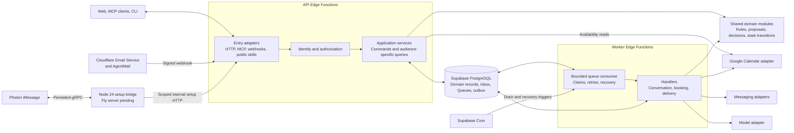

# Find Me a Time — Backend Architecture

Status: API/worker foundation and P1–P4 runtime implemented; live and later-adapter gates remain open\
Date: 2026-10-05\
Basis: [Technical specification](../03_technical_specification.md), [PRD](../02_product_requirements.md), and [interfaces](../user_experience/03_interfaces.md)

This document expands the technical specification into backend boundaries, request processing, persistence, and worker responsibilities. The Hono/Deno API, worker, declarative schemas and CI are implemented and deployed; the [runtime guide](07_request_and_booking_runtime.md) and [implementation plan](04_implementation_plan.md) record evidence and pending live gates. MCP and conversational webhook surfaces below remain later adapter designs. The PRD owns product scope; the technical specification records the backend decision and deferred alternatives. Implementation contracts and tasks belong in bounded OpenSpec changes under the [repository workflow](../../AGENTS.md#documentation-and-specifications).

## 1. Deployment shape

Use a modular TypeScript backend on Supabase Edge Functions, with Deno and Hono. API functions handle interactive requests; worker functions consume durable jobs in bounded batches. They share domain code and Supabase PostgreSQL state. These are execution roles, not always-on processes. PostgreSQL and Supabase Queues preserve work across function termination; Supabase Cron triggers recurring drains and recovery sweeps.

Supabase PostgreSQL, Auth, Edge Functions, Queues, and Cron supply the implemented backend. React/Vite/npm with shadcn preset `b6rtA2Hmi` runs on Vercel, and OpenAI supplies validated extraction/ranking. Cloudflare Email Service is the transactional sender for application and Supabase Auth mail; AgentMail retains managed conversation inboxes and threading. A narrow Node 24 Photon bridge implements private iMessage host setup, with Fly.io selected for its persistent runtime. The CLI is authenticated and the app name reserved; no server is deployed. [Runtime and hosting status](../../apps/photon-bridge/README.md). Host Calendar M1 readiness is verified; remaining Calendar M2 checks, complete MCP client journeys and production messaging integration remain open; the isolated AgentMail received-parent/signature/recovery gate passed. Backend alternatives are deferred as recorded in the [backend decision](../03_technical_specification.md#backend-decision).



The public skill routes do not require host credentials. Protected operations do. The diagram groups entry points for readability; reading a public skill document does not pass through a host authorization grant.

## 2. Module boundaries

| Module | Owns | Boundary |
|---|---|---|
| Identity and grants | Host/account mapping, admission checks, agent grants, guest access, verified channel bindings, and revocation. | Resolves principals from trusted credentials; login and OAuth consent alone cannot confer host admission. |
| Onboarding and profiles | Waitlist, invitations, admission records, setup progress, public handles, calendar selection, settings, and readiness. | Invite issuance requires operator authority; publication requires admission and validated setup. |
| Requests and conversations | Intake, request state/revision, channel mappings, and audience-specific conversation history. | Links channels only after verifying access; separates host-private and shared content. |
| Rules and availability | Versioned policy, normalized times, feasible candidates, and travel checks. | Deterministic filtering precedes AI ranking. Failed data reads never mean free time. |
| Proposals and decisions | Proposal versions, shared-detail and approval digests, agreements, exceptions, and human-confirmation evidence. | Only trusted confirmation paths can produce approval evidence. |
| Booking | Booking identity, attempt history, host reservations, provider event association, and reconciliation. | Sole owner of calendar event creation. |
| Delivery | Outbound messages, recipients, formatting, provider keys, and delivery outcomes. | A delivery job cannot book or change an approved proposal. |
| Infrastructure | Database transactions, job transport, secrets, provider clients, and telemetry. | Implements domain-facing interfaces; does not decide scheduling policy. |

Application services coordinate modules for a use case. A request adapter does not write another module's records directly, and a background handler does not bypass authorization by calling a repository helper. Use the same transition functions for web, MCP, CLI, and messaging inputs.

The [repository structure](02_repo_structure.md) records the current web/API/worker, shared capability modules and contracts, along with planned MCP, webhook and product CLI additions. Keep application operations and their rules together within each capability; extract client-safe contracts only when multiple consumers need them. Provider credentials and privileged persistence stay inside the backend.

The repository structure also owns public skill document placement and route mapping. Preserve the promised `findmeatime.com/SKILL.md` and `/{host}/SKILL.md` entry URLs independently of deployment paths.

## 3. Entry surfaces

| Surface | Processing responsibility (MCP, public skills and conversational webhooks remain planned) |
|---|---|
| `GET /SKILL.md` | Serve versioned onboarding instructions for “Let me use findmeatime.com/SKILL.md for my scheduling”. |
| `GET /{host}/SKILL.md` | Resolve a public host handle and serve requester instructions for “Let me schedule a meeting with findmeatime.com/dodo/SKILL.md”. |
| Application HTTP API | Validate web/CLI inputs, resolve identity, invoke commands/queries, and return structured results. Implemented route and command names are recorded in the [backend contract](../../scripts/backend-contract.md). |
| Remote MCP endpoint | Expose permitted tools and map tool calls to the same application commands. OAuth discovery and consent follow the selected authorization implementation. |
| Calendar and identity callbacks | Validate provider callback context and associate host grants with the initiating account/setup flow, or requester availability grants with the authorized request continuation. Requester calendar consent does not require host admission. |
| Email and iMessage webhooks | Authenticate provider origin, persist deduplicated input, acknowledge durable receipt, and queue processing. |

Public skill content is service-controlled guidance. Host display text is treated as data. No private rules, request history, credentials, or live calendar context appear in these documents. Execution revalidates the stable host ID and status; cached instructions do not authorize an operation. Finalize handle rename/reuse behavior so an old link cannot silently identify a different host.

For onboarding, return a saved setup status and a next action such as join waitlist, redeem invitation, consent required, missing settings, or ready. Check host admission before host calendar setup and hosting operations; requester calendar connection requires no host admission; keep waitlist entry and request-scoped guest operations accessible without host admission. Browser callbacks update this state so the personal agent can resume without repeating questions. Optional messaging setup follows core readiness. Direct web onboarding uses the same services while skipping personal-agent connection and consent.

## 4. Command and query pipeline

Each entry adapter constructs a server-verified principal and a validated command. The principal identifies an authenticated host, a permitted host client, a request-scoped guest, or a narrowly authorized internal job. A worker principal authorizes job execution; it does not convert unverified inbound text into a host decision.

An illustrative command envelope contains:

| Field | Use |
|---|---|
| Operation and input | Validated domain intent, such as revise proposal or express requester agreement. |
| Resource identity | Request/setup identifier; its ownership is checked against the principal. |
| Expected revision | Reject concurrent or stale changes instead of silently overwriting them. |
| Proposal version | Required when acting on particular meeting details. |
| Idempotency key | Stable within actor, operation, and resource scope for retries. |
| Correlation and source reference | Trace the input without storing unnecessary private content in logs. |

Actor identity, effective permissions, and confirmation evidence are derived or verified server-side, not accepted as authoritative fields in this envelope.

The processing sequence is:

1. Apply input limits and schema validation; authenticate and authorize the operation against current ownership, grants, and channel bindings.
2. Check the idempotency record within the same logical mutation. Repeated identical input returns its recorded outcome after current access checks; key reuse with different input is rejected.
3. Load current state and check expected revision, proposal version, and transition prerequisites under transaction-level concurrency control.
4. Commit state changes, decision/audit history, and necessary jobs/outbox records atomically. Return the new revision and the actual completed or pending outcome.
5. Perform slow or external work outside that transaction. Apply recomputable model/availability results only if their relevant state/rule versions still match. Always durably record or reconcile booking and delivery outcomes against their persisted attempts; later rule or state changes cannot erase an external side effect.

Idempotency prevents duplicate processing of the same operation. Revision checks prevent different operations based on stale state. Both are needed. For initial creation, which has no existing revision, use a creation-specific idempotency key; do not invent a revision or merge unrelated submissions by matching names.

Query services return separate host and requester projections. Requester projections contain submitted information, shared proposals, and permitted status. Host-only fields should never be serialized into guest or public responses. Keep error responses equally scoped, including resource-not-found behavior.

## 5. Persistence and concurrency

PostgreSQL owns request state and the mapping from provider identifiers to application records. The [logical data model](../03_technical_specification.md#4-logical-data-model) defines the entities; this section defines how they change together.

| Transaction | Records committed together |
|---|---|
| Redeem host invitation | Validate token, expiry/revocation, verified account binding, and unused status; consume invitation and grant admission with an audit record atomically. Same-account retries return existing admission. |
| Accept intake or verified message | Request/conversation update, revision, audit record, and follow-up work. |
| Revise proposal | New immutable proposal, current-version pointer, invalidation of applicable decisions, and notifications/work items. |
| Record agreement or approval | Version-bound decision, evidence reference where required, revision, and booking work if prerequisites hold. |
| Enter booking | Current prerequisite checks, booking identity/attempt, request state, and reservation or reservation-wait state. |
| Confirm booking | Provider event association, Booked state, audit record, reservation release, and confirmation outbox entries. |
| Revoke access | Grant/channel revocation and invalidation of pending access-dependent work where appropriate. |

Keep one booking identity per request with attempt history. A pre-dispatch feasibility failure can return the request to negotiation. After renewed agreement and approval, a new attempt may bind the revised proposal only when the previous attempt is conclusively non-creating. Once an attempt may have reached Google, do not replace its payload/event identity or accept a new booking attempt until reconciliation resolves it. A confirmed booking is terminal for initial-release scheduling.

Use short row locks or compare-and-update operations to guard revisions, plus uniqueness constraints for proposal versions, deduplication keys, and booking identity. Adopt a consistent lock acquisition order for host reservation and request records. Do not hold a database transaction open across model or provider calls.

Initially serialize booking work per host with a durable reservation. This is an internal coordination record, not a calendar hold visible to requesters. Preserve the reservation while a write is uncertain. Worker leases may expire and transfer recovery ownership, but that cannot free a potentially occupied interval or justify a fresh creation.

Database access should use narrowly privileged server paths. Keep workflow data unexposed by default; exposed data needs explicit grants and ownership-based RLS. Application authorization remains necessary on privileged paths. Guest credentials and provider secrets never become general database credentials. Follow the existing [schema workflow](../../AGENTS.md#supabase-schema-changes) rather than adding a second migration mechanism.

## 6. Conversation and availability processing

Inbound channel processing has two stages. First, the webhook receiver stores the authenticated provider event. Second, a worker resolves verified participant identity, request mapping, and visibility before interpreting its contents. Unknown or ambiguous associations trigger clarification or authenticated continuation without disclosing existing private history.

The conversation handler gives the model only audience-appropriate context and asks for structured intent or missing fields. Deterministic code validates the result, obtains authorized availability, applies rules, and offers feasible candidates. The model can rank candidates but cannot relax hard constraints, waive preferences, generate host consent, or select private recipients.

Attach request revision and rule version to long-running model/availability work. Before saving a result, compare those versions with current state; discard or recompute stale work. Arrival order, email timestamps, and provider thread grouping are not reliable substitutes for proposal versions.

Keep calendar reads behind the availability adapter and creation behind the booking adapter. Optional requester connections supply only authorized availability, remain bound to their protected request, and never grant event creation or host access. Intersect their busy intervals with host feasibility, recheck before booking, and require reconnection or explicit manual/agent availability when a required requester read fails. Keep requester event details and tokens out of host responses and model context. See [requester calendar access](../03_technical_specification.md#optional-requester-google-calendar-access). Free/busy results alone cannot establish adjacent meeting locations for travel checks. The calendar integration must obtain necessary authorized context or request clarification, as described in the [technical specification](../03_technical_specification.md#6-state-availability-and-ai).

## 7. Approval to booking

The approval handler verifies trusted evidence for the current proposal. A client having permission to submit decisions does not let it invent human confirmation. P0–P4 accepts only explicit authenticated web confirmation. Verified channel/client confirmation remains a later design requiring attributable human evidence; clients without that mechanism use authenticated web review.

```mermaid
sequenceDiagram
    participant H as Verified host confirmation
    participant API as Application service
    participant DB as PostgreSQL
    participant W as Booking worker
    participant G as Google Calendar
    H->>API: Approve proposal version
    API->>DB: Transaction: verify evidence, version, agreement; record decision and job
    DB-->>API: Current state and revision
    API-->>H: Approved; booking pending
    W->>DB: Claim work and acquire host reservation
    W->>G: Read current availability
    W->>DB: Recheck versions; persist exact attempt and dispatch state
    Note over W,G: Create only if current checks still pass
    W->>G: Create using persisted event ID and payload
    alt Confirmed creation
        G-->>W: Confirmed event
        W->>DB: Transaction: Booked, release reservation, enqueue notifications
    else Uncertain outcome
        W->>DB: Keep Booking and reservation; schedule reconciliation
        W->>G: Look up persisted event ID
        Note over W,DB: Do not create a replacement while uncertainty remains
    end
```

The sequence shows the main path, not every error response. Revalidation failure returns to revision before dispatch. A definitive non-creating provider rejection records a recoverable failure. A timeout, lost response, or worker crash after dispatch requires reconciliation before another creation. Inspect the persisted event in the persisted destination and verify its association with the attempt before accepting success.

Provider event IDs and local fencing reduce duplicate risk but do not create a distributed transaction. Follow the [booking reconciliation policy](../03_technical_specification.md#7-booking-and-reconciliation); neither a lease timeout nor an immediate not-found result proves that an earlier provider write cannot complete. External calendar changes can still race with the final availability read.

The transition into Booking is the cutoff for reporting that withdrawal prevented creation. Requests to edit or withdraw after a write may have begun report the pending outcome until resolved. Do not auto-delete confirmed events as compensation; post-booking cancellation remains outside scope.

## 8. Jobs, inbox, and outbox

Use Supabase Queues for durable messages and assume handlers can run more than once. Workflow and provider outcomes remain in application records. Commit state changes and enqueue work in one database transaction using a restricted database operation or a transaction-capable connection. Separate REST calls are not atomic. If publication is separate, commit an outbox entry with the state change and publish it idempotently.

An authenticated worker Edge Function reads a bounded batch with a visibility timeout, acquires application ownership, executes a step, and persists its result before deleting or archiving the queue message. A crash before acknowledgement permits redelivery; completed work must be recognized without repeating its side effects. Persist any follow-up or reconciliation job before acknowledging the current message.

A best-effort invocation after commit can reduce latency. Cron also invokes the worker to drain pending work and recover expired ownership, so a lost wake-up cannot strand a committed job. Limit concurrent consumers and use leases/fencing to protect overlapping invocations. Select visibility timeouts and provider deadlines together; lease expiry never proves an external write did not happen.

Keep each invocation within the [Edge runtime limits](../03_technical_specification.md#backend-decision). Stop claiming work before its execution budget expires and persist longer workflows as separate steps. `waitUntil()` and shutdown callbacks are not durability mechanisms. Waiting for human approval is a saved request state, not a sleeping job or open MCP connection. Worker invocation requires internal credentials; public and agent clients cannot directly consume queues or invoke internal booking work.

| Job family | Input references | Completion and recovery |
|---|---|---|
| Process inbound message | Inbox event and verified channel context | Deduplicated conversation/action result; clarification when identity or intent is uncertain. |
| Evaluate request | Request and expected state/rule versions | Persist valid candidates or clarification; discard stale results. |
| Attempt booking | Booking identity and authorized proposal version | Confirm event, record definite failure, or schedule reconciliation. |
| Reconcile booking | Existing attempt, destination, and event ID | Resolve the same write; unresolved work remains visible and blocks conflicting progress. |
| Deliver message | Outbox entry, audience, recipient, and provider key | Record delivered/failed/uncertain outcome independently of booking state. |

Claims carry lease/ownership metadata and attempt counts. Retry transient failures with bounded backoff and jitter; invalid credentials or unverified identity require a recovery action rather than endless retries. Quarantine malformed input with a visible operational reason. A job exhausting retries does not silently close its request or release an uncertain booking reservation.

For notification dispatch, recheck recipient authorization and suppress obsolete pending summaries. Persist provider references and retry identity. An uncertain send must be reconciled under the provider's capabilities and idempotency window; do not assume that retrying always avoids duplicate email. Maintain separate requester and host-private outbox entries even when they refer to the same request.

## 9. Provider boundaries

| Integration | Narrow application-facing responsibility |
|---|---|
| Identity/OAuth | Validate sessions and tokens, bind client grants, and expose revocation checks. No provider login claim supplies meeting approval. |
| Google Calendar | Read authorized host context and optional requester availability under distinct grants; create the frozen attempt only through the host booking calendar, and retrieve its event for reconciliation. |
| Google Routes | Estimate travel between adjacent physical commitments; combine estimates with host buffers and surface missing or unsupported routes without assuming zero travel. |
| Cloudflare Email Service | Send frozen transactional verification, recovery, booking, and Supabase Auth messages from an onboarded domain. Do not automatically replay an application delivery after persisted dispatch. |
| AgentMail | Receive authenticated event notifications, retrieve messages, and send/reply to explicitly validated recipients. Map inbox/thread/message IDs to our records. |
| iMessage transport | Receive and send messages for verified private host conversations; channel identity and proposal confirmation remain application checks. |
| Model | Return validated extraction/ranking results from audience-scoped context. No direct credentials or booking authority. |

Use the provider-specific boundaries from the [email design](../03_technical_specification.md#email-provider-direction): Cloudflare handles transactional sending and Supabase Auth custom SMTP; AgentMail handles managed conversational inboxes and threads. The adapters should not expose provider-specific delivery or thread behavior as a scheduling invariant.

Host email remains a proposed scope extension. The architecture permits a private host conversation, but implementing it still requires aligned requirements and web-based final approval. Dots, Muse, Instinct, ChatGPT, Codex, Claude, and Claude Code connect through the same backend operations; each needs separate discovery, authorization, and confirmation testing.

## 10. Operations and verification

Use separate development, test/preview, and production credentials and destinations. Provider secrets remain in server-side secret storage. Limit public intake, webhook payload size, per-request model usage, and outbound messaging so one conversation cannot consume unlimited capacity. Select concrete limits during pilot planning.

Correlate logs by request, proposal, job, and booking attempt. Track old pending jobs, unresolved writes, blocked reservations, repeated delivery failures, rejected stale decisions, and authorization failures. Logs should contain identifiers and error categories rather than tokens, full private transcripts, or calendar descriptions.

Operational recovery must use audited actions with defined guards: reconnect credentials, retry delivery, resume a definitively failed action, or reconcile an uncertain attempt. Operators cannot mark a meeting approved or booked merely to clear a queue. Backups, retention, and recovery ownership must be decided before the pilot.

Verify this architecture with:

- Domain and contract tests for revision checks, authority, audience separation, and valid transitions.
- Database tests for tenant isolation, uniqueness, concurrent decisions, and competing host reservations.
- Crash tests at each boundary between local commit and provider call, including a successful Calendar write with a lost response.
- Edge termination, queue redelivery, overlapping consumers, lost wake-ups, Cron recovery, and unauthorized worker invocation tests; verify representative batches stay within hosted runtime limits.
- Adapter tests for duplicate/out-of-order webhooks, uncertain sends, recipient changes, revoked access, and provider rate limits.
- End-to-end tests of both pasted skill prompts, browser consent/resumption, every named agent, and cross-channel continuation.
- Admission tests for waitlist deduplication, invalid/expired/revoked/reused and concurrent invitation redemption, operator-only issuance, direct host-setup bypass attempts, and continued account-free requester access.
- Requester calendar tests for browser callback/request binding, denied/revoked consent, disconnection, read failure, changed busy intervals before booking, private-data isolation, and manual/agent availability fallback.

Map these tests to the [PRD acceptance scenarios](../02_product_requirements.md#9-end-to-end-release-acceptance-scenarios). Existing automated tests, migration rebuilds, deployment checks and remaining live gates are recorded in the [implementation plan](04_implementation_plan.md) and [runtime guide](07_request_and_booking_runtime.md). Resolve the relevant [remaining technical decisions](../03_technical_specification.md#11-open-technical-decisions) before extending the affected area.
