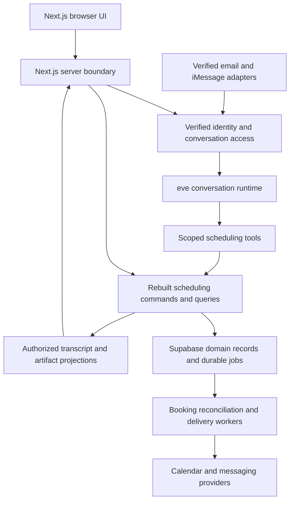

# Frontend architecture

Date: 2026-10-06
Status: runtime, protected browser conversations and bound Calendar consent implemented on 2026-10-07; guided setup and scheduling journeys in progress
Companion: [Page list](../user_experience/04_page_list.md)

## Scope and decisions

Rebuild the web, agent integration, and Supabase scheduling backend source. Retain product requirements and provider/infrastructure choices unless a later decision changes them. Existing API routes, components, DTOs and workers are reference material, not a compatibility boundary. Do not describe this work as a frontend port onto the old backend. The [implementation plan](04_implementation_plan.md) records scope and source preservation.

Use Next.js App Router and TypeScript for the web, React for interactive components, and eve as the proposed conversation runtime. Use shadcn/ui primitives for accessible controls and selected AI Elements components where they fit the scheduling UI. Keep npm as the workspace package manager. Pin a tested dependency set and verify the selected eve template's build integration on Node.js 24 before completing the application structure.

Use the [eve chat template](https://github.com/vercel/eve/tree/main/apps/templates/eve-chat-template) for runtime/client integration, the [personal-agent template](https://github.com/vercel/eve/tree/main/apps/templates/personal-agent-template) for channel-linking concepts, and [Vercel chatbot](https://github.com/vercel/chatbot) for interaction references. Do not copy their authentication, databases or application chrome wholesale. Template selection does not override our permissions or the no-sidebar [workspace contract](../../openspec/specs/chat-workspaces/spec.md).

Configure eve's model on the server through the [direct OpenAI provider](03_provider_setup.md#openai-model-access-through-eve), using the application's OpenAI API credits. Do not inherit a template's Gateway model string as the replacement's provider configuration. The browser receives authorized conversation output, never `OPENAI_API_KEY`.

Supabase remains the selected database and host identity infrastructure. Its existing scheduling API, domain services and worker implementation are in replacement scope. The final placement of rebuilt API/worker code, queue processing and eve persistence must be recorded in backend design after the runtime check; the frontend depends on typed application contracts rather than Supabase table shapes or old Edge Function URLs.

Use **`https://release.findmeatime.com`** as the reconstruction public origin. Generate share links and browser handoffs from server-owned origin configuration; keep browser API requests same-origin. [Provider setup](03_provider_setup.md#reconstruction-deployment-origin) owns domain, Auth and Calendar callback configuration.

## Logical boundaries



This is a responsibility diagram, not a claim that all components run inside Next.js. Test the reference template's separately built eve and Next.js services composed through root `vercel.ts`; do not infer that eve runs inside Next.js or add another worker merely to mirror the diagram. Browser traffic uses same-origin application endpoints. Provider webhooks and credentials remain server-side.

| Layer | Owns | Does not own |
|---|---|---|
| Route/server boundary | Verified initial data, safe redirects, request-scoped credential exchange, application command/stream access | Business approval rules or independent booking logic |
| Feature UI | Conversation rendering, editable local drafts, typed card actions, accessible dialogs and feedback | Calendar writes, provider credentials or trusted identity claims |
| eve integration | Agent session execution, tools, model streaming and runtime continuation | Application session ownership, admission or proof of human approval |
| Rebuilt scheduling backend | Actor/role checks, current revisions, feasibility, decisions, transactional records, effect idempotency and recovery | Layout and browser-local interaction state |
| Channel adapters | Provider verification, deduplicated ingestion, sender/thread bindings and delivery integration | Granting host authority from a display name or quoted message |

## Source organization

The runtime entrypoints, separate build scripts and browser access routes now exist. The tree below remains the target structure; Calendar selection and requester availability recovery are implemented; guided setup and scheduling artifacts remain in progress. The [evidence ledger](05_rebuild_evidence.md) records which parts have executable verification.

Follow the eve chat template's outer layout: root `agent/`, Next.js under `apps/web/`, and a root build/deployment configuration. Root `lib/` holds our shared scheduling code and contracts; these product-specific modules are our addition to the template. Keep the database, documentation and specification directories already present in this repository.

```text
agent/
  agent.ts                    # eve definition
  instructions.md
  tools/                      # thin adapters to authorized application operations
  channels/                   # web and messaging channel integration
  connections/                # supported eve connection definitions when needed
apps/
  web/
    app/                      # thin Next.js routes
      (public)/               # landing, [handle] and public skill entry
      (auth)/                 # sign-in and Auth callback
      (host)/app/              # single host-agent chat
      (guest)/booking/[bookingId]/
      connect/                # personal-agent consent
      connections/            # Calendar callbacks
      api/                    # web endpoints; eve ingress follows runtime routing
    components/
      ui/
      conversation/
      artifacts/              # typed scheduling cards
      onboarding/
    lib/                      # web-specific auth, client and runtime adapters
    public/
    next.config.ts
lib/
  contracts/                  # client-safe inputs, actions and projections
  server/                     # shared server-only application code
    identity/                 # permissions, channel links, session ownership
    onboarding/
    scheduling/               # request lifecycle, availability, proposals, travel
    booking/                  # approval validation, event creation, reconciliation
    delivery/                 # outbound messages and recovery
    providers/                # Google, Photon, AgentMail and Cloudflare
    db/
    jobs/
tests/
  integration/                # domain, runtime and channel boundaries
  e2e/                        # complete browser journeys
supabase/
  config.toml
  schemas/
  migrations/
  tests/
documentations/
openspec/
scripts/
package.json                  # root orchestration for eve and web builds
vercel.ts                     # compose eve and the Next.js web service
```

The reference builds eve and Next.js separately and composes them with `withEve` in root `vercel.ts`. Follow that integration shape and verify it in Phase 1; sharing one repository or Vercel project does not mean eve executes inside the Next.js runtime. Keep npm as our selected package manager rather than copying the template's pnpm commands. Exact SDK APIs, mounts, import aliases and build commands follow the pinned, tested template version.

Route groups organize source without adding URL segments. Route files authenticate, validate and delegate; web-specific UI and interaction code lives in `apps/web/`. Unit tests sit beside their modules, shared integration tests live in root `tests/integration/`, and browser tests in root `tests/e2e/`. Avoid a separate `src/features/` hierarchy until the UI needs it.

Eve tools and web, iMessage, email, MCP and CLI entry adapters invoke the same `lib/server/` operations. Keep scheduling decisions and authorization in ordinary testable application code. Shared modules must work in both the eve and web server builds; keep Next.js request/cookie adapters in `apps/web/lib/` and pass verified actor/context into application operations. Agent instructions and channel handlers do not implement separate booking rules. `lib/contracts/` contains browser-safe schemas only; forbid client imports of `lib/server/`, including indirect barrel exports, and test that boundary in both builds.

Root `lib/` is shared source, not a separately published package. Defer `packages/contracts/` until independent packaging is actually required. Add `apps/worker/` or a new `apps/photon-bridge/` implementation only when runtime/channel tests demonstrate a need beyond the template's existing eve/web services. Directory placeholders do not establish a package or service requirement. Do not wrap or duplicate eve's session engine.

## Rendering and state ownership

Use server rendering for public content, protected entry checks and initial authorized snapshots. Use client components for the composer, streaming transcript, card interactions, menus and dialogs. Server-rendered payloads must already be filtered for the viewer; hiding a field in a React component is not access control.

| State | Authority and frontend handling |
|---|---|
| Signed-in host, admission, channel/client grants | Server-verified identity and domain records; reload/revalidate after grant changes |
| Request, candidate set, proposal revision, decisions and booking | Rebuilt backend; treat as versioned snapshots and refresh after commands or external events |
| Agent history, checkpoints and runtime cursor | eve; reconnect through an authorized adapter and reconcile committed runtime events |
| Visible conversation and action cards | Authorized application projection; keep stable message/artifact IDs and correlate runtime events without a second agent history engine |
| Composer text, open dialog, selected discussion, pending interaction | Local React state; retain unsent text during recoverable failures and clear protected state on account change |

Begin with React state and framework data-loading facilities; add no global state library without a concrete need. Do not persist private transcripts or access tokens in browser local storage. Do not cache authenticated HTML, RSC payloads, API responses or streams in shared caches. Any private application cache is keyed by verified actor, request and discussion scope and cleared on sign-out or revoked access.

## Identity and conversation selection

The host stays at `/app` while setup, request selection, review and settings change in context. Authentication and consent return here and restore the authorized draft or selected request. Persist enough scoped application state to recover selection after reload; never infer access from a selected request ID.

Resolve the actor before reading any history or starting model work. Host web identity comes from Supabase Auth; host iMessage identity comes from a verified binding to that same host. Requester web access comes from a request-specific credential, while email continuation requires validated request/thread routing and sender evidence. A matching name, an email `From` string or a user-supplied host ID is insufficient.

Resolve a conversation from verified actor, application resource and discussion scope. Keep host setup, host-private request discussion and requester-facing discussion distinct. Host access to a shared discussion is deliberate and uses shared-safe context/tools; it must not attach the host's private history or calendar context to a requester session. A phone thread covering several requests requires explicit request selection when ambiguous.

Protect every exposed eve create, read/list, stream, continue, cancel, compact, clear, reset and input/action route. Check ownership and current grants at the server boundary and again on scoped tool execution. Do not expose an unprotected raw eve endpoint around these checks. A channel's trace audience setting is not an application permission check. Eve's [authentication documentation](https://eve.dev/docs/guides/auth-and-route-protection) explicitly assigns session ownership authorization to the application.

The current adapter uses `/api/conversations` for open, snapshot, message and NDJSON stream operations; default eve session/control routes remain denied. Accepted inputs carry a stable client UUID, with one pending input per scope. The database freezes input and the delivery hook binds its canonical runtime session. Checkpointed channel state deduplicates replay. Streams omit raw tool, reasoning and auth metadata, recheck access per event and while idle, and expose an absolute cursor for reconnect. A leased inbox dispatcher supplies automatic wake-up recovery. The browser conversation gateway is connected; scheduling controls remain in progress; see the [evidence ledger](05_rebuild_evidence.md).

Conversation JSON requests have a 35-second browser deadline covering headers and body parsing; stream reads have a 60-second deadline, beyond the gateway's 55-second stream limit. A timeout enters saved-state recovery rather than leaving the composer waiting indefinitely. **Reconnect now** cancels the current read/stream and starts another authorized read from the last fully parsed cursor. It preserves transcript state and the independent message-submission identity. A timed-out message is uncertain: retry retains its original UUID rather than creating a new message. Navigation or authority loss still aborts the whole conversation lifetime and clears private state.

Browser access currently uses `/api/browser/*` Route Handlers. Google-only Supabase PKCE authentication returns to `/auth/callback`; session/refresh and verifier cookies are HttpOnly, SameSite=Lax and Secure on HTTPS, with the `__Host-` prefix for production Auth cookies. Only Route Handlers create the server Auth client and write refreshed cookies. `getSession` supplies the raw token; original-token verification and current `auth.sessions` checks establish authority. Browser JavaScript receives neither access nor refresh tokens. This server-only cookie strategy differs from the browser-client pattern in the [Supabase SSR guide](https://supabase.com/docs/guides/auth/server-side/advanced-guide).

Private requester fragments are removed immediately and exchanged for a request-specific HttpOnly cookie after server validation. Each read checks current request authority; cookie expiry cannot extend the database grant. All browser mutations require the configured same origin and bounded JSON; private responses use `private, no-store` and vary on cookies. The service-only browser RPC derives host identity/email from current Auth records and exposes narrow admission and request-state projections. It cannot approve proposals or return model history. The conversation gateway forwards verified credentials to allowlisted application runtime routes. Calendar start/callback/status/disconnect now bind consent to the initiating browser and original current principal; exact host/request returns restore the authorized workspace. Host/requester calendar choices and bounded credential refresh are implemented. Requester free/busy checks use request-bound credentials and refresh the displayed recovery state after a successful retry. Explicit manual windows and timezone replace Calendar dependence; full host event analysis, feasibility and booking remain pending.

## Guided guest intake

Guests receive guided, suggestion-first intake without mandatory account creation. Reuse details already supplied by the guest or their authorized agent. Offer **Continue with Google** as an optional identity shortcut alongside **Continue without Google**. Validated Google identity may prefill name and verified email; manual entry uses a compact name/email card. Let the guest edit the display name and review the invitation recipient in the proposal. An alternate or manually entered address requires contact verification before trusted private recovery or attendee use; typing an address or matching an existing address never grants request access.

Use the browser's IANA timezone as an initial display suggestion when available, show it beside times with an editable selector, and do not interrupt with a separate confirmation question. An explicit guest choice takes precedence and survives reload or Google return. Ask only when timezone is missing, conflicting or date/travel context is ambiguous; do not infer it from name, language or email. Render date-specific offsets for daylight-saving time. Changing the display timezone preserves proposed instants; changing intended local availability requires re-evaluation and a new proposal where applicable.

Offer **Connect Google Calendar** when finding mutual times, with a clear availability-only explanation and **Skip for now**. Google identity verification and Calendar permission are separate transactions; neither grants requester agreement, host admission or host approval. Guests can sign in without Calendar access or use request-bound Calendar consent without a mandatory product account. Both flows resume the same protected request or bound intake draft. Web/email/manual availability and requester-agent delegation remain available.

Identity callbacks must bind the initiating browser to the intake draft/request and preserve its continuation authority. Verify provider identity server-side; a client-supplied email or Google login alone cannot attach existing requests. Sensitive verification and OAuth inputs bypass chat/model history. The identity provider adapter and callback placement must be settled in the owning Google change before implementation, without coupling guest access to host admission.

## Booking route and invitation entry

Use `/booking/[bookingId]` for requester continuation from creation through the final receipt; public `/{handle}` intake transitions into that route after the server accepts creation. The route parameter maps to the application request, independently of the internal booking operation or provider event ID. Host review loads the selected request inside `/app`. Authorization is unchanged by the user-facing route name.

Confirmation email and calendar descriptions use **View booking** to reach this destination. Private email continuation may exchange its short-lived fragment secret through the approved server boundary and immediately remove it from the URL. Shared calendar descriptions contain no transcript-access credential. Never infer authority from a booking ID, email query parameter or an action flag in a URL; visiting a link performs no mutation.

Render the receipt from the confirmed event projection: meeting title/purpose, date and start/end time with a named timezone, organizer/participants, and location or validated join URL. Display **Join meeting** only when a valid online meeting URL exists. Delivery errors remain separate from booking status. Closed-request reads remain limited to the current contract's minimal status/receipt while access is valid; do not reload a full conversation after closure. No in-product reschedule/cancel controls are part of this release. See the [invitation design](../user_experience/03_interfaces.md#booking-confirmation-email-and-calendar-invitation).

## Commands, artifacts and human decisions

The frontend consumes a rebuilt discriminated artifact contract: artifact kind, stable ID, resource ID, current revision, display-safe payload, freshness and permitted action descriptors. Schemas validate incoming data before rendering. Unknown or invalid kinds produce a recoverable unsupported-content state, never executable HTML or a guessed action.

Each action descriptor maps to a known application command; do not execute arbitrary URLs or code produced by the model. The server issues the artifact identity and derives actor/permissions from the authenticated request. A command supplies the resource, expected revision and an idempotency key stable across retries of that same user action. Reject stale/unauthorized actions even if a forged client displays the button.

Proposed contract families are queries for setup, inbox, request and connection snapshots; commands for draft application, calendar/rule selection, candidate selection, agreement, approval, decline, withdrawal and grant management; and events for committed messages, updated artifacts, decision status and delivery outcomes. These are semantic contracts, not promises to preserve old endpoint names. Define schemas and explicit conflict/expired-access/retryable-error responses before connecting real feature screens.

Model-extracted edits remain drafts until the relevant explicit apply action. The requester adapter now stores partial extracted patches in a private review ledger. `propose_request_details` cannot edit saved details; `/api/browser/request-review/read`, `/apply` and `/dismiss` derive current guest authority from the HttpOnly request cookie. The chat card shows current and normalized proposed values, blocks unresolved clarifications and stale application, and retries the same decision after a lost response. Applying the exact review uses domain revision checks and invalidates prior proposal decisions; dismissing preserves saved details. Failed Calendar dependence remains until an explicit availability recovery action. Closed or rotated credentials cannot retrieve drafts or replay decisions. Web agreement and approval buttons submit application commands independently of model text or generic eve tool approval. Approval refers to the displayed current proposal, including its shared meeting details and host-only exceptions. Backend revalidation still decides whether booking can begin. Optimistically show sending/pending feedback, never successful agreement, approval, connection or booking before server confirmation.

## Streaming and cross-channel updates

1. Load an authorized application snapshot and its conversation mapping.
2. Submit a message with a stable client message ID; the server persists/accepts it under the verified actor before dispatch. Distinguish local sending from accepted processing.
3. Render provisional model output through the eve adapter; reconcile committed message IDs and typed artifact updates with authoritative domain state.
4. On disconnect, resume using the permitted cursor or reload the authorized snapshot. Never replay historical transcript text as new user instructions.
5. Refresh affected projections after web actions and email/iMessage activity. The update transport must be access-controlled and support snapshot recovery after missed events; its exact choice is a runtime-spike decision.

Define submission deduplication at the application boundary; runtime checkpoints do not replace provider inbox/outbox or business idempotency. On an ambiguous command timeout, query operation status before resubmitting with the same key. Distinguish stopping model generation from withdrawing a request and from cancelling an external calendar event. If the runtime is unavailable, retain structured settings, current decisions and truthful status.

## Host setup conversation

Use `/app` for both setup and ongoing host-agent chat. Keep one authorized private setup context with durable eve transcript/runtime state and versioned application drafts/review artifacts. Reload and consent return restore server state. Model interpretation changes a draft only; unsupported rules, ambiguous input or model failures leave saved policy unchanged and expose clarification or structured controls.

The **Confirm and save proposed settings** action applies only to the current review. Any later conversation turn or saved-rule revision invalidates that review, including a turn arriving through linked iMessage. Calendar choices use actual authorized IDs; duplicate names and insufficient write permissions require explicit protected controls. Reconnecting requires reconfirming selections. Readiness requires admission, confirmed rules, an active Google grant, selected conflict calendars and a writable booking destination before shareable links appear.

Sensitive credentials, linking proofs and URL fragments stay out of transcripts/model input. Website setup remains usable during a Photon outage. An iMessage setup decision must establish human intent for the exact current review; an ambiguous “yes” requires clarification or authenticated web review. An iMessage-first browser continuation is short-lived and conveys no host authority by itself. Unlinking blocks further private processing/dispatch; unknown delivery outcomes are not blindly resent.

See the [host journey](../user_experience/01_user_journeys.md#j-01--host-setup), [provider consent configuration](03_provider_setup.md#google-calendar-consent-configuration) and [pending linking change](../../openspec/changes/conversational-host-setup/proposal.md).

### Agent-led guidance and suggestion-first preferences

The conversation leads the full onboarding flow, including admission/sign-in, invitation, Google consent, calendar selection, preference review, inline iMessage verification and completion. Render one server-authorized next action at a time; before admission, show only generic guidance and protected entry controls. Explain browser handoffs, resume automatically from verified results and offer contextual retry on failure. A checklist may show progress but must not leave the host to discover the next step.

For each preference, show a proposed value and brief rationale before asking the host to supply one. Use explicit choices and confirmed settings first, authorized context second, then labeled starter defaults; do not overwrite a known choice with an inference. Offer **Use this**, **Adjust** and **Choose my own**. Cover timezone, calendar roles, meeting windows, duration, buffers, meeting mode and supported location preferences. Always include the explicit mode/location preference step described below unless the host has already answered it; suggestions help answer the question but cannot replace that answer. Never invent an address. Numeric starter defaults remain configurable product policy, not inferred facts.

Clearly distinguish “you chose,” “suggested from your calendar,” and “starter suggestion.” Corrections take priority in the draft. Ask one focused question when no safe useful suggestion resolves a required field, and never repeatedly offer a dismissed suggestion without new evidence or user request. **Use this** stages a value; final current-review confirmation saves settings. Identity, consent, phone verification and meeting approval always require their own explicit actions. Model failure leaves all structured controls and saved choices available.

### Guided calendar onboarding

Make setup feel like a composed conversation: a centered transcript, generous spacing, clear typography, restrained calendar colors and one primary next action per step. Keep progress compact, collapse completed cards to readable summaries, and retain **Change** controls. Avoid a wall of setup forms. Use actual server state for transitions and scan progress; preserve the composer, keyboard focus and reduced-motion behavior.

| Step | Conversation artifact and actions |
|---|---|
| Connect | A concise benefit and access explanation with **Connect Google Calendar**. On return, show verified connection status and resume the same draft. |
| Choose calendars | Calendar cards show name/account, color, access level and **Recommended** with a short reason. Separate calendars to check for conflicts from the calendar where bookings will be created; only writable calendars qualify for the latter. Make duplicate names distinguishable. **Analyze selected calendars** confirms the scan selection after showing its bounded date range; **Set up manually** bypasses inference. |
| Understand the schedule | Show genuine reading/analyzing status, selected calendars, date range and timezone. Surface partial coverage and errors with **Retry** or manual entry. Do not fabricate percentages, insights or success while reads are pending. |
| Suggest meeting windows | A compact weekly preview plus equivalent text/keyboard controls shows proposed windows, duration and buffers. Give an evidence-based reason and uncertainty, such as a recurring free interval in the analyzed period. **Use these times**, **Adjust**, or **Choose my own** changes the draft, not saved policy. Free time does not establish willingness to meet; ask about preferences and hard constraints. |
| Ask location preference | Ask **Online, in person, or either?** with selectable choices. For in-person/either, ask **Where do you prefer to meet?** with editable evidence-based areas/venues, **Enter a place** and **Decide per meeting**. Label suggestions and require an explicit answer before final settings confirmation; reuse an existing answer. Online-only skips physical venue entry. Never infer home/work labels or publish an observed address. |
| Ask transportation | After location preference, ask **How do you usually get to meetings?** with supported mode choices and **Depends on the trip**. Ask for an editable extra travel buffer separately from journey duration. Suggestions require an explicit answer; reuse existing answers and skip for online-only hosts. Clearly explain unsupported routes; never silently substitute a mode. |
| Confirm | One current review groups conflict calendars, writable booking destination, timezone, meeting windows, duration, meeting/travel buffers, confirmed location choices and transportation policy. **Confirm and save proposed settings** applies validated settings; publish share links only when readiness passes. Earlier **Use** actions do not save policy or approve meetings. |
| Connect iMessage | After settings confirmation, an unlinked host sees **Connect iMessage** and **Maybe later** in chat. Inline phone and code fields lead to a verified connected summary; preserve retry, expiry and change-number actions in the same card. Already-linked hosts see their current status. |

Recommendations are private, optional drafts. Retain provenance, scope and freshness in structured data so the UI can explain them without placing raw calendar events in chat. A selection, permission, scan or draft revision change invalidates dependent suggestions/reviews; offer refresh without silently replacing confirmed rules. See the [pending behavioral contract](../../openspec/changes/conversational-host-setup/specs/conversational-host-setup/spec.md#requirement-calendar-informed-setup-suggestions).

### Weekly preference preview

Calendar suggestions, their review, the saved draft summary and the manual schedule editor share a Monday-to-Sunday preview. Each day has exact time ranges and a static 24-hour bar; days without a chosen window are labeled explicitly. The timezone and recurring-preference description remain visible. This view does not report live Calendar availability or promise that a meeting can be booked.

Editing days or times updates only the local preview until the existing draft action is submitted. Empty, reversed or otherwise unfinished ranges are omitted with readable guidance. The suggestion review preserves already chosen windows and their timezone. Cancelling discards local edits; using suggestions updates only the private draft and final confirmation remains separate. The preview adds no keyboard stops or animation and uses text equivalents for every graphical range. While a schedule editor is open, its preview replaces the duplicate summary view.

## Connection flows

**Google Calendar:** an in-chat action requests a server-bound consent transaction, opens the browser flow and returns to the original draft/request. The server verifies OAuth state and the actor binding, exchanges credentials, then the UI refreshes connection status and calendar choices. Requester consent never creates a host account. Tokens remain server-side; disconnect/revocation invalidates dependent availability instead of implying free time.

**iMessage:** perform linking in inline action cards within the `/app` conversation. Offer **Connect iMessage** and **Maybe later**; Connect expands a labeled phone-number field and **Send code** in the transcript. The same card advances to a six-digit input and **Confirm and link**, then to a server-verified connected summary. Do not require a settings dialog or separate linking page. The host reads the code in iMessage and submits it from the initiating browser through this protected input, not the ordinary chat composer. Phone/code submissions go directly to typed linking endpoints; never append the code to messages, model context, analytics or persisted card state. Clear the code after submission; reload restores challenge status, not the code. Show only masked recipient, delivery status and expiry. The new backend owns rate limits, challenge expiry, single use and binding/revocation. Direct iMessage approval needs explicit human intent and exact current-proposal evidence; a text “yes” or framework approval widget is insufficient by itself.

**Personal agents:** grant/deny application access through the validated OAuth consent flow and inspect/revoke clients in settings. Keep it distinct from Google authorization and booking approval. OAuth-server placement, client compatibility and CLI login are backend/access design decisions; an in-chat connection button is not evidence of a completed integration.

## Accessible presentation and failures

Use `/app` as the single host-agent chat page for admission, setup, request review and settings. Vary its server-authorized state, audience label, cards and available actions without host subpage navigation. Request selection uses contextual cards or a picker; exact settings use labeled in-page dialogs. Reuse the conversation shell for requester pages. Keep structured controls reachable even when chat fails. Host private/shared switching changes the requested server projection and clears the previous scope's visible state; it does not merely hide messages with CSS.

The MVP targets iPhone/iMessage hosts. Prioritize actual iPhone Safari-to-iMessage handoffs and desktop web, recording tested browser/OS versions; Android-specific UX and device testing are deferred. Preserve responsive public requester access without a device-based block. Recommend **Connect iMessage** while keeping **Maybe later** and full web continuation available.

Target WCAG 2.2 AA, keyboard-complete flows, 200% zoom and 320/390/768/1440px layouts. Test visible focus, accessible names, safe-area/virtual-keyboard behavior, restrained live regions, reduced motion and focus restoration. Present user-facing recovery messages without raw provider errors, tool traces, framework names or hidden reasoning. Show public/shared explanations without private calendar details.

## Delivery and verification

Build one end-to-end slice first: authorized requester message, host-private review, current-proposal action, reconnect and reconstructed state after restart. Verify two hosts and two requesters cannot cross-read sessions or artifacts. Measure the runtime's integration cost before committing every feature to eve; replacing it with AI SDK requires an explicit architecture update, not a silent second engine.

Then implement the [page inventory](../user_experience/04_page_list.md) in feature slices against the rebuilt contracts. Deterministic test fixtures may exercise failures; production features require real connected providers. Preserve behavioral assertions from existing tests where relevant, but rewrite tests coupled to removed components/endpoints.

Required evidence: types/lint/build; command/schema and access tests; browser setup/intake/review/settings flows, including host flows remaining at `/app` and restoring authorized context after reload/consent; stale and duplicate actions; private-link exchange and CSRF/redirect checks; two-user cache isolation; stream interruption/restart; email/iMessage event replay and revocation; uncertain booking and delivery; booking-link entry and closed-receipt access; agreement between email, calendar and receipt details; mobile/keyboard review. Run real controlled Calendar, AgentMail and linked iMessage journeys separately from fixture tests. Test new SQL through the repository's declarative schema/generated-migration workflow on an identified disposable local database.

Use correlation IDs and timings for request, conversation, message, command and delivery diagnostics. Exclude credentials, private message bodies and calendar details from default logs. Set retention/deletion policy and model-turn limits before real-user use. Record fresh verification; old deployment evidence does not prove the replacement works.

## Remaining design decisions

Backend design must finalize new schema/command interfaces, API/worker placement, durable effect processing, provider ingestion/delivery, requester credential recovery, OAuth consent hosting and client support. The runtime check must settle eve persistence/deployment, event-to-projection reconciliation, live update transport and dependency versions. These do not reopen the confirmed full-source rebuild boundary. Host email, native apps, general inbox management and automated post-booking changes remain outside this frontend design unless product scope changes.

## Implemented draft and review controls

The `/app` setup card calls protected `GET /api/browser/setup/read` and POST `/draft`, `/rebase`, `/confirm`, `/progress`. Current server state supplies confirmed settings, the private draft, unresolved questions and the review. Profile, schedule, mode, location and travel editors stay inside the chat and capture their starting revision. An uncertain save retries its frozen input/key; explicit reload discards the pending local action and reads authoritative state. Consent denial and page reload preserve server drafts.

Online-only omits physical preferences; in-person/either requires explicit location policy, transportation (including per trip) and extra travel buffer. Starter schedule defaults are labeled and editable. Applicable values cannot become explicit answers through assistant inference. A ready review has one primary confirmation action. Stale rules/calendar choices show a refresh action that preserves draft answers and requires review again. The selected preset and inline iMessage linking controls are implemented; settings confirmation alone does not advertise a working booking link. After confirmation, the card calls protected `GET /api/browser/setup/readiness`. Only a successful current Calendar permission check reveals the booking URL and agent-instruction link. Pending checks hide previous links; provider failures and invalid calendars show an explicit retry. Refocusing the window rechecks access, and changes to the setup snapshot remount the check. These reads never change settings or approve a booking.

## Implemented Calendar suggestion cards

An optional in-chat card discloses scan scope and limits before reading selected calendars. Calendar role descriptions suggest the primary calendar as a starting point without silently selecting it; read-only calendars remain valid analysis sources but cannot become booking destinations. Scan results display dates/timezone, a weekly text preview, explained gaps or labeled defaults, evidence limitations and private quoted place candidates. Use/dismiss/reload/manual controls preserve explicit preferences; using a schedule changes only a draft. Observations do not answer mode/location or transportation questions. Results poll private server state every 30 seconds and never poll Google automatically.

The deterministic browser journey covers failure/reload/retry/application and narrow-screen action containment. Complete cross-channel pacing, linked iMessage conversation and live AC-28 remain unfinished.

## Implemented focused setup guidance

The browser and authorized model setup read share a pure `setupGuide` projection over current server state, including current scan status. Ready Calendar evidence takes precedence over starter suggestions. It selects connection, calendar choices, optional analysis, profile, schedule, explicit mode/location, transportation, extra travel buffer, first remaining clarification, review or confirmed status. Completed choices remain editable. Transportation and extra buffer are separate guided steps; online skips both. Browser actions remain usable when natural-language extraction fails.

Schedule suggestions preserve existing draft values and label defaults for missing fields. Use changes only the draft; Adjust opens the exact-value editor; Choose my own persists dismissal and leaves missing numeric/time fields blank on reload. Mode suggestions also require an explicit choice and can be dismissed. Analysis skip and dismissal choices are host-owned, revision-checked, idempotent progress mutations. Choosing analysis records the choice independently of expiring scan summaries. Clarification controls resolve only the first question rather than clearing all outstanding questions. Neither progress nor suggestion use saves settings, grants provider access or books an event.

## Reviewed Calendar preferences and provenance

**Review and edit suggestions** opens focused schedule → mode → location → review cards inside the same chat. Explicit existing answers are reused. The host can adjust weekly days/times, skip schedule application, choose online/in-person/either without preselection, select and rename private observed places, enter other places or decide per meeting. Online skips places. One current scan/revision-bound action applies the reviewed choices together; individual use actions still do not save policy. Invalid or stale results retain the ordinary manual editors.

An expandable source explanation in the setup review distinguishes values the host entered, assistant suggestions, accepted Calendar suggestions, edited Calendar suggestions and starter defaults. Calendar origins retain only scan identity and disclosed date/timezone scope, independent of short-lived raw summary retention. Source and explicit-answer provenance are separate: a human can explicitly choose a suggestion without disguising its origin. Unrelated edits retain origin, while changed manual values no longer claim Calendar evidence. Guided default actions identify the actual starter fields; the server validates the allowed fields and fixed values. Browser timezone remains an editable, explicitly chosen hint. Dismissed guesses cannot be restored by a model draft mutation; the host can re-offer suggestions through protected controls.

### Review extracted chat answers

Supported mode/location/transport/buffer values extracted into the current draft appear in one focused **Review your draft answers** card. The host chooses applicable displayed answers with initially unchecked controls or edits the extracted values; they do not need to re-enter preferences already described in chat. An unchosen suggested mode blocks accepting dependent physical answers. Online-only, dismissed modes and stale drafts omit inapplicable choices. Accepting a subset leaves the remaining questions unresolved.

Selection uses the existing revision/idempotency-protected draft action and preserves derivation separately from host provenance. It does not save settings. Final confirmation remains a separate exact-review action. Reload or a new draft revision resets unsubmitted checkbox state, and accepted answers are reused on resume. A lost response retries the same selection intent. This browser review also works without a model connection after extraction has been persisted; actual linked iMessage equivalence remains pending.

The admitted-host shell uses a compact heading and spacing, leaving more room for the installed message scroller and composer. Standard Radix/shadcn `Collapsible` controls expose saved Calendar choices, connection management, preference details and completed scan evidence without adding a new scrolling system. Disclosure buttons have explicit 44px targets because the composed trigger owns its data slot.

`CalendarChoices` collapses only when its authorized catalog still contains every saved conflict calendar and a writable saved destination. Missing/invalid selections open the form; failed reads show recovery without a success summary. Cancelling restores the saved catalog selection. A successful save refreshes `HostSetup` through the parent conversation component, so the authoritative next question appears without a manual reload; disconnect also refreshes setup. The final preference review is forced open before confirmation, regardless of the earlier disclosure choice. Only disclosure state is local; no new browser storage or domain mutation is introduced.

`HostSetup` remembers the opening control in memory, focuses each editor legend on mount, returns to that control on cancel (with the setup heading as fallback), and focuses the saved-draft status after success. Failed edits remain open. `CalendarConnection` focuses the result only for a browser return after its authorized status read; denied or forged-success returns retain recovery wording, and failed reads focus the error. No focus target or draft value is added to browser storage or the consent URL.

Focusing Calendar or setup controls pauses automatic conversation following. Replayed user messages do not create forced scroll anchors that can pull a focused control off screen. Sending a new message or choosing **Jump to latest message** explicitly resumes following; ordinary transcript scrolling continues through the installed scroller's public API.

### Inline iMessage connection card

After current settings confirmation, the chat renders `IMessageLink` with optional connection or persisted skip. Phone/code forms call only protected browser endpoints. They never append input to the composer, model messages, setup turns or browser storage. The code clears on submit and is absent after reload; uncertain retry retains only its attempt ID and a transient digest that requires re-entering the same value. A wrong code returns focus to an invalid, empty input. Start retries retain the original recipient/request identity until a verified response or explicit status refresh.

Masked challenge/link state refreshes every ten seconds while visible and on window focus. Mutation generations reject stale background responses. Expiry, attempt limits, wrong-browser guidance, delivery failure, cooldown, change-number, skip and confirmed unlink remain inline. Provider acceptance is distinct from delivery, and disabled configuration keeps web continuation available. These controls use the selected olive/green/Inter shadcn preset; the six code slots have a 44px height. Actual iPhone handoffs and live linked conversation remain separate acceptance gates.

The preset’s light-mode muted foreground is darkened to OKLCH lightness 0.54 so small helper text reaches at least 4.5:1 against both white and muted surfaces. The latest-message control occupies its own chat footer, with a 44px target, so it cannot obscure inline actions. The message-scroller primitive continues to own scroll state and inactive-control behavior.


### Incoming private iMessage links

`/app#imessage=<id>.<token>` strips its fragment immediately and exchanges it after establishing a separate HttpOnly browser proof. A bounded HttpOnly continuation cookie survives sign-in and invitation redemption. Before admission, only the masked original number and next sign-in action appear. Once admitted, an inline **Send verification code** action is available before settings confirmation. It sends a fresh OTP to the immutable originating conversation, capped by the original fifteen-minute entry deadline. Browser, Auth session, receiver, expiry and revocation are rechecked server-side. Codes stay outside chat/model/storage; token possession cannot grant host access. Skip/cancel/link completion clears the continuation cookie. A lost exchange can retry by reopening the original private link in the same browser; a transferred link cannot rebind to another browser.

## Requester candidate and proposal controls

The protected requester conversation now renders server-authorized meeting options and the current immutable proposal. Each candidate uses the saved request timezone with date-specific UTC offsets, duration, mode and location from the same revision-bound projection. Choosing a time and agreeing are separate explicit actions. Re-selection or a fresh publication clears prior agreement; an agreed proposal remains visibly awaiting host approval and does not claim a booking.

The card refreshes after conversation/detail changes, on browser focus, while visible and at offer expiry. Changed context removes selection controls and disables agreement. Missing details, no-match, clarification, reconnect and failed reads have distinct recovery text without private host diagnostics. Alternatives and requested changes populate the existing composer for user review; they do not send a message automatically. Lost decision responses retain the exact action identity and require a status lookup before retry; reload reads authoritative state. Private host exception controls are described below; withdrawal and booking revalidation remain unfinished parts of the plan. Host request selection is described below.

## Host request selection and conversation audience

Admitted hosts can open **Meeting requests** within `/app`, search by requester/purpose, filter active/closed/all and page through thirty summaries at a time. The service-only query returns an allowlist of request identity, short title, requester name, status, revision, timestamps and proposal version; it does not load every request's transcript, contact details or private evaluation context. A `(host_id, created_at, id)` index supports stable newest-first cursor pagination. Current host admission and the live Auth session are checked for every list and selected-request read, independently of Calendar readiness.

Selection stores only a request ID and audience in `/app?request=…&audience=…`. Reload and browser history reauthorize the target before rendering. Request IDs and cursors grant no access. Every newly selected request defaults to **Private host review**; an explicit **Shared with requester** control switches to the separate shared conversation. Switching requests/audiences remounts the conversation, clearing local drafts and the previous transcript. No request summaries or messages are saved in browser storage. Closed requests show their current status without scheduling controls; booking in progress retains its authoritative status.

Active requests reuse the same shared-safe current proposal and candidate controls as the requester, with host credentials and no requester-agreement control. The selection does not record host approval. The selected summary refreshes on focus, while visible and after scheduling decisions. Private exception controls are described below. Full approval/withdrawal/booking lifecycle remains unfinished.

## Private travel and preference review

Only the selected request's **Private host review** audience mounts the private scheduling card. **Check private constraints** runs the shared deterministic evaluator without model ranking or candidate publication. The card displays a bounded sample, host timezone and date-specific UTC offsets, separate buffers, travel clarification and applicable private preferences. Current check identity, request/rule context, evidence manifest and expiry govern every read. Stale results lose decision controls; reload restores saved inputs from authorized server state.

For each unresolved travel leg, the host explicitly chooses a mode, positive journey duration, endpoint/time and private reason. Known future boundaries and locations are fixed; unknown or past starting context requires new explicit input. The form separates journey minutes from both buffers. Preference confirmation explicitly classifies the item as a preference; free-form items require a satisfied/exception choice, while configured mode/location mismatches require an exception. Hard conflicts cannot be waived.

Confirmation and revocation use the existing host-only, current-revision APIs and automatically recheck the exact time. They clear prior proposal decisions and grant no agreement or booking authority. Saved decisions remain revocable even when their original context is stale; only fresh evaluation establishes applicability. Lost responses retain frozen command identity and read current state before retry. A recovery read is protected from background polling; an advanced revision loads saved state without claiming which actor caused it. Neither shared conversation nor requester views contain private rules, endpoints, reasons or confirmation controls. Provider event identifiers and internal context fingerprints are removed from the browser projection.

### Request closure controls

A request-specific status card sits outside the conversation on the guest booking page and the selected host request in `/app`. Withdrawal/decline first opens a separate explicit confirmation; cancelling this confirmation keeps the request open. The command freezes request revision and decision identity, and a status read owns recovery after a lost response. A changed revision requires renewed review, closure removes conversation controls immediately, and booking-pending status disables negotiation/closure without claiming that an event was cancelled. Visible-tab polling and focus refresh keep minimal status current independently of chat and Calendar availability. Closed guests can reload only their allowed status/receipt.

## Requester contact verification controls

The protected requester conversation includes a **Verify your contact email** card beside saved request details. `GET /api/browser/contact-verification/state` and `POST /api/browser/contact-verification/start` or `/confirm` require the current request-scoped HttpOnly cookie; host login and receipt-only tokens cannot substitute. Mutations enforce same-origin CSRF and strict input shapes, and responses are private/no-store. Codes never enter chat, model tools, URLs or browser storage.

The card shows the current address, queued/sending/accepted/failed/uncertain/suppressed delivery, bounded guesses, expiry and resend cooldown. Accepted email submission does not imply contact proof. A failed mutation first reads authoritative status and keeps its exact input/UUID in memory for an explicit same-action retry. Reload recovers current status without sending a new email; an explicit new code invalidates earlier codes. Contact edits and authority loss clear obsolete input/proof, and successful verification refreshes scheduling state while leaving requester agreement and host approval separate. Polling while visible and focus refresh recover worker outcomes. Keyboard controls, 320px reflow and 200% CSS zoom are tested; actual iPhone acceptance remains separate.

## Optional requester Google identity

Public intake offers **Continue with Google** and **Continue without Google** alongside editable name/email fields. The current contact, purpose, duration and explicit timezone are saved before redirect and restored on return. Name and email are prefilled from verified identity; the requester can change them before creating the request. An alternate address or a third-party Google address without current Google contact authority still requires an email code. A failed identity-state read leaves manual intake available.

Existing private requests offer the same optional identity choice within contact verification. A callback displays the selected account without changing request details or granting proof automatically; **Use verified Google email** explicitly verifies the matching current recipient. Other recipients must first be reviewed in request details. An uncertain proof response retains the exact revision/email for retry. Google identity remains separate from Calendar permissions, account creation and meeting decisions.

The shared Google callback recognizes the dedicated identity state marker and binding cookie. It returns only to the original authorized intake/request; unusable callbacks show a safe landing-page message when no target can be verified. Return parameters are removed from the displayed URL. Browser tests cover denial, replay, wrong-browser access, account switching, third-party/alternate email, saved draft/timezone, lost proof responses, keyboard focus and 320px/200% CSS reflow. Actual Google account consent and iPhone acceptance remain separate.

### Requester display timezone preference

The intake timezone and meeting-review display selector remember an explicit IANA choice for the current browser tab across reloads and Google returns. Only the timezone is stored under `fmat-display-timezone-v1` in session storage; identities, contact details, request IDs and credentials are excluded. Browser detection supplies the initial choice when none exists. A cleared or invalid choice requires correction instead of silently selecting another zone. Storage restrictions leave the current interaction usable and explain that the preference cannot survive reloads.

Candidate and proposal displays compute offsets separately for each instant, including DST transitions. Changing the display selector makes no scheduling mutation and preserves candidates, proposal versions and decisions. The proposal's original meeting timezone remains visible. Editing manual availability still changes the meaning of wall-clock inputs and requires explicit confirmation through the existing revision-checked operation.

## Requester email-linking controls

`RequesterEmailCard` appears only in an authorized requester conversation. `GET /api/browser/requester-email/state` and `POST /api/browser/requester-email/start` or `/revoke` resolve the current request-scoped HttpOnly credential. All inputs are strict, mutations use the existing same-origin CSRF boundary, and responses are private/no-store. Host sessions and receipt-only tokens cannot substitute for requester access.

The card polls on visible intervals and browser focus, refreshes when request details change, and discards pending text on read failure or access loss. Start retries preserve the revision/idempotency key; revoke retries preserve the exact link ID. Revocation hides the proof immediately, including uncertain outcomes. A failed response triggers an authoritative state read before a retry is offered. Expired secrets are hidden locally at their deadline as well as by the server. Linking text is a read-only selectable field, never a URL, chat message, localStorage or sessionStorage value. Email unavailability preserves the web conversation.

### Requester recovery controls

A booking page without private access offers **Lost your private link?** and a labeled verified-contact email field. Issuance always uses generic feedback: it neither confirms eligibility nor promises delivery. A failed response retains the submitted email and logical request UUID for an explicit retry; a successful response permits a deliberate later request, subject to server limits.

Recovery email links use a fragment removed immediately after hydration. Proof stays in memory and is never rendered, placed in browser storage or sent to model context. Opening the link presents **Restore request access** and **Cancel**; only the explicit restore action redeems it. A lost response retries the same proof and stable replacement credential. Success installs a request-specific HttpOnly cookie, clears proof, refreshes private state and restores heading focus. Old request credentials no longer work; other request cookies remain unchanged. Invalid/expired proof returns to the generic recovery form. Reload before redemption requires reopening the email link, while reload after successful redemption uses the new cookie.

The browser endpoints are `POST /api/browser/recovery/start` and `/redeem`. Both require the configured same origin, strict bounded inputs and private/no-store responses. Start returns only `{status:"accepted"}`; redeem returns request ID, `recovered` status and expiry, never the replacement token. This is account-free request recovery; host authentication remains Google-only.

### Personal-agent consent and revocation

`/connect/authorize?authorizationId=<uuid>` displays the unverified client name as plain text, exact requested permissions, registered return address and current host/request identity. Grant and deny are separate explicit controls. Host sign-in uses Google and returns only to the original browser-bound attempt. Requester consent uses a current private request cookie and offers a request picker when several authorized requests are present; it requires no host login. A missing private context explains how to reopen the meeting link and reload. Decision permissions never stand in for meeting approval.

Reload reads the recorded consent outcome. After a lost grant/deny response, the same choice recovers the original callback; it never creates another code or grant. A code that has expired requires a new agent connection. An expired/wrong-browser attempt gives a recoverable error. Long client names, callback addresses and identity labels wrap at mobile widths; semantic grant/deny controls remain keyboard accessible.

`/connect/authorize` without an attempt manages host permissions; `?requestId=<uuid>` manages one request using its current cookie. Host/request workspaces link to this page. Lists expose only client name, permissions, expiry and disabled status, support bounded pagination, and offer explicit revocation with a safe retry on an uncertain response. Revocation does not depend on the original consent cookie. Public protocol activation and named-client acceptance remain separate release gates.


### Account-free intake agent consent

The existing `/connect/authorize` screen now renders the locally implemented intake consent flow. It displays the fixed public host and requested client permissions, explains the one-request/fifteen-minute creation limit, and offers grant/deny without host login or meeting-details inputs. The same-origin browser adapter accepts no existing-request hint for this flow and chooses the intake consent RPC from server-read authorization state. Browser JavaScript receives public target metadata and callback navigation only, never the binding hash, reserved request UUID or future request proof. Lost consent responses can be retried; an existing grant can be revoked from the same browser. The verified 320px and 200% renders remain readable. Request creation, protected request handoff and full MCP entry acceptance remain pending under the [intake change](../../openspec/changes/enable-agent-request-intake/tasks.md).
