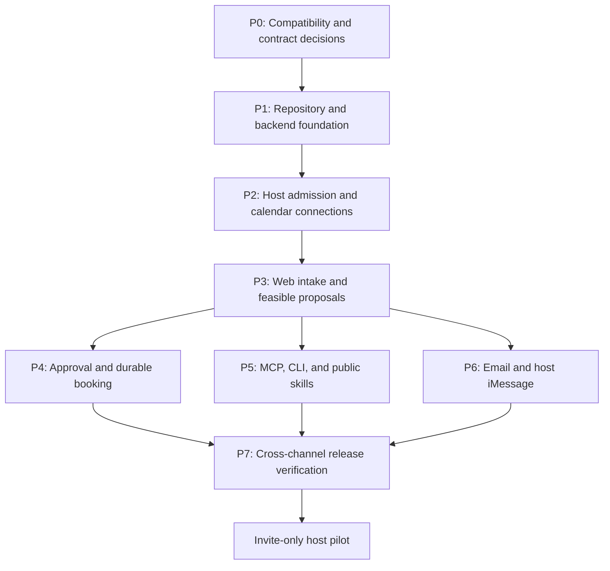

# Find Me a Time — Implementation Plan

Status: P0 investigation recorded; P1–P4 deployed; live Calendar gates open\
Date: 2026-10-05\
Basis: [PRD](../02_product_requirements.md), [technical specification](../03_technical_specification.md), [backend architecture](01_backend_architecture.md), [repository structure](02_repo_structure.md), and [provider setup](03_provider_setup.md).

Build a working web scheduling flow first, then connect personal agents, email, and iMessage to the same operations. Investigate integration risks at the start so the web milestone does not hide a release blocker. Intermediate milestones are development checkpoints; the initial release still includes all required channels and named agent clients.

This document owns sequencing and completion evidence. Each substantial capability needs a bounded OpenSpec change with observable scenarios, design decisions, implementation tasks, and tests. The proposed change names below are planning labels, not existing proposals or approved specifications. Archive only completed, verified changes into main capability specs.

## 1. Starting point and scope

The repository now includes React/Vite with shadcn preset `b6rtA2Hmi`, a Hono/Deno API, provider boundaries, private command/schema infrastructure, durable jobs, and executable checks. Capability implementation is tracked below and in the owning OpenSpec changes.

### Execution evidence (2026-10-05)

| Phase | Current status | Evidence / remaining gate |
|---|---|---|
| P0 | Investigation recorded; live integration gates open | [Compatibility report](05_compatibility_report.md) records provider/travel probes, defaults, isolated OAuth code/refresh/revoke and client-bound audience prototype results, plus actual Codex diagnostic-tool success and revoked-grant denial. A separate actual Codex natural-expiry refresh probe passed; requested-resource enforcement remains open. The distinct product-controlled AgentMail pair passed received-parent replies, inbox-local threading, same-key recovery, changed-payload 409, and six signed sent/delivered/received callbacks; P0 task 2.4 is complete. Production OAuth, complete named-client journeys, Photon conversation and Calendar gates remain open. |
| P1 | Verified and deployed | `npm run check`: typecheck, lint, 24 Deno tests, production web build pass. Generated pg-delta foundation plus runtime initializer reset locally; 29 pgTAP tests pass. Actual local Edge worker drained a persisted job (`claimed: 1, completed: 1`); clean `npm ci` passes. GitHub Actions run 37239080874 passes both application and database jobs. Production HTTPS and API health return 200; authenticated worker and recurring Cron are installed. |
| P2 | Deployed; M1 verified; Calendar lifecycle gates open | Full P1/P2 migration chain resets locally and 66 pgTAP checks pass; scoped onboarding tests and GitHub Actions run 37239720301 pass. Real invitation redemption, browser Google consent, protected credentials, authorized calendar listing, selected calendars and a ready public profile passed on October 5: [M1 evidence](../../scripts/p0/host-setup-live-results-2026-10-05.json). Refresh, disconnect/reconnect and requester consent remain unverified. |
| P3 | Verified locally and deployed | Reviewed pg-delta migration rebuilds P1–P3 with 189 pgTAP checks passing. The full application check passes typecheck, lint, 85 Deno tests (including 18 P4 adapter tests), and web build. Real local RPC integration covers account-free creation, feasible candidate ranking/selection, current-version agreement, private exceptions/redaction, stale evaluation rejection and withdrawal, with injected providers. All 24 browser checks pass; production build dpl_F6BT1GRE1JwppQnpPz5LzLVoCT3P serves findmeatime.com, API health 200 and worker 200. |
| P4 | Verified locally and deployed; live Calendar M2 open | Full migration reset and 291 SQL checks (102 booking) pass; 101 Deno tests, typecheck/lint/build and actual local RPC booking runtime pass. Fault injection verifies one stable event identity through lost response, immediate not-found, reconciliation, credential/lease fencing, and notification failure. Exhausted prepared-job recovery is reviewed and verified. Frozen commit `86296d1` deployed API/worker and web (`dpl_6ahRhaReQPAegQXCtrm2kmjK4FyS`); production health/access checks and recurring persisted-job completion pass. GitHub Actions run 37242545049 passes application, full reset/291 SQL checks, and both real local RPC runners. The October 6, 14:00–14:30 KST controlled request passed actual host Calendar feasibility and has a current proposal. Verification delivery was accepted by the email provider; requester possession, agreement, explicit host approval and the Calendar write remain pending: [live evidence](../../scripts/p0/calendar-live-results-2026-10-05.json). |

| Prepared | Evidence and remaining work |
|---|---|
| Supabase project and local credentials | Project reference is configured; application access, migrations, Auth flows, and deployed functions still need verification. |
| Google Cloud, Calendar OAuth credentials, and Routes key | Calendar and Routes APIs enabled. OAuth client credentials passed a negative-control check; registered callbacks were re-read. The controlled Seoul itinerary tested both adjacent directions through the actual evaluator: TRANSIT passed ample gaps and failed tight gaps with buffers; DRIVE/WALK stayed unresolved. Calendar consent, refresh and reads/writes remain untested. See the compatibility report for captured evidence. |
| OpenAI API key | Present locally; choose and test the model and structured-result contract. |
| Cloudflare Email Service, AgentMail and Photon | Cloudflare's `findmeatime.com` DNS is ready, scoped SMTP login returned 235 without sending, and Supabase Auth SMTP readback matches the intended configuration. A controlled requester verification message was accepted by Cloudflare and its durable delivery job completed; recipient verification and actual Supabase Auth delivery remain unverified. See the provider setup and compatibility records for controlled AgentMail and Photon evidence. |
| Development tools | Supabase CLI 2.119.0, OpenSpec CLI 1.14.0, provider CLIs, and shared skills. Confirm local Docker/runtime readiness during foundation work. |

Carry these boundaries through every phase: only hosting a calendar is invite-only; requesters can request meetings and optionally connect Google Calendar without an invitation or product account. Google consent, MCP OAuth, requester agreement, and explicit host approval are separate permissions. Calendar writes use the host's selected booking calendar.

The latest product direction includes map-based travel-time calculation. The PRD and technical specification are aligned in this change: estimate both adjacent trips and add host buffers. Missing estimates require clarification or a confirmed manual allowance. Native apps, group scheduling, automated post-booking changes, and agent-generated host approval remain excluded. Host email is a proposed extension and needs its own scope decision before implementation.

## 2. Dependencies and milestones

P5 and P6 can implement adapters after shared contracts stabilize in P3. Their end-to-end booking checks depend on P4. Provider experiments in P0 should use disposable fixtures; avoid building independent scheduling logic for each channel.

| Milestone | Demonstrable result |
|---|---|
| M1 — Connected host, after P2 | An invited host completes web setup; an uninvited account cannot publish a booking link. |
| M2 — Web booking, after P4 | An account-free requester and invited host complete one approved meeting, including recovery from a lost Calendar response. |
| M3 — All required interfaces, after P5/P6 | Agents, email, and iMessage operate on the same request and proposal versions. |
| M4 — Pilot, after P7 | Acceptance evidence, operator recovery, and provider configurations satisfy the release gates. |

## 3. Implementation phases

### P0 — Resolve integration risks and contracts

Proposed change: `validate-provider-and-agent-compatibility`. This phase precedes production implementation of the affected adapters.

- Verify Supabase OAuth with a minimal remote MCP tool in the actual client versions: discovery, registration, redirect handling, token audience, refresh, revocation, and application-owned grants. Start with a browser-oriented client and a terminal client, then record results for all seven required clients.
- Determine how each host client obtains attributable confirmation of a specific proposal. Use authenticated web confirmation when the client cannot supply reliable human confirmation; a model-supplied `approved` field is insufficient.
- Exercise Photon authentication and a controlled test conversation. Validate its documented Node-compatible gRPC transport against the chosen runtime. Record direct Photon versus Mastra and the transport/deployment decision; if Edge execution cannot support it, design a narrow Node/Bun messaging bridge while retaining Supabase as the scheduling backend.
- Complete controlled Cloudflare transactional and Supabase Auth delivery tests against the configured sending domain and custom SMTP settings. Validate AgentMail webhook verification, reply threading, and uncertain-send handling using dedicated test identities. Keep Cloudflare transactional mail separate from AgentMail conversation inboxes; decide inbox allocation and contact verification before binding conversations to requests.
- Test Google consent and token refresh, Calendar read/write permissions, and Routes coverage for the intended geography and travel modes. Keep host event scopes separate from requester free/busy scopes. Select callback URLs before editing the OAuth client configuration.
- Choose the web framework/hosting, package manager, MCP library, model, and compatible package versions. Specify guest token recovery, invitation expiry, request expiry, online meeting-link behavior, and supported language coverage in the owning changes.

**Exit evidence:** a recorded decision and reproducible check for each risk. An unsupported required client or transport remains an explicit blocker with a proposed resolution, not an implicit scope reduction. Independent foundation work can continue while an adapter-specific blocker is investigated.

### P1 — Establish the repository and backend foundation

Proposed change: `establish-application-foundation`. Depends on P0's runtime and web choices.

- Create the first real files under `apps/web`, `supabase/functions`, and shared modules following the repository structure. Introduce `packages/contracts` when a second consumer needs it; keep secrets and server-only entities outside client contracts.
- Implement environment validation, provider adapters with test doubles, scoped logs, and stable error/command envelopes. Define idempotency and expected-revision semantics before client mutations.
- Create initial desired SQL under `supabase/schemas/`, with explicit privileges, constraints, and RLS where data is exposed. Add later capability tables with their owning phases rather than guessing the entire schema now.
- Add local checks and CI for formatting/lint, typechecking, meaningful unit/database tests, and web builds. Establish separate preview/test provider identities and default external sends off.
- Verify a bounded worker and durable queue publication in a transaction, internal invocation authorization, and Cron recovery. Use jobs for persisted work; never rely on an open request or `waitUntil()` for durability.

**Exit evidence:** a fresh checkout starts locally, builds, and passes foundation CI. Generate migrations with `supabase db schema declarative sync --name <name> --no-apply`, review the SQL, and rebuild only the disposable local database with `supabase db reset --local`. No remote migration is implied by a local reset.

### P2 — Implement host admission and calendar connections

Proposed changes: `implement-host-admission`, `connect-google-calendars`. Depends on P1.

- Implement public waitlist intake, operator-controlled invitation issuance, verified recipient binding, atomic redemption, and resumable host onboarding. Enforce admission in shared operations so direct API access cannot bypass web restrictions.
- Add host sign-in, calendar selection, booking-destination permissions, confirmed rules, timezone, handle assignment, and connection recovery. Publish a host only after admission and minimum setup are complete.
- Implement Google callbacks with validated state and browser/session binding, refresh-token encryption, refresh/revocation handling, disconnect, and bounded token retention. Keep encryption key management separate from stored token rows.
- Add request-scoped requester consent without requiring a host account. Complete its intake-to-consent-to-resume journey in P3. Denied or revoked consent offers explicit manual/agent availability or reconnection.

**Exit evidence:** M1 works through web. Tests reject expired/reused invitations, concurrent redemption by different accounts, cross-host access, callback swapping, and requester grants used for host writes. Credential failures never appear as an empty calendar. Coverage: FR-01–FR-04, FR-35–FR-36; AC-09–AC-10, AC-26–AC-27.

### P3 — Build web intake, feasibility, and proposal negotiation

Proposed changes: `implement-request-lifecycle`, `evaluate-calendar-and-travel-feasibility`. Depends on P2.

- Add public host discovery, account-free intake, protected continuation, contact verification, and the phone-friendly host inbox. Implement the PRD lifecycle with immutable proposals, audience-specific views, revision checks, and closed-state guards.
- Collect and normalize purpose, participants, date window, timezone, duration, mode, and location. Intersect host constraints with manually supplied, agent-supplied, or connected requester availability.
- Implement deterministic interval checks, focus rules, and travel estimates for previous commitment → candidate → next commitment. Account for travel mode, departure context, estimate freshness, and host margins. Define when a new estimate invalidates feasibility; never turn a missing route into zero travel.
- Add structured AI extraction and ranking only around valid domain operations. Recheck state/rule versions before saving asynchronous results. Keep private event locations, notes, and host reasoning out of requester output and model contexts that do not need them.
- Support no-match clarification, private preference exceptions, requester agreement, host revisions, decline, and withdrawal. Confirmation controls identify the exact proposal version.

**Exit evidence:** a requester can reach a complete agreed proposal and host review without an account. No Calendar write is enabled yet. Tests cover DST, adjacent travel in both directions, missing routes, private-data isolation, prompt injection, stale asynchronous results, revision invalidation, and interrupted requester consent. Coverage: FR-05–FR-17, FR-19, FR-36; AC-01–AC-04, AC-10–AC-13, AC-27.

### P4 — Add explicit approval and recoverable booking

Proposed change: `book-approved-proposals-reliably`. Depends on P3 and P1's durable job infrastructure.

- Persist attributable host approval separately from requester agreement. Both must refer to current details; host revisions invalidate the appropriate decisions.
- Implement one durable booking identity per request, immutable dispatch payloads, provider-valid stable event IDs, per-host reservations, worker leases, and transactional state/job/outbox updates.
- Re-read required calendars, rules, and travel feasibility before dispatch; reject conflicts or changed prerequisites. Create the event only in the host booking calendar, with the selected invitation/meeting-link policy.
- Reconcile uncertain writes before retrying. A lease timeout does not release a possibly occupied reservation. Confirm Booked only from verified provider evidence, then deliver notifications independently.
- Add audited operator actions for reconnecting, reconciling, and retrying definitive failures. Do not offer a manual switch that bypasses approval or marks an uncertain write successful.

**Exit evidence:** M2 passes with a dedicated Calendar test account. Fault injection covers success with a lost response, process termination around each external boundary, duplicate queue delivery, competing requests, stale approval, changed requester availability, withdrawal races, missed wake-ups, and notification failure. A confirmed booking remains booked when delivery fails. Coverage: FR-17–FR-23; AC-04, AC-06–AC-10, AC-13.

### P5 — Add agent onboarding, remote MCP, and CLI

Proposed changes: `expose-authorized-agent-operations`, `publish-scheduling-skills`. Contract work starts after P3; booking verification requires P4.

- Expose stateless Streamable HTTP MCP and a thin CLI over shared operations. Implement the P0 OAuth design, application grants, consent/revocation controls, CLI credential storage, structured output, and stable errors.
- Keep guest submission and continuation request-scoped. Never distribute host credentials, Google tokens, or Supabase privileged keys to personal agents.
- Publish `/SKILL.md` and `/{host}/SKILL.md` from service-controlled templates and allowlisted public host fields. Preserve waitlist/invitation checks and resumable browser consent; reading Markdown does not grant authorization.
- Test both exact pasted prompts from the PRD. Resolve supported connection steps per client; report unsupported steps honestly and preserve the same request through web continuations.

**Exit evidence:** requester and host cases pass separately in Dots, Muse, Instinct, ChatGPT, Codex, Claude, and Claude Code. Record versions and confirmation mechanisms. Test expired/revoked/wrong-audience grants, direct privilege bypass, stale decisions, unknown/unavailable hosts, and interrupted setup. Coverage: FR-18, FR-24–FR-25, FR-29–FR-35; AC-14–AC-15, AC-19–AC-26.

### P6 — Add requester email and host iMessage

Proposed changes: `integrate-requester-email`, `integrate-host-imessage`. Depends on P0's transport decisions and P3's contracts; booking verification requires P4.

- Deploy signature-verifying receivers and durably save deduplicated inbound events before acknowledging them. Resolve actor, request, and audience before model interpretation. Provider thread IDs and sender display names are not authorization.
- Use Cloudflare Email Service for transactional verification, recovery, and booking messages, and configure Supabase Auth to use its authenticated SMTP endpoint. Freeze the Cloudflare account, From address, recipient, and body before application dispatch; after persisted dispatch, an uncertain Cloudflare result remains visible and is not replayed automatically. Keep historical AgentMail pending sends on their existing bounded 23-hour retry policy.
- Implement AgentMail conversational intake/replies, verified web continuation, recipient selection, and conversation delivery records. Provider recovery never retries booking.
- Implement host iMessage opt-in, identity verification, private conversations, unlinking, proposal-specific summaries, clarification, revision, approval, and decline. Ambiguous replies and unreliable confirmation paths use authenticated web review.
- Register actual AgentMail receiver URLs and webhook secrets after deployment. Recheck the configured Cloudflare sending-domain records without disturbing unrelated DNS and mail routing, then capture controlled transactional/Auth delivery evidence. Use the development pod and controlled messaging identities for conversation tests.

**Exit evidence:** M3 passes across web ↔ email, web ↔ iMessage, and agent ↔ web/email. Test spoofed senders, forwarded messages, groups, replay/out-of-order delivery, obsolete summaries, unlinking, and concurrent decisions. Private host conversations cannot leak into requester threads. Coverage: FR-08, FR-26–FR-28; AC-05–AC-06, AC-11, AC-14, AC-16–AC-18.

### P7 — Verify the complete release and prepare the pilot

Proposed change: `verify-invite-only-pilot`. Depends on P4–P6.

- Execute AC-01–AC-27 and every required client journey on the intended deployment. Attach reproducible evidence and failures to the owning changes; mocks alone do not establish live-provider compatibility.
- Verify mobile layouts, keyboard operation, labeled controls, consent recovery, readable pending/error states, and post-booking scope messaging. Exercise non-admitted hosts and account-free requesters throughout.
- Rehearse queue recovery, blocked reservation handling, token revocation, backups/restoration, and release rollback without destructive schema rollback. Confirm webhook replay protection and secret/log redaction in deployed configuration.
- Set pilot limits and operator ownership for job age, provider latency/errors, unresolved writes, delivery failure, abuse, and cost. Finalize retention/deletion and provider data handling. Collect booking conversion and coordination baselines without claiming unmeasured targets.
- Identify the intended Supabase environment before reviewing remote migrations with `supabase db push --dry-run`; deploy through the reviewed release process. Keep Cloudflare DNS authoritative and verify the chosen web host's actual records and HTTPS routes.

**Exit evidence:** all acceptance scenarios pass, each required client has evidence, and no unresolved authority, duplication, or privacy failures remain in the release suite. Operator recovery is demonstrated. Production OAuth configuration/verification and messaging-domain requirements are satisfied where applicable. Passing tests is not a guarantee that external Calendar races cannot occur.

## 4. Team ownership and change discipline

Suggested responsibilities for the four-person team; assign people before implementation. Ownership is by module and contract, not by independent channel state machines.

| Responsibility | Primary scope | Coordination point |
|---|---|---|
| Web and onboarding | Responsive UI, admission/setup views, consent continuation, accessibility | Shared identity and operation contracts |
| Scheduling and persistence | Desired SQL/migrations, proposals, constraints, approval, booking/jobs/recovery | Booking guards and transactional boundaries |
| Calendar and messaging | Google Calendar/Routes, email, iMessage, provider fixtures | Scoped credentials and normalized adapter outcomes |
| Agent interfaces and release evidence | MCP OAuth, CLI, public skills, client compatibility, CI/E2E coordination | Audience-safe contracts and confirmation evidence |

Review each bounded OpenSpec change before implementing its behavior. Use short-lived branches and reviewed PRs; include the relevant AC IDs, actual test commands/results, migration review, and remaining gaps. Tests are owned by each capability author, with another teammate reviewing sensitive authorization and booking paths. Sync completed behavior into main specs when archiving the change.

The first implementation change should resolve P0's compatibility questions and capture the foundation decisions. Do not start with a general-purpose agent loop, all channel adapters at once, or a production Calendar write path before approval and recovery guards exist.

## Conversational website rollout (2026-10-05)

Host setup now uses a durable website chat and exact settings review; requester chat exposes explicit
review/apply, availability evaluation, candidate selection and current-proposal agreement. Both use
the requested official AI Elements components and preserve shadcn preset `b6rtA2Hmi`. Account,
invitation, Calendar and meeting-decision guards remain in the shared command boundary.

The full local check passes 147 Deno tests, 11 Node tests, typecheck, lint and build. Complete local
reset passes 394 SQL assertions; a separate two-session check verifies private-turn serialization and
unlink/dispatch fencing. The local Auth/RPC/HTTP runner passes website→private iMessage→website
resumption with fixture model/Google transports. Browser fixtures pass setup 14 areas/9 mutations,
requester 10 areas/24 mutations, existing 25 areas/17 mutations and workspace 9 areas, including 320px widths.
The bridge passes 23 tests without external messages. The approximately 324 kB eager website bundle
defers its 654 kB chat runtime; the lazy chunk-size warning remains. [Sanitized evidence](../../scripts/p0/conversation-results-2026-10-05.json).

Requester conversation is archived into the meeting-requests contract. Host setup remains an open
change: Fly CLI `0.4.111` is authenticated and `fmat-photon-bridge` is reserved in the `personal`
organization. Strict configuration validation and the local Linux/amd64 Node 24 container checks
pass, but no Fly Machines are deployed. Recurring spend, billing readiness, deployment/restart
verification and real linked-host onboarding are pending. See the [preparation evidence](../../scripts/p0/fly-bridge-preparation-2026-10-05.json)
and [runtime/pricing guide](../../apps/photon-bridge/README.md#flyio-cli-setup-app-reserved-server-not-deployed). This bounded setup bridge does not implement
full P6 iMessage scheduling, and these fixtures do not close the remaining P0 live client or Calendar
M2 gates.

The reviewed release `d6d1a62` is deployed on `https://findmeatime.com`; production migration
`20261005062543_setup_conversations.sql`, API/worker deployment and worker schedule installation
succeeded. HTTPS and API health checks pass. The actual signed-in host workspace shows the new
conversation and preserves 5/5 readiness. Its iMessage section shows the unavailable-service fallback,
and the disabled internal bridge route returns 503. No persistent bridge server or live Calendar
event was created by this rollout.
