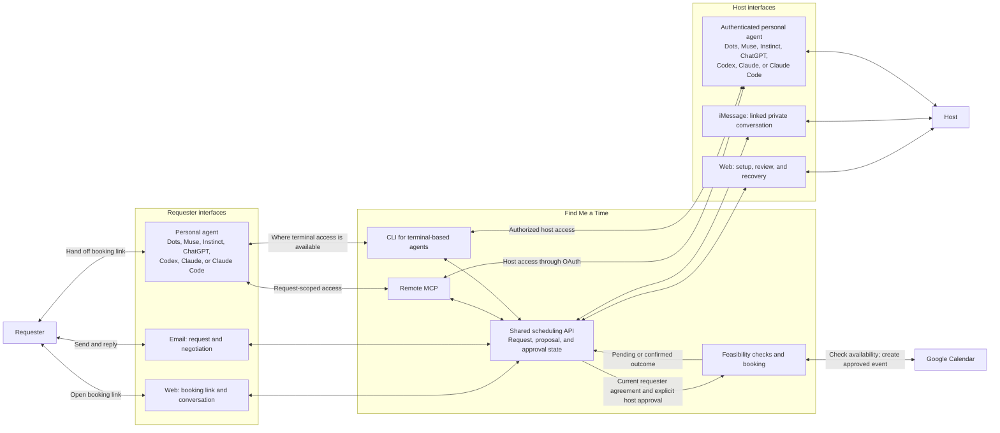
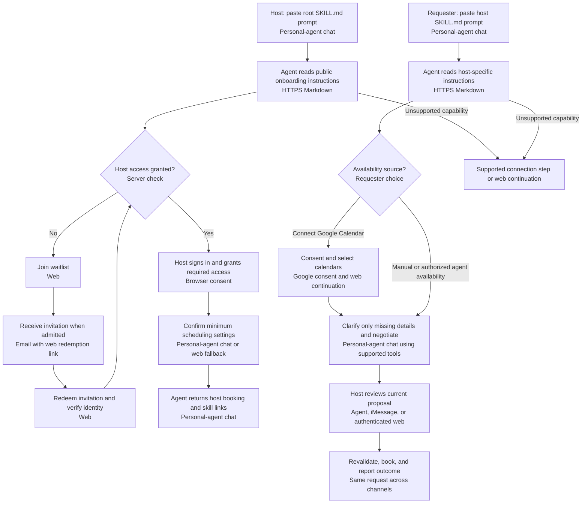
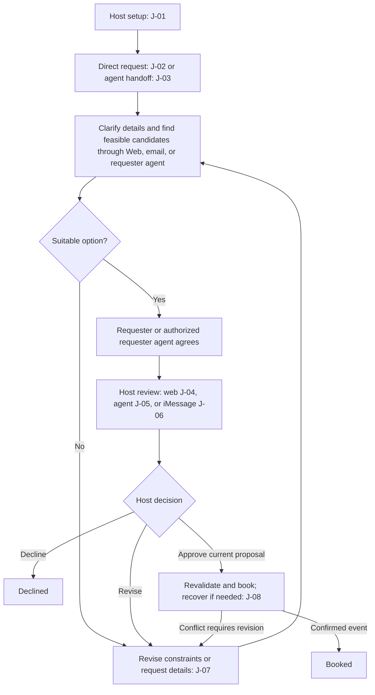
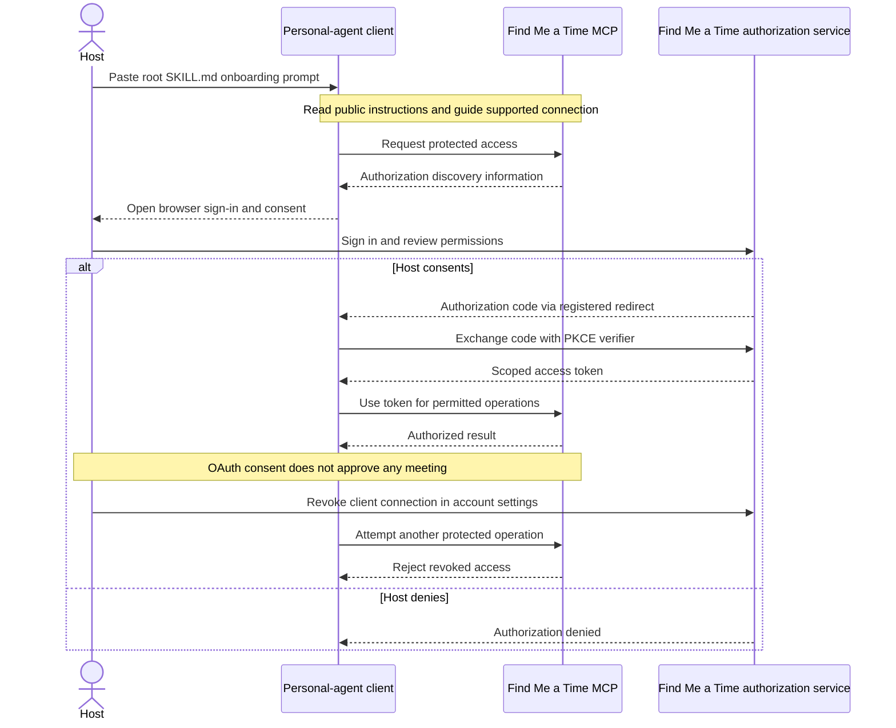

# Find Me a Time — User Journeys

Status: Draft for team review\
Date: 2026-10-06\
Basis: [Product requirements](../02_product_requirements.md)

A journey describes a person's goal and experience across channels; a flow describes the steps and decisions within it. This document combines both to explain the proposed experience. [User stories](02_user_stories.md) express the corresponding needs. Requirement and acceptance IDs refer to the PRD; these journeys do not introduce separate behavioral contracts or claim that features are implemented. The [implementation plan](../technical_specification/04_implementation_plan.md) replaces the full application source, including the scheduling backend, while preserving these journeys as required behavior.

## Interfaces used in the journey

The booking link works for people and supported requester agents. Hosts can start by pasting the root skill prompt into their personal agent. Host access is invite-only: users without access join the waitlist; invited hosts redeem access through web before calendar setup. Hosts sign in with Google in the browser; email login is outside the MVP. Admitted hosts use separate provider consent when needed, then choose where to review requests. Direct web setup remains available. Here, **Web** includes mobile and desktop browsers; a separate native app is outside the initial release.

The arrows show communication, not equal permissions: requester interfaces cannot grant host approval or read host-only information. iMessage is a host channel in this release. Email is shown as a requester negotiation channel; it is not a host approval surface in these journeys. The MVP targets iPhone/iMessage hosts and recommends iMessage for everyday scheduling. Agent connections and iMessage linking remain opt-in; hosts can start onboarding in either channel and use web throughout. Private iMessage entry leads through verified browser handoffs before accessing host state. Android-specific flows are deferred; requester links remain account-free without device-based blocking. Photon Spectrum remains the selected iMessage transport direction; the bridge and its application identity mapping must be rebuilt and verified against the new contracts.

Remote MCP is the primary agent interface; the CLI serves clients with terminal access. Both use the shared scheduling API. Host MCP access uses OAuth, while requester access stays account-free and request-scoped. The diagram shows intended paths, not verified support for either interface in every named client. OAuth connection and revocation are covered in J-09.

## Copy-and-paste entry flow

Host: `Let me use findmeatime.com/SKILL.md for my scheduling`\
Requester: `Let me schedule a meeting with findmeatime.com/dodo/SKILL.md`

These are intended product entry points, not claims that the URLs or integrations are deployed.

Requester agreement and explicit current-proposal host approval remain prerequisites for booking. See J-01 for setup, J-03 for requester delegation, and J-09 for access consent.

## Main decision flow

The host prepares their availability and rules once. A requester then coordinates directly or through an agent, and the host reviews the resulting proposal through web, a personal agent, or iMessage. Every route uses the same request state.

This shows the main path. Withdrawal, expiry, and unresolved failures are covered in J-08. An offered time is not a reservation, and requester agreement alone never authorizes booking.

## J-01 — Host setup

**Goal:** Delegate coordination while keeping control over availability and final decisions.\
**Entry:** The host pastes `Let me use findmeatime.com/SKILL.md for my scheduling` into their personal agent, or starts directly on web.

The steps below describe the agent path. Direct web onboarding performs the same account, calendar, and settings checks in web, skips personal-agent connection and authorization, and displays the shareable links there.

1. The agent reads the root skill document and checks host access and its available connection capabilities. If access is missing, it offers web waitlist entry without requiring calendar consent. The flow waits for admission; it does not claim setup succeeded. Proposed delivery is an email invitation with browser redemption. A valid invitation admits the verified account and resumes setup; unusable invitations show a recovery step. Direct web follows the same admission check. The agent guides any required client setup without asking the host to discover endpoints or commands.
2. The host completes browser sign-in and agent authorization through J-09, plus the separate Google Calendar consent. Existing connections are reused when valid.
3. The agent shows **Connect Google Calendar**, then resumes with cards for actual authorized calendars. It recommends calendars to check and a writable booking destination with short reasons; the host can change them. **Analyze selected calendars** explains which calendars and date range will be read. After the scan, the agent proposes recurring meeting windows in a weekly preview and online/in-person location preferences, explaining the observed patterns and uncertainty. The agent explicitly asks whether the host prefers online, in-person or either; for in-person/either it asks for preferred areas/venues or an explicit **Decide per meeting** choice. For hosts accepting in-person meetings, it then asks how they usually travel and how much extra travel buffer they want, offering supported modes or **Depends on the trip** plus an editable buffer suggestion. The final review includes these choices; online-only skips transportation setup. Calendar suggestions accompany these questions and do not count as answers. Reuse an already stated preference, and skip physical-location entry for online-only hosts. The host can use, edit or dismiss other suggestions and supply missing timezone, duration or buffers. **Set up manually** remains available; sparse history, missing locations or failed reads produce a question rather than invented preferences. Calendar selection and final settings require explicit confirmation before use.
4. After the host confirms settings and the service verifies setup, the agent returns the host's booking link and `findmeatime.com/{host}/SKILL.md` link.
5. For an unlinked host, the assistant recommends **Connect iMessage** with **Maybe later** available. A host who began in iMessage resumes the verified linked conversation after required browser steps. Linking is optional and does not block basic setup; everyday proposal review can then continue in iMessage.
6. An interrupted flow resumes from saved progress. Unsupported client capabilities lead to a supported setup step or web continuation; consent denial does not create a successful connection.

**Outcome:** A user awaiting an invitation has a waitlist confirmation, with no active booking link. An admitted host who completes setup is ready to receive requests with minimal information repeated across agent and browser. Re-running onboarding reuses the existing host account. Failed calendar access is a recovery state, not unrestricted availability.

The agent leads the entire journey with a useful next action and a suggested answer where possible. It reuses known choices, proposes calendar-informed preferences or labeled starter defaults, and asks one focused question only for an unresolved detail. Hosts accept or correct suggestions instead of completing a blank questionnaire. Sign-in, Calendar consent, inline iMessage verification, retries and completion all receive conversational guidance; sensitive inputs still use protected controls.

Direct web setup stays inside `/app`. The host chats with the agent, reviews draft settings, and chooses **Confirm and save proposed settings** on the current review. Exact calendar/rule edits use labeled dialogs. Returning from consent or reloading resumes saved progress; model failure leaves manual controls and existing saved rules available. A later web or iMessage turn can invalidate an older review, so the host reviews the latest settings before confirming.

For optional iMessage linking, choose **Connect iMessage** in the `/app` chat, enter an E.164 phone number in its inline card and choose **Send code**. Read the six-digit code in the private iMessage conversation, then enter it in the protected inline code field in the same browser and choose **Confirm and link**. The card becomes a verified connected summary; linking does not require leaving chat for a settings page or dialog. The verification field submits directly to the server and never posts the code as a chat message. The web page shows the masked recipient, delivery state and expiry, never the sent code. Wrong/expired codes and delivery failures leave web setup available. An iMessage-first introduction can lead to this authenticated browser flow but grants no private access by itself. The [owning change](../../openspec/changes/conversational-host-setup/tasks.md) records implemented browser/proof behavior and deterministic verification; live Google/iPhone acceptance remains open.

**PRD references:** FR-01, FR-02, FR-03, FR-04, FR-18, FR-26, FR-31, FR-33, FR-35; AC-09, AC-17, AC-19, AC-23, AC-25, AC-26.

## J-02 — Request through a booking link or email

**Goal:** Arrange an external meeting without creating an account.\
**Entry:** The requester receives the host's public `/{handle}` link or uses the supported email channel. After request creation, verified continuation opens `/booking/[bookingId]` without creating a product account.

1. The requester explains the meeting purpose. The assistant reuses known details and suggests duration/mode, offering **Continue with Google** to prefill name and verified email or **Continue without Google** with an inline name/email card. Manual or alternate email follows contact verification before trusted recovery or invitation use; final proposal review shows the recipient.
2. Display times in the browser-detected IANA timezone with a visible selector, preserving any explicit guest choice without asking a separate timezone confirmation question. Clarify only missing/conflicting zones or ambiguous dates/travel. Offer optional **Connect Google Calendar** for mutual availability, separately from identity sign-in, or **Skip for now** with manual availability. Email users receive protected browser continuation. Consent returns to the same request, not host setup, and requires no product signup or invitation.
3. The requester receives feasible options expressed with explicit dates, times, and timezones, excluding busy intervals from their connected calendars when applicable. Neither party sees the other's private event details. Denied or failed requester access prompts reconnection or an explicit manual/agent-availability fallback, never a claim that the calendar is free.
4. They choose an option or suggest alternatives. No suitable option leads to J-07.
5. Their agreement sends the current proposal to host review. The requester sees that approval is pending rather than receiving a booking confirmation.
6. After host approval and confirmed event creation, they receive a confirmation email and calendar invitation with consistent final meeting details, **View booking**, and a join link when applicable. Booking problems follow J-08.

**Outcome:** A confirmed meeting or an accurate pending/closed status. If the requester continues through another channel, verified access returns them to the same request.

**PRD references:** FR-05, FR-06, FR-07, FR-08, FR-09, FR-10, FR-14, FR-15, FR-19, FR-23, FR-36; AC-01, AC-05, AC-11, AC-12, AC-27.

## J-03 — Hand the booking link to a personal agent

**Goal:** Delegate the scheduling conversation instead of filling out a page and relaying messages.\
**Entry:** The requester pastes `Let me schedule a meeting with findmeatime.com/dodo/SKILL.md` into Dots, Muse, Instinct, ChatGPT, Codex, Claude, or Claude Code. Sharing the ordinary booking link remains supported.

1. The agent reads the host-specific skill document, resolves the intended host, and supplies known meeting details through a supported connection. It handles tool selection using the documented MCP/CLI paths. If integration setup is missing, it explains the required step or offers web continuation; sharing the link alone does not connect the client or grant access.
2. It uses availability and preferences the requester has authorized it to access, or offers an optional direct Google Calendar connection through a request-bound browser consent flow. The requester chooses the source; credentials never pass through agent chat. Manual availability remains supported.
3. It exchanges suitable options with the service and can select a candidate and express requester agreement within its delegation.
4. It returns to the requester for missing information or decisions beyond that delegation.
5. It tracks the request while the host reviews the proposal, and negotiates again if the host changes agreed details.
6. It reports a confirmed meeting only after booking succeeds; otherwise it reports the actual status or action needed.

**Outcome:** The agent handles coordination with limited requester intervention, without requiring a Find Me a Time account or host OAuth connection. Continuation access covers only the request. Its authority to agree for the requester does not grant it host approval authority. Compatibility is evaluated separately for each named client.

**PRD references:** FR-05, FR-06, FR-08, FR-19, FR-24, FR-25, FR-29, FR-30, FR-32, FR-34, FR-36; AC-10, AC-14, AC-15, AC-21, AC-22, AC-24, AC-25, AC-27.

## J-04 — Host review on mobile web

**Goal:** Make a clear scheduling decision from a phone.\
**Entry:** A current proposal awaits host approval; the host opens its authenticated review view.

1. The host sees the requester, purpose, participants, date/time/timezone, duration, mode/location, and any private exceptions relevant to the decision.
2. They inspect the details and can discuss the request privately with the scheduling assistant.
3. They approve the current proposal, suggest a change through J-07, or decline it.
4. Approval leads to a final feasibility check and booking through J-08. Decline closes the request without creating an event.
5. The host sees whether booking is confirmed, pending, or needs recovery.

**Outcome:** The host's decision is recorded against the proposal they reviewed. Private discussion is not included in requester-visible messages.

**PRD references:** FR-01, FR-14, FR-16, FR-17, FR-20, FR-23; AC-04, AC-06, AC-10, AC-13.

## J-05 — Host review through a personal agent

**Goal:** Review requests through an agent the host already uses.\
**Entry:** The host uses an authenticated Dots, Muse, Instinct, ChatGPT, Codex, Claude, or Claude Code integration with authorized access to their requests.

1. Through the connection established in J-09, the agent retrieves the current proposal within granted permissions and presents the details needed for review.
2. The host asks questions, requests a revision, declines, or explicitly approves that proposal.
3. The agent relays the host's decision with its proposal context. OAuth consent, a CLI login, and standing scheduling instructions do not constitute proposal approval or let the agent decide on the host's behalf.
4. If the integration cannot establish explicit host confirmation, the host completes the decision directly in authenticated web review.
5. The agent reports the same status and booking outcome as the web interface.

**Outcome:** The host keeps final control while using their personal agent as the interaction surface.

**PRD references:** FR-01, FR-16, FR-17, FR-18, FR-24, FR-29, FR-30, FR-31; AC-06, AC-10, AC-14, AC-20, AC-22.

## J-06 — Host review through iMessage

**Goal:** Handle a request in a private messaging conversation.\
**Entry:** The host has verified and linked their messaging identity and opted into notifications.

Before discussing a request, the host asks for their request list and sends its exact `request <reference>` command. The service confirms the selection; ambiguous or invalid choices leave it unchanged. `setup` returns to onboarding/settings. Request replies identify their original request even when delivered after a new selection. Selection never grants proposal approval. Sending `review` retrieves the application-authored proposal, its version and current requester agreement. If details cannot fit completely in one message, the host reviews them in the browser; a shortened summary cannot authorize a decision.

1. The host receives a summary of the current proposal in their linked private conversation.
2. They ask questions or propose changes such as “Make it next week.” The discussion remains host-only.
3. They explicitly approve or decline the displayed proposal using its exact authored command and review reference, or complete authenticated browser review. If the proposal or its context changed, they review again. An approval acknowledgment reports booking pending until an event is actually confirmed. A change follows J-07.
4. If a reply such as “yes” is ambiguous, the assistant asks for clarification. A stale reply cannot approve a newer proposal. When identity or proposal context cannot be established, the host uses authenticated web review.
5. The host receives the booking outcome or continues in `/app` if delivery fails. They can unlink iMessage to stop notifications and further private processing or host actions through that identity; relinking requires fresh proofs.

**Outcome:** iMessage operates on the same request as web and agent clients. Delivery/read receipts are not approval; unlinked senders and group conversations cannot retrieve host-only information or act as the host.

Photon Spectrum is the selected transport direction described in the [PRD dependencies section](../02_product_requirements.md#10-dependencies-and-open-decisions). The product journey does not depend on an agent framework; an adapter's message rendering alone does not establish host approval.

**PRD references:** FR-08, FR-16, FR-17, FR-26, FR-27, FR-28; AC-16, AC-17, AC-18.

## J-07 — Revise a proposal or resolve a lack of suitable times

**Goal:** Find a workable meeting without silently relaxing the host's rules.\
**Entry:** No feasible candidate exists, a party requests different details, or a pre-booking check finds a conflict.

1. The assistant asks the requester for missing information or a wider window, or privately asks the host to review a preference.
2. The host can explicitly waive a preference for the request, edit an applicable rule, or decline. A busy calendar conflict or unmet hard constraint cannot be bypassed by approval alone.
3. The service evaluates new options, including travel before and after physical meetings, and offers only feasible candidates.
4. Changed shared details return to the requester or their authorized agent for agreement. A revised proposal requires fresh host approval.
5. The request returns to the chosen review channel, or closes when declined or withdrawn.

**Outcome:** Both parties act on the same current details. The requester sees alternatives and shared meeting information, not private rules or exception reasons.

**PRD references:** FR-04, FR-10, FR-11, FR-12, FR-13, FR-14, FR-17, FR-19, FR-20; AC-02, AC-03, AC-04, AC-07.

## J-08 — Booking, recovery, and closed requests

**Goal:** Know whether a meeting exists and what action remains necessary.\
**Entry:** The request is ready for booking, encounters a failure, or is being closed.

| Situation | User experience and next step |
|---|---|
| Current agreement and host approval exist | The service rechecks feasibility before creating an event. Confirmed creation leads to Booked, confirmation email/calendar details, and the protected final receipt at `/booking/[bookingId]`. After closure, requester access shows only minimal status/receipt while the existing credential remains valid. A conflict returns to J-07. |
| Calendar access is revoked or a write is definitively rejected | The host sees a reconnection or retry action. A creation retry rechecks agreement, approval, and feasibility. |
| A calendar write times out with an uncertain outcome | Both parties see booking as pending while the service checks whether the event exists; a timeout does not imply that no event was created. |
| A reply or approval is repeated, including across channels | The user sees the current result; retries do not create another event. |
| An event exists but confirmation delivery fails | The booking remains confirmed. Delivery recovery does not recreate the event; iMessage users can continue in web. |
| The requester withdraws before booking begins | The request becomes Withdrawn and late approvals cannot book it. During an uncertain write, the product reports the pending outcome rather than promising that creation was prevented. |
| The host declines or the request expires | The current closed status is shown. Old messages cannot reopen booking; a new request with refreshed details and decisions is required after expiry. Actionable requests expire after seven days or at the earlier requested-window end, as defined by the [request contract](../../openspec/specs/meeting-requests/spec.md). |
| A booked meeting needs cancellation or rescheduling | The initial release directs users to manage the existing event in their calendar; automated post-booking changes are outside scope. |

**PRD references:** FR-03, FR-09, FR-17, FR-20, FR-21, FR-22, FR-23, FR-28; AC-06, AC-07, AC-08, AC-09, AC-13, AC-18. Expiry and post-booking boundaries follow PRD sections 3, 7, and 10.

## J-09 — Connect and manage agent access

**Goal:** Give a personal-agent client limited access and remain able to revoke it.\
**Entry:** During skill-led onboarding, the agent guides a host into a compatible remote MCP connection; the host can also add it manually.

1. The client discovers the service's authorization flow and directs the host to browser sign-in.
2. The host signs in to Find Me a Time, inspects the requested permissions, and grants or denies access.
3. After consent, the client completes the OAuth flow and receives access scoped to the host and granted operations. Consent denial gives it no new authorized connection.
4. The host returns to the agent to review requests through J-05. Each meeting still requires a separate explicit decision on its current proposal.
5. The host can inspect and revoke the connection in account settings. Revoked or expired credentials cannot access protected operations; a failed connection does not prevent direct web review.

This illustrates the host experience and authorization boundary, not a complete protocol exchange. Google Calendar authorization is separate: it lets the scheduling service access selected calendars and does not supply MCP credentials. Terminal-based agents can instead use the CLI with equivalent permissions and JSON results; the CLI login mechanism remains a design decision. Requester agents follow J-03 and do not need this host connection.

**PRD references:** FR-29, FR-30, FR-31, FR-32; AC-19, AC-20, AC-21, AC-22.

## Decisions still open

These journeys inherit the [PRD's open decisions](../02_product_requirements.md#10-dependencies-and-open-decisions), including channel delivery order, agent discovery and confirmation, iMessage identity linking, rule defaults, meeting-link creation and reminders. Request expiry and English/Korean intake are settled in the [meeting-request contract](../../openspec/specs/meeting-requests/spec.md); broader localization and mixed-language acceptance remain open. The [active host-setup change](../../openspec/changes/conversational-host-setup/tasks.md) records implemented six-digit browser verification and its pending live acceptance. The two skill URL paths and copy-and-paste entry experiences are product requirements. Remaining example phrases do not prescribe screens, API formats, notification timing, or a finished integration.

### Requester contact-code recovery

On the private booking page, review the address in **Verify your contact email** and choose **Send verification code**. Enter the six digits from the email into that card and choose **Verify email**. Delivery status describes email submission; only a matching current code establishes proof. Codes expire after ten minutes and allow five failed guesses. A new code is available after the one-minute cooldown, subject to the hourly request limit, and replaces earlier codes.

If the result is unknown, use **Check verification status** or **Retry same verification action**. Reload restores current status without sending another message. A changed address requires fresh proof. Verification creates no account, replacement private link, proposal agreement or host approval. Requesters still explicitly agree to a proposal and hosts separately approve it.

### Optional Google identity during requester intake

Choose **Continue with Google** to prefill your name and email, or **Continue without Google** to enter them yourself. Google identity does not connect your calendar. Your meeting purpose and selected timezone return with the draft after consent, including when you cancel. Review the address and edit your display name before continuing. A changed address, or an address Google cannot currently vouch for, needs an email verification code.

On an existing private request, Google identity shows the selected account first. Choose **Use verified Google email** to verify the matching current recipient. If you want a different recipient, review that change in the request details first. This action does not agree to a proposal or book a meeting.

The timezone selector remembers your explicit choice in this tab across reloads and Google returns. In meeting review, **Display timezone** converts the same proposed times and shows each date’s offset; changing it does not revise availability or agreement. Clear or correct an unknown zone before choosing a time. To change scheduling constraints, edit and confirm the meeting details.
