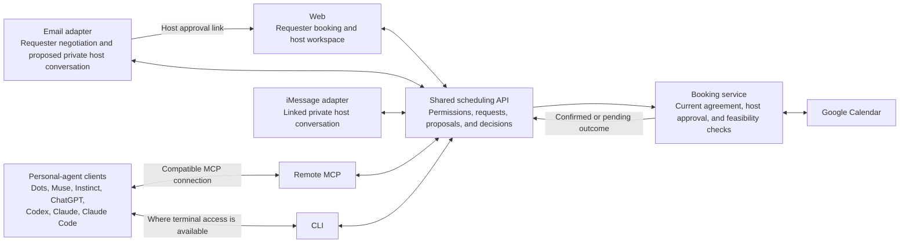

# Find Me a Time — Interfaces

Status: Draft for team review\
Date: 2026-10-06\
Basis: [Product requirements](../02_product_requirements.md)\
Companion: [User journeys and flows](01_user_journeys.md)

This document explains which interfaces people and personal agents use, what each interface is for, and how they connect to the same scheduling workflow. It describes intended product design, not implemented integrations. The PRD owns release requirements and acceptance criteria.

Reconstruction design (2026-10-06): the [page list](04_page_list.md) defines the proposed new web routes and contextual actions. The [frontend architecture](../technical_specification/02_frontend_architecture.md) proposes Next.js/eve against a rebuilt scheduling backend. The [implementation plan](../technical_specification/04_implementation_plan.md) defines the delivery phases and verification gates. The active host-setup change records the six-digit iMessage linking contract; the browser card and proof backend are implemented, while live delivery and linked conversation remain unverified.

## Channel direction

Make the personal agent the primary entry point for agent users: paste `Let me use findmeatime.com/SKILL.md for my scheduling` to become a host, or `Let me schedule a meeting with findmeatime.com/dodo/SKILL.md` to request a meeting. The agent guides the workflow and asks only for missing information, required consent, and decisions. The rebuilt application serves both paths on `https://release.findmeatime.com`; the root-domain URLs remain the intended launch entry points. The current documents provide browser continuation while protected MCP/CLI and named-client acceptance remain incomplete.

Publishing a booking link and receiving requests as a host is waitlist/invite-only; connecting Google Calendar as a requester is available without an invitation. The public root skill explains this and directs users without access to web waitlist entry or invitation redemption. Existing admitted hosts resume setup normally. Requesters using an active host's link remain account-free and do not need invitations. They can optionally connect Google Calendar through a separate browser consent flow to check availability; this does not enroll them as hosts.

Build one responsive web application for mobile and desktop. Website chat and linked private iMessage guide host setup through the same durable draft and explicit settings review. The inline linking flow has the host enter an E.164 phone number on the authenticated website, receive a six-digit code in iMessage, and enter that code back on the website; the website never displays the code it sent. Connect/Maybe later, phone/code entry, expiry, retry, number changes and confirmed unlink stay inside `/app`; reload restores only masked server state. The active conversational-host-setup change tracks remaining channel acceptance. Make the host and requester web workspaces conversation-first: show current settings, candidate times, proposals and decisions as reviewable artifacts with labeled action buttons in context. Keep structured controls in clearly labeled in-page dialogs for precise edits. A private request link restores requester access automatically; the request page does not show credential-paste or recovery controls. Sign-in, invitation codes and Google consent continue in the browser. Web also handles full request management and connection settings, while the public booking page lets requesters coordinate without an account. A native mobile app is outside the initial release.

The host chats with the agent at `/app`, the single host page for admission, setup, request review and settings. A compact menu opens contextual controls and sign-out; request cards or a picker select the discussion within the same page. Requester intake and booking conversations retain their separate public/protected routes. These workspaces use centered chat with no persistent sidebar or dashboard metrics. Host request review switches between shared and private discussions, showing one at a time. Status and decisions appear in the transcript, while exact settings stay in labeled dialogs. On phones, the transcript scrolls independently so the composer remains reachable.

For hosts who use iMessage, make the linked private conversation their main day-to-day channel for request summaries, discussion, and decisions. Hosts can instead use web or a supported personal agent. Channel choice should not require repeating a conversation or maintaining a second request.

Also offer a private host–assistant email conversation, with final approval through authenticated web review. This is a proposed extension from the latest product discussion: the current PRD and numbered journeys cover requester email, but do not yet specify host email requirements or acceptance scenarios. The email design below should be incorporated there before implementation.

## Interface inventory

| Interface | Who uses it | Main responsibility | Access and approval |
|---|---|---|---|
| Waitlist and invitation web flow | Prospective host | Join the waitlist, see pending access, redeem an invitation, and resume onboarding. | Waitlist entry grants no host access; invitation redemption binds admission to a verified account. Remote operator-issued invitations use Cloudflare email from `no-reply@findmeatime.com`, with an explicit manual-delivery option. |
| Public skill documents | Host or requester through a personal agent | Root `/SKILL.md` guides onboarding; `/{host}/SKILL.md` guides requesting that host. | Public instructions only; tools still enforce role-specific access, consent, and approval. |
| Public booking entry | Requester | `/{handle}` introduces the host and starts intake; accepted creation continues at `/booking/[bookingId]`. | No account required; public entry exposes no existing request history. |
| Private booking conversation and receipt | Requester | `/booking/[bookingId]` supports clarification, optional Calendar availability, candidate selection, agreement and status; after booking, shows the permitted final receipt. | Verified request-scoped access; the route ID alone grants nothing. Cannot approve for the host. |
| Host web workspace (`/app`) | Host | Calendar and rule setup, contextual request selection, private discussion, proposal review, connection management, and recovery within one agent chat page. | Authenticated and admitted host access; explicit approval of the displayed current proposal. |
| Requester email | Requester | Submit details, exchange alternatives, agree to shared details, and receive outcomes. | Verified request continuation; sender claims do not grant host access. |
| Host email — proposed extension | Host | Receive summaries, discuss privately, request revisions or decline, and receive outcomes. | Verified host conversation; final meeting approval uses an authenticated web link. |
| iMessage | Host | Opt-in private summaries, questions, revisions, approval, decline, and outcomes. | Linked host identity and exact proposal context; use web when these cannot be established. |
| Personal-agent client | Requester or host | Let users coordinate through an agent they already use. | Role-specific MCP or CLI access; host decisions require explicit human confirmation. |
| Remote MCP server | Compatible personal-agent clients | Discover and invoke scheduling operations. | OAuth for protected host access; account-free, request-scoped requester access. |
| CLI | Terminal-based agents and scripts | Perform the same scheduling operations with structured JSON results. | Equivalent role permissions; CLI login design remains open. |
| Shared scheduling API | Our web application, channel adapters, MCP server, and CLI | Enforce permissions, proposal versions, workflow transitions, and booking rules. | One authority boundary and request state across interfaces. A general public REST API is not an additional release commitment. |

MCP and CLI are connection options for personal-agent clients, not additional chat applications we need to build. The CLI and MCP server both use the shared scheduling API; the CLI does not need to route through MCP.

Requester calendar consent opens in a browser from web, email continuation, or a personal-agent response and returns to the same protected request. Google sign-in is for calendar authorization and does not require creating a product account. Provide a visible skip/disconnect path and manual or authorized agent availability as alternatives. The host and personal agents receive appropriate proposed times, not the requester's private events or tokens.

## Booking confirmation email and calendar invitation

Use the supplied invitation as a presentation reference: a readable confirmation email and a calendar-native event are complementary views of the same confirmed booking. Reuse the pattern, not the example's personal details, meeting credentials or management tokens. These are meeting invitations, distinct from invite-only host-admission emails.

| Surface | Content | Actions |
|---|---|---|
| Confirmation email | Confirmed status; meeting title/purpose; date, start/end time, duration and explicit timezone; organizer and participants; physical location or online meeting link. Provide readable HTML and a plain-text equivalent. | **Join meeting** when an online URL exists; **View booking** opens the requester receipt at `/booking/[bookingId]`; the host opens the selected request in `/app?request=[bookingId]`. |
| Calendar invitation | Structured title, start/end instants, timezone, organizer, attendees and location/join URL. A concise description contains shared purpose, practical joining details and the booking-page link. | Calendar-native response controls; **View booking** in the description. |
| Booking page | Current authoritative status and, once confirmed, the final event details and joining information permitted for that viewer. | Continue negotiation while active; view the terminal receipt after closure within the credential's lifetime. |

The service may send confirmation email while the host's selected calendar supplies event organizer identity. Do not replace the organizer with the email delivery provider or assume every selected calendar has the host's primary email. Calendar RSVP/accepted flags, delivery receipts and email opening do not establish our requester agreement or host approval; those remain recorded application decisions.

Generate all views from the same confirmed event details. An uncertain write must not produce a “Confirmed” email or receipt. Keep delivery outcome separate: failure or retry does not recreate the calendar event. Calendar description links contain no host-private notes, rules, exception reasons or credential granting transcript access; opening them still requires appropriate authorization. Private requester email carries a separate receipt-only token in the URL fragment, exchanged for an HttpOnly cookie and removed from the address bar. It grants no conversation, scheduling mutation or Calendar access. Its lifetime is bounded by the original requester credential; rotation, expiry or a changed verified recipient denies access. Hosts use their authenticated workspace session.

The first release offers **View booking** rather than in-product **Reschedule** or **Cancel** actions. Users manage post-booking changes through their existing calendar; pre-booking withdrawal remains a separate permitted action. Exact new rendering and delivery behavior must be captured and tested in the owning OpenSpec change before implementation; this design does not claim invitation delivery is already built.

## How the interfaces connect

The diagram shows logical responsibilities, not a deployment plan or verified compatibility. Calendar access and event creation belong to the scheduling service. Requesters and their agents do not receive the host's Google Calendar credentials or private calendar data.

## Host email experience — proposed extension

The host should be able to email the scheduling assistant as part of managing a request. Keep this conversation separate from the requester-facing thread, even when both refer to the same request.

1. The host links and verifies an email address through their authenticated account and chooses email notifications.
2. The assistant sends a private request summary. The host can ask a question or request a change, such as “Try Thursday and make it 45 minutes.”
3. After verifying the sender's authority and request context, the assistant evaluates the change. Changed shared details return to the requester for agreement; private host discussion is not copied into that negotiation.
4. The assistant sends the resulting proposal with a link to authenticated web review. The host sees the current details and explicitly approves there. Opening the link alone is not approval, and an old link cannot approve a superseded proposal.
5. The host receives the confirmed booking or an accurate pending or failure status. They can continue in the web workspace if email delivery fails.

For the proposed initial email experience, a reply such as “Approve” directs the host to web review rather than recording approval. Inline email approval can be considered later after identity and proposal binding are designed and tested. A typed sender address, forwarded thread, quoted approval, or newly added recipient is not sufficient authority for private access or host actions. When verification or context is uncertain, move the action to authenticated web review.

AgentMail is the provider for managed conversational inboxes, threads, and replies. Cloudflare Email Service separately sends fixed transactional verification, recovery, and booking messages, including Supabase Auth mail through custom SMTP. The conversational address scheme, reply verification, thread linking, unlinking behavior, and recovery still need design. This is request-specific scheduling assistance; it does not require general access to the host's inbox.

## Personal agents and authorization

Dots, Muse, Instinct, ChatGPT, Codex, Claude, and Claude Code are required compatibility targets in the PRD. Test each separately for discovery, connection, role permissions, request continuation, human confirmation, and recovery. Support for ChatGPT does not establish Codex support; likewise, Claude and Claude Code need separate verification. Do not assume every client offers both MCP and terminal access.

The requester normally pastes the host-specific skill prompt; the ordinary public booking link is also supported. The agent submits details, negotiates, expresses requester agreement within its delegated authority, and tracks the result. Missing information or decisions outside that authority return to the requester. Sharing the link does not automatically configure an MCP connection or install a CLI; missing setup needs a clear next step or web continuation.

The root skill document guides host onboarding and supported tool connection. For protected host MCP access, the host signs in through a browser, reviews OAuth permissions, and grants or denies access. The agent resumes setup after consent and returns shareable links only when host admission, calendar connection, and minimum settings are ready. A valid OAuth connection alone does not admit a waitlisted host. They can inspect and revoke connections in web settings. The CLI follows the same permission boundaries; its login mechanism remains open. See [agent connection and authorization](../02_product_requirements.md#agent-connection-and-authorization) for the product requirements.

Three permissions remain distinct: Google Calendar authorization lets our service use the consenting host's calendars or the requester's selected availability; an MCP OAuth grant lets a client perform permitted service operations; explicit host approval authorizes booking one current proposal, subject to requester agreement and revalidation. Neither an agent credential nor a standing instruction to manage scheduling replaces that last decision.

## Integration choices and scope

- **Email:** Use Cloudflare Email Service for transactional verification, recovery, booking, and Supabase Auth custom SMTP. Use AgentMail for managed inboxes and multi-turn conversations, mapping its inbox/thread/message IDs to application-owned conversations. Keep private host threads separate from requester threads. See the [email provider design](../technical_specification/01_backend_architecture.md#email-provider-direction).
- **iMessage:** Keep Photon Spectrum as the transport direction and rebuild or adapt the bridge to the new channel contracts. Do not assume a native eve Photon adapter is compatible with Spectrum credentials without verification. Transport or runtime approval mechanisms must still enforce the product's explicit host-confirmation rule.
- **Mobile:** Use responsive web for the initial release. Consider a native app later if post-launch evidence shows recurring needs that existing channels cannot meet.
- **Agent-to-agent coordination:** The rebuilt application will coordinate requester and host agents through shared scheduling state. A separate agent-to-agent protocol endpoint is not currently a release requirement.
- **Delivery order:** Web is the setup and recovery foundation; MCP is the primary personal-agent interface and CLI complements it. Channel delivery order and client support details still need agreement, without silently dropping the PRD's required integrations. Host email remains the scope extension identified above.

All channels inherit the PRD's privacy and lifecycle rules. Changed proposals require fresh approval; stale messages and retries cannot duplicate bookings. A delivered message, read receipt, requester agreement, or unconfirmed calendar write must never be reported as a confirmed meeting.

## Reconstruction status

The [chat workspace specification](../../openspec/specs/chat-workspaces/spec.md) owns the agreed contextual-artifact and explicit-decision behavior. The [page list](04_page_list.md) describes the proposed replacement host and requester workspaces.

The replacement must verify website setup, requester conversation, email, MCP, CLI, and full iMessage journeys independently. Unconfirmed web chat text has no agreement or approval authority; channel decisions require the verified, current-proposal confirmation mechanism described above. Existing provider resources and credentials may be reused deliberately, but old deployment success cannot be carried forward as replacement evidence.

### Implemented web confirmation receipt

Once provider evidence confirms booking, the host's selected request and the requester's protected booking page display the same frozen title/purpose, start/end, duration, timezone, participant emails and location. Online HTTPS locations offer **Join meeting**; an allowlisted saved Calendar URL offers **Open in Google Calendar**. **Check booking status** refreshes confirmation and the viewer's own email status. Pending or failed email does not change the confirmed meeting. An uncertain Calendar write remains “Booking in progress” without a join action or confirmed receipt. Expired or rotated requester access removes the receipt on refresh and does not reveal the prior conversation. The receipt displays the actual Calendar organizer from provider evidence. Confirmation email and receipt-only links have local fault/browser coverage and verified production activation; controlled inbox acceptance still requires separate evidence.

### Withdrawal before Calendar dispatch

An approved request can still show **Withdraw request** to its requester and **Decline request** to its host while its saved Calendar attempt is prepared and has no dispatch evidence. The card explains that Calendar creation has not started and the server will check again on confirmation. The existing explicit confirmation and same-decision retry remain usable in that state. Once dispatch may have begun, both actions disappear and the card explains that the outcome is pending; it never claims to cancel an existing event.
